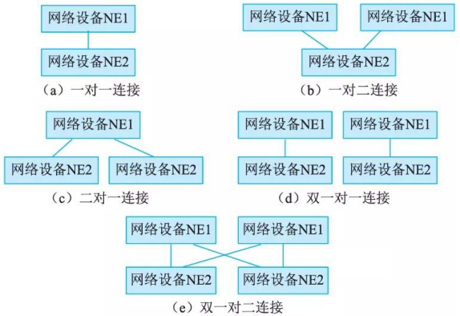
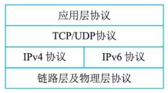

# 网络构建关键技术

## 网络高可用设计

### 网络高可用性概述

网络可用性度量可从两个方面考虑。首先是网络不能频繁出现故障。网络出现故障势必影响业务的运营，特别是实时性强和对丢包时延敏感的业务，如语音、视频以及在线游戏等。退一步讲，网络即使出现故障，应能迅速恢复。如一个网络不常出现故障，但出现一次故障，需要比较长时间才能恢复，如几个小时、几天或甚至更长时间，这样的网络也不能算是高可用性网络。因此，故障次数少和故障恢复时间短是衡量网络高可用性的主要指标。

可用性 (Availability)可以下式表示：
A= MTBF/(MTBF+MTTR) ✨对么, 和之前书中讲的不一样

MTBF: 平均无故障时间 (Mean Time Between F ailurs)
MTTR: 平均故障修复时间 (Mean Time To Repair)

可见，提高网络可用性，提高 MTBF, 降低 MTTR 都是行之有效的方法。 MTBF 取决千网络设备的硬件和软件本身的质量，而极力提升它们的质量总是有限的，因此无法一味地提高MTBF 数值来获得网络高可用性。设法减少 MTTR 数值，也是提高网络可用性的有效途径。就MTTR 的影响因素来说，一是以最快的速度发现网络故障，二是迅速将网络从故障状态恢复出来。

### 网络高可用架构

网络的高可用性是一个系统级的概念。对于一个网络来说，它由网络元素(或网络部件)，按照一定的连接模型连接在一起而构成。因此，构成网络的部件的可用性，以及连接模型的可用性就决定了网络的可用性程度。以下从网络部件、网络连接模型以及有关网络协议等方面来考虑如何保证整个网络的可用性。

1. 网络部件

    网络部件是组成网络的基本要素，典型代表有各种交换机、路由器等网络设备。网络部件的高可用性是网络高可用性的关键。在网络设计时，它们的高可用设计或选用是需要重点、优先考虑的。通常，网络部件包括硬件结构和软件系统。因此硬件高可用性和软件系统高可用性，就直接影响着网络部件的高可用性。硬件高可用性包括主控结点冗余设计，如采用 l+l 主备；业务结点热插拔设计；电源风扇冗余设计等。软件系统高可用性包括软件热补丁设计，软件异常保护，数据冗余备份等。

2. 网络连接模型

    除了网络部件本身的高可用性外，网络物理拓扑连接形式也影响网络的可用性程度。如图 17-18 (a) 、 (b) 、 (c) 、 (d) 、 (e) 分别是网络设备 NEl 和网络设备 NE2 两类设备互连的五种拓扑形式。假设网络设备 NEl 的在线率(可用性)为 Rl,网络设备 NE2 的在线率(可用性)为 R2 。它们的高可用性指标分别是 Al 、 A2 、 A3 、 A4 、 A5 。由 NEl 和 NE2 两类设备组成的这五种型式网络的可用性计算如下。

    

    (a) 是一对一(单点单归)连接方式，其可用性 Al 为： Al= RI XR2:
    (b) 是一对二(单点双归)连接方式，其可用性 A2 为： A2=R2X (1-(1-Rl)  X  (1-Rl));
    (c) 是二对一(双点单归)连接方式，其可用性 A3 为： A3 = Rl X  (I- (1 -R2)  X  (1-R2));
    (d) 是双一对一(双点双归)连接方式，其可用性 A4 为： A4 =  I- (1-RIXR2)  X  (1-RI XR2));
    (e) 是双一对二(双归属)连接方式，其可用性 A5 为： AS = (1 - (1-Rl)  X  (1-Rl))  X (1 -(1-R2)  X  (1-R2)) 。

3. 网络协议及配置

    高可用性离不开运行于网络中的路由、链路检测等协议。在网络部署中，以基本路由协议如 OSPF/B GP 等为主，除此之外，根据网络拓扑连接和链路情况，同时部署其他链路检测协议如 BFD/NQA 等辅助协议以尽可能缩短网络故障发现时间，为网络故障快速恢复提供有力支撑。

    另外，提升网络可靠性的协议还包括 802.3ad 、 VRRP 、路由多下一跳等。

## 1Pv4与1Pv6融合组网技术

目前国内外主流网络还是 IPv4 网络， IPv6 网络尚未规模化部署。面对 IPv4 网络巨大的投资成本，以及大量应用仍基于 IPv4 协议开发并提供业务的现状，网络演进还存在较长时间 IPv4到 IPv6 过渡期或 IPv4 和IPv6 网络共存期。为此，国际标准组织为应对这段较长时间过渡期，形成了相关的过渡技术标准。目前主要存在三种过渡技术：双协议栈、隧道技术、地址翻译机制。

### 双协议栈

IPv4/IPv6 双协议栈机制就是使 IPv6 网络节点具有一个1Pv6 协议栈和一个 1Pv4 协议栈，同时支持 1Pv4 和 1Pv6 协议的处理。 1Pv6 和 1Pv4 是功能相近的网络层协议，两者均运行千同一物理平台，并均可承载相同的传输层协议 TCP 、 UDP等。支持双协议栈的节点既能与支持 IPv4 协议的节点通信，又能与支持 IPv6 协议的节点通信。双栈 IP 协议栈的结构见图 17-19 所示。

### 隧道技术

为了保持现有 IPv4 网络的投资成本，以及现有业务提供的持续性，需在现有 IPv4 网络基础上实现 IPv6 网络的构建。考虑到 IPv6 和 IPv4 的互连互通，以及 IPv6 网络对 IPv4 网络的依赖，需要采用必要的隧道技术。在 IPv4 和 IPv6 融合组网时通常采用下述隧道技术。

1. ISATAP隧道

    ISATAP (Intra-Site Automatic Tunnel Addressing Prot ocol) 是一种 IPv6 转换传送机制，允许IPv6 数据包通过 IPv4 网络上双栈节点传输。 ISATAP 将 IPv4 网络作为一个非广播多路访问网络的数据链路层，但不需要底层 IPv4 网络支持多播工作方式。

    ISATAP 是通过将 IPv4 地址嵌入到 IPv6 地址当中，并将 IPv6 协议报文封装在 IPv4 中基千隧道传送的。隧道是在主机相互通信时从 IPv6 地址中抽出 IPv4 地址自动建立的。换言之，当两台 ISATAP 主机基千 IPv6 通信时，自动抽取其中的 IPv4 地址建立隧道，并将 IPv6 协议报文封装在其中完成双方的信息交换。 ISATAP 运行环境不需其他特殊网络设备，只要通信双方节点之间 IPv4 网络可达即可。

2. 6to4隧道

    6to4 隧道指的是在站点之间进行 1Pv6 通信，每个站点应至少部署一台 6to4 路由器作为出入口，使用特定的地址格式，即地址前缀为 “2002:", 将路由器 1Pv4 地址嵌入到 1Pv6 地址前缀中，因此位于不同 6to4 站点内的主机彼此通信时即可自动抽出 1Pv4 地址在路由器之间建立隧道。

    当 6to4 站点内主机与外部普通 1Pv6 主机通信时，必须经过 6to4 路由器。 6to4 路由器必须同时具备 6to4 接口和 IPv6 接口，并提供在这两种接口之间的封装解封装和转发处理。

    基于 6to4 隧道机制的通信需要一个全局合法 IPv4 地址，所以对解决 1Pv4 地址短缺没有太大帮助。但它不需要申请 1Pv6 地址，通过它可使站点迅速升级为 IPv6 网络。

3. 4over6 隧道

    4over6 是 1Pv4 over 1Pv6 的简称，是 1Pv4 网络向 IPv6 网络过渡过程中向纯 IPv6 主干网过渡提出的一种技术。它可以在最大程度地继承基于 1Pv4 网络的应用的同时，加快网络从 1Pv4向 IPv6 过渡的进程。

    基于 4over6 机制，两个通信节点之间采用 IPv4 进行业务交互，但它们之间交互的 1Pv4 业务实际上承载在 1Pv6 网络上。

4. 6over4 隧道

    6over4 隧道技术提供一种转发机制，使得双栈节点之间在组播使能的 1Pv4 网络中传送 1Pv6分组。即它在用于承载的 IPv4 网络建立的虚拟数据链路层(虚拟以太网)上供 1Pv6 协议传送分组数据。

### 网络地址翻译技术

网络地址翻译 (Network Address Translator) 技术将 IPv4 地址和 IPv6 地址分别看作内部地址和外部地址，或者相反，以实现地址转换。

内部的 1Pv4 主机要和外部 IPv6 主机通信时，在 NAT 服务器中将 IPv4 地址(内部地址)变换成 IPv6 地址(对外地址)， NAT 服务器维护一个 IPv4 和 IPv6 地址的映射表。反之，当内部IPv6 主机和外部 IPv4 主机进行通信时，则 IPv6 主机地址(内部地址)映射成 IPv4 主机地址(对外地址)。可见，通过 NAT 技术可以解决 IPv4 主机和 IPv6 主机之间的互通问题。

在网络地址翻译技术中涉及 NAT-PT (Network Address Translation-Protocol Translation) (RFC2766) 协议、 SIIT (Stateless IP/ICMP Translation)  (RFC2765) 协议等。

## SDN技术

SDN 网络在控制平面和转发平面分别采用了不同技术，以满足 SDN 网络控制的全局性和灵活性，业务转发的高效性及高性价比要求。主要关键技术包括：控制平面技术、数据平面技术和转发规则一致性更新技术等。

### 控制平面技术

控制器是控制乎面核心部件，也是整个 SDN 体系架构的逻辑中心。随着 SDN 网络规模的扩大，单一控制器结构的 SDN 网络处理能力遇到了性能瓶颈，因此需要对控制器进行扩展。通常存在两种控制器扩展方式：一种是对网络中单一控制器本身进行扩展，另一种是采用多控制器方式。

单一集中式结构的控制器，一般采用了多线程的方式对控制器进行性能提升，形成 NOX­MT 版本。另一种控制器是 Maestro, 它采用良好的并行处理架构，充分发挥了高性能服务器的多核并行处理能力，使其在大规模网络部署下性能表现更佳。

多控制器方式是用扩展的方式优化 SDN 网络。扩展控制器一般可采用两种模型方式：一种是扁平控制模型；另一种是层次控制模型。

### 数据平面技术

SDN 转发设备(如交换机等)的数据转发形态可分为硬件和软件两种。

l) 硬件处理方式

硬件处理方式相比软件处理方式具有更快的速度，但灵活性有所降低。为了使硬件能够更加灵活地进行数据转发操作， Bosshart等人提出了 RMT (Reco nfigurable  Match Tables) 模型，该模型支持可重配置的匹配表，它允许在流水线阶段支持任意宽度和深度的流表。另一种硬件灵活处理技术是 FlowAdapter, 它采用交换机分层的方式来实现多表流水线业务。

2) 软件处理方式

与硬件方式不同，软件的处理速度低千硬件，但软件方式可以提升转发规则处理的灵活性。利用交换机 CPU 或 NP 处理转发规则可以避免硬件灵活性差的问题。另外， NP (Ne twork Processor) 专门用来处理网络任务，在网络处理性能方面优于 CPU 。

### 转发规则一致性更新技术

在 SDN 网络中不同转发设备转发规则更新可能会出现不一致现象。针对这种问题一般采用“两段提交”的方式来更新规则。

首先，当规则需要更新时，控制器询问每个交换机是否处理完对应旧规则的流，确认后对处理完毕的所有交换机进行规则更新；之后当所有交换机都更新完毕后才真正完成更新，否则撤销之前所有的更新操作。然而，这种方法需要等待旧规则的流全部处理完毕后才能进行规则更新，这样会造成规则空间被占用的情况。增量式一致性更新算法可以解决上述问题，该算法将规则更新分多轮进行，每一轮都采用“二段提交”方式更新一个子集，达到节省规则空间和缩短更新时间的折中。
