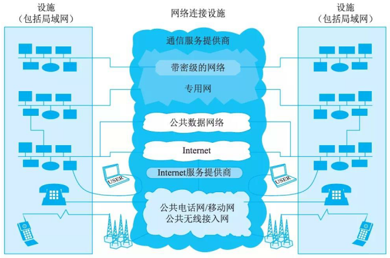
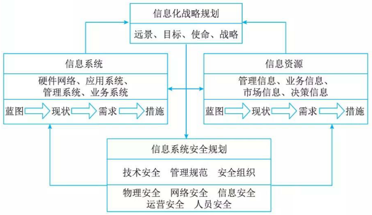

# 系统安全体系架构规划框架

## 安全技术休系架构

安全技术体系架构的目标是建立可持续改进的安全技术体系架构的能力，信息技术系统千变万化，有各种各样的分类方式，为从技术角度建立一个通用的对象分析模型，这里，我们将信息系统抽象成一个基本完备的信息系统分析模型，如图所示。从信息技术系统分析模型出发，建立整个信息技术系统的安全架构。

一般来说，国际标准化组织(ISO)提出一种网络标准架构(OSI)参考模型将网络划分为物理、数据链路、网络、传输、会话、表示和应用等7层，Andrew S.Tanenbau综合OSI参考模型和TCP/IP参考模型将网络划分为物理、数据链路、网络、传输和应用等5层。在本模型中，首先需要做的就是对网络结构层次进行划分，考虑到安全评估是以安全风险威胁分析入手的，而且在实际的网络安全评估中会发现，主机和存储系统占据了大量的评估考察工作，虽然主机和存储系统都属千应用层，但本模型由千其重要性，特将其单列为一个层次，因此根据网络中风险威胁的存在实体划分出5个层次的实体对象：应用、存储、主机、网络和物理。

## 信息系统安全体系规划

信息系统安全体系规划是一个非常细致和非常重要的工作，首先需要对企业信息化发展的历史情况进行深入和全面的调研，并针对信息系统安全的主要内容进行整体的发展规划工作。图给出了一种信息系统安全体系的框架。

从图可以看出，信息系统安全体系主要是由技术体系、组织机构体系和管理体系三部分共同构成的。

技术体系是全面提供信息系统安全保护的技术保障系统，该体系由物理安全技术和系统安全技术两大类构成。

组织体系是信息系统的组织保障系统，由机构、岗位和人事三个模块构成。机构分为领导决策层、日常管理层和具体执行层；岗位是信息系统安全管理部门根据系统安全需要设定的负责某一个或某几个安全事务的职位；人事是根据管理机构设定的岗位，对岗位上在职、待职和离职的员工进行素质教育、业绩考核和安全监管的机构。

管理体系由法律管理、制度管理和培训管理三部分组成。

## 信息系统安全规划框架

建立了信息系统安全体系之后，就可以针对以上描述的内容进行全面的规划。信息系统安全规划的层次方法与步骤可以有不同，但是规划内容与层次应该是相同。规划的具体环节、相互之间的关系和具体方法如图所示。

1. 信息系统安全规划依托企业信息化战略规划

    信息化战略规划是以整个企业的发展目标、发展战略和企业各部门的业务需求为基础，结合行业信息化方面的需求分析、环境分析和对信息技术发展趋势的掌握，定义出企业信息化建设的远景、使命、目标和战略，规划出企业信息化建设的未来架构，为信息化建设的实施提供一幅完整的蓝图，全面系统地指导企业信息化建设的进程。信息系统安全规划依托企业信息化战略规划，对信息化战略的实施起到保驾护航的作用。信息系统安全规划的目标应该与企业信息化的目标是一致的，而且应该比企业信息化的目标更具体明确、更贴近安全。信息系统安全规划的一切论述都要围绕着这个目标展开和部署。

2. 信息系统安全规划需要围绕技术安全、管理安全、组织安全考虑

    信息系统安全规划的方法可以不同、侧重点可以不同，但都需要围绕技术安全、管理安全、组织安全进行全面考虑。规划的内容基本上应涵盖：确定信息系统安全的任务、目标、战略以及战略部门和战略人员，并在此基础上制定出物理安全、网络安全、系统安全、运营安全、人员安全的信息系统安全的总体规划。物理安全包括环境设备安全、信息设备安全、网络设备安全、信息资产设备的物理分布安全等。网络安全包括网络拓扑结构安全、网络的物理线路安全、网络访问安全(防火墙、入侵检测系统和 VPN 等)等。系统安全包括操作系统安全、应用软件安全和应用策略安全等。运营安全应在控制层面和管理层面保障，包括备份与恢复系统安全、入侵检测功能、加密认证功能、漏洞检查及系统补丁功能、口令管理等。人员安全包括安全管理的组织机构、人员安全教育与意识机制、人员招聘及离职管理、第三方人员安全管理等。

3. 信息系统安全规划以信息系统与信息资源的安全保护为核心

    信息系统安全规划的最终效果应该体现在对信息系统与信息资源的安全保护上，因此规划工作需要围绕着信息系统与信息资源的开发、利用和保护工作进行，要包括蓝图、现状、需求和措施 4 个方面。
    (1) 对信息系统与信息资源的规划需要从信息化建设的蓝图入手，知道企业信息化发展策略的总体目标和各阶段的实施目标，制定出信息系统安全的发展目标。
    (2) 对企业的信息化工作现状进行整体的、综合、全面的分析，找出过去工作中的优势与不足。
    (3) 根据信息化建设的目标提出未来几年的需求，这个需求最好可以分解成若干个小的方面，以便千今后的实施与落实。
    (4) 要明确在实施工作阶段的具体措施与方法，提高规划工作的执行力度。信息系统安全规划服务千企业信息化战略目标，信息系统安全规划做得好，企业信息化工作的实现就有了保障。信息系统安全规划是企业信息化发展战略的基础性工作，不是可有可无而是非常重要。由千企业信息化的任务与目标不同，所以信息系统安全规划包括的内容就不同，建设的规模就有很大的差异，因此信息系统安全规划难以从专业书籍或研究资料中找到非常有针对性的适用法则，也难以给出一个规范化的信息系统安全规划的模板。这里给出信息系统安全规划框架与方法，信息系统安全规划工作的一种建设原则、建设内容、建设思路。具体规划还需要深入细致地进行本地化的调查与研究。
