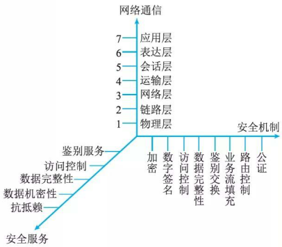
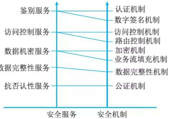
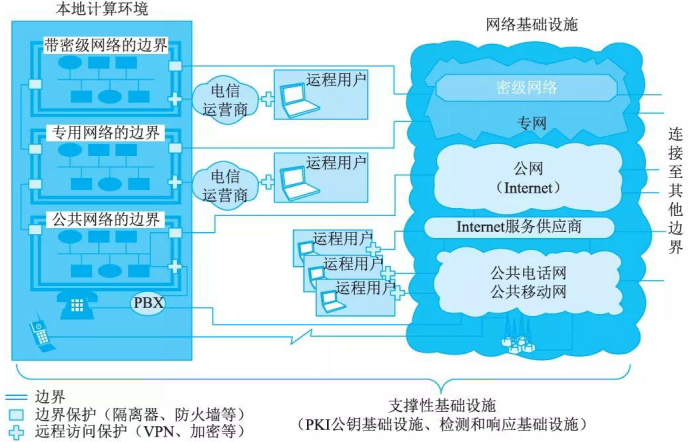
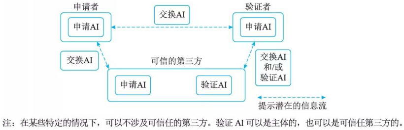
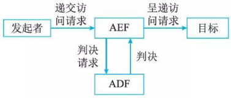
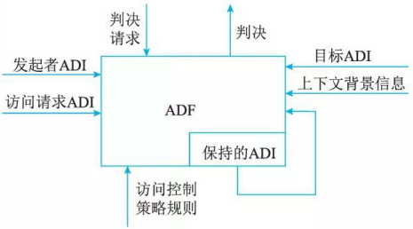
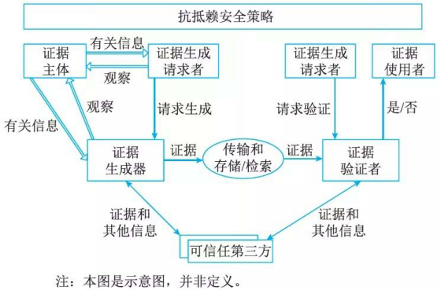
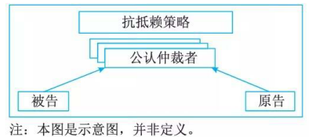

# 网络安全体系架构设计

## 最佳实践

### 题目总结

- 💛(✨2025上)39.开放系统互联安全体系的五类安全服务包括( )。
    - A.鉴别、访问控制、安全防御、数据机密性和抗抵赖性
    - B.鉴别、访问控制、数据机密性、数据完整性和安全防御
    - C.鉴别、访问控制、数据机密性、数据完整性和抗抵赖性
    - D.访问控制、安全防御、数据机密性、数据完整性和抗抵赖性

    答案: C

- 💚保护信息不泄露或不暴露给那些未授权想掌握该信息的实体是(  )安全服务。

    - A．鉴别
    - B．数据完整性
    - C．数据机密性
    - D．访问控制 

    答案: C

- 💛门禁卡是属于以下哪种鉴别方式？(  )

    - A．已知的
    - B．拥有的
    - C．不改变的特性
    - D．环境 

    答案: B

### 考察问

💛开放系统互联安全体系的五类安全服务包括`()`、`()`、数据`()`性、数据`()`性和`()`性✨记`()`(鉴别身份)和`()`(授予权限), 剩下三个是整机不可控审的前`()`个

### 题目总结

开放系统互联安全体系的五类安全服务包括`鉴别`、`访问控制`、数据`机密`性、数据`完整`性和`抗抵赖`性✨记`鉴别`(鉴别身份)和`访问控制`(授予权限), 剩下三个是整机不可控审的前`三`个

## OSI的安全体系架构概述

### OSI概述

OSI(Open System Interconnection/Reference Mode, OSI/RM)是由国际化标准组织制定的开放式通信系统互联模型(ISO 7498-2), 国家标准GB/T 9387.2—1995《信息处理系统工程开放系统互联基本参考模型—第二部分：安全体系结构》等同于ISO 7498-2。OSI目的在于保证开放系统进程与进程之间远距离安全交换信息。这些标准在参考模型的框架内，建立起一些指导原则与约束条件，从而提供了解决开放互联系统中安全问题的一致性方法。OSI 安全体系结构提供以下内容。

- 提供安全服务与有关安全机制在体系结构下的一般描述，这些服务和机制必须是为体系结构所配备的。
- 确定体系结构内部可以提供这些服务的位置。
- 保证安全服务完全准确地得以配置，并且在信息系统的安全周期中一直维持，安全功能务必达到一定强度的要求。

GB/T 9387.2一1995给出了基于OSI参考模型的7层协议之上的信息安全体系结构。其核心内容是：为了保证异构计算机进程与进程之间远距离交换信息的安全，它定义了该系统5大类安全服务，以及提供这些服务的8类安全机制及相应的OSI安全管理，并可根据具体系统适当地配置于OSI模型的7层协议中。图所示的三维安全空间解释了这一体系结构。

安全机制是对安全服务的详细补充，安全服务和安全机制的对应关系如图所示。

### OSI 安全架构

OSI定义了7层协议，其中除第5层(会话层)外，每一层均能提供相应的安全服务。实际上，最适合配置安全服务的是在物理层、网络层、运输层及应用层上，其他层都不宜配置安全服务。

OSI开放系统互联安全体系的5类安全服务包括`鉴别`、`访问控制`、`数据机密性`、`数据完整性`和`抗抵赖性`。

OSI定义分层多点安全技术体系架构，也称为深度防御安全技术体系架构，它通过以下三种方式将防御能力分布至整个信息系统中。

- 多点技术防御
    
    在对手可以从内部或外部多点攻击一个目标的前提下，多点技术防御通过对以下多个防御核心区域的防御达到抵御所有方式的攻击目的。

    - 网络和基础设施。为了确保可用性，局域网和广域网需要进行保护以抵抗各种攻击，如拒绝服务攻击等。为了确保机密性和完整性，需要保护在这些网络上传送的信息以及流量的特征以防止非故意的泄露。
    - 边界。为了抵御主动的网络攻击，边界需要提供更强的边界防御，例如流量过滤和控制以及入侵检测。
    - 计算环境。为了抵御内部、近距离的分布攻击，主机和工作站需要提供足够的访问控制。

- 分层技术防御

    即使最好的可得到的信息保障产品也有弱点，其最终结果将使对手能找到一个可探查的脆弱性，一个有效的措施是在对手和目标间使用多个防御机制。为了减少这些攻击成功的可能性和对成功攻击的可承担性，每种机制应代表一种唯一的障碍并同时包括保护和检测方法。例如，在外部和内部边界同时使用嵌套的防火墙并配合以入侵检测就是分层技术防御的一个实例。

- 支撑性基础设施

    支撑性基础设施为网络、边界和计算环境中信息保障机制运行基础的支撑性基础设施，包括公钥基础设施以及检测和响应基础设施。

    - 公钥基础设施。提供一种通用的联合处理方式，以便安全地创建、分发和管理公钥证书和传统的对称密钥，使它们能够为网络、边界和计算环境提供安全服务。这些服务能够对发送者和接收者的完整性进行可靠验证，并可以避免在未获授权的情况下泄露和更改信息。公钥基础设施必须支持受控的互操作性，并与各用户团体所建立的安全策略保持一致。

    - 检测和响应基础设施。检测和响应基础设施能够迅速检测并响应入侵行为。它也提供便于结合其他相关事件观察某个事件的“汇总“性能。另外，它也允许分析员识别潜在的行为模式或新的发展趋势。

    这里必须注意的是，信息系统的安全保障不仅仅依赖于技术，还需要集成的技术和非技术防御手段。一个可接受级别的信息保障依赖千人员、管理、技术和过程的综合。

    

    分层多点安全技术体系架构为信息系统安全保障提供了框架和进一步分析所需的重点区域划分。在具体的技术方案实践中，应从使命和需求的实际情况出发制定适合组织机构要求的技术体系和方案。

## 认证框架

鉴别(Authentication) 的基本目的是防止其他实体占用和独立操作被鉴别实体的身份。鉴别提供了实体声称其身份的保证，只有在主体和验证者的关系背景下，鉴别才是有意义的。鉴别有两种重要的关系背景：一是实体由申请者来代表，申请者与验证者之间存在着特定的通信关系(如实体鉴别)；二是实体为验证者提供数据项来源。图给出了申请者、验证者、可信第三方之间的关系及三种鉴别信息类型
鉴别的方式主要基于以下 5 种。

- 已知的，如一个秘密的口令。
- 拥有的，如 IC 卡、令牌等。
- 不改变的特性，如生物特征。
- 相信可靠的第三方建立的鉴别(递推)。
- 环境(如主机地址等)。

鉴别信息是指申请者要求鉴别到鉴别过程结束所生成、使用和交换的信息。鉴别信息的类型有交换鉴别信息、申请鉴别信息和验证鉴别信息。

在某些情况下，为了产生交换鉴别信息，申请者需要与可信第三方进行交互。类似地，为了验证交换鉴别信息，验证者也需要同可信第三方进行交互。在这种情况下，可信第三方待有相关实体的验证 AI ，也可能使用可信第三方来传递交换鉴别信息。实体也可能需要待有鉴别可信第三方中所使用的鉴别信息。

鉴别服务分为以下阶段：安装阶段、修改鉴别信息阶段、分发阶段、获取阶段、传送阶段、验证阶段、停活阶段、重新激活阶段、取消安装阶段。

在安装阶段，定义申请鉴别信息和验证鉴别信息。修改鉴别信息阶段，实体或管理者申请鉴别信息和验证鉴别信息变更(如修改口令)。在分发阶段，为了验证交换鉴别信息，把验证鉴别信息分发到各实体(如申请者或验证者)以供使用。在获取阶段，申请者或验证者可得到为鉴别实例生成特定交换鉴别信息所需的信息，通过与可信第三方进行交互或鉴别实体间的信息交换可得到交换鉴别信息。例如，当使用联机密钥分配中心时，申请者或验证者可从密钥分配中心得到一些信息，如鉴别证书。在传送阶段，在申请者与验证者之间传送交换鉴别信息。在验证阶段，用验证鉴别信息核对交换鉴别信息。在停活阶段，将建立一种状态，使得以前能被鉴别的实体暂时不能被鉴别。在重新激活阶段，使在停活阶段建立的状态将被终止。在取消安装阶段，实体从实体集合中被拆除。

## 访问控制框架

访问控制(Access Control)决定开放系统环境中允许使用哪些资源、在什么地方适合阻止未授权访问的过程。在访问控制实例中，访问可以是对一个系统(即对一个系统通信部分的一个实体)或对一个系统内部进行的。

基本访问控制功能示意图

ADF示意图

ACI(访问控制信息)是用于访问控制目的的任何信息，其中包括上下文信息。ADI(访问控制判决信息)是在做出一个特定的访间控制判决时可供ADF使用的部分(或全部)ACI。ADF(访问控制判决功能)是一种特定功能，它通过对访问请求、ADI以及该访问请求的上下文使用访问控制策略规则而做出访问控制判决。AEF(访问控制实施功能)确保只有对目标允许的访问才由发起者执行。

涉及访问控制的有发起者、AEF、ADF和目标。发起者代表访问或试图访问目标的人和基于计算机的实体。目标代表被试图访问或由发起者访问的，基于计算机或通信的实体。例如，目标可能是OSI实体、文件或者系统。访问请求代表构成试图访问部分的操作和操作数。

当发起者请求对目标进行特殊访问时，AEF就通知ADF需要一个判决来做出决定。为了作出判决，给ADF提供了访问请求(作为判决请求的一部分)和下列几种访问控制判决信息(ADI)。

- 发起者ADI(ADI由绑定到发起者的ACI导出)。
- 目标ADI(ADI由绑定到目标的ACI导出)。
- 访问请求ADI(ADI由绑定到访问请求的ACI导出)。

ADF的其他输入是访问控制策略规则(来自ADF的安全域权威机构)和用于解释ADI或策略的必要上下文信息。上下文信息包括发起者的位置、访问时间或使用中的特殊通信路径。基千这些输入，以及可能还有以前判决中保留下来的ADI信息，ADF可以做出允许或禁止发起者试图对目标进行访问的判决。该判决传递给AEF, 然后AEF允许将访问请求传给目标或采取其他合适的行动。

在许多情况下，由发起者对目标的逐次访问请求是相关的。应用中的一个典型例子是在打开与同层目标的连接应用进程后，试图用相同(保留)的ADI执行几个访问。对一些随后通过连接进行通信的访问请求，可能需要给ADF提供附加的ADI以允许访问请求。在另一些情况中，安全策略可能要求对一个或多个发起者与一个或多个目标之间的某种相关访问请求进行限制。这时，ADF可能使用与多个发起者和目标有关的先前判决中所保留的ADI来对特殊访问请求作出判决。

如果得到AEF的允许，访问请求只涉及发起者与目标的单一交互。尽管发起者和目标之间的一些访问请求是完全与其他访问请求无关的，但常常是两个实体进入一个相关的访问请求集合中，如质询应答模式。在这种情况下，实体根据需要同时或交替地变更发起者和目标角色，可以由分离的AEF组件、ADF组件和访问控制策略对每一个访问请求执行访问控制功能。

## 机密性框架

### 机密性概述

机密性(Confidentiality)服务的目的是确保信息仅仅是对被授权者可用。由千信息是通过数据表示的，而数据可能导致关系的变化(如文件操作可能导致目录改变或可用存储区域的改变)，因此信息能通过许多不同的方式从数据中导出。例如，通过理解数据的含义(如数据的值)导出；通过使用数据相关的属性(如存在性、创建的数据、数据大小、最后一次更新的日期等)进行推导；通过研究数据的上下文关系，即通过那些与之相关的其他数据实体导出；通过观察数据表达式的动态变化导出。

信息的保护是确保数据被限制于授权者获得，或通过特定方式表示数据来获得，这种保护方式的语义是，数据只对那些拥有某种关键信息的人才是可访问的。有效的机密性保护，要求必要的控制信息(如密钥和RCI等)是受到保护的，这种保护机制和用来保护数据的机制是不同的(如密钥可以通过物理手段保护等)。

在机密性框架中用到被保护的环境和被交叠保护的环境两个概念。在被保护环境中的数据，可通过使用特别的安全机制(或多个机制)保护。在一个被保护环境中的所有数据以类似方法受到保护。当两个或更多的环境交叠的时候，交叠中的数据能被多重保护。可以推断，从一个环境移到另一个环境的数据的连续保护必然涉及交叠保护环境。

### 机密性机制

数据的机密性可以依赖千所驻留和传输的媒体。因此，存储数据的机密性能通过使用隐藏数据语义(如加密)或将数据分片的机制来保证。数据在传输中的机密性能通过禁止访问的机制、通过隐藏数据语义的机制或通过分散数据的机制得以保证(如跳频等)。这些机制类型能被单独使用或者组合使用。

- 通过禁止访问提供机密性

    通过禁止访问的机密性能通过在 ITU-T Rec.812 或 ISO/IEC 10181-3 中描述的访问控制获得，以及通过物理媒体保护和路由选择控制获得。通过物理媒体保护的机密性保护可以采取物理方法保证媒体中的数据只能通过特殊的有限设备才能检测到。数据机密性通过确保只有授权的实体才能使这些机制本身以有效的方式来实现。通过路由选择控制的机密性保护机制的目的，是防止被传输数据项表示的信息未授权泄露。在这一机制下只有可信和安全的设施才能路由数据，以达到支持机密性服务的目的。

- 通过加密提供机密性

    这些机制的目的是防止数据泄露在传输或存储中。加密机制分为基千对称的加密机制和基于非对称加密的机密机制。

## 完整性框架

### 完整性概述

完整性(Integrity)框架的目的是通过阻止威胁或探测威胁，保护可能遭到不同方式危害的数据完整性和数据相关属性完整性。所谓完整性，就是数据不以未经授权方式进行改变或损毁的特征。

完整性服务有几种分类方式：根据防范的违规分类，违规操作分为未授权的数据修改、未授权的数据创建、未授权的数据删除、未授权的数据插入和未授权的数据重放。依据提供的保护方法分为阻止完整性损坏和检测完整性损坏。依据是否支持恢复机制，分为具有恢复机制的和不具有恢复机制的。

### 完整性机制的类型

由于保护数据的能力与正在使用的媒体有关，对于不同的媒体，数据完整性保护机制是有区别的，可概括为以下两种情况。

- 阻止对媒体访问的机制。包括物理隔离的不受干扰的信道、路由控制、访问控制。
- 用以探测对数据或数据项序列的非授权修改的机制。未授权修改包括未授权数据创建、数据删除以及数据重复。而相应的完整性机制包括密封、数字签名、数据重复(作为对抗其他类型违规的手段)、与密码变换相结合的数字指纹和消息序列号。

按照保护强度，完整性机制可分为不作保护；对修改和创建的探测；对修改、创建、删除和重复的探测；对修改和创建的探测并带恢复功能；对修改、创建、删除和重复的探测并带恢复功能。

## 抗抵赖框架

抗抵赖(Non-repudiation) 服务包括证据的生成、验证和记录，以及在解决纠纷时随即进行的证据恢复和再次验证。

框架所描述的抗抵赖服务的目的是提供有关特定事件或行为的证据。事件或行为本身以外的其他实体可以请求抗抵赖服务。抗抵赖服务可以保护的行为实例有发送X.400消息、在数据库中插入记录、请求远程操作等。

当涉及消息内容的抗抵赖服务时，为提供原发证明，必须确认数据原发者身份和数据完整性。为提供递交证明，必须确认接收者身份和数据完整性。在某些情况下，还可能需要涉及上下文信息(如日期、时间、原发者／接收者的地点等)的证据。

抗抵赖服务提供下列可在试图抵赖的事件中使用的设备：证据生成、证据记录、验证生成的证据、证据的恢复和重验。

纠纷可以在纠纷两方之间直接通过检查证据解决。但是，纠纷也可能不得不通过仲裁者解决，该仲裁者评估并确定是否发生过有纠纷的行为或事件。

抗抵赖由4个独立的阶段组成：证据生成；证据传输、存储及恢复；证据验证和解决纠纷。

1. 证据生成

    在这个阶段中，证据生成请求者请求证据生成者为事件或行为生成证据。卷入事件或行为中的实体，称为证据实体，其卷入关系由证据建立。根据抗抵赖服务的类型，证据可由证据实体，或可能与可信第三方的服务一起生成，或者单独由可信第三方生成。

2. 证据传输、存储及恢复

    在这个阶段，证据在实体间传输或从存储器取出来或传到存储器。

    

3. 证据验证

    在这个阶段，证据在证据使用者的请求下被证据验证者验证。本阶段的目的是在出现纠纷的事件中，让证据使用者确信被提供的证据确实是充分的。可信第三方服务也可参与，以提供验证该证据的信息。

4. 解决纠纷

    在解决纠纷阶段，仲裁者有解决双方纠纷的责任。图描述了纠纷解决阶段。

    

## 