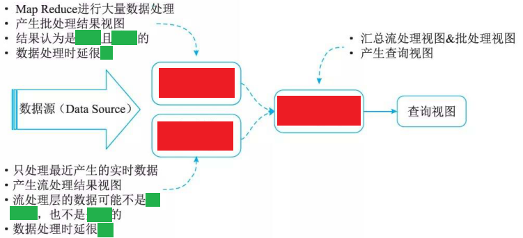
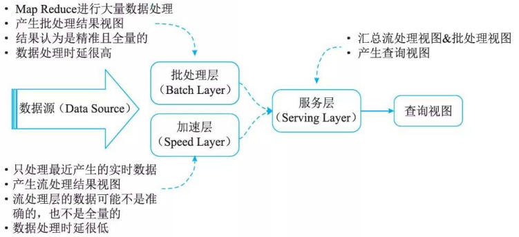
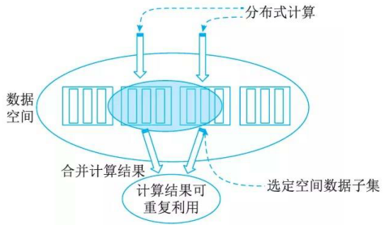
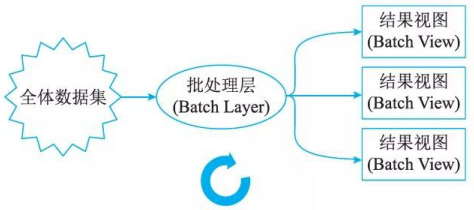
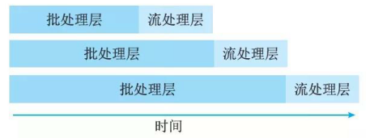
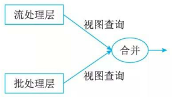
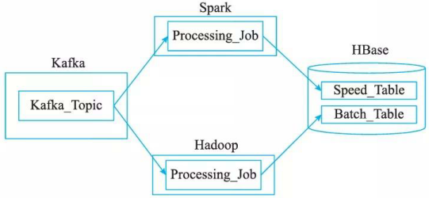

# 3Lambda架构

## 最佳实践

### 考察问

- 💚Lambda架构组成✨`()`
    - `()`
    - `()`
    - `()`

    

### 考察点

- Lambda架构组成✨`BSS`
    - `批处理层(Batch Layer)`
    - `加速层(Speed Layer)`
    - `服务层(Serving Layer)`

    

## Lambda架构对大数据处理系统的理解

Lambda架构由Storm的作者Nathan Marz提出，其设计目的在于提供一个能满足大数据系统关键特性的架构，包括高容错、低延迟、可扩展等。其整合离线计算与实时计算，融合不可变性、读写分离和复杂性隔离等原则，可集成Hadoop、Kafka、Spark、Storm等各类大数据组件。Lambda是用于同时处理离线和实时数据的，可容错的，可扩展的分布式系统。它具备强鲁棒性，提供低延迟和持续更新。

## Lambda架构介绍

如图所示，Lambda架构可分解为三层，即批处理层、加速层和服务层。

1. 批处理层(Batch Layer):存储数据集，Batch Layer在数据集上预先计算查询函数，并构建查询所对应的View。Batch Layer可以很好地处理离线数据，但有很多场景数据是不断实时生成且需要实时查询处理，对于这种情况，Speed Layer更为适合。
2. 加速层(Speed Layer):Batch Layer处理的是全体数据集，而Speed Layer处理的是最近的增量数据流。Speed Layer为了效率，在接收到新的数据后会不断更新Real-time View, 而Batch Layer是根据全体离线数据集直接得到Batch View。
3. 服务层(Serving Layer):Serving Layer用于合并Batch View和Real-time View中的结果数据集到最终数据集。

### 批处理层

Batch Layer 有两个核心功能：存储数据集和生成Batch View。

该层负责管理主数据集。主数据集中的数据必须具有以下三个属性：
1. 数据是原始的。
2. 数据是不可变的。
3. 数据永远是真实的。

有一类称为Monoid特性的函数应用非常广泛。Monoid的概念来源于范畴学(CategoryTheory), 其一个重要特性是满足结合律。如整数的加法就满足Monoid特性：

不满足Monoid特性的函数很多时候可以转化成多个满足Monoid特性的函数的运算。如多个数的平均值Avg函数，多个平均值没法直接通过结合来得到最终的平均值，但是可以拆成分母除以分子，分母和分子都是整数的加法，从而满足Monoid特性。

Monoid的结合律特性在分布式计算中极其重要，满足Monoid特性意味着我们可以将计算分解到多台机器并行运算，然后再结合各自的部分运算结果得到最终结果。同时也意味着部分运算结果可以储存下来被别的运算共享利用(如果该运算也包含相同的部分子运算)，从而减少重复运算的工作量。图展示了Monoid特性。

如果预先在数据集上计算并保存查询函数的结果，查询的时候就可以直接返回结果(或通过简单的加工运算就可得到结果)而无需重新进行完整费时的计算了。这里可以把Batch Layer看成是一个数据预处理的过程，如图所示。我们把针对查询预先计算并保存的结果称为View, View是Lamba架构的一个核心概念，它是针对查询的优化，通过View即可以快速得到查询结果。

如果采用HDFS来储存数据，我们就可以使用MapReduce来在数据集上构建查询的View。View是一个和业务关联性比较大的概念，View的创建需要从业务自身的需求出发。一个通用的数据库查询系统，查询对应的函数千变万化，不可能穷举。但是如果从业务自身的需求出发，可以发现业务所需要的查询常常是有限的。Batch Layer需要做的一件重要的工作就是根据业务的需求，考察可能需要的各种查询，根据查询定义其在数据集上对应的Views 。

### 加速层

对加速层批处理视图建立索引，便于能快速进行即席查询(AdHoc Queries)。它存储实时视图并处理传入的数据流，以便更新这些视图。

Batch Layer可以很好地处理离线数据，但有很多场景数据不断实时生成，并且需要实时查询处理。Speed Layer 正是用来处理增量的实时数据。

Speed Layer和Batch Layer比较类似。如图所示，Speed Layer对数据进行计算并生成Realtime View, 其主要区别在于：

- Speed Layer处理的数据是最近的增量数据流，Batch Layer处理的全体数据集。
- Speed Layer为了效率，接收到新数据时不断更新Realtime View, 而Batch Layer根据全体离线数据集直接得到Batch View 。

Lambda架构将数据处理分解为Batch Layer和Speed Layer有如下优点：

1. 容错性。Speed Layer中处理的数据也不断写入Batch Layer, 当Batch Layer中重新计算的数据集包含Sp eed Layer处理的数据集后，当前的Real-time View就可以丢弃，这也就意味着Speed Layer处理中引入的错误，在Batch Layer重新计算时都可以得到修正。这一点也可以看成是CAP理论中的最终一致性(Eventual Consistency)的体现。
2. 复杂性隔离。Batch Layer处理的是离线数据，可以很好地掌控。Speed Layer采用增量算法处理实时数据，复杂性比Batch Layer要高很多。通过分开Batch Layer和Speed Layer, 把复杂性隔离到Speed Layer, 可以很好地提高整个系统的鲁棒性和可靠性。
3. Scalable(横向扩容) ：当数据量／负载增大时，可扩展性的系统通过增加更多的机器资源来维持性能。也就是常说的系统需要线性可扩展，通常采用scale out(通过增加机器的个数)而不是scale up(通过增强机器的性能)。

### 服务层

Lambda架构的Serving Layer用于响应用户的查询请求，合并Batch View和Real-time View中的结果数据集到最终的数据集。该层提供了主数据集上执行的计算结果的低延迟访问。读取速度可以通过数据附加的索引来加速。与加速层类似，该层也必须满足以下要求，例如随机读取，批量写入，可伸缩性和容错能力。

这涉及数据如何合并的问题。前面我们讨论了查询函数的Monoid性质，如果查询函数满足Monoid性质，即满足结合率，只需要简单地合并BatchView和Real-time View中的结果数据集即可。否则，可以把查询函数转换成多个满足Monoid性质的查询函数的运算，单独对每个满足Monoid性质的查询函数进行Batch View和Real-time View中的结果数据集合并，然后再计算得到最终的结果数据集。另外也可以根据业务自身的特性，运用业务自身的规则来对 Batch View和Real-time View中的结果数据集合并，如图所示。

## Lambda架构的实现

如图所示，在这种Lambda 架构实现中，Hadoop(HDFS)用于存储主数据集，Spark(或Storm)可构成速度层(Speed Layer), HBase(或Cassandra)作为服务层，由Hive创建可查询的视图。

Hadoop是被设计成适合运行在通用硬件上的分布式文件系统(Distributed File System) 。它和现有的分布式文件系统有很多共同点。但同时，它和其他分布式文件系统的区别也很明显。HDFS是一个具有高度容错性的系统，能提供高吞吐量的数据访问，非常适合大规模数据集上的应用。HDFS放宽了一些约束，以达到流式读取文件系统数据的目的。

Apache Spark是专为大规模数据处理而设计的快速通用的计算引擎。Spark是UC Berkeley AMPlab所开源的类 Hadoop Map Reduce的通用并行处理框架， Spark拥有Hadoop Map Reduce所具有的优点；但不同于Map Reduce 的是一Job中间输出结果可以保存在内存中，从而不再需要读写HDFS，因此Spark能更好地适用于数据挖掘与机器学习等需要迭代的Map Reduce算法。

HBase - Hadoop Database, 是一个高可靠性、高性能、面向列、可伸缩的分布式存储系统，利用HBase技术可在廉价PC Server上搭建起大规模结构化存储集群。

## Lambda架构优缺点

1. 优点
    - 容错性好。Lambda架构为大数据系统提供了更友好的容错能力，一旦发生错误，我们可以修复算法或从头开始重新计算视图。
    - 查询灵活度高。批处理层允许针对任何数据进行临时查询。
    - 易伸缩。所有的批处理层、加速层和服务层都很容易扩展。因为它们都是完全分布式的系统，我们可以通过增加新机器来轻松地扩大规模。
    - 易扩展。添加视图是容易的，只是给主数据集添加几个新的函数。

2. 缺点
    - 全场景覆盖带来的编码开销。
    - 针对具体场景重新离线训练一遍益处不大。
    - 重新部署和迁移成本很高。

