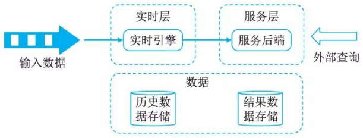
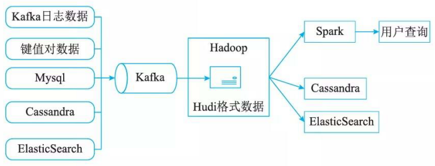
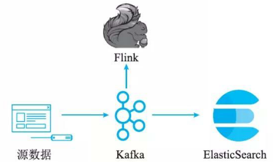

# Kappa架构

## 最佳实践

### 考察问

- Kappa架构
    - 组成: 放弃`()`层, 仅保留`()`层(加速层)

### 考察点

- Kappa架构
    - 组成: 放弃`批处理`层, 仅保留`实时`层(加速层)

## Kappa架构下对大数据处理系统的理解

为了设计出能满足前述的大数据关键特性的系统，我们需要对数据系统有本质性的理解。我们可将数据系统简单理解为：

数据系统＝数据＋查询

### 数据的特性

我们先从数据的特性谈起。数据是一个不可分割的单位，数据有两个关键的性质：When和What。

- When。When是指数据是与时间相关的，数据一定是在某个时间点产生的。比如Log日志就隐含着按照时间先后顺序产生的数据，Log前面的日志数据一定先于Log后面的日志数据产生；消息系统中消息的接收者一定是在消息的发送者发送消息后接收到的消息。相比于数据库，数据库中表的记录就丢失了时间先后顺序的信息，中间某条记录可能是在最后一条记录产生后发生更新的。对于分布式系统，数据的时间特性尤其重要。分布式系统中数据可能产生于不同的系统中，时间决定了数据发生的全局先后顺序。比如对一个值做算术运算，先＋2,后＋3, 与先＋3 ，后＋2, 得到的结果完全不同。数据的时间性质决定了数据的全局发生先后，也就决定了数据的结果。

- What。What是指数据的本身。由于数据跟某个时间点相关，所以数据的本身是不可变的(Immutable), 过往的数据已经成为事实(Fact),你不可能回到过去的某个时间点去改变数据事实。这也就意味着对数据的操作其实只有两种：读取已存在的数据和添加更多的新数据。采用数据库的记法，CRUD就变成了CR, Updat e 和 Delet e 本质上其实是新产生的数据信息，用C来记录。

### 数据的存储

根据上述对数据本质特性的分析，Lamba架构中对数据的存储采用的方式是：数据不可变，存储所有数据。通过采用不可变方式存储所有的数据，可以有如下好处：

- 简单。采用不可变的数据模型，存储数据时只需要简单地往主数据集后追加数据即可。相比于采用可变的数据模型，为了Update操作，数据通常需要被索引，从而能快速找到要更新的数据去做更新操作。

- 应对人为和机器的错误。前述中提到人和机器每天都可能会出错，如何应对人和机器的错误，让系统能够从错误中快速恢复极其重要。不可变性 (Immutability)和重新计算 (Re­computati on) 则是应对人为和机器错误的常用方法。采用可变数据模型，引发错误的数据有可能被覆盖而丢失。相比于采用不可变的数据模型，因为所有的数据都在，引发错误的数据也在。修复的方法就可以简单的是遍历数据集上存储的所有的数据，丢弃错误的数据，重新计算得到Views。重新计算的关键点在于利用数据的时间特性决定的全局次序，依次顺序重新执行，必然能得到正确的结果。

## Kappa架构介绍

Kappa架构由Jay Kreps提出，不同于Lambda同时计算流计算和批计算并合并视图，Kappa只会通过流计算一条的数据链路计算并产生视图。Kappa同样采用了重新处理事件的原则，对于历史数据分析类的需求，Kappa要求数据的长期存储能够以有序日志流的方式重新流入流计算引擎，重新产生历史数据的视图。本质上是通过改进 Lambda架构中的Speed Layer, 使它既能够进行实时数据处理，同时也有能力在业务逻辑更新的情况下重新处理以前处理过的历史数据。

Kappa架构的原理就是：在Lambda的基础上进行了优化，删除了Batch Layer的架构，将数据通道以消息队列进行替代。因此对于Kappa架构来说，依旧以流处理为主，但是数据却在数据湖层面进行了存储，当需要进行离线分析或者再次计算的时候，则将数据湖的数据再次经过消息队列重播一次则可。Kappa数据处理架构如图所示。

如图所示，输入数据直接由实时层的实时数据处理引擎对源源不断的源数据进行处理，再由服务层的服务后端进一步处理以提供上层的业务查询。而中间结果的数据都是需要存储的，这些数据包括历史数据与结果数据，统一存储在存储介质中。

Kappa方案通过精简链路解决了数据写入和计算逻辑复杂的问题，但它依然没有解决存储和展示的问题，特别是在存储上，使用类似Kafka的消息队列存储长期日志数据，数据无法压缩，存储成本很大，绕过方案是使用支持数据分层存储的消息系统(如Pulsar, 支持将历史消息存储到云上存储系统)，但是分层存储的历史日志数据仅能用于Kappa backfill作业，数据的利用率依然很低。

从使用场景上来看，Kappa架构与Lambda相比，主要有两点区别：

- Kappa不是Lambda的替代架构，而是其简化版本，Kappa放弃了对批处理的支持，更擅长业务本身为增量数据写入场景的分析需求，例如各种时序数据场景，天然存在时间窗口的概念，流式计算直接满足其实时计算和历史补偿任务需求；
- Lambda直接支持批处理，因此更适合对历史数据分析查询的场景，比如数据分析师需要按任意条件组合对历史数据进行探索性的分析，并且有一定的实时性需求，期望尽快得到分析结果，批处理可以更直接高效地满足这些需求。

## Kappa架构的实现

下面以Apache Kafka为例来讲述整个全新架构的过程。

部署Apache Kafka, 并设置数据日志的保留期(Retention Period) 。这里的保留期指的是你希望能够重新处理的历史数据的时间区间。例如，如果你希望重新处理最多一年的历史数据，那就可以把Apache Kafka中的保留期设置为365天。如果你希望能够处理所有的历史数据，那就可以把Apache Kafka中的保留期设置为“永久(Forever)” 。

如果我们需要改进现有的逻辑算法，那就表示我们需要对历史数据进行重新处理。我们需要做的就是重新启动一个Apache Kafka作业实例(Instance)。这个作业实例将从头开始，重新计算保留好的历史数据，并将结果输出到一个新的数据视图中。我们知道Apache Kafka的底层是使用Log Offset来判断现在已经处理到哪个数据块了，所以只需要将Log Offset设置为0, 新的作业实例就会从头开始处理历史数据。

当这个新的数据视图处理过的数据进度赶上了旧的数据视图时，我们的应用便可以切换到从新的数据视图中读取。

停止旧版本的作业实例，并删除旧的数据视图。

## Kappa架构的优缺点

Kappa架构的优点在于将实时和离线代码统一起来，方便维护而且统一了数据口径的问题，避免了Lambda架构中与离线数据合并的问题，查询历史数据的时候只需要重放存储的历史数据即可。而Kappa的缺点也很明显：

- 消息中间件缓存的数据量和回溯数据有性能瓶颈。通常算法需要过去180天的数据，如果都存在消息中间件，无疑有非常大的压力。同时，一次性回溯订正180天级别的数据，对实时计算的资源消耗也非常大。
- 在实时数据处理时，遇到大量不同的实时流进行关联时，非常依赖实时计算系统的能力，很可能因为数据流先后顺序问题，导致数据丢失。
- Kappa 在抛弃了离线数据处理模块的时候，同时抛弃了离线计算更加稳定可靠的特点。Lambda虽然保证了离线计算的稳定性，但双系统的维护成本高且两套代码带来后期运维困难。

## 常见Kappa架构变形

Kappa＋是Uber提出流式数据处理架构，它的核心思想是让流计算框架直接读HDFS里的数据仓库数据，一并实现实时计算和历史数据backfill计算，不需要为backfill作业长期保存日志或者把数据拷贝回消息队列。

Kappa＋将数据任务分为无状态任务和时间窗口任务，无状态任务比较简单，根据吞吐速度合理并发扫描全量数据即可，时间窗口任务的原理是将数据仓库数据按照时间粒度进行分区存储，窗口任务按时间先后顺序一次计算一个partition的数据，partition内乱序并发，所有分区文件全部读取完毕后，所有source才进入下一个partition消费并更新watermark。事实上，Uber开发了Apache bu山框架来存储数据仓库数据，hudi支待更新、删除已有parquet数据，也支持增量消费数据更新部分，从而系统性解决了问题2存储的问题。下图是完整的Uber大数据处理平台，其中Hadoop-Spark-用户查询的流程涵盖了Kappa＋数据处理架构。

## 混合分析系统的Kappa架构

Lambda 和 Kappa 架构都还有展示层的困难点，结果视图如何支持热点数据查询分析，一个解决方案是在 Kappa 基础上衍生数据分析流程。

如图 19-12 所示，在基于使用 Kafka + Flink 构建 Kappa 流计算数据架构，针对 Kappa 架构分析能力不足的问题，再利用 Kafka 对接组合Elastic- Search 实时分析引擎，部分弥补其数据分析能力。但是 ElasticSearch 也只适合对合理数据量级的热点数据进行索引，无法覆盖所有批处理相关的分析需求，这种混合架构某种意义上属千 Kappa 和 Lambda 间的折中方案。

