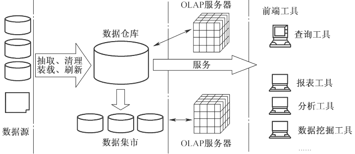

# 数仓

## 最佳实践

### 考察问

- 数据分层✨记最终的字母`SDMSS`, 中间是三个DW, 两边是OD和AD

    1. `()`: 存在业务数据库中, 如MySQL, ES、Redis, 用于业务查询, 形成`报表`
    2. `()`, 整合成`主题`的数据服务层, 用于OLAP、数据分发, 形成`宽表`
    3. `()`: 在DWD的基础上进行聚合操作，算出相应的`统计指标`, 形成`指标表`
    4. `()`: 业务层和数据仓库层的`隔离层`, 清洗数据, 保持`和ODS层相同颗粒度`, 形成`清洗表`
    5. `()`: 直接接入数据的：业务库、埋点日志、消息队列等, 形成`原始表`

### 考察点

- 数据分层

    1. `应用服务层`(Application Data Service, ADS): 存在业务数据库中, 如MySQL, ES、Redis, 用于业务查询, 形成`报表`
    2. `数仓服务层`(Data Warehouse Service, DWS), 整合成`主题`的数据服务层, 用于OLAP、数据分发, 形成`宽表`
    3. `数仓中间层`(Data Warehouse Middle, DWM): 在DWD的基础上进行聚合操作，算出相应的`统计指标`, 形成`指标表`
    4. 数据细节层(Data Warehouse Details, DWD): 业务层和数据仓库层的`隔离层`, 清洗数据, 保持`和ODS层相同颗粒度`, 形成`清洗表`
    5. 贴源层(Operation Data Store, ODS): 直接接入数据的, 业务库、埋点日志、消息队列等, 形成`原始表`

## 数据仓库概念

数据仓库是一个面向主题的、集成的、相对稳定的、反映历史变化的数据集合，用于支持管理决策。

OLAP服务器：联机分析处理服务器，快速汇总大量数据并进行高效查询分析，为分析人员提供决策支持。

## 数据仓库的结构

四个层次:

1. 数据源：是数据仓库系统的基础，是整个系统的数据源泉。
2. 数据的存储与管理：是整个数据仓库系统的核心。
3. OLAP(联机分析处理)服务器：对分析需要的数据进行有效集成，按多维模型组织，以便进行多角度、多层次的分析，并发现趋势。
4. 前端工具：主要包括各种报表工具、查询工具、数据分析工具、数据挖掘工具以及各种基于数据仓库或数据集市的应用开发工具。

## 数据仓库与数据库的对比

|对比项|数据仓库|数据库|
| ---- | ---- | ---- |
|面向对象|面向主题的|面向事务的|
|数据结构|数据结构是集成的，具有一致性|数据结构更为复杂|
|数据状态|是静态的历史数据，只能定期添加、刷新|是动态变化的，业务发生，数据就更新|
|数据类型|存储历史数据|存储实时、在线数据|
|设计冗余|设计需要引入冗余|设计尽量避免冗余|

## 数据分层

1. `应用服务层`(Application Data Service, ADS): 存在业务数据库中, 如MySQL, ES、Redis, 用于业务查询, 形成`报表`
2. `数仓服务层`(Data Warehouse Service, DWS), 整合成`主题`的数据服务层, 用于OLAP、数据分发, 形成`宽表`
3. `数仓中间层`(Data Warehouse Middle, DWM): 在DWD的基础上进行聚合操作，算出相应的`统计指标`, 形成`指标表`
4. 数据细节层(Data Warehouse Details, DWD): 业务层和数据仓库层的`隔离层`, 清洗数据, 保持`和ODS层相同颗粒度`, 形成`清洗表`
5. 贴源层(Operation Data Store, ODS)直接接入数据的：业务库、埋点日志、消息队列等, 形成`原始表`

