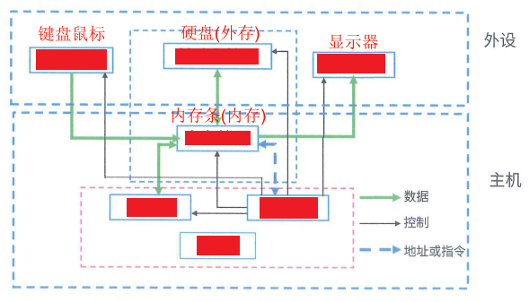
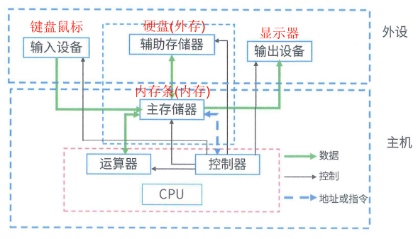

# 计算机硬件

## 最佳实践

### 考察问

- 计算机的基本硬件系统由`()`、`()`、`()`、`()`五大部件组成。(冯·诺依曼结构)✨`()`输入输出
    - 运算器， 控制器被集成在`()`
    - 存储器是分为`()`和`()`
    - 输入设备和输出设备合称为`()`

    

### 考察点

- 计算机的基本硬件系统由`运算器`、`控制器`、`存储器`、`输入设备和输出设备`五大部件组成。(冯·诺依曼结构)✨`运控存`输入输出
    - 运算器， 控制器被集成在`中央处理单元(Central Processing Unit,  CPU)`
    - 存储器是分为`内部存储器(内存)`和`外部存储器(硬盘)`
    - 输入设备和输出设备合称为`外部设备(简称外设)`

    

## 计算机硬件组成

计算机的基本硬件系统由`运算器`、`控制器`、`存储器`、`输入设备和输出设备`五大部件组成。(冯·诺依曼结构)

1. `运算器`、`控制器`被集成在`中央处理单元(Central Processing Unit,  CPU)`
2. `存储器`是分为`内部存储器(内存)`和`外部存储器(硬盘)`
3. `输入设备`和`输出设备`合称为`外部设备(简称外设)`

