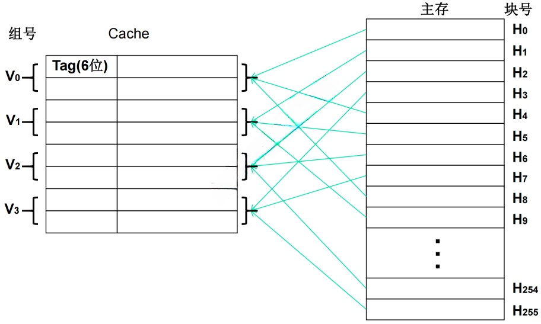

# 存储器

## 最佳实践

### 题目

- 假设cache的周期$t_1=1$, 主存储器周期$t_2=100$, 命中率$h=0.08$, 则平均周期$t_3 = 100 * 0.08 + 1 * 0.92= 1$. 比没有cache快了100倍.

- 内存按字节编址，利用8K×4bit的存储器芯片构成84000H到8FFFFH的内存，共需(  )片。

    答案: 12片

    1. 总容量 = 存储单元个数 x 编址容量. ✨这里编制内容是按字节, 所以为8bit

        1. = (8FFFFH - 84000H + 1) * 8bit ✨H是十六进制的标志, 而非具体数字
        2. = (8FFFFH + 1 - 84000H) * 8bit ✨个数要+1, 题目故意如此设计, 来简化计算, F是15, 然后加1, 正好进一位.
        3. = (90000H - 84000H) * 8bit ✨0-4不够, 借一位, 尾巴是H十六进制, 既16-4=12, 记为C
        4. = C000H * 8bit
        5. = 12 x 16^3 x 8bit  ✨十六进制转十进制

    2. 单位芯片容量

        8K x 4bit = 8 x 2^10 x 4bit  ✨K是2^10, 而不是1000

    3. 单位芯片数 = 总容量/单位芯片容量

        12 x 16^3 x 8bit/8 x 2^10 x 4bit = 12

- 某磁盘磁头从一个磁道移至另一个磁道需要10ms。文件在磁盘上非连续存放，逻辑上相邻数据块的平均移动距离为10个磁道，每块的旋转延迟时间及传输时间分别为100ms和2ms，则读取一个100块的文件需要(  )ms时间。

    1. ((磁道个数 x 磁道移动时间) + 旋转延迟时间 + 传输时间) x 文件个数
    2. ((10 x 10) + 100 + 2) x 100

- 假设某磁盘的每个磁道划分成11个物理块，每块存放1个逻辑记录。逻辑记录$R_0$，$R_1$，...，$R_9$，$R_{10}$存放在同一个磁道上，记录的存放顺序如下表所示：

    |物理块|1|2|3|4|5|6|7|8|9|10|11|
    | ---- | ---- | ---- | ---- | ---- | ---- | ---- | ---- | ---- | ---- | ---- | ---- |
    |逻辑记录|$R_0$|$R_1$|$R_2$|$R_3$|$R_4$|$R_5$|$R_6$|$R_7$|$R_8$|$R_9$|$R_{10}$|

    1. 如果磁盘的旋转周期为33ms，磁头当前处在$R_0$的开始处。若系统使用单缓冲区顺序处理这些记录，每个记录处理时间为3ms，则处理这11个记录的最长时间为(366ms)；若对信息存储进行优化分布后，处理11个记录的最少时间为(66ms)。

        1. 每个记录旋转时间=总旋转时间/物理块个数: 33/11=3ms
        2. $R_0$处理时间: 3(旋转) + 3(处理) = 6ms
        3. $R_1$处理时间:
            1. $R_0$处理完, 磁头已经旋转到$R_1$的末尾, 所以要再次旋转到$R_1$的开始, 共需3 * 10 = 30ms
            2. 3(旋转) + 3(处理) = 6ms
            3. 处理$R_1$的时间就等于等待磁盘再次旋转到$R_1$开始30ms + 旋转3ms + 处理3ms
        4. 依次类推
        5. 6 + 36 * 10 = 366ms

    2. 上述情况, 时间主要浪费在每次读取依次扇区, 整个磁盘都要旋转一周才能到下一个需要读取的扇区, 所以可以更改扇区内物理块的排序来优化.

        1. $R_0$: 3ms + 3ms(旋转3ms + 处理3ms)
        2. $R_1$: 3ms + 3ms(旋转3ms + 处理3ms)

        

1. 假设磁盘臂位于15号柱面上，进程的请求序列如下表表示，如果采用最短移臂调度算法，那么系统的响应序列应为( 512436, 514236, 152436, 154236 )。

    |请求序列|柱面号|磁头号|扇区号|
    | ---- | ---- | ---- | ---- |
    |1|12|8|9|
    |2|19|6|5|
    |3|23|9|6|
    |4|19|10|5|
    |5|12|8|4|
    |6|28|3|10|

2. 在磁盘调度管理中，应先进行移臂调度，再进行旋转调度。假设磁盘移动臂位于20号柱面上，进程的请求序列如下表所示。如果采用最短移臂调度算法，那么系统的响应序列应为4 6 9 5 7 1 2 8 3。

    |请求序列|柱面号|磁头号|扇区号|
    | ---- | ---- | ---- | ---- |
    |1|18|8|9|
    |2|16|6|3|
    |3|16|9|6|
    |4|21|10|5|
    |5|18|8|4|
    |6|21|3|10|
    |7|18|7|6|
    |8|16|10|4|
    |9|22|10|8|

### 考察问

1. 计算机层次化存储结构, 从CPU到硬盘:
    1. `()`
    2. `()`(Cache)
    3. `()`
    4. `()`
2. Cache的性能指标

    1. $\text{命中率} = \frac{\text{`()`完成存取次数}}{\text{`()`完成存取次数}+\text{`()`完成存取次数}}$
    2. $平均周期 = `()` * `()` + `()` * `()`$

3. 主存编址: 
    - 总芯片数 = `()` / `()`
    - 内存总容量 = `()` * `()`
        - 存储单元个数 = `()` - `()` + `()`
        - 编址容量: 按字节(`()`bit)编址：存储体的存储单元是字节存储单元，即最小寻址单位是一个字节
    - 每个芯片容量 = `()` * `()`

4. 磁盘的组成:
    1. 磁头: 磁盘的正反面, 各有`()`个磁头, 一个有2张盘片的磁盘，就有4个磁头，编号从`()`开始 。
    2. 磁道: 所有盘片上`()`相同的磁道, 也成为`()`。
    3. 扇区:
5. 磁盘数据读取 = `()`时间 + `()`时间 + `()`时间
6. 磁盘旋转优化
7. 磁盘移臂调度算法
    1. 先来先服务
    2. 扫描算法: `()`
    3. 循环扫描算法: `()` ✨循环是重头再来
    4. 最短移臂算法:
        1. 先计算`()`号, 找差值最小的
        2. 如果差值相同, 再看`()`号, 找差值最小的

### 考察点

1. 计算机层次化存储结构, 从CPU到硬盘:
    1. `CPU寄存器`
    2. `高速缓存`(Cache)
    3. `内存`
    4. `外存`
2. Cache的性能指标

    1. $\text{命中率} = \frac{\text{`cache`完成存取次数}}{\text{`cache`完成存取次数}+\text{`内存`完成存取次数}}$
    2. $平均周期 = `Cache的周期时间` * `命中率` + `主存的周期时间` * `(1-命中率)`$

3. 主存编址: 
    - 总芯片数 = `存储总容量` / `每个芯片容量`
    - 内存总容量 = `存储单元个数` * `编址容量`
        - 存储单元个数 = `最大地址` - `最小地址` + `1`
        - 编址容量: 按字节(`8`bit)编址：存储体的存储单元是字节存储单元，即最小寻址单位是一个字节
    - 每个芯片容量 = `存储单元个数` * `编址容量`

4. 磁盘的组成:
    1. 磁头: 磁盘的正反面, 各有`1`个磁头, 一个有2张盘片的磁盘，就有4个磁头，编号从`0`开始 。
    2. 磁道: 所有盘片上`半径`相同的磁道, 也成为`柱面`。
    3. 扇区:
5. 磁盘数据读取 = `寻道`时间 + `旋转`时间 + `传输`时间
6. 磁盘旋转优化
7. 磁盘移臂调度算法
    1. 先来先服务
    2. 扫描算法: `起点终点终点起点...`
    3. 循环扫描算法: `起点终点起点终点...` ✨循环是重头再来
    4. 最短移臂算法:
        1. 先计算`磁道`号, 找差值最小的
        2. 如果差值相同, 再看`扇区`号, 找差值最小的

## 层次化存储结构

解决存储的容量、价格和速度之间的矛盾, 按照与处理器的物理距离可分为 4 个层次:

|层级|名称|描述|
| ---- | ---- | ---- |
|1|CPU|寄存器(register)|
|2|Cache|静态随机存储器(static random-access memory, SRAM)|
|3|内存|动态随机存储器(dynamic random-access memory, DRAM)|
|4|外存|硬盘、光盘、U盘|

1. 片上缓存(CPU寄存器)：在处理器核心中直接集成的缓存，一般为SRAM结构，实现数据的快速读取。它容量较小，一般为 16kB~512kB, 按照不同的设计可能划分为一级或二级。
2. 片外缓存(Cache)：在处理器核心外的缓存，需要经过交换互联开关访问，一般也是由 SRAM构成，容量较片上缓存略大，可以为 256kB~4MB 。按照层级被称为 L2Cache 或 L3Cache, 或者称为平台Cache(Platform Cache) 。
3. 主存(内存)：通常采用DRAM结构，以独立的部件／芯片存在，通过总线与处理器连接。DRAM依赖不断充电维持其中的数据，容量在数百MB至数十GB之间。
4. 外存：可以是磁带、磁盘、光盘和各类Flash等介质器件，这类设备访问速度慢，但容量大，且在掉电后能够保持其数据。

## Cache

高速缓存(Cache)位于CPU与主存之间，用于存储当前活跃的程序和数据。可以直接与CPU进行数据交互，容量小，速度为主存的5-10倍。其内容是主存的一个拷贝副本，对程序员来说是透明的，

使用Cache改善系统性能的依据是程序的局部性原理，包括时间局部性和空间局部性。

1. 时间局部性：最近被访问过的指令和数据很可能会被再次访问，比如循环操作。
2. 空间局部性：最近访问过的指令和数据往往集中在一小片存储区域中, 程序顺序执行。

### 主存与Cache的地址映射

在CPU工作时，输出的是主存单元的地址，然而数据的读写操作应在Cache存储器中进行。所以，必须将主存地址转换为Cache地址，这种转换过程被称为地址映像，且该映射由硬件自动完成。

- 全相联映像：主存中的任何一个数据块都能与Cache中的任意一行对应。

    - 映射方法：多对多
    - 优点：冲突概率小，Cache的利用率高
    - 缺点：硬件难实现，且需要一个访问速度很快、成本高的相联存储器
    - 适用场合：小容量Cache

    

- 直接映像：Cache中的一行固定对应主存中的若干行，例如通过主存块号对Cache总行数取模来确定对应关系。

    - 映射方法：一对多
    - 优点：硬件实现简单，成本低，地址变换速度快
    - 缺点：冲突概率高，且Cache空间利用率不高
    - 适用场合：大容量Cache

    

- 组相联映像：它结合了上述两种方式。先将Cache分组，组与组之间采用直接映射，而在组内采用全相联映射 。

    - 映射方法：一组对多
    - 优点：综合前两者的优点，又尽量避免其缺点，故被普遍采用

    

### Cache的替换策略

Cache替换算法的目标是使Cache获得尽可能高的命中率。

- 随机替换算法：从特定的行位置中随机地选取一行换出即可。特点： 硬件易实现，速度快；但命中率和工作效率在小容量Cache中不高。
- 先进先出算法(First In First Out，FIFO)：最先进入Cache的行被换出。
- LFU算法(Least Frequently Used，LFU)：被访问的行计数器增加1，值最小的行被换出。特点：不能反映近期cache的访问情况。
- LRU算法(Least Recently Used，LRU)：被访问的行计数器置0，其他的计数器增加1，换值最大的行。特点：符合cache的工作原理。

### Cache的性能指标

当CPU所访问的数据在Cache中时，直接从Cache中读取数据，即命中；否则，需要从主存中读取数据，即未命中。

命中率：在一个程序执行期间，设$N_{c}$表示cache完成存取的次数，$N_{m}$表示主存完成存取的总次数，$h$定义为命中率，则有

$h = \frac{N_{c}}{N_{c} + N_{m}}$

如果以$h$代表对Cache的访问命中率，$t_1$表示Cache的周期时间，$t_2$表示主存储器周期时间，以读操作为例，使用“Cache + 主存储器”的系统的平均周期为$t_3$，则：

$$t_3 = h\times t_1+(1 - h)\times t_2$$

其中，$(1 - h)$又称为失效率(未命中率)。

🔒假设cache的周期$t_1=1$, 主存储器周期$t_2=100$, 命中率$h=0.08$, 则平均周期$t_3 = 100 * 0.08 + 1 * 0.92= 1$. 比没有cache快了100倍.

## 主存编址

1. 总片数 = 存储总容量 / 每个芯片容量
2. 内存总容量 = 存储单元个数 * 编址内容
    1. 存储单元个数 = 最大地址 - 最小地址 + 1
    2. 编址内容
        1. 按字(1bit)编址：存储体的存储单元是字存储单元，即最小寻址单位是一个字
        2. 按字节(8bit)编址：存储体的存储单元是字节存储单元，即最小寻址单位是一个字节
3. 每个芯片容量 = 存储单元个数 * 编制内容

🔒内存按字节编址，利用8K×4bit的存储器芯片构成84000H到8FFFFH的内存，共需(  )片。

答案: 12片

1. 总容量 = 存储单元个数 x 编址容量. ✨这里编制内容是按字节, 所以为8bit

    1. = (8FFFFH - 84000H + 1) * 8bit ✨H是十六进制的标志, 而非具体数字
    2. = (8FFFFH + 1 - 84000H) * 8bit ✨个数要+1, 题目故意如此设计, 来简化计算, F是15, 然后加1, 正好进一位.
    3. = (90000H - 84000H) * 8bit ✨0-4不够, 借一位, 尾巴是H十六进制, 既16-4=12, 记为C
    4. = C000H * 8bit
    5. = 12 x 16^3 x 8bit  ✨十六进制转十进制

2. 单位芯片容量

    8K x 4bit = 8 x 2^10 x 4bit  ✨K是2^10, 而不是1000

3. 单位芯片数 = 总容量/单位芯片容量

    12 x 16^3 x 8bit/8 x 2^10 x 4bit = 12

注意:

1. 计算机的千位进制

    $1kb = 2^10bit$
    $1Mb = 2^20bit$
    $1Gb = 2^30bit$

2. 字节和bit

    $1B = 8bit$

3. 十六进制

    $1H = 16$

## 磁盘读取

磁盘的结构:

1. 磁头号: 磁盘一般有多张盘片，每张盘片上下两面都可存储数据，对应两个磁头，磁头号用于标识读写数据时使用的是哪个磁头，即对应盘片的哪一面 。比如一个有2张盘片的磁盘，就有4个磁头，编号从0开始 。

2. 柱面号(磁道号): 所有盘片上半径相同的磁道构成一个柱面。柱面号就是用来标识不同柱面的编号 。例如，最外侧的所有磁道构成 0 号柱面，向里依次递增 。

3. 扇区号: 盘片被划分为若干个扇形区域，每个区域就是一个扇区，扇区号用于标识具体的扇区 。通常一个磁道会被划分为多个扇区，如8个、16个等 。

读取磁盘数据的时间应包括以下三个部分：

1. 寻道时间(找磁道)：半径方向移动, 将磁头定位至所要求的磁道上所需的时间
2. 旋转时间(找扇区)：圆周方向移动, 寻道完成后至磁道上需要访问的信息到达磁头下的时间，平均等待时间为磁盘旋转一周所需时间的一半
3. 传输时间：传输数据的时间

🔒某磁盘磁头从一个磁道移至另一个磁道需要10ms。文件在磁盘上非连续存放，逻辑上相邻数据块的平均移动距离为10个磁道，每块的旋转延迟时间及传输时间分别为100ms和2ms，则读取一个100块的文件需要(  )ms时间。

1. ((磁道个数 x 磁道移动时间) + 旋转延迟时间 + 传输时间) x 文件个数
2. ((10 x 10) + 100 + 2) x 100

## 磁道旋转优化

磁道旋转优化

## 磁盘移臂调度算法

1. 先来先服务(FCFS): 下一个是按顺序排

    

2. 扫描算法(SCAN): 电梯算法, 从外磁道到内磁道, 再从内磁道到外磁道
3. 循环扫描算法(CSCAN): 从外磁道到内磁道, 然后回到外磁道, 再来一遍
4. 最短移臂调度算法(SSTF): 下一个是离本次最近的磁道

    

    解题方法：
    第一、优先看柱面(也就是磁道)；
    第二、看同一柱面(磁道)下，按照扇区号从小到大即可。
