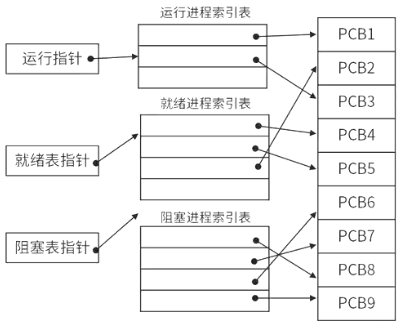
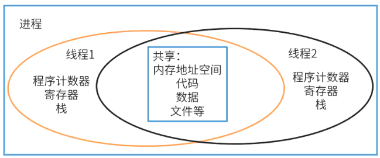
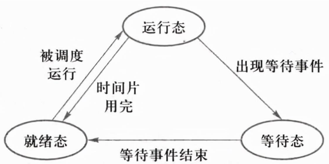

# 进程和线程

## 最佳实践

### 题目总结

- 💚在支持多线程的操作系统中，假设进程P创建了若干个线程，那么( )是不能被这些线程共享的。

    - A. 该进程中打开的文件
    - B. 该进程的代码段
    - C. 该进程中某线程的栈指针
    - D. 该进程的全局变量

    答案: C

- 💚在支持多线程的操作系统中，假设进程P创建了线程T1、T2和T3，那么下列说法正确的是 ( )。

    - A.该进程中已打开的文件是不能被T1、T2和T3共享的
    - B.该进程中T1的栈指针是不能被T2共享的，但可被T3共享
    - C.该进程中T1的栈指针是不能被T2和T3共享的
    - D.该进程中某线程的栈指针是可以被T1、T2和T3共享的

    答案: C

- 💚(✨2025上22)下列选项中会导致线程从执行态变为就绪态的是( )。

    - A.键盘输入
    - B.主动让出 CPU
    - C.执行信号量的 wait()操作
    - D.缺页异常

    答案: B

- 💚某计算机系统中的进程管理采用三态模型，那么下图所示的PCB(进程控制块)的组织方式采用( )，图中( )

    - A. 顺序方式
    - B. 链接方式
    - C. 索引方式
    - D. Hash

    - A. 有1个运行进程，2个就绪进程，4个阻塞进程
    - B. 有2个运行进程，3个就绪进程，3个阻塞进程
    - C. 有2个运行进程，3个就绪进程，4个阻塞进程
    - D. 有3个运行进程，2个就绪进程，4个阻塞进程

    

    答案: CC

### 考察问

- 💚进程是`()`资源的最小单位, 线程是`()`的最小单位
- 💚线程共享:
    - 线程共享: 代码, 数据, 文件, 内存地址空间
    - 线程独立: `()`, `()`, `()`
- 💚进程状态
    - 没有`()`: 阻塞态
    - 有`()`:
        - 有CPU资源: 运行
        - 没有CPU资源: 等待
- 💚进程状态的转换
    - 顺时针循环: `()`
    - 逆时针: `()`

### 考察点

- 进程是`拥有`资源的最小单位, 线程是`调度`的最小单位
- 线程共享:
    - 线程共享: 代码, 数据, 文件, 内存地址空间
    - 线程独立: `程序计数器`, `寄存器`, `栈`
- 进程状态
    - 没有`非CPU资源`: 阻塞态
    - 有`非CPU资源`:
        - 有CPU资源: 运行
        - 没有CPU资源: 等待
- 进程状态的转换
    - 顺时针循环: `运行->阻塞->等待->运行`
    - 逆时针: `运行->等待(失去CPU资源)`

## 进程概念

1. 进程:

    系统进行资源分配和调度的一个独立单位, 包含三部分:

    1. 程序块
    2. 进程控制块(Process Control Block, PCB), 进程存在的唯一标志, 包含进程标识符、状态、位置信息、控制信息、队列指针(链接同一状态的进程)、优先级、现场保护区等。
    3. 数据块

2. 线程:

    线程是`调度`的最小单位，进程是`拥有资源`的最小单位，线程可以共享进程的公共数据、全局变量、代码及一些进程级的资源(如打开文件和信号)等，但不能共享线程独有的资源，如线程的栈指针等标识数据。

引入线程的原因是进程在创建、撤销和切换中，系统必须为之付出较大的时空开销，故在系统中设置的进程数目不宜过多，进程切换的频率不宜太高，这就限制了并发程度的提高。引入线程后，将传统进程的两个基本属性分开，线程作为调度和分配的基本单位，进程作为独立分配资源的单位。

✨进程与程序的区别：进程是程序的一次执行过程，没有程序就没有进程。

## 进程状态

状态|CPU资源|非CPU资源
--|--|--
运行|是|是
就绪|否|是
阻塞|有无均可|否

