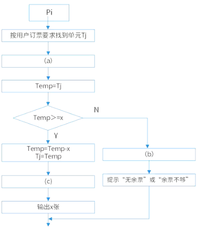
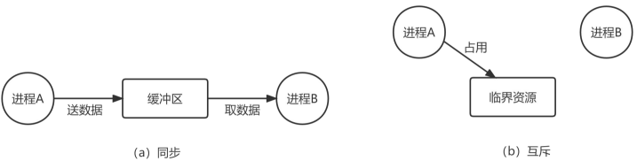
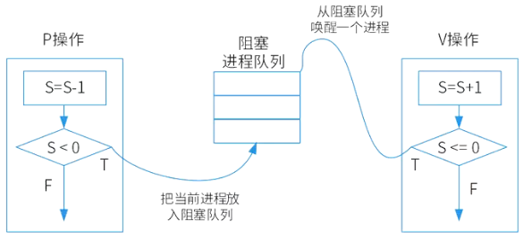
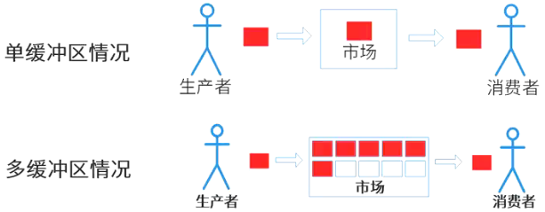

# 信号量与PV操作

## 最佳实践

### 题目总结

1. 某航空公司机票销售系统有n个售票点，该系统为每个售票点创建一个进程Pi(i = 1，2，…，n)管理机票销售。假设Tj(j = 1，2，…，m)单元存放某日某航班的机票剩余票数，Temp为Pi进程的临时工作单元，x为某用户的订票张数。

    

    初始化时系统应将信号量S赋值为(  )。Pi进程的工作流程如下图所示，若用P操作和V操作实现进程间的同步与互斥，则图中空(a)，空(b)和空(c)处应分别填入(  )。

    - A. 0
    - B. 1
    - C. 2
    - D. 3
    - A. P(S),V(S)和V(S)
    - B. P(S),P(S)和V(S)
    - C. V(S),P(S)和P(S)
    - D. V(S),V(S)和P(S)

    答案: BA
    1. 没有协作关系, 是互斥模型,  所以初始信号量为1

1. 同步模型

    生产者将物品放入市场, 消费者将物品从市场拿出, 市场只允许存放一个物品.

    |生产者|消费者|
    | ---- | ---- |
    |生产一个产品|P(S2)修改物品个数|
    |P(S1)修改缓冲区的容量|从缓冲区取产品|
    |送产品到缓冲区|V(S1)修改缓冲区的容量|
    |V(S2)修改物品个数|消费产品|

    ✨考虑不能同时进行放物品和取物品的操作, 所以要加一个互斥锁

    1. S1表示缓冲区容量，初值为1
    2. S2表示缓冲区产品个数，初值为0

2. 互斥模型

    多个进程共享一台打印机:

    ```sh
    P(S)
    使用打印机
    V(S)
    ```

    1. 进程1使用打印机前进行P(S), S = S - 1 = 0, 进程1执行
    2. 进程2使用打印机前进行P(S), S = S - 1 = -1, 进程2阻塞
    3. 进程1使用打印机后进行V(S), S = S + 1 = 0, 唤醒阻塞进程2
    4. 进程2使用打印机后进行V(S), S = S + 1 = 1

### 考察问

- 进程同步: 协调`()`个进程, 保证数据`()`的一种机制.
- 进程互斥: `()`个进程在访问`()`资源时，需要`()`地访问。
- 临界资源: 只能`()`个进程使用的资源称为临界资源，如打印机。
- 信号量S: 资源的`()`
- P操作和V操作
    - P(Passeren)加锁操作：表示`()`一个资源，即S = S – 1
        - 若P操作后: S `()` 0，则执行P操作的进程`()`执行
        - 若P操作后: S `()` 0，则执行P操作的进程进入`()`状态, `()`的值代表阻塞进程的`()`
    - V(Verhoog)解锁操作：表示`()`一个资源，即S = S + 1
        - 若V操作后: S `()` 0，则执行V操作的进程`()`执行
        - 若V操作后: S `()` 0，则
            - `()`一个因申请该资源被`()`, 并将其插入就绪队列
            - 执行V操作的进程`()`执行

- 互斥模型举例: `()`模型
- 同步模型举例: `()`模型✨利用多个互斥模型完成

    - S1表示市场`()`, `()`
    - S2表示市场存放的`()`, `()`

    |生产者|消费者|
    | ---- | ---- |
    |生产一个产品|P(S2)修改物品个数|
    |P(S1)修改缓冲区的容量|从缓冲区取产品|
    |送产品到缓冲区|V(S1)修改缓冲区的容量|
    |V(S2)修改物品个数|消费产品|

### 考察点

- 进程同步: 协调`多`个进程, 保证数据`一致`的一种机制.
- 进程互斥: `多`个进程在访问`临界`资源时，需要`相互排斥`地访问。
- 临界资源: 只能`一`个进程使用的资源称为临界资源，如打印机。
- 信号量S: 资源的`个数`
- P操作和V操作
    - P(Passeren)加锁操作：表示`申请`一个资源，即S = S – 1
        - 若P操作后: S `≥` 0，则执行P操作的进程`继续`执行
        - 若P操作后: S `<` 0，则执行P操作的进程进入`阻塞`状态, `S`的值代表阻塞进程的`个数`
    - V(Verhoog)解锁操作：表示`释放`一个资源，即S = S + 1
        - 若V操作后: S `>` 0，则执行V操作的进程`继续`执行
        - 若V操作后: S `≤` 0，则
            - `唤醒`一个因申请该资源被`阻塞的进程`, 并将其插入就绪队列
            - 执行V操作的进程`继续`执行

- 互斥模型举例: `打印机`模型
- 同步模型举例: `生产者消费者`模型✨利用多个互斥模型完成

    - S1表示市场`存放空间`, `初值为1`
    - S2表示市场存放的`物品的个数`, `初值为0`

    |生产者|消费者|
    | ---- | ---- |
    |生产一个产品|P(S2)修改物品个数|
    |P(S1)修改缓冲区的容量|从缓冲区取产品|
    |送产品到缓冲区|V(S1)修改缓冲区的容量|
    |V(S2)修改物品个数|消费产品|

## 同步互斥

进程的同步：`协调多个进程`, `避免`出现数据`不一致`的一种`机制`.

进程的互斥：`多个进程`在访问`临界资源`时，需要`相互排斥地访问`。

临界资源: 每次只能给一个进程使用的资源称为临界资源，如打印机。

临界区：每个进程中访问临界资源的那段代码称为临界区。



## 信号量(semaphore)

`信号量`是实现进程同步和互斥的工具。两类信号量：

1. 同步信号量，对共享资源访问控制，初值为0或某个正整数。表示缓冲区里的资源个数.
2. 互斥信号量，对临界资源采用互斥访问，初值为1或资源的个数。表示临界资源的个数.

信号量S的物理意义：

1. 若S ≥ 0，表示可用的资源数
2. 若S < 0，其绝对值表示阻塞队列中等待该资源的进程数

## PV操作

P、V操作：均为原子操作，是实现同步和互斥的常用方法。

1. P(Passeren)加锁操作：表示申请一个资源，即S = S – 1
    1. 若P操作后, S ≥ 0，则执行P操作的进程继续执行
    2. 若P操作后, S < 0，则执行P操作的进程进入阻塞状态, S的值代表阻塞进程的个数
2. V(Verhoog)解锁操作：表示释放一个资源，即S = S + 1
    1. 若V操作后, S > 0，则执行V操作的进程继续执行
    2. 若V操作后, S ≤ 0，则唤醒一个因申请该资源被阻塞的进程, 并将其插入就绪队列. 然后执行V操作的进程继续执行



## 同步模型: 生产者消费者模型



### 单缓冲区模型

生产者将物品放入市场, 消费者将物品从市场拿出, 市场只允许存放一个物品.

🔒不考虑不能同时进行放物品和取物品的操作

1. S1表示市场存放空间, 初值为1，
2. S2表示市场存放的物品的个数, 初值为0

|生产者|消费者|
| ---- | ---- |
|生产一个产品|P(S2)修改物品个数|
|P(S1)修改缓冲区的容量|从缓冲区取产品|
|送产品到缓冲区|V(S1)修改缓冲区的容量|
|V(S2)修改物品个数|消费产品|

✨考虑不能同时进行放物品和取物品的操作, 所以要加一个互斥锁

1. S0是互斥信号量，初值为1，因为缓冲区是一个临界资源
2. S1表示是否可以将产品放入缓冲区，初值为1(即缓冲区的容量)
3. S2表示缓冲区是否有产品，初值为0。

|生产者|消费者|
| ---- | ---- |
|生产一个产品|P(S2)修改物品个数|
|P(S1)修改缓冲区的容量|P(S0)缓冲区本身被加锁|
|P(S0)缓冲区本身被加锁|从缓冲区取产品|
|送产品到缓冲区|V(S0)释放缓冲区本身锁|
|V(S0)释放缓冲区本身锁|V(S1)修改缓冲区的容量|
|V(S2)修改物品个数|消费产品|

### 多缓冲区模型

生产者将物品放入市场, 消费者将物品从市场拿出, 市场只允许存放n个物品.

1. S0是互斥信号量，初值为1，因为缓冲区是一个临界资源
2. S1表示是否可以将产品放入缓冲区，初值为n(即缓冲区的容量)
3. S2表示缓冲区是否有产品，初值为0。

## 互斥模型: 打印机使用

利用PV操作实现进程的互斥(Mutual Exclusion, mutex), 信号量S初值为资源的数量，当进入临界区时执行P操作，退出临界区时执行V操作。PV操作均在一个进程里进行.

🌰多个进程共享一台打印机:

```sh
P(S)
使用打印机
V(S)
```

1. 进程1使用打印机前进行P(S), S = S - 1 = 0, 进程1执行
2. 进程2使用打印机前进行P(S), S = S - 1 = -1, 进程2阻塞
3. 进程1使用打印机后进行V(S), S = S + 1 = 0, 唤醒阻塞进程2
4. 进程2使用打印机后进行V(S), S = S + 1 = 1
