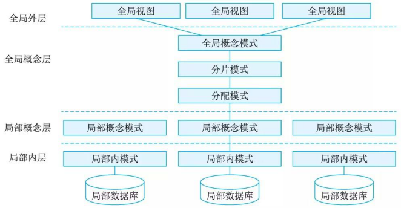

# 数据库

数据库(DataBase, DB)是指长期存储在计算机内、有组织的、统一管理的相关数据的集合。

最常见的数据库种类是关系型数据库和非关系型数据库。根据数据库存储体系分类，还可分为关系型数据库、键值(Key-Value) 数据库、列存储数据库、文档数据库和搜索引擎数据库等类型。

1. 关系型数据库: 关系型数据库模型是把复杂的数据结构归结为简单的二元关系.
2. 键值数据库: 键值数据库将数据存储为键值对集合，其中键作为唯一标识符。
3. 列存储数据库: 列式存储( Column-Based) 是相对千传统关系型数据库的行式存储(Row-Basedstorage) 来说的。简单来说两者的区别就是对表中数据的存储形式的差异。
4. 文档数据库: 文档数据库所存放的文档，就相当千键值数据库所存放的＂值”。文档数据库可视为其值可查的键值数据库。
5. 搜索引擎数据库: 由千搜索引擎会爬取大量的数据，并以特定的格式进行存储，这样在检索的时候才能保证性能最优。

## 关系数据库

关系可以理解为二维表。

前已有的数据库设计方法可分为4类，即直观设计法、规范设计法、计算机辅助设计法和自动化设计法。常用的有基于3NF的设计方法、基于实体联系(E-R)模型的数据库设计方法、基于视图概念的数据库设计方法、面向对象的关系数据库设计方法、计算机辅助数据库设计方法、敏捷数据库设计方法等。

关系数据库设计的基本步骤:数据库设计分为需求分析、概念结构设计、逻辑结构设计、物理结构设计、应用程序设计和运行维护 6 个阶段.

1. 需求分析是在用户调查的基础上，通过分析逐步明确用户对系统的需求，包括数据需求和围绕这些数据的业务处理需求。

2. 数据库概念结构设计是在需求分析的基础上，依照需求分析中的信息需求，对用户信息加以分类、聚集和概括，建立信息模型，并依照选定的数据库管理系统软件，把它们转换为数据的逻辑结构，再依照软硬件环境，最终实现数据的合理存储。这一过程也称为数据建模。采用E-R方法的数据库概念结构设计可分为三步：设计局部E-R模型、设计全局E-R模型以及全局E-R模型的优化。

3. 逻辑结构设计是在概念结构设计基础上进行的数据模型设计，可以是层次、网状模型和关系模型。逻辑结构设计阶段的主要任务是确定数据模型，将E-R图转换为指定的数据模型，确定完整性约束，确定用户视图。

4. 数据库在物理设备上的存储结构与存取方法称为数据库的物理结构。数据库的物理结构设
计是对已确定的数据库逻辑结构，利用DBMS所提供的方法、技术，以较优的存储结构和数据
存取路径、合理的数据存放位置以及存储分配，设计出一个高效的、可实现的数据库物理结构。

5. 数据库应用程序设计要做的工作有选择设计方法、制订开发计划、选择系统架构和设计安全性策略。在应用程序设计阶段，设计方法有结构化设计方法和面向对象设计方法两种。安全性策略主要是指硬件平台、操作系统、数据库系统、网络及应用系统的安全。

6. 在数据库运行维护阶段要做的工作主要有数据库的转储和恢复，数据库的安全性和完整性控制，数据库性能的监督、分析和改造，数据库的重组和重构等。

## 分布式数据库

分布式数据库系统 (Distributed DataBase System,  DDBS) 是针对地理上分散，而管理上又需要不同程度集中管理的需求而提出的一种数据管理信息系统。

