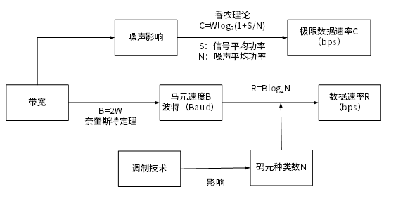

# 通信技术

## 最佳实践

### 题目总结

1. (✨2025上)某信道的带宽为3000Hz，编码采用32种不同的物理状态来表示数据，在无噪声环境下，该信道的最大数据传输速率是( )kbps。

    - A. 100
    - B. 30
    - C. 50
    - D. 500

    答案: B

    

    根据奈奎斯特(Nyquist)定理，无噪声信道的最大传输速率为：
    $C = 2B\log_{2}(N) = 2\times3000\times\log_{2}(32) = 6000\times5 = 30000 = 30kbps$。

### 考察问

- 信道的最大数据传输速率 = `()` * $log_2{`()`}$

### 考察点
- 信道的最大数据传输速率 = `带宽` * $log_2{`物理状态数`}$

## 通信结束

计算机网络是利用通信技术将数据从一个结点传送到另一结点的过程。通信技术是计算机网络的基础。这里所说的数据，指的是模拟信号和数字信号，它们通过信道来传输。

信道可分为物理信道和逻辑信道。物理信道由传输介质和设备组成，根据传输介质的不同，分为无线信道和有线信道。逻辑信道是指在数据发送端和接收端之间存在的一条虚拟线路，可以是有连接的或无连接的。逻辑信道以物理信道为载体。

## 信道

信息传输就是信源和信宿通过信道收发信息的过程。信源发出信息，发信机负责将信息转换成适合在信道上传输的信号，收信机将信号转化成信息发送给信宿。

1. 信道是信息的传输通道。
2. 发信机接收信源发送的信息，进行编码和调制，将信息转化成适合在信道上传输的信号，发送到信道上。
3. 收信机负责从信道上接收信号，进行解调和译码，将信息恢复出来发送给信宿。不是所有频率的信号都可以通过信道传输，频率响应决定了哪些可以通过，可以通过的频率范围大小是信道的带宽。
4. 香农公式。信道容量就是信道的最大传输速率，可通过香农公式计算得到。

$C = B \times \log_{2}\left(1 + \frac{S}{N}\right)$  

1. C代表信道容量，单位是b/s
2. B代表信号带宽，单位是Hz
3. S代表信号平均功率，单位是W
4. N代表噪声平均功率，单位是W
5. S/N代表信噪比，单位是dB(分贝)

提升信道容量可以使用比较大的带宽，降低信噪比；也可以使用比较小的带宽，升高信噪比。

## 信号变换

发信机进行的信号处理包括信源编码、信道编码、交织、脉冲成形和调制。相反地，收信机进行的信号处理包括解调、采样判决、去交织、信道译码和信源译码。

1. 信源编码: 将模拟信号进行模数转换，再进行压缩编码(去除冗余信息)，最后形成数字信号。例如GSM (全球移动通信系统)先通过 PCM (脉冲编码调制)编码将模拟语音信号转化成二进制数字码流，再利用 RPE-LPT (规则脉冲激励－长期预测编码)算法对其进行压缩。

2. 信道编码: 信道编码通过增加冗余信息以便在接收端进行检错和纠错，解决信道、噪声和干扰导致的误码问题，一般只能纠正零星的错误，对千连续的误码无能为力。

3. 交织: 为了解决连续误码导致的信道译码出错问题，通过交织将信道编码之后的数据顺序按照一定规律打乱，到了接收端在信道译码之前再通过交织将数据顺序复原，这样连续的误码到了接收端就变成了零星误码，信道译码就可以正确纠错了。

4. 脉冲成形: 为了减小带宽需求，需要将发送数据转换成合适的波形，这就是脉冲成形。

5. 调制: 调制是将信息承载到满足信号要求的高频载波信号的过程。

## 复用技术和多址技术

在一条信道上只传输一路数据的情况下，只需要经过信源编码、信道编码、交织、脉冲成形、调制之后就可以发送到信道上进行传输了；但如果同时传递多路数据就需要复用技术和多址技术。

1. 复用技术: 复用技术是指在一条信道上同时传输多路数据的技术，如 TDM 时分复用、 FDM 频分复用
和 CDM 码分复用等。 ADSL 使用了 FDM 的技术，语音的上行和下行占用了不同的带宽。
2. 多址技术: 多址技术是指在一条线上同时传输多个用户数据的技术，在接收端把多个用户的数据分离
(TDMA 时分多址、 FDMA 频分多址和 CDMA 码分多址)。

## 5G通信网络

1. 基于 OFDM 优化的波形和多址接入

    5G 采用基千 OFDM 优化的波形和多址接入技术，因为 OFDM 技术被当今的 4GLTE 和Wi Fi系统广泛采用，因其可扩展至大带宽应用，具有高频谱效率和较低的数据复杂性，能够很好地满足 5G 要求。 OFDM 技术可实现多种增强功能，例如，通过加窗或滤波增强频率本地化，在不同用户与服务间提高多路传输效率，以及创建单载波 OFDM 波形，实现高能效上行链路传输。

2. 实现可扩展的 OFDM 间隔参数配置

    通过 OFDM 子载波之间的 15kHz 间隔(固定的 OFDM 参数配置)， LTE 最高可支持 20MHz 的载波带宽。为了支持更丰富的频谱类型／带(为了连接尽可能丰富的设备， 5G 将利用所有可利用的频谱，如毫米微波、非授权频段)和部署方式。 5G NR  (New  Radio) 将引入可扩展的 OFDM 间隔参数配置。这一点至关重要，因为当快速傅里叶变换 (Fast Four ier  Trans form, FFT) 为更大带宽扩展尺寸时，必须保证不会增加处理的复杂性。而为了支持多种部署模式的不同信道宽度， 5GNR 必须适应同一部署下不同的参数配置，在统一的框架下提高多路传输效率。另外， 5GNR 也能跨波形实现载波聚合，比如聚合毫米波和 6GHz 以下频段的载波。

3. OFDM 加窗提高多路传输效率

    5G 将被应用千大规模物联网，这意味着会有数十亿设备相互连接， 5G 势必要提高多路传输的效率，以应对大规模物联网的挑战。为了相邻频带不相互干扰，频带内和频带外信号辐射必须尽可能小。 OFDM 能实现波形后处理 (Post -Processing),如时域加窗或频域滤波，来提升频率局域化。

4. 灵活框架设计

    5GNR 采用灵活的 5G 网络架构，进一步提高 5G 服务多路传输的效率。这种灵活性既体现在频域，更体现在时域上， 5GNR 的框架能充分满足 5G 的不同服务和应用场景。这包括可扩展的传输时间间隔( Scalable Transmission Time Interval,  STTI) 和自包含集成子帧 (Self­Contained Integrated Subframe) 。

5. 大规模 MIMO (Mu ltiple-Input Multiple-Output) 

    5G 将 2X2 MIMO 提高到了 4X4 MIMO 。更多的天线也意味着占用更多的空间，要在空间有限的设备中容纳更多天线显然不现实，只能在基站端叠加更多 MIMO 。从目前的理论来看，5GNR 可以在基站端使用最多 256 根天线，而通过天线的二维排布，可以实现 3D 波束成型，从而提高信道容量和覆盖。

6. 毫米波

    全新 5G 技术首次将频率大于 24GHz 以上的频段(通常称为毫米波)应用于移动宽带通信。大量可用的高频段频谱可提供极致的数据传输速度和容量，这将重塑移动体验。但毫米波的利用并非易事，使用毫米波频段传输更容易造成路径受阻与损耗(信号衍射能力有限)。通常情况下，毫米波频段传输的信号甚至无法穿透墙体，此外，它还面临着波形和能量消耗等问题。

7. 频谱共享

    用共享频谱和非授权频谱，可将 5G 扩展到多个维度，实现更大容量，使用更多频谱，支持新的部署场景。这不仅将使拥有授权频谱的移动运营商受益，而且会为没有授权频谱的厂商创造机会，如有线运营商、企业和物联网垂直行业，使他们能够充分利用 5GNR 技术。 5GNR原生地支持所有频谱类型，并通过前向兼容灵活地利用全新的频谱共享模式。

8. 先进的信道编码设计

    现有移动通信网络编码(如 LTE Turbo 码)不足以应对未来无线数据传输需求。在 5G 通信信道编码中拟采用更符合 5G 网络应用场景的编码方式，如 LDPC 码和 Polar 码等。

    低密度奇偶校验( Low-Density Parity-Check,  LDPC) 码是一种具有稀疏校验矩阵的分组纠错码，性能逼近香农容量极限，实现简单，译码简单且可实行并行操作，适合硬件实现。 LDPC码传输效率远超 LTE Turbo, 且易于平行化的解码设计，能以低复杂度和低时延途径进行扩展，获得更高传输速率。

    Polar 码是一种前向错误更正编码方式。在编码侧采用此方式使各个子信道呈现出不同的可靠性，当码长待续增加时，部分信道将趋向千容量近千 l 的完美信道(无误码)，另一部分信道趋向于容量接近于 0 的纯噪声信道，选择在容量接近千 l 的信道上直接传输信息以逼近信道容量；在解码侧，极化后的信道可用简单的逐次干扰抵消解码的方法，以较低的复杂度获得与最大自然解码相近的性能。由于没有误码率，极化编码可以支持 99.999％的可靠性，这正迎合了5G 应用的超高可靠性诉求。 Polar 码是用作 5G 控制信道的主要编码方式。
