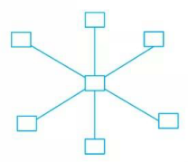
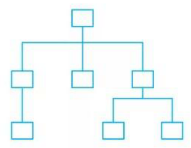
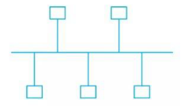
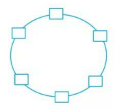
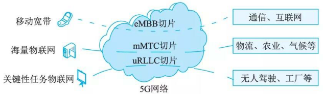

# 网络技术
## 最佳实践

### 考察问

1. 局域网英文缩写(), 广域网英文缩写()

### 考察点

1. 局域网英文缩写lan, 广域网英文缩写wan

##  网络技术

网络通常按照网络的覆盖区域和通信介质等特征来分类，可分为局域网 (LAN) 、无线局域网 (WLAN) 、城域网 (MAN) 、广域网 (WAN) 和移动通信网等。

## 局域网(LAN)

局域网 (Local Area Network, LAN) 是指在有限地理范围内将若干计算机通过传输介质互联成的计算机组(即通信网络)

### 网络拓扑

常见的局域网拓扑结构有星状结构、树状结构、总线结构和环形结构。

1. 星状结构。网络中的每个结点设备都以中心结点为中心，通过连接线与中心结点相连，如果一个结点设备需要传输数据，它首先必须通过中心结点如图。这种结构的网络系统中，中心结点是控制中心，任意两个结点间的通信最多只需两步，所以；传输速度快、网络构简单、建网容易、便千控制和管理。这种结构的缺点是可靠性低，网络共享能力差，并且一旦中心结点出现故障则导致全网瘫痪。

    

2. 树状结构。树状结构网络也被称为分级的集中式网络，如图所示，其特点是网络成本低，结构简单。在网络中，任意两个结点之间不产生回路，每个链路都支持双向传输，结点扩充方便、灵活，方便寻查链路路径。但在这种结构的网络系统中，除叶结点及其相连的链路外，任何一个工作站或链路产生故障都会影响整个网络系统的正常运行。

    

3. 总线结构。总线结构网络是将各个结点设备和一根总线相连，如图所示。网络中所有的结点设备都是通过总线进行信息传输的。在总线结构中，作为数据通信必经的总线的负载能力是有限度的，这是由通信媒体本身的物理性能决定的。
    
    

4. 环形结构。将网络中各结点通过一条首尾相连的通信链路连接起来，形成一个闭合环形结构网，如图所示。环形结构的网络中各结点设备的地位相同，信息按照固定方向单向流动，两个节点之间仅有一条通路，系统中无信道选择问题，任一结点的故障将导致物理瘫痪。由于环路是封闭的，所以环形结构的网络不便于扩充，系统响应延时长，且信息传输效率相对较低。
    

5. 网状结构。网状网络中的任何结点彼此之间均存在一条通信链路，任何结点故障不会影响其他结点之间的通信。但这种拓扑结构的网络布线较为烦琐，且建设成本高，控制方法复杂。

### 以太网技术

以太网 (Ethernet)是一种计算机局域网组网技术。 IEEE 制定的 IEEE 802.3 标准给出了以太网的技术标准。它规定了包括物理层的连线、电信号和介质访问层协议的内容。

1. 以太网帧结构。在以太网链路上的数据包被称作以太帧，其结构如图所示。

    

    1. DMAC 代表目的终端的 MAC 地址
    2. SMAC 代表源 MAC 地址
    3. Length/Type 字段长度是 2 字节，若该字段的值大于 1500, 则代表该数据帧的类型(比如该帧是属于哪个上层协议的数据单元)；若该字段的值小于 1500, 则代表该数据帧的长度。 
    4. DATA/PAD 代表具体数据，以太网数据帧的最小长度必须不小千 64 字节(根据半双工模式下最大距离计算获得的)，如果数据长度加上帧头不足 64 字节，需要在数据部分增加填充内容。当 Length/Type 取值大于 1500 的时候， MAC 子层可以根据 Length/Typ e 的值直接把数据帧提交给上层协议，由上层协议进行分帧处理。这种结构为当前较为流行的 ETHERNET_II 协议，大部分计算机都支持这种结构。 
    5. FCS则是帧校验字段，用于判断该数据帧是否出错。

2. 最小帧长。由于 CSMA/ CD 算法限制，以太网帧的最小长度为 64 字节。高层协议要保证此长度。如果实际数据不足 64 个字节，则高层协议必须进行填充。数据域的长度上限可以灵活设置，但通常被设置为 1500 字节。
3. 最大传输距离。以太网的最大传输距离没有严格限制，由线路质量、信号衰减程度等因素决定。
4. 流量控制。当通过交换机端口流量过大，超过了它的处理能力时，就会发生端口阻塞。网络拥塞一般是由于线速不匹配(如 IOOM 向 IOM 端口发送数据)和突发的集中传输而产生的，它可能导致延时增加、丢包和重传增加这几种情况，使网络资源不能有效利用。流量控制的作用是防止在设备出现阻塞情况下丢帧。

### 无线局域网 (WLAN)

无线局域网 WLAN (W ireless  Local Area  Networks) 利用无线技术在空中传输数据、话音和视频信号。

1. WLAN 标准

    IEEE  802.11 是最早的无线局域网技术标准，当时传输速率只有 1~2Mb/s, 采用无连接的协议。IEEE  802.11 b 标准的速率可达 llMb/s, IEEE  802.1 la 标准的传输速率可达到 54Mb/s 。同时还出现了 IEEE 802.1 l g标准，该标准具有与 IEEE 802.1 la 标准一样的接入速率，同时兼容 IEEE802.llb 标准，工作千免费的 2 .4GHz 频段，价格比 IEEE802. lla 更便宜。之后出现了 IEEE802.lln 新标准，其传输速率可达 200Mb/s 以上。

2. WLAN 拓扑结构

    在 WLAN 中，通常使用的拓扑结构主要有 3 种形式：点对点型、 HUB 型和全分布型。

    1. 点对点型。典型的点对点结构是通过单频或扩频微波电台、红外发光二极管、红外激光等方法，连接两个固定的有线 LAN 网段，实际上是作为一种网络互联方案。无线链路与有线LAN 是通过桥路器或中继器完成连接的。点对点拓扑结构简单，采用这种方案可获得中远距离的高速率链路。由千不存在移动性问题，收发信机的波束宽度可以很窄，虽然这会增加设备调试难度，但可减小由波束发散引起的功率衰耗。

    2. HUB 型。由一个中心结点 (HUB) 和若干外围节点组成，外围结点既可以是独立的结点，也可与多个用户相连。中心 HUB 作为网络管理设备，为访问有线 LAN 或服务器提供逻辑接入点，并监控所有节点对网路的访问，管理外围设备对广播带宽的竞争，其管理功能由软件具体实现。在此拓扑中，任何两外围结点间的数据通信都须经过 HUB, 是典型的集中控制式通信。采用这种结构的网络具有用户设备简单，维护费用低，网络管理单一等优点，并可与微蜂窝技术结合，实现空间和频率复用。但是，用户之间的通信延迟增加，网络抗毁性能较差，中心结点的故障容易导致整个网络的瘫痪。

    3. 完全分布型。完全分布结构目前还无具体应用，仅处于理论探讨阶段，它要求相关结点在数据传输过程中发挥作用，类似千分组无线网的概念。对每一结点而言，一般仅只有网络的部分拓扑信息，但它可与邻近结点以某种方式分享各自拓扑结构信息，基千此完成一种分布路由算法，使得传输路径上的每一结点都要协助源结点数据传送至目的结点。分布式结构抗毁性能好，移动能力强，可形成多跳网，适合较低速率的中小型网络，但对于用户结点而言，复杂性和成本较其他结构大幅度提高，网络管理困难，并存在多径干扰问题，同时随着网络规模的扩大，其性能指标快速下降。但在军事领域中，分布式 WLAN 具有很好的应用前景。

### 广域网(WAN)

广域网是一种将分布千更广区域(比如一个城市、一个国家甚至国家之间)的计算机设备联接起来的网络。它通常是电信部门负责组建、经营和管理，并向社会公众提供通信服务。

1. 广域网相关技术

    同步光网络。同步光网络 (Synchronous Optical Networking,  SONET) 是使用光纤进行数字化信息通信的一个标准。

2. 数字数据网。数字数据网 DDN (D igital  Data Network) 利用数字信道提供半永久性连接电路以传输数据。

3. 帧中继。帧中继 FR (Frame  Relay)是一种高性能广域网技术. 帧中继采用虚电路技术，充分利用网络资源，具有吞吐量高，时延低，适合突发性业务等
特点。

4. 异步传输技术。异步传输模式 (Asynchronous Transfer Mode,  ATM) 是以信元为基础的面向连接的一种分组交换和复用技术。它具有高速数据传输率，可满足多种业务(如语音、数据、传真、实时视频等)传输的需要。

### 城域网(MAN)

城域网是在单个城市范围内所建立的计算机通信网，简称 MAN (Me tropolitan Area Network) 。

如果说局域网或广域网通常是为了一个单位或系统服务的，那么城域网则是为整个城市而非某个特定部门服务。它向上与骨干网相连，向下将本地所有的联网用户与城市骨干网相连。 城域网络通常分为 3 个层次：核心层、汇聚层和接入层。核心层主要提供高带宽的业务承载和传输，完成和已有网络(如 ATM、 FR、 DDN 、 IP 网络)的互联互通，其特征为宽带传输和高速调度。汇聚层的主要功能是给业务接入结点提供用户业务数据的汇聚和分发处理，同时要实现业务的服务等级分类。接入层利用多种接入技术，进行带宽和业务分配，实现用户的接入。

## 移动通信网

### 移动通信网发展

1. 最初采用模拟信号传输，即将电磁波进行频率调制后，将语音信号转换到载波电磁波上，载有信息的电磁波发布到空间后由接收设备接收，并从载波电磁波上还原语音信息，完成人与人之间的通话，即 lG通信时代。由于 lG 采用模拟信号传输，所以其容量非常有限，一般只能传输语音信号

2. 2G移动通信采用数字调制技术。移动通信系统的容量有了增加，此时手机可以上网了，虽然数据传输速度很慢，速率为 9.6~14 .4kb/s, 但可传输文字信息。

3. 3G 延续 2G 数字数据传输技术，但通过开辟新电磁波频谱及研发新标准，使得 3G 传输速率可达 384kb/s, 在室内稳定环境下甚至可达 2 Mb/s 的速率，比2G 提升了百倍之多。

4. 4G 采用更先进的通信协议和技术，理论上网速度为 3G 的几十倍，实际用户上网体验与固网 20Mb/s 家庭宽带相当。 

5. 5G 网络的基本特征是高速率(峰值速率可大于 20Gb/s, 相当于 4G 的 20 倍)、低时延(网络时延从 4G 的 50ms 缩减到 lms) 、海量设备连接(满足 1000 亿量级的连接)、低功耗(基站更节能，终端更省电)。

### 5G网络的主要特征

移动宽带(eMBB) 的应用场景如面向 4K/8K 超高清视频、全息技术、增强现实／虚拟现实等应用，对网络带宽和速率要求较高；海量大规模物联网 (mMTC) 的应用场景如海量的物联网传感器部署千测量、建筑、农业、物流、智慧城市、家庭等领域，这些传感器设备是非常密集的，规模庞大，且大部分是静止的，对时延和移动性要求不高；关键任务物联网 (uRLLC) 的应用场景如无人驾驶、车联网、自动工厂、远程医疗等领域，要求超低时延和超高可靠性。

