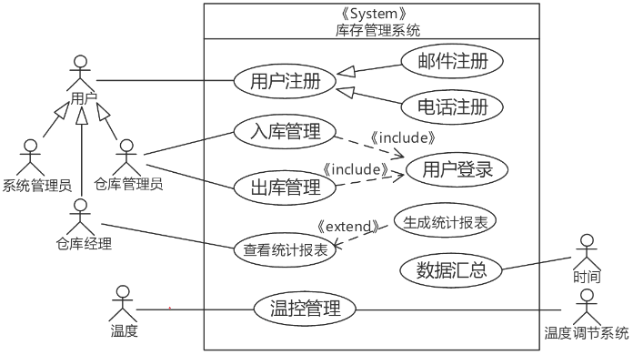
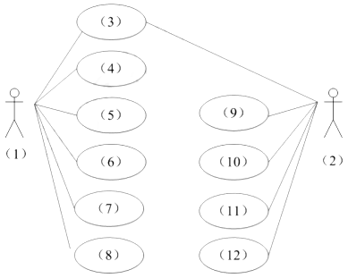
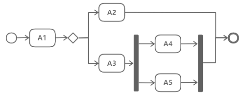
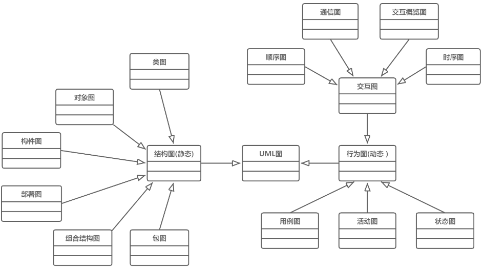

# 计算机语言的组成和分类
## 最佳实践

### 题目总结

1. UML中有4种关系：依赖、关联、泛化和实现。( )是一种结构关系，描述了一组链，链是对象之间的连接；( )是一种特殊/一般关系，使子元素共享其父元素的结构和行为。

    - A. 依赖
    - B. 关联
    - C. 泛化
    - D. 实现

    - A. 依赖
    - B. 关联
    - C. 泛化
    - D. 实现

    答案：B C

- (✨2025上)43.在 UML 用例图中，用例与用例之间不存在( )。
    - A.包含关系
    - B.泛化关系
    - C.扩展关系
    - D.聚合关系

    答案: D

1. 看图填空

    

1. 在UML用例图中，用例与用例之间不存在( )。✨2025上真题
    - A. 包含关系
    - B. 泛化关系
    - C. 扩展关系
    - D. 聚合关系

    答案: D

2. 在某银行业务的用例模型中：“取款”和“存款”两个用例中都需要执行查询余额的功能，将查询余额提取成独立的用例，那么“取款”和“存款”用例与“查询余额”用例之间的关系属于(  )。

    - A. 扩展关系  B. 包含关系  C. 依赖关系  D. 继承关系

    答案: B

3. 采用UML分析用户需求时，用例UC1可以出现在用例UC2出现的任何位置，那么UC1和UC2之间的关系是(  )。

    - A. include  B. extend  C. generalize  D. call

    答案: C

4. 某软件公司拟为物流企业开发一套库存管理系统，该系统的部分需求陈述如下：

    库存管理系统主要包括货物入库管理、货物出库管理、仓库管理、统计报表和系统管理等功能。

    库存管理系统的用户包括仓库管理员、仓库经理和系统管理员，用户必须在注册后才能使用系统功能；用户可以选择使用邮件注册或电话注册。

    仓库管理员在进行出入库操作前必须先登录；仓库经理可以通过系统查看统计报表，如果前一个月的报表未生成，则系统自动生成统计报表，否则直接显示。

    系统管理员可以在系统中设置仓库温度范围，当仓库内温度超过最高值或者低于最低值时，系统自动调用温控管理操作，连接温度调节系统进行制冷或加热。

    仓库管理功能要求每个月1日零点对前一个月货物入库和出库记录进行数据汇总操作。

    项目组决定构造用例模型以描述系统需求。

    1. (6分)用例建模的首要任务是识别系统中的参与者。请根据题目中所描述的需求，识别出系统中有哪些参与者？

        用例模型的参与者：仓库管理员、仓库经理、系统管理员、`时间`、`温度`、`温度调节系统`。

    2. (7分)用例建模的主要工作是书写用例规约。用例规约通常包括哪几部分内容？

        用例名称、简要说明、事件流、非功能需求、前置条件、后置条件、扩展点、优先级。

    3. (12分)建立了用例模型后，可以利用用例之间的关系调整用例模型，用例间的关系包括哪几种？对于每种关系，请根据题目中所描述的需求分别给出一组用例。

        1. 用例之间的关系包括：包含关系、扩展关系、泛化关系。
        2. “出入库操作”与“登录”属于包含关系；“查看统计报表”与“生成统计报表”属于扩展关系；“用户注册”与“邮件注册”和“电话注册”属于典型的泛化关系。

    

4. 请分别给出SysML建模的需求图与UML建模的用例图的定义，并说明二者的区别。

    需求图(REQ或req)：用于表述文字化的需求、需求间的关系，以及与之存在满足、验证等关系的其他模型元素。

    用例图：从用户的角度提供系统或业务流程功能的概述。

    这两者的主要区别在于，需求图更关注系统内部的功能和流程，以及这些功能和流程如何满足用户的需求；而用例图更关注用户如何使用系统，以及系统与用户的交互。简单来说，需求图更偏向于系统的功能和流程，而用例图更偏向于用户的使用体验。

5. 某医院拟委托软件公司开发一套预约挂号管理系统，以便为患者提供更好的就医体验，为医院提供更加科学的预约管理。本系统的主要功能描述如下：(a)注册登录，(b)信息浏览，(c)账号管理，(d)预约挂号，(e)查询与取消预约，(f)号源管理，(g)报告查询，(h)预约管理，(i)报表管理，(j)信用管理等。

    1. (6分)若采用面向对象方法对预约挂号管理系统进行分析，得到如图2-1所示的用例图。请将合适的参与者名称填入图2-1中的(1)和(2)处，使用题干给出的功能描述(a)~(j)，完善用例(3)~(12)的名称，将正确答案填在答题纸上。(2021下)

        

        (1)系统操作员(系统管理员)
        (2)预约人(患者)
        (3)(a)注册登录
        (4) - (8)(c)、(f)、(h)、(i)、(j)
        (9) - (12)(b)、(d)、(e)、(g)

    2. 预约人员(患者)登录系统后发起预约挂号请求，进入预约界面。进行预约挂号时使用数据库访问类获取医生的相关信息，在数据库中调用医生列表，并调取医生出诊时段表，将医生出诊时段反馈到预约界面，并显示给预约人员；预约人员选择医生及就诊时间后确认预约，系统反馈预约结果，并向用户显示是否预约成功。

        采用面向对象方法对预约挂号过程进行分析，得到如图2-2所示的顺序图，使用题干中给出的描述，完善图2-2中对象(1)，及消息(2)-(4)的名称，将正确答案填在答题纸上，请简要说明在描述对象之间的动态交互关系时，协作图与顺序图存在哪些区别。 (2021下)

        

        (1)预约人员(患者)
        (2)发起预约挂号请求
        (3)显示医生出诊时段
        (4)显示是否预约成功。

        顺序图强调交互的消息时间顺序。

        协作图强调接收和发送消息的对象的结构组织，强调通信的方式。

    3. (9分)采用面向对象方法开发软件，通常需要建立对象模型、动态模型和功能模型，请分别介绍这3种模型，并详细说明它们之间的关联关系，针对上述模型，说明哪些模型可用于软件的需求分析？(2021下)  

        1. `对象模型`描述系统中对象的静态结构、对象之间的关系、属性和操作，主要用`对象图`来实现。
        2. `动态模型`描述与时间和操作顺序有关的系统特征，例如，激发事件、事件序列、确定事件先后关系的状态等，主要用`状态图`来实现。
        3. `功能模型`描述一个计算如何从输入值得到输出值，它不考虑计算的次序，主要用`数据流图`来实现。

        功能模型指发生了什么，动态模型确定什么时候发生，而对象模型确定发生的客体。上述模型均可用于需求分析。

- (✨2025上)26.在UML活动图中，( )是原子的，不能被分解，没有内部转移、没有内部活动，它的工作所占用的时间可以忽略。
    - A.活动状态
    - B.初始状态
    - C.动作状态
    - D.原子状态

    答案: C

2. (  ) 适用于描述复杂算法的执行流程。

    - A. 活动图  B. 状态图  C. 类图  D. 用例图

    答案: A

3. 公司欲开发一个在线交易系统。为了能够精确表达用户与系统的复杂交互过程，应该采用UML的 (  ) 进行交互过程建模。

    - A. 类图  B. 顺序图  C. 部署图  D. 对象图

    答案: B

1. 序列图的哪三种消息和概念(2024上)

    - 同步消息
    - 异步消息
    - 返回消息

2. 系统分析设计过程中两种交互图的选取原则(2024上)。

    在UML中，交互图(Interaction Diagrams)主要用于描述在特定语境中对象之间的交互，它们可以在分析和设计阶段使用。交互图主要包括两种类型：序列图(Sequence Diagrams)和协作图(Collaboration Diagrams)。

    - 序列图：强调消息的时间顺序，展示对象之间的动态合作关系，常用于分析阶段。
    - 协作图：强调参与交互的对象以及它们如何相互关联，常用于设计阶段。

    在分析阶段，你可能想要创建序列图来捕捉对象之间的动态合作，并且能够清晰地展示时序和并发。

    在设计阶段，你可能想要创建协作图来定义交互模式，并且能够清晰地展示对象之间的静态关系和它们之间的关联。

3. 顺序图表示条件分支序列片段有哪些(2024上)。

    顺序图表示条件分支序列片段包括：

    - Alt(Alternative)
    - Opt(Option)
    - Loop(循环)
    - Break(中断)
    - Par(并行)

    区别总结：

    - Alt：用于条件分支，有多个互斥的条件。
    - Opt：用于可选行为，只有一个条件。
    - Loop：用于循环操作，根据条件重复执行。
    - Break：用于中断行为，根据条件跳出当前片段。
    - Par：用于并行操作，多个消息序列同时执行。
    - Critical：用于临界区，确保操作的原子性。
    - Neg：用于不应发生的行为，表示错误情况。
    - Ref：用于引用其他序列图，实现模块化和重用。

1. UML(Unified Modeling Language)是面向对象设计的建模工具，独立于任何具体程序设计语言，以下( )不属于UML中的模型。

    - A.用例图
    - B.协作图
    - C.活动图
    - D.PAD图

    答案：D, PAD图是用于结构化设计的工具。

2. UML活动图用于建模( )。以下活动图中，活动A1之后，可能的活动执行序列顺序是______。

    

    - A.系统在它的周边环境的语境中所提供的外部可见服务
    - B.某一时刻一组对象以及它们之间的关系
    - C.系统内从一个活动到另一个活动的流程
    - D.对象的生命周期中某个条件或者状态

    - A.A2、A3、A4和A5
    - B.A3、A4和A5，或A2、A4或A5
    - C.A2、A4和A5
    - D.A2或A3、A4和A5

    答案: CD

3. 某软件公司为电子商务企业开发一套网上交易订单管理系统，以提升服务的质量和效率。在项目之初，项目组决定采用面向对象的开发方法进行系统开发，并对系统的核心业务功能进行了分析，具体描述如下：

    注册用户通过商品信息页面在线浏览商品，将需要购买的商品添加进购物车内，点击“结算”按钮后开始录入订单信息。

    用户在订单信息录入页面上选择支付方式，填写并确认收货人、收货地址和联系方式等信息。点击“提交订单”按钮后产生订单，并开始进行订单结算。

    订单需要在30分钟内进行支付，否则会自动取消，用户也可以手工取消订单。

    用户支付完成，经确认后，系统开始备货，扣除该商品可接单数量，并移除用户购物车中的所有商品资料。

    生成订单表单，出货完毕，订单生效。为用户快递商品，等待用户接收。

    用户签收商品，交易完成。

    1. (12分)识别`设计类`是面向对象设计过程中的重要工作，设计类表达了类的职责，即该类所担任的任务。请用300字以内的文字说明设计类通常分为哪三种类型，每种类型的主要职责，并针对题干描述案例涉及的具体类为每种类型的设计类举出2个实例。

        1. 实体类：映射需求中的每个实体，保存需存储在永久存储体中的信息，如用户、商品。
        2. 控制类：用于控制用例工作，对一个或几个用例特有的控制行为建模，如结算、备货 。
        3. 边界类：封装在用例内、外流动的信息或数据流，如浏览器、购物车。

    2. (3分)在面向对象的设计过程中，活动图(activity diagram)阐明了业务用例实现的工作流程。请用300字以内的文字给出活动图与流程图(flow chart)的三个主要区别。

        1. 活动图描述对象活动顺序关系遵循的规则，侧重系统行为，非处理过程；流程图侧重描述处理过程。
        2. 流程图一般限于顺序进程，活动图可支持并发进程。
        3. 活动图是面向对象的，流程图是面向过程的。

    3. (10分)在面向对象的设计过程中，状态图(state diagram)描述了一个实体基于事件反应的动态行为。请根据题干描述，填写下图中的(a)～(e)空白，完成订单处理的状态图。

        

        1. a 取消
        2. b 待结算
        3. c 大于30分钟
        4. d 订单生效
        5. e 用户签收

4. 某软件公司计划开发一套教学管理系统，用于为高校提供教学管理服务。该教学管理系统基本的需求包括：

    1. 系统用户必须成功登录到系统后才能使用系统的各项功能服务；
    2. 管理员(Registrar)使用该系统管理学校(University)、系(Department)、教师(Lecturer)、学生(Student)和课程(Course)等教学基础信息；
    3. 学生使用系统选择并注册课程，必须通过所选课程的考试才能获得学分；如果考试不及格，必须参加补考，通过后才能获得课程学分；
    4. 教师使用该系统选择所要教的课程，并从系统获得选择该课程的学生名单；
    5. 管理员使用系统生成课程课表，维护系统所需的有关课程、学生和教师的信息；
    6. 每个月到了月底系统会通过打印机打印学生的考勤信息。

    项目组经过分析和讨论，决定采用面向对象开发技术对系统各项需求建模。

    1. (7 分)用例建模用来描述待开发系统的功能需求，主要元素是用例和参与者。请根据题目所述需求，说明教学服务系统中有哪些参与者。(2016下)

        参与者：学生、教师、管理员、时间、打印机。

    2. (7 分)用例是对系统行为的动态描述，用例获取是需求分析阶段的主要任务之一。请指出在面向对象系统建模中，用例之间的关系有哪几种类型?对题目所述教学服务系统的需求建模时，“登录系统”用例与“注册课程”用例之间、“参加考试”用例与“参加补考”用例之间的关系分别属于哪种类型?(2016下)

        用例之间的关系：泛化(Generalization)、包含(Include)和扩展(Extend)。用例“登录系统”与用例“注册课程”之间的关系是包含(Include)关系；用例“参加考试”与用例“参加补考”之间的关系是扩展(Extend)关系。

    3. (11 分)类图主要用来描述系统的静态结构，是组件图和配置图的基础。请指出在面向对象系统建模中，类之间的关系有哪几种类型?对题目所述教学服务系统的需求建模时，类 University 与类 Student 之间、类 University 和类 Department 之间、类 Student 和类 Course 之间的关系分别属于哪种类型? (2016下)

        类之间的关系：关联(Association)、聚集(Aggregation)、组合(Composition)、泛化(Generalization)、依赖(Dependence)。

        类 University 与类 Student 之间的关系是聚集(Aggregation)关系；类 University 和类 Department 之间的关系是组合(Composition)关系；类 Student 和类 Course 之间的关系是关联(Association)关系。

5. 与UML 1.x不同，为了更清楚地表达UML的结构，从UML 2开始，整个UML规范被划分为基础结构和上层结构两个相对独立的部分，基础结构是UML的( )，它定义了构造UML模型的各种基本元素；而上层结构则定义了面向建模用户的各种UML模型的语法、语义和表示。
    - A. 元元素
    - B. 模型
    - C. 元模型
    - D. 元元模型

    答案：C

6. 在UML2.0(Unified Modeling Language)中，顺序图用来描述对象之间的消息交互，其中循环、选择等复杂交互使用( )表示，对象之间的消息类型包括( )。

    - A. 嵌套  
    - B. 泳道  
    - C. 组合  
    - D. 序列片段

    - A. 同步消息、异步消息、返回消息、动态消息、静态消息
    - B. 同步消息、异步消息、动态消息、参与者创建消息、参与者销毁消息
    - C. 同步消息、异步消息、静态消息、参与者创建消息、参与者销毁消息
    - D. 同步消息、异步消息、返回消息、参与者创建消息、参与者销毁消息

    答案: DD

### 考察问

1. UML的组成要素: 事物, 关系, 图
    1. UML的事物包括: `()`事物, `()`事物, `()`事物, `()`事物(行为结构要分组注释)
    2. UML的关系包括: `()`, `()`, `()`和`()`(衣冠化石)
    3. UML的图包括:
        1. `()`图: ✨`()`(`()`图, `()`图, `()`图, `()`图, `()`图, `()`图)
        2. `()`图: ✨`()`(`()`图, `()`图, `()`图, `()`图, `()`图, `()`图, `()`图)

2. 零碎知识

    1. 用例规约通常包括`()`、`()`、`()`、`()`、`()`、`()`、`()`、`()`。
    2. `()`描述系统中对象的静态结构、对象之间的关系、属性和操作，主要用`()`来实现。
    3. `()`描述与时间和操作顺序有关的系统特征，例如，激发事件、事件序列、确定事件先后关系的状态等，主要用`()`来实现。
    4. `()`描述一个计算如何从输入值得到输出值，它不考虑计算的次序，主要用`()`来实现。
    5. 顺序图表示条件分支序列片段有
        - `()`
        - `()`
        - `()`
        - `()`
        - `()`
    6. 活动图和对象图的区别
        1. `()`描述对象活动顺序关系遵循的规则，侧重`()`，非处理过程；`()`侧重描述`()`。
        2. `()`一般限于`()`，`()`可支持`()`。
        3. `()`是`()`，`()`是`()`。

### 考察点

1. UML的组成要素: 事物, 关系, 图
    1. UML的事物包括: `结构`事物, `行为`事物, `分组`事物, `注释`事物(行为结构要分组注释)
    2. UML的关系包括: `依赖`, `关联`, `泛化`和`实现`(衣冠化石)
    3. UML的图包括:
        1. `结构`图: ✨`对象组构件包部署很累`(`对象`图, `组合结构`图, `构件`图, `包`图, `部署`图, `类`图)
        2. `行为`图: ✨`用例活动的状态的交互通信要按计时顺序`(`用例`图, `活动`图, `状态`图, `交互`图, `通信`图, `顺序`图, `计时`图)

8. 零碎知识

    1. 用例规约通常包括`用例名称`、`简要说明`、`事件流`、`非功能需求`、`前置条件`、`后置条件`、`扩展点`、`优先级`。
    2. `对象模型`描述系统中对象的静态结构、对象之间的关系、属性和操作，主要用`对象图`来实现。
    3. `动态模型`描述与时间和操作顺序有关的系统特征，例如，激发事件、事件序列、确定事件先后关系的状态等，主要用`状态图`来实现。
    4. `功能模型`描述一个计算如何从输入值得到输出值，它不考虑计算的次序，主要用`数据流图`来实现。
    5. 顺序图表示条件分支序列片段有
        - `Alt(Alternative)`
        - `Opt(Option)`
        - `Loop(循环)`
        - `Break(中断)`
        - `Par(并行)`
    6. 活动图和对象图的区别
        1. `活动图`描述对象活动顺序关系遵循的规则，侧重`系统行为`，非处理过程；`流程图`侧重描述`处理过程`。
        2. `流程图`一般限于`顺序进程`，`活动图`可支持`并发进程`。
        3. `活动图`是`面向对象的`，`流程图`是`面向过程的`。

## 计算机语言的组成

计算机语言主要由一套指令组成，而这种指令一般包括表达式、流程控制和集合三大部分内容。

## 计算机语言的分类

机器语言、汇编语言、高级语言、建模语言和形式化语言等

### 机器语言

机器语言是计算机能够直接接收并能识别和执行操作的语言，其优点是可以被计算机直接理解和执行，而且执行速度快、占用内存少。

1. 机器语言的指令格式

    机器语言指令是一种二进制代码，由操作码和操作数两部分组成。一条指令必须包含下列信息。

    1. 操作码。一台计算机可能有几十条至几百条指令，每一条指令都有一个相应的操作码，计算机通过识别该操作码来完成不同的操作。
    2. 操作数的地址。 CPU 通过该地址就可以取得所需的操作数。
    3. 操作结果的存储地址。把对操作数的处理所产生的结果保存在该地址中，以便再次使用。
    4. 下条指令的地址。执行程序时，大多数指令按顺序依次从主存中取出执行，只有在遇到转移指令时，程序指令的执行顺序才会改变。为了压缩指令的长度，可以用一个程序计数器(Pro gram Counter,  PC) 存放指令地址。每执行一条指令， PC 的指令地址就自动＋1 (设该指令只占一个主存单元)，指出将要执行的下一条指令的地址。当遇到执行转移指令时，则用转移地址修改 PC 的内容。由千使用了 PC, 指令中就不必明显地给出下一条将要执行指令的地址。

        一条指令实际上包括两种信息即操作码和地址码。操作码用来表示该指令所要完成的操作(如加、减、乘、除、数据传送等)，其长度取决千指令系统中的指令条数。地址码用来描述该指令的操作对象，它或者直接给出操作数，或者指出操作数的存储器地址或寄存器地址(即寄存器名)。

### 汇编语言

为了降低使用机器语言编程的难度，人们进行了一种有益的改进，即用一些简洁的英文字母、符号串来替代一个特定指令的二进制串，例如，用 ADD 代表加法， MOV 代表数据传递等，这样一来，人们很容易读懂并理解程序在做什么，编程、纠错及维护都变得方便了，这种程序设计语言就称为汇编语言，即第二代计算机语言。

与机器语言相比，汇编语言有许多优点。程序设计人员用汇编语言写出的程序，代码短、省空间、效率高。但是汇编语言仍是一种面向机器的语言，通用性差。它要求程序设计人员详细了解计算机的硬件结构，如计算机的指令系统、 CPU 中寄存器的结构及存储单元的寻址方式等，并且要求程序设计人员具有较高的编程技巧。

汇编语言是机器语言的符号化描述，所以也是面向机器的程序设计语言。然而，计算机并不认识这些符号，这就需要一个专门的程序，专门负责将这些符号翻译成二进制的机器语言，这种翻译程序被称为汇编程序。

1. 汇编语言的语句格式

    语句 (Statements) 是汇编语言程序的基本组成单位。在汇编语言源程序中有 3 种语句：指令语句、伪指令语句和宏指令语句(或宏调用语句)。

    1. 指令语句。指令语句又称为机器指令语句，将其汇编后能产生相应的机器代码，这些代码能被 CPU 直接识别并执行相应的操作。基本的指令有 ADD 、 SUB 和 AND 等
    2. 伪指令语句。伪指令语句指示汇编程序在汇编源程序时完成某些工作，例如为变量分配存储单元地址，给某个符号赋一个值等。伪指令语句与指令语句的区别是：伪指令语句经汇编后不产生机器代码，而指令语句经汇编后要产生相应的机器代码。另外，伪指令语句所指示的操作是在源程序被汇编时完成的，而指令语句的操作必须在程序运行时完成。
    3. 宏指令语句。在汇编语言中，还允许用户将多次重复使用的程序段定义为宏。宏的定义必须按照相应的规定进行，每个宏都有相应的宏名。

2. 指令语句和伪指令语句格式

    指令语句和伪指令语句有相同的语句格式，每条语句均由如下 4 个字段 (Fi elds) 组成：名字、操作符、操作数和注释。其中，每个字段的意义如下。

    1. 名字字段(Name Field)
    2. 操作符字段(Operator Field)
    3. 操作数字段(Operand Field)
    4. 注释字段(Comment Field)

### 高级语言

由千汇编语言依赖千硬件，使得程序的可移植性极差，而且编程人员在使用新的计算机时还需学习新的汇编指令，大大增加了编程人员的工作量，为此诞生计算机高级语言。常见的高级语言包括C、C++、Java、VB、C#、Python、Ruby等。

### UML建模语言

#### 概念

统一建模语言(Unified Modeling Language，UML)是面向对象软件的标准化建模语言，而非程序设计语言，支持从需求分析开始的软件开发的全过程。UML 成为“标准”建模语言的原因之一在于与程序设计语言无关。

#### UML 组成要素

UML由3个要素构成：UML的基本构造块(事物、关系)、图(支配基本构造块如何放置在一起的规则)和运用于整个语言的公用机制。事物是UML中最基本的构成元素；关系把事物结合在一起；图聚集了相关的事物。

1. 事物。 UML 中有 4 种事物：结构事物、行为事物、分组事物和注释事物。

    1. 结构事物。结构事物是 UML 模型中的名词。它们通常是模型的静态部分，描述概念或物理元素。结构事物包括类 (Class) 、接口( Interface) 、协作 (Collaboration) 、用例 (UseCase) 、主动类 (Acti ve Class) 、构件 (Component)、制品 (Artifact)和结点 (Node) 。

    2. 行为事物。行为事物是 UML 模型的动态部分。它们是模型中的动词，描述了跨越时间和空间的行为。行为事物包括交互 (Interacti on) 、状态机(S tate  Machine) 和活动 (Activity)。

    3. 分组事物。分组事物是 UML 模型的组织部分，是一些由模型分解成的＂盒子”。在所有的分组事物中，最主要的分组事物是包 (Package) 。

    4. 注释事物。注释事物是 UML 模型的解释部分。这些注释事物用来描述、说明和标注模型的任何元素。

2. 关系。 UML 中有 4 种关系：依赖、关联、泛化和实现。

    1. 依赖是两个事物间的语义关系，其中一个事物(独立事物)发生变化会影响另一个事物(依赖事物)的语义

    2. 关联是一种结构关系，它描述了一组链，链是对象之间的连接。聚集是一种特殊类型的关联，它描述了整体和部分间的结构关系。

    3. 泛化是一种特殊／一般关系，特殊元素(子元素)的对象可替代一般元素(父元素)的对象。

    4. 实现是类元之间的语义关系，其中一个类元指定了由另一个类元保证执行的契约。在两种情况下会使用实现关系：一种是在接口和实现它们的类或构件之间；另一种是在用例和实现它们的协作之间。

3. UML 中的图。图是一组元素的图形表示，大多数情况下把图画成顶点(代表事物)和弧(代表关系)的连通图。

    UML 2.0 提供了 13 种图，分别是类图、对象图、用例图、序列图、通信图、状态图、活动图、构件图、部署图、组合结构图、包图、交互概览图和计时图。序列图、通信图、交互概览图和计时图均被称为交互图。

#### UML图分类

图(Diagram)是事务和关系的可视化表示。在UML2.0中总共定义了13种图，如下图所示。

UML图分为静态图(结构图)和动态图(行为图)两类：

- 结构图(静态图)

    - 类图：展示一组类、接口、协作及其之间的关系
    - 对象图：呈现一组对象及其之间的关系
    - 构件图：描述一个封装的类及其接口
    - 部署图：体现软硬件之间的映射关系
    - 组合结构图
    - 包图：由模型分解的组织单元及其依赖关系构成

- 行为图(动态图)

    - 用例图：体现系统与外部参与者的交互
    - 活动图：类似程序流程图，可展示并行行为
    - 状态图：描述状态转换变迁
    - 交互图:
        - 交互概览图
        - 顺序图：强调按时间顺序的交互
        - 通信图:(协作图)
        - 时序图：着重体现实际时间

### 形式化语言

形式化方法就是用符号化的数学变换把需求分析准确地表述出来，这样可以确保和需求的一致性，并能用于分析和验证应用程序。

