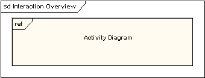
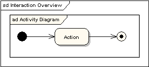

# 交互概览图(interaction overview diagram)

一个交互概览图是活动图的一种形式，它的节点代表交互图。交互图包含顺序图，通信图，交互概览图和时间图。 大多数交互概览图标注与活动图一样。例如：起始，结束，判断，合并，分叉和结合节点是完全相同。并且，交互概览图介绍了两种新的元素：交互发生和交互元素。

## 交互发生

交互发生引用现有的交互图。显示为一个引用框，左上角显示 "ref" 。被引用的图名显示在框的中央。

## 交互元素

交互元素与交互发生相似之处在于都是在一个矩形框中显示一个现有的交互图。不同之处在内部显示参考图的内容不同。

## 将它们放在一起

所有的活动图控件，都可以相同地被使用于交互概览图，如：分叉，结合，合并等等。它把控制逻辑放入较低一级的图中。下面的例子就说明了一个典型的销售过程。子过程是从交互发生抽象而来。

## 参考

- <https://sparxsystems.cn/resources/uml2_tutorial/uml2_interactionoverviewdiagram.html>
