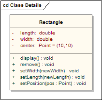
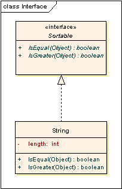
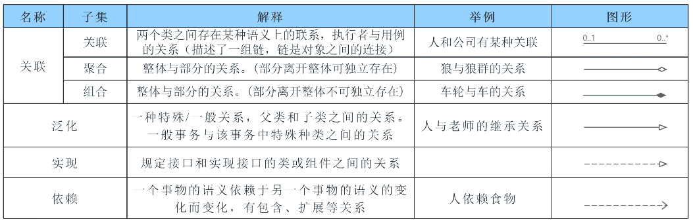
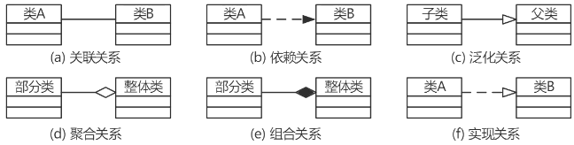
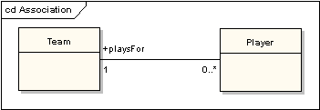
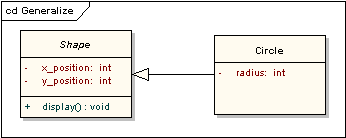
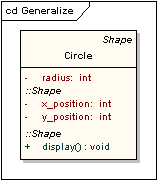
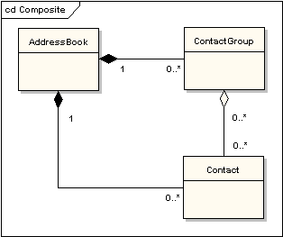

# 类图或结构图

## 最佳实践

- 💚`()`：一个事物发生变化会对另一个事物产生影响。
- 💛`()`(Association)：用于描述类与类之间的整体-部分关系
    - `()`关系(Aggregation)：整体与部分的生命周期不同, 部分独立于整体而存在
    - `()`关系(Composition)：整体与部分的生命周期相同, 部分依赖于整体而存在
- 💚`()`：`()`的关系。
- 💚`()`: `()`之间的关系 。

### 考察点

- `依赖关系`：一个事物发生变化会对另一个事物产生影响。
- `关联关系`(Association)：用于描述类与类之间的整体-部分关系
    - `聚合`关系(Aggregation)：整体与部分的生命周期不同, 部分独立于整体而存在
    - `组合`关系(Composition)：整体与部分的生命周期相同, 部分依赖于整体而存在
- `泛化关系`：`父子`的关系。
- `实现关系`: `接口与类`之间的关系 。

## 类图

类图最常用来表达多个类和接口之间的关系。泛化（Generalizations），聚合（aggregations）和关联（associations）分别是类之间继承，复合或应用，及连接的表现。

## 组件

### 类

类（Classes）: 类是定义对象所具有的属性和行为的元素. 类用矩形表示。除类的名称外，还可以选择性地显示属性和操作。 分栏分别用来显示类的名称，属性和操作。

在下面图中，类的类名显示在最上面的分栏，它下面的分栏显示详细属性，如："center" 属性显示初始化的值。最后面的分栏显示操作，如： setWidth，setLength 和 setPosition 以及他们的参数。 属性和操作名前的标注表示了该属性或操作的可见性: 如果使用 "+"号，这个属性或操作是公共的 ; "-" 号则代表这个属性或操作是私有的。 "#"号是这个属性或操作被定义为保护的，" ~" 号代表包的可见性。

### 接口

接口是实施者同意满足的行为规范，是一种约定。实现一个接口，类必需支持其要求的行为. 接口有相似于类的外形风格，含有指定的操作，如下图所示。如果没有明确的详细操作，也可以画成一个圆环。这里虚线箭头表示实现.

## 关系

- 依赖关系：实三角, 一个事物发生变化会对另一个事物产生影响。
- 关联关系(Association)：直线, 用于描述类与类之间的整体 - 部分关系
    - 聚合关系(Aggregation)：空菱形, 整体与部分的生命周期不同, 部分可以独立于整体而存在
    - 组合关系(Composition)：实菱形, 整体与部分的生命周期相同, 部分不能独立于整体而存在
- 泛化关系：空三角实线, 即特殊与一般的关系。
- 实现关系：空三角虚线, 存在于接口与类之间的关系 。

✨依赖是特殊的关联

### 依赖（Dependencies）

依赖被用来描述模型元素间广泛的依赖关系。通常在设计过程早期显示两个元素之间存在某种关系，因为是初期而不能确定具体是什么关系，在设计过程末期，该继承关系会被归入已有构造型 (构造型 可以是实例化 «instantiate»，跟踪 «trace»，导入 «import»， 和其它的关系)，或被替换成一个更明确类型的连接符。

### 关联（Associations）

关联表明两个模型元素之间有关系，通常用在一个类中被实现为一个实例变量。连接符可以包含两端的命名的角色，基数性，方向和约束。关联是元素之间普通的关系。如果多于两个元素，也可以使用菱形的关联关系。当从类图生成代码时，关联末端的对象将变成目标类中实例变量。见下图示例 "playsFor" 将变成"Player"类中的实例变量。

### 泛化（Generalizations）

泛化被用来说明继承关系。连接从特定类元到一般类元。泛化的含义是源类继承了目标类的特性。下图的图显示了一个父类泛化一个子类， 类“Circle”的一个实例将会有属性 “ x_position”，“ y_position” ， “radius” 和 方法 “display()”。 注意：类 "Shape" 是抽象的，类名显示为斜体。

下图显示了与上图相同信息的视图。

### 实现（Realizations）

业务模型或需求被一个或多个用例实现，用例则被类实现，类被组件实现，等等

### 聚合（Aggregations）

聚合通常被用来描述由更小的组件所构成的元素。聚合关系表示为白色菱形箭头指向目标类或父类。

聚合的更强形式 -组合聚合（强聚合） - 显示为黑色菱形箭头，用来组合每次最大化的包含组件。如果一个组合聚合的父类被删除，通常与他相关的所有部分都会被删除，但是，如果一个部件从组合中去掉，将不用删除整个组合。组合是可迁，非对称的关系和递归的。

下面的图示：显示了弱聚合和强聚合的不同。“ address book” 由许多 “contacts” 和 “contact groups”组成。 “contact group” 是一个“contacts”的虚分组; “contact”可以被包含在不止一个 “contact group”。 如果你删除一个“ address book”，所有的 “contacts” 和 “contact groups” 也将会被删除；如果你删除“ contact group”， 没有 “contacts”会被删除。

多重度:

- 1：表示一个集合中的一个对象对应另一个集合中一个对象。
- 0..*：表示一个集合中的一个对象对应另一个集合中的0个或多个对象(可以不对应)。
- 1..*：表示一个集合中的一个对象对应另一个集合中的一个或多个对象(至少对应一个)。
- *：表示一个集合中的一个对象对应另一个集合中的多个对象 。

## 参考

- <https://sparxsystems.cn/resources/uml2_tutorial/uml2_classdiagram.html>
