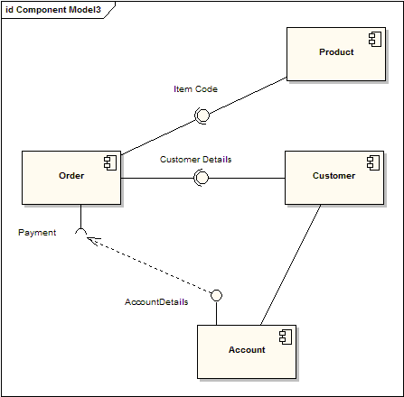
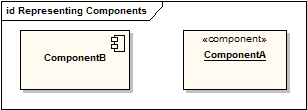
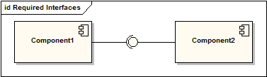
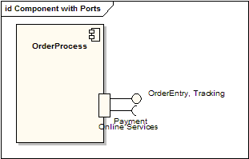

# 组件图(component diagram)

组件图描绘了组成一个软件系统的模块和嵌入控件。组件图比类图具有更高层次的抽象－通常运行时一个组件被一个或多个类（或对象）实现。它们象积木那样使得组件能最终构成系统的绝大部分。

上图演示了一些组件和它们的内部关系。装配连接器（Assembly connectors）“连接”由"Product"和"Customer"的提供接口到由 "Order"指定的需求接口。 一个依赖关系映射了客户相关的帐户信息到“Order”需要的 "Payment"需求接口。

实际上，组件图同包图很相似，它们都有明确的界限，把元素分组到逻辑结构中。他们之间的不同是：组件图提供了语义更丰富的分组机制，在组件图中，所有的模型元素都是私有的，而包图只显示公有的成员。

## 表现组件

组件可表示为带关键字«component»的矩形类元；也可用右上角有组件图标的矩形表示。

## 装配连接器

装配连接器在组件 “Component1”的需求接口和另一个组件 “Component2”的提供接口之间建立桥梁; 这个桥梁使得一个组件能提供另一个组件所需要的服务。

## 带端口组件

使用端口的组件图允许在它的环境指定一个服务和行为，同时这个服务和行为也是组件需要的。当端口进行双向操作的时候，它可以指定输入和输出。下图详述了用于在线服务的带端口组件，它有两个提供接口 “order entry”和 “tracking”，也有 “payment” 需求接口。

## 参考

- <https://sparxsystems.cn/resources/uml2_tutorial/uml2_componentdiagram.html>
