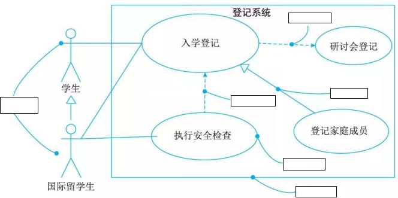
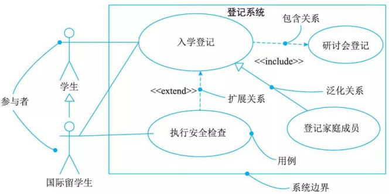
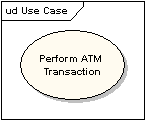
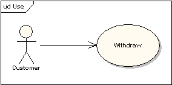
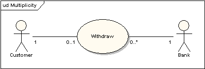
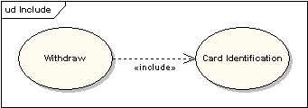
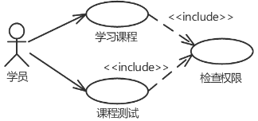
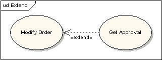
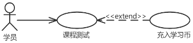

# 用例图(usecase diagram)

## 最佳实践

### 考察问

- 💚概念理解: `()`、`()`以及它们之间的`()`
- 💛关系理解:
    - `()`: 必然包含, `()`, `()`线指向`()`用例
    - `()`: 不必然包含, 只起到补充功能, `()`, `()`先指向`()`用例
    - `()`: 父泛化成子, `()`, `()`线指向`()`用例

### 考察点

- 概念理解: `用例`、`参与者`以及它们之间的`关系`
- 关系理解:
    - `包含关系`: 必然包含, `<<include>>`, `虚`线指向`被包含`用例
    - `扩展关系`: 不必然包含, 只起到补充功能, `<<extend>>`, `虚`先指向`被拓展`用例
    - `泛化关系`: 父泛化成子, `<<generalize>>`, `实`线指向`被实现`用例

## 用例图

用例模型用来记录系统的需求，它提供系统与用户及其他参与者的一种通信手段。

## 执行者

用例图显示了系统和系统外实体之间的交互。这些实体被引用为执行者。执行者代表角色，可以包括：用户，外部硬件和其他系统。执行者往往被画成简笔画小人。也可以用带«actor»关键字的类矩形表示。

## 用例

用例是有意义的单独工作单元。它向系统外部的人或事提供一个易于观察的高层次行为视图。 用例的标注符号是一个椭圆。

使用用例的符号是带可选择箭头的连接线，箭头显示控制的方向。下图说明执行者 "Customer"使用 "Withdraw"用例。

用途连接器（uses connector）可以有选择性的在每一个端点有多重性值，如下图，显示客户一次可能只执行一次取款交易。但是银行可以同时执行许多取款交易。

## 包含

用例可能包含其他用例的功能来作为它正常处理的一部分。通常它假设，任何被包含的用例在基本程序运行时每一次都会被调用。下面例子：用例“卡的确认”`<Card Identification>`在运行时，被用例“取钱”`<Withdraw>`当作一个子部分。

当可以从两个或两个以上的用例中`提取公共行为`时，应该使用包含关系来表示它们，用`<<include>>`表示。

## 扩展

一个用例可以被用来扩展另一个用例的行为，通常使用在特别情况下。例如：假设在修改一个特别类型的客户订单之前，用户必须得到某种更高级别的许可，然后“获得许可”`<Get Approval>`用例将有选择的扩展常规的“修改订单”`<Modify Order>`用例。

一个用例(扩展用例)在特定条件下增强或补充另一个用例(基础用例)的功能，用`<<extend>>`表示。

1. 基础用例(Base Use Case)：提供核心功能的主用例，具有完整的独立流程(即使没有扩展用例，基础用例仍可正常执行). 如登录系统
2. 扩展用例(Extending Use Case)：在特定条件下(如异常情况、特殊需求)才会被触发，用于补充基础用例的功能. 如发送验证码(当密码错误次数超过3次时)

## 泛化

当多个用例共同拥有一种类似的结构和行为的时候，可以将它们的`共性抽象成父用例`，其他的用例作为泛化关系中的子用例。用`<<generalize>>`表示.

## 用例图

如学生登记用例图：

- 包含关系：有公共的行为：登记
- 扩展关系：明显地混合了两种或两种以上的不同场景，即根据情况可能发生多种分支。学生登记为基本用例，安全检查为扩展用例。
- 泛化关系：登记学生和登记学生家庭成员共同拥有一种类似的结构和行为，即登记信息，这就是泛化关系。

✨注意包含关系是基础用例外指向, 而拓展关系是拓展用例指向基础用例

## 课本

## 参考

- <https://sparxsystems.cn/resources/uml2_tutorial/uml2_usecasediagram.html>
