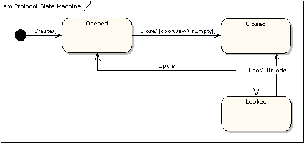
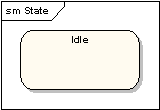
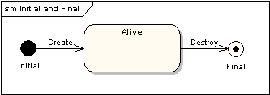
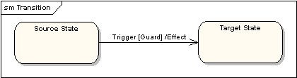
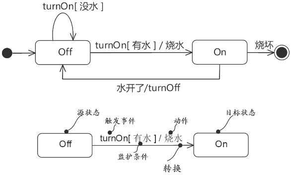

# 状态机图(state diagram)

状态机图对一个单独对象的行为建模，指明对象在它的整个生命周期里，响应不同事件时，执行相关事件的顺序。

如下示例， 下列的状态机图显示了门在它的整个生命周期里如何运作。

门可以处于以下的三种状态之一： "Opened"打开状态， "Closed"关闭状态，或者"Locked"锁定状态。 它分别响应事件：“Open”开门， “Close”关门， “Lock”锁门 和 “Unlock”解锁。 注意：不是所有的事件，在所有的状态下都是有效的。如：一个门打开的时候是不可能锁定的，除非你关上门。并且，状态转移可能有附加监护条件：假设门是开的，如果“doorWay->isEmpty”（门是空的）被满足，那么它只能响应关门事件。状态机图使用的语法和约定将在下面的部分进行讨论。

## 状态

状态被表示为圆角矩形，状态名写在里面。

## 起始和结束状态

初始状态表示为实心黑圆环，可以标注名称。结束状态表示为中心带黑点圆环，也可以被标注名称。

## 转移

一个状态到下一个状态的转移表示为带箭头实线。转移可以有一个“Trigger”触发器，一个“Guard”监护条件和一个“effect”效果。如下所示：

"Trigger"触发器是转移的起因，它可以是某个条件下的一个信号，一个事件，一个变化或一个时间通路。"Guard"监护是一个条件，而且必须为真，以便于让触发器引起转移。效果"Effect"是直接作用到对象上的一个动作，该对象具有做为转移结果的状态机。

水壶烧水案例:

## 参考

- <https://sparxsystems.cn/resources/uml2_tutorial/uml2_statediagram.html>
