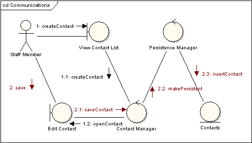
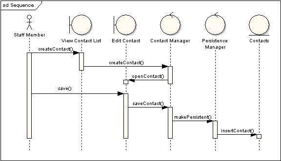

# 通信图(communication diagram)

通信图，以前称之为协作图，是一种交互图，所显示消息与顺序图相似，但是它更侧重于对象间的联系。

在通信图中，对象之间显示关联连接器。消息附加到这些关联上，显示短箭头指向消息流的方向。消息的顺序通过编号码显示。

下面的两个图用通信图和顺序图分别显示相同的信息。尽管我们可能从通信图的编号码得到消息顺序，但它不是立即可见的。通信图十分清楚的显示了邻近对象间全部完整的消息传递。

