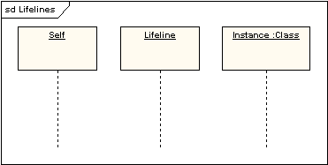
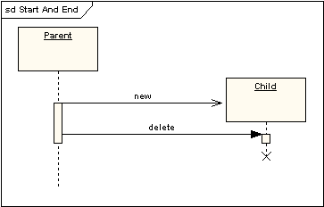
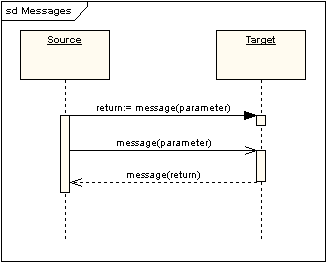
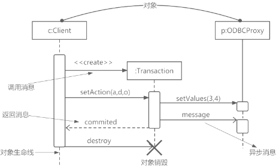
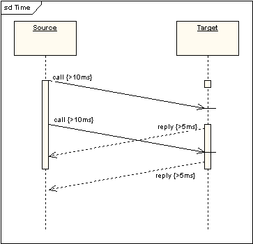

# 顺序图(sequence diagram)

## 最佳实践

### 考察问

消息分类:

- `()`消息
- `()`消息
- `()`消息

### 考察点

消息分类:

- `同步`消息
- `异步`消息
- `返回`消息

## 顺序图

顺序图能很好地显示那些对象与其它那些对象通信，什么消息触发了这些通信，顺序图不能很好显示复杂过程的逻辑。

## 生命线

一条生命线在顺序图中代表一个独立的参与者。表示为包含对象名的矩形，如果它的名字是"self"，则说明该生命线代表控制带顺序图的类元。

生命线可以在顺序图时间刻度范围内创建和销毁，在下面的例子中，生命线被停止符号（叉号）终止。在前面的例子中，生命线顶端的符号（Child）显示在比创建它的对象符号（parent）沿页面要低的位置上。下图显示创建和终止对象。

## 消息

消息显示为箭头。消息可以完成传输，也可能丢失和找回，它可以是同步的，也可以是异步的，即可以是调用，也可以是信号。在下图中，第一条消息是同步消息(标为实箭头)完成传输，并隐含一条返回消息。第二条消息是异步消息 (标为实线箭头)，第三条是异步返回消息(标为虚线)。

1. 同步消息(进行阻塞调用，调用者中止执行，等待控制权返回，需要等待返回消息，用实心三角箭头表示)
2. 异步消息(发出消息后继续执行，不引起调用者阻塞，也不等待返回消息，由空心箭头表示)
3. 返回消息(由从右到左的虚线箭头表示)。

## 时间和期限约束

消息默认显示为水平线。因为生命线显示为沿屏幕向下的时间通道，所以当给实时系统建模，或是有时间约束的业务过程建模，考虑执行动作所需时间长度是很重要的。因此可以给消息设置一个期限约束，这样的消息显示为下斜线。

## 参考

- <https://sparxsystems.cn/resources/uml2_tutorial/uml2_sequencediagram.html>
