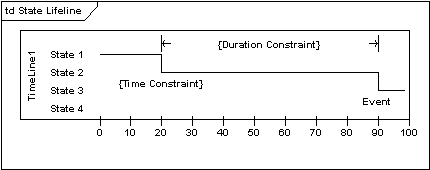
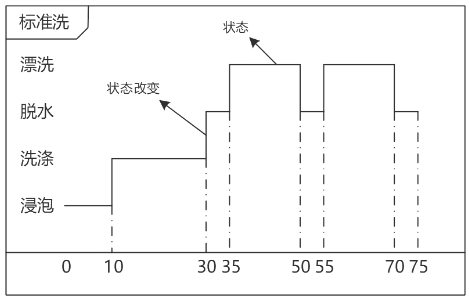

# 时间图(timing diagram)

UML 时间图被用来显示随时间变化，一个或多个元素的值或状态的更改。

状态生命线显示随时间变化，一个单项状态的改变。不论时间单位如何选择，X轴显示经过的时间，Y轴被标为给出状态的列表。状态生命线如下所示：

它描述对象的状态随着时间改变的情况，很像示波器。

## 参考

- <https://sparxsystems.cn/resources/uml2_tutorial/uml2_timingdiagram.html>
