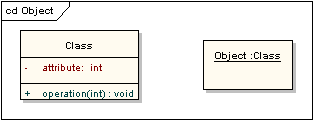

# 对象图(object diagram)

对象图可以认为是类图的特殊情形，是类图元素子集，被用来及时强调在某些点，类的实例间的关系。

## 类和对象元素

下面的图显示了类元素和对象元素外观上的不同。注意：类元素包括三个部分，分别是名字栏，属性栏和操作栏；对象元素默认为没有分栏。名称显示也有不同：对象名称有下划线，并可能显示该对象实例化所用类元的名称。

## 运行状态

类元元素可以有任意数量的属性和操作。在对象实例中不会被显示出来。但可能定义对象的运行状态，显示特殊实例的属性设置值。

## 参考

- <https://sparxsystems.cn/resources/uml2_tutorial/uml2_objectdiagram.html>
