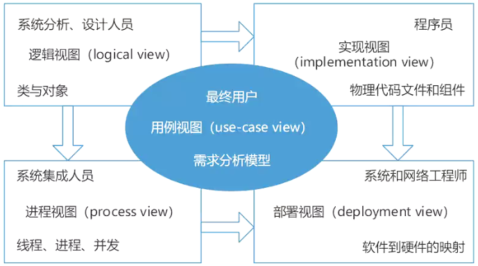

# UML5种视图

## 最佳实践

UML的4+1视图:
- `()`: `()`图. 用于需求分析.
- `()`: `()`, `()`, `()`, `()`图. 用于代码开发.
- `()`: `()`图. 用于设计.
- `()`: `()`图, 用于系统集成.
- `()`: `()`图. 逻辑向物理的转变.

### 考察点

UML的4+1视图:
- `用例视图`: `用例`图. 用于需求分析.
- `实现视图`: `类图`, `对象`, `组合结构`, `构件`图. 用于代码开发.
- `逻辑视图`: `状态`图. 用于设计.
- `进程视图`: `顺序`图, 用于系统集成.
- `部署视图`: `部署`图. 逻辑向物理的转变.

## UML4+1
按照图本身具有的特点，可以把图形划分为5类视图，分别是用例视图、逻辑视图、进程视图、实现视图和部署视图，其中的用例视图居千中心地位。

1. 用例视图：描述系统的功能需求，方便找出用例和执行者；它展示了一个外部用户能够观察到的系统功能模型，主要包括用例图。对此关心的开发团队成员主要包括客户、分析者、设计者、开发者和测试者。
2. 逻辑视图：描述如何实现系统内部的功能；系统的静态结构和因发送消息而出现的动态协作关系。逻辑视图包含类图和对象图、状态图、顺序图、合作图和活动图。
3. 进程视图：描述系统的并发性，并处理这些线程间的通信和同步；它将系统分割成并发执行的控制线程及处理这些线程的通信和同步。进程视图主要包括状态图、顺序图、合作图、活动图、构件图和配置图；对此关心的开发团队成员主要包括开发者和系统集成者。
4. 实现视图：描述系统代码构件组织和实现模块及它们之间的依赖关系；实现视图主要包括构件图；对此关心的开发团队成员主要有设计者、开发者和测试者。
5. 部署视图：定义系统中软硬件的物理体系结构及连接、哪个程序或对象驻留在哪台计算机上执行；主要包括配置图；对此关心的开发团队成员主要包括开发者、系统集成者和测试者。

