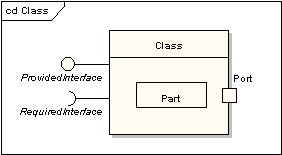
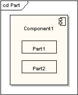
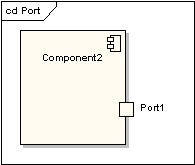
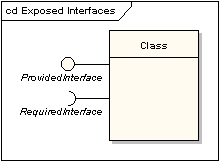

# 复合结构图(composite diagram)

复合结构图显示类元内部结构，包括它与系统其他部分的交互点。也显示各部分的配置与关系，这些部分一起执行类元的行为。

类元素已经在类图部分被详细地阐述，这部分用来说明类表现复合元素的方式，如：暴露接口，包含端口和部件。

## 部件
部件是代表一组（一个或多个）实例的元素，这组实例的拥有者是一类元实例，例如：如果一个图的实例有一组图形元素，则这些图形元素可以被表示为部件，并可以对他们之间的某种关系建模。部件在类或组件内部显示为不加修饰的方框。

## 端口

端口是类型化的元素，代表一个包含类元实例的外部可视的部分。端口定义了类元和它的环境之间的交互。端口显示在包含它的部件，类或组合结构的边缘上。端口显示为所属类元边界指定的方框。

## 接口
接口与类相似，但是有一些限制，所有的接口操作都是公共和抽象的，不提供任何默认的实现。

提供接口显示为“带棒球体”，依附在类元边缘。需求接口显示为“带棒杯体”，也是依附在类元边缘。

## 参考

- https://www.cnblogs.com/cxygg/p/18252619