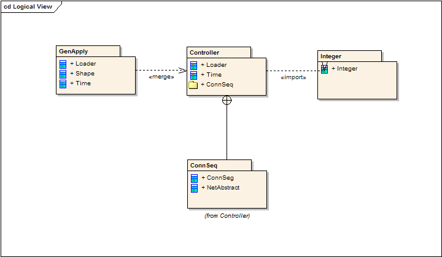
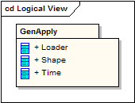

# 包图(package diagram)

包图用来表现包和它所包含元素的组织。当用来代表类元素时，包图提供了命名空间的可视化。包图最常用的用途是用来组织用例图和类图，尽管它不局限于这些UML元素。

包中的元素共享相同的命名空间，因此，一个指定命名空间的元素必须有唯一的名称。

包可以用来代表物理或逻辑关系。选择把类包括在指定的包里，有助于在同一个包里赋予这些类相同继承层次。通常认为把通过复合相关联的类，以及与它们相协作的类放在同一个包里。

在UML 中，包用文件夹来表示，包中的元素共享同一个命名空间，并且必须是可识别的，因此要有唯一的名称或类型。包必须显示包名，在附属方框部分有选择的显示包内的元素。

## 包的合并
包之间的合并连接符«merge»定义了源包元素与目标包同名元素之间的泛化关系。源包元素的定义被扩展来包含目标包元素定义。当源包元素与目标包内没有同名元素时，目标包元素的定义不受影响。

## 包的导入
导入连接符 «import»表明目标包的元素，在该例中是一个类 ，在源包中被引用要用非限定修饰名。源包的命名空间获得目标类的接口，目标包的命名空间则不受影响。

## 嵌套连接符
源包和目标包间的嵌套连接符说明目标包完全包含源包。

## 参考

- https://sparxsystems.cn/resources/uml2_tutorial/uml2_packagediagram.html