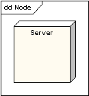
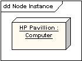
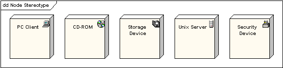
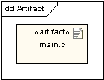
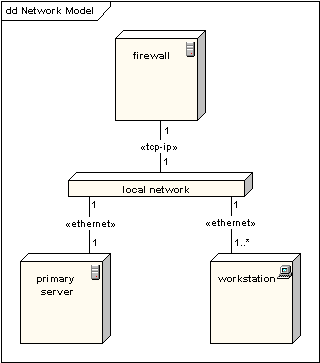
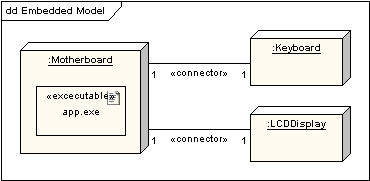

# 部署图(deployment diagram)

部署图是对系统运行时的架构进行建模。它显示硬件元素（节点）的配置，以及软件元素与工件是如何映射到这些节点上的。

## 节点

节点既可以是硬件元素，也可以是软件元素。它显示为一个立方体，如下图所示。

## 节点实例
图可以显示节点实例，实例与节点的区分是：实例的名称带下划线，冒号放在它的基本节点类型之前。实例在冒号之前可以有名称，也可以没有名称。下图显示了一个具名的计算机实例。

## 节点构造型

为节点提供了许多标准的构造型，分别命名为 «cdrom»， «cd-rom»， «computer»， «disk array»， «pc»， «pc client»， «pc server»， «secure»， «server»， «storage»， «unix server»， «user pc»。 并在节点符号的右上角显示适当的图标。

## 工件

工件是 软件开发 过程中的产品。 包括过程模型（如：用例模型，设计模型等），源文件，执行文件，设计文档，测试报告，构造型，用户手册等等。

工件表示为带有工件名称的矩形，并显示«artifact»关键字和文档符号。

## 关联

在部署图的上下文联系中，关联代表节点间的联系通道。下图显示了一个网络系统的部署图，描述了网络协议为构造型和关联终端的多重性，

## 作为容器的节点

节点可以包含其他元素，如组件和工件。下图显示了一个嵌入式系统某个部分的部署图。描写了一个被主板节点包含的可执行工件。

## 参考

- https://sparxsystems.cn/resources/uml2_tutorial/uml2_deploymentdiagram.html

