# 活动图(activity diagram)

## 最佳实践

### 考察问

- 活动图中的并发`()`和并发`()`线是一条水平粗线。

### 考察点

- 活动图中的并发`分叉`和并发`合并`线是一条水平粗线。

## 活动图

活动图用来展示活动的顺序。 显示了从起始点到终点的工作流，描述了活动图中存在于事件进程的判断路径。活动图可以用来详细阐述某些活动执行中发生并行处理的情况。活动图对业务建模也比较有用，用来详细描述发生在业务活动中的过程。一个活动图的示例如下所示。

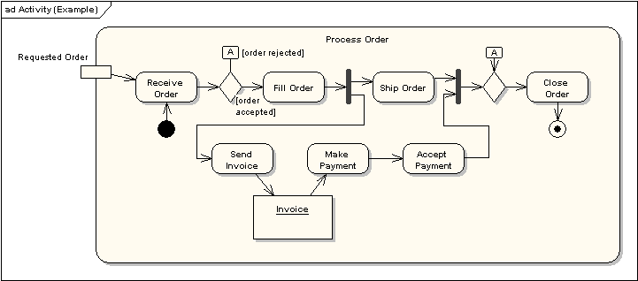

## 活动

活动是行为参数化顺序的规范。活动被表示为圆角矩形，内含全部的动作，工作流和其他组成活动的元素。

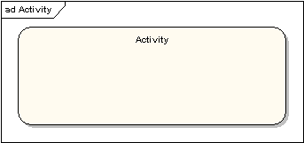

## 动作

一个动作代表活动中的一个步骤。动作用圆角矩形表示。

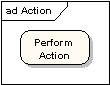

## 控制流

控制流显示一个动作到下一个动作的流。表示为带箭头实线

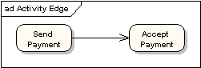

## 初始节点

一个开始或起始点用大黑圆点表示，如下图。
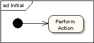

## 结束节点

结束节点有两种类型：活动结束节点和流结束节点。活动结束节点表示为中心带黑点的圆环。

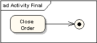

流结束节点表示为内部为叉号的圆环。

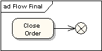

这两种不同类型节点的区别为：流结束节点表明单独的控制流的终点。活动结束终点是活动图内所有控制流的结束。

## 对象和对象流

对象流是对象和数据转递的通道。对象显示为矩形。对象流显示为带箭头的连接器，表明方向和通过的对象。

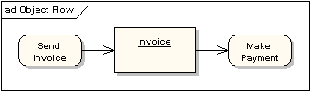

一个对象流在它的至少一个终端有一个对象。在上图中，可以采用带输入输出引脚的速记标柱表示。

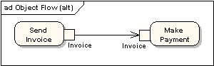

数据存储显示为带`«datastore»`关键字的对象。

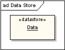

## 判断节点和合并节点

判断节点和合并节点是相同标注：菱形。它们可以被命名。从判断节点出来的控制流有监护条件，当监护条件满足时，可以对流控制。下图显示了判断节点和合并节点的使用。

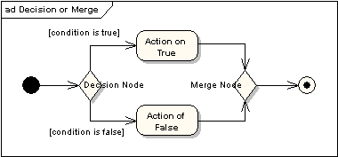

## 分叉和结合节点

分叉和结合节点有同样的标柱：垂直或水平条（方向取决于工作流从左到右，还是从上到下）。它们说明了控制的并发线程的起始和终点，下图显示他们的使用示例。

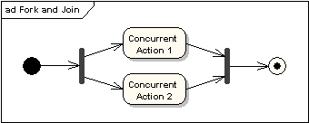

结合节点与合并节点不同之处在于：结合节点同步两个输入量，产生一个单独的输出量。来自结合节点的输出量要接收到所有的输入量后才能执行。合并节点直接将控制流传递通过。如果两个或更多的输入量到达合并节点。则它的输出流指定的动作会被执行两次或更多次。

✨考试中使用并发分叉和并发结合

## 泳道

一个活动分割显示为垂直或水平泳道。在下图中，分割被用来在活动图中分隔动作，有在 "accounting department"中执行的，有在 "customer"中执行的。

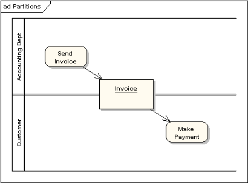

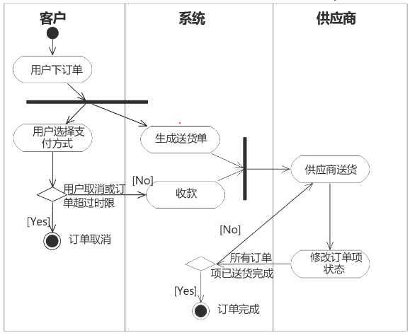

## 参考

- <https://sparxsystems.cn/resources/uml2_tutorial/uml2_activitydiagram.html>
./6计算机语言的组成和分类/活动图_泳道2.png