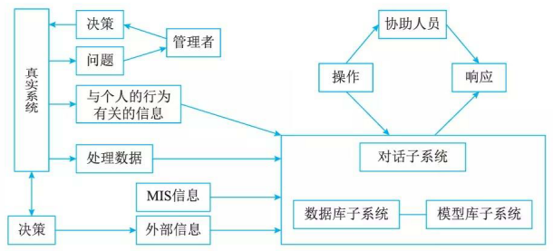
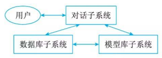

# 决策支持系统(Decision Support System, DSS)

## 决策支持系统的概念

### 概念

决策支持系统(Decision Support System，DSS)应当是一个交互式的、灵活的、适应性强的基于计算机的信息系统，能够为解决非结构化管理问题提供支持，以改善决策的质量。DSS应具有的特征是：

1. 数据和模型是DSS的主要资源。
2. DSS用来支援用户作决策而不是代替用户作决策。
3. DSS主要用于解决半结构化及非结构化问题。
4. DSS的作用在于提高决策的有效性而不是提高决策的效率。

### 决策支持系统的基本模式

DSS的基本模式反映DSS的形式及其与“真实系统”、人和外部环境的关系，如图所示。其中管理者处于核心地位，运用自己的知识和经验，结合决策支持系统提供的支持，对其管理的“真实系统”进行决策。

### 决策支持系统的结构

DSS 的两种基本结构形式是两库结构和基于知识的结构，实际中的 DSS 由这两种基本结构通过分解或增加某些部件演变而来。两库结构由数据库子系统、模型库子系统和对话子系统形成三角形分布的结构.

## 决策支持系统的功能

1. 决策支持系统用来整理和提供本系统与决策问题有关的各种数据。各种不同的待决策的问题可能需要不同方面、不同层次的数据，如生产数据、库存数据、财务数据、设备运行数据等。
2. 决策支持系统要尽可能地收集、存储和及时提供与决策有关的外部信息。外部信息是保证正确决策的重要依据，如市场需求、商品价格、原材料供应、竞争对手的经营状况等。
3. 决策支持系统能及时收集和提供有关各项活动的反馈信息，包括系统内和与系统相关的信息，如计划完成情况、产品销售情况、用户反映信息等。
4. 决策支持系统对各种与决策有关的模型具有存储和管理的能力。不同的决策内容需要不同的决策模型的支持，如库存控制模型、生产调度模型、投入产出模型等。
5. 决策支持系统提供对常用的数学方法、统计方法和运筹方法的存储和管理，如统计检验方法、回归分析方法、线性规划方法等。
6. 决策支待系统能对各种数据、模型、方法进行有效管理，为用户提供查找、变更、增加、删除等操作功能，以使用户可以对系统所提供的数据、模型和方法进行有效而灵活的运用，如数据的变更、模型的修改、方法的增删等，都可以通过系统来完成。
7. 决策支持系统运用所提供的模型和方法对数据进行加工，并得出有效支持决策的信息，如对数据进行汇总、分析、预测等。
8. 决策支持系统具有人－机对话接口和图形加工、输出功能，不仅用户可以对所需要的数据进行查询，而且可以输出相应的图形，如回答 “What…if…”等类型的问题和输出各种统计、分析图表。
9. 决策支持系统应能支持分布使用方式，提供有效的传输功能，以保证分散在不同地点的用户能共享系统所提供的模型、方法和可共享的数据，如系统在局域网的环境中运行，并提供了可共享的数据、模型和方法。由上述功能可见，决策支持系统应是在一种网络环境下，提供对数据、模型和方法进行管理功能的，并具有良好的人－机界面的完整的软件系统。一个实用的决策支持系统，更重要的是它拥有能对决策起辅助作用的丰富的数据和成熟的模型以及有效的方法。

## 决策支持系统的特贞

1. 决策支持系统面向决策者，系统在开发中遵循的需求和操作是设计系统的依据和原则。系统的收集、存储和输出的一切信息，都是为决策者服务。
2. 决策支持系统支持对半结构化问题的决策。半结构化问题的复杂性致使传统的计算机信息系统，如电子数据处理系统、管理信息系统都难以解决，而决策支持系统则可以辅助决策者对决策信息过程和方案进行较系统且全面的分析。
3. 决策支持系统的作用是辅助决策者、支持决策者。由于决策过程的复杂性和决策过程中的重要作用，系统不可能取代人而做出决策。在整个决策过程中系统不可能也不应该提供答案，也不应该强加给决策者预先规定的决策顺序。
4. 决策支持系统体现决策过程的动态性。用户或用户通过模型，根据决策层次、决策环境、问题理解、知识积累等多方面变化的情况来动态地确定问题的解答，并在决策的动态运行过程中完善和调整系统。
5. 决策支待系统提倡交互式处理。通过人－机对话的方式将决策人的经验、观念和判断纳入系统，进而将人们主观的、经验的判断与客观的信息反映相结合，最后确定决策方案。

## 决策支持系统的组成

1. 数据的重组和确认:

    获得正确的数据并且可用理想的形式操作这些数据。有时这是非常困难的，因为从事务处理系统收集的数据必须经过重组和确认才能对决策支持有效。这个问题可以通过数据仓库的概念解决。

1. 数据字典的建立

    大多数现存作业层的数据库没有按有利千分析类型和查询应用的方式组织。起初，公司通过产生一些从查询得到的固定的数据析取来解决这样的问题。但这种方法使析取的数据固定在一个时间点上，并随时间的推移很快就不适用了。

    数据仓库是一个与作业层系统分离存在的数据库。通过对数据仓库的存取，管理者可以做出以事实为根据的决策来解决许多业务问题。例如，什么定价策略最有效，什么样的客户能带来更多的利润，什么样的产品有最大利润。

    生成数据仓库的过程十分直接。首先，数据被“提炼”出来，确认它们是有意义的、一致的和准确的，然后载入关系表中以便支持分析及查询应用。通常数据必须从多个生产系统和外部来源获得，这是一个困难的过程，包括识别相应数据、数据混合、提炼数据阶段以保证其有效性。最后数据需要与建立的逻辑数据模型相一致。

2. 数据挖掘和智能体

    一旦建成数据仓库，管理者们需要运用工具进行数据存取和查询，这个过程为数据挖掘，使用的工具称为智能体。智能体是管理者用来在关系数据库中搜寻相应数据的软件，用来做趋势分析、异常情况识别和结果跟踪。数据挖掘工具同时也被用来识别数据的模式，从模式中得出规则，并且利用另外的数据检验来精炼这些规则。数据挖掘的结果类型包括：

    1. 联合：把各个事件联系在一起的过程。例如，将学生们经常同时选修的两门课程联系起来，以便这两门课程不被安排在同一时间。
    2. 定序：识别模式的过程。例如，识别学生们多个学期课程的次序。
    3. 分类根据模式组织数据的过程。例如，以学生完成学业的时间 (4 年以内， 4 年以上)为标准分成几个小组。
    4. 聚类：推导特定小组与其他小组相区分的判断规则的过程。例如，通过兴趣、年龄、工作经验来划分学生。

3. 模型建立

    每种模型都有不同的应用范围，例如，统计模型包括回归分析、方差和指数平滑，会计模型包括折旧、纳税计划和成本分析，人事管理模型包括环境模拟、角色练习，市场营销模型包括广告策略分析、消费者选择倾向及消费者行为转变分析。建立一个决策支持系统的难点在于，必须清楚系统应包括什么样的模型，如何使这些模型对决策者有意义。

    模型也有不同的特点，有一些是经验的，有一些是客观的。经验模型包括判断和专家的意见，例如，一个内科医生使用一个经验模型去诊断心脏的状况，客观模型意味着数据分析独立千决策者的经验。建立模型的方法有穷枚举法、算法、启发式和模拟法。

    1. 神经网络经常支持穷枚举法。一个神经网络包括许多简单的处理单元，它们结合成网络，每个处理单元基千输入的特性及权重产生一个输出。神经网络可以帮助解决复杂模式匹配、不完全信息和大规模数据的问题。神经网络通过一组例子训练，当网络通过训练样本训练过之后，用另一组例子来测试它的性能。不同于规则推理，训练后神经网络得出的决策标准可能与传统或常规规则相矛盾，但是决策结果是有效的。
    2. 算法或算法模型是一组可以循环执行以获得结果的过程。算法支持许多类型的业务决策，包括如何投资，何时对商品进行广告宣传，如何把员工分派到项目中去。
    3. 另外一个建立模型的基础是启发式，启发式是经验法则，用于分析结构化程度低的问题。启发式模型经常在专家系统设计中使用，因为这些模型可以使用户应用规则来重复专家解决结构化程度低的技巧。
    4. 第 4 个建模的方法是模拟，模拟的目标是仿真。如模拟工厂的运作、业务的操作或一个国家的政治气候。通过这些，用户能在每个环境中进行策略改变分析。
