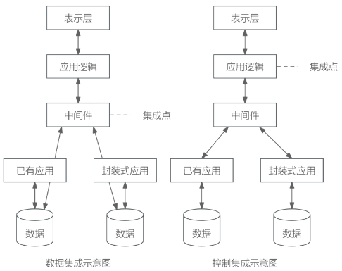

## 客户关系管理CRM

### 概念

客户关系管理CRM是以客户为中心，提高客户满意度、增加客户的忠诚度，以达到使企业获利的最终目标。CRM是一个集成化的信息管理系统，它存储了企业现有和潜在客户的信息，并且对这些信息进行自动的处理从而产生更人性化的市场管理策略。

CRM涵盖的要素主要有：

1. CRM以信息技术为手段，但是CRM绝不仅仅是某种信息技术的应用，它更是一种以客户为中心的商业策略，CRM注重的是与客户的交流，企业的经营是以客户为中心，而不是传统的以产品或以市场为中心。
2. CRM在注重提高客户的满意度的同时，一定要把帮助企业提高获取利润的能力作为重要指标。
3. CRM的实施要求企业对其业务功能进行重新设计，并对工作流程进行重组(BPR)，将业务的中心转移到客户，同时要针对不同的客户群体有重点地采取不同的策略。

CRM系统的主要模块包括销售自动化、营销自动化、客户服务与支持、商业智能。

### CRM的功能

- 客户服务：是CRM的关键内容，对客户提供的服务，可以提高客户忠诚度。
- 市场营销：包括商机产生、商机获取和管理、商业活动管理和电话营销等；销售人员与潜在客户的互动行为、将潜在客户发展为真正客户并保持其忠诚度是使企业赢利的核心因素。
- 共享的客户资料库：是企业的一种重要信息资源，将市场营销和客户服务连接起来。也是CRM的基础和依托。
- 分析能力：CRM的一个重要方面在于它具有使客户价值最大化的分析能力。对上述获取的资料库进行分析。

其中，客户服务和市场营销是CRM的支柱性功能。

### 一个有效的CRM解决方案应该具备以下要素

- 畅通有效的客户交流渠道(触发中心)。
- 对所获信息进行有效分析(挖掘中心)。
- CRM必须能与ERP很好地集成。

### CRM的实现过程

- 客户服务与支持，即通过控制服务品质以赢得顾客的忠诚度。
- 客户群维系，即通过与顾客的交流实现新的销售。
- 商机管理，即利用数据库开展销售。

## 供应链管理SCM

### 概念

供应链管理(Supply Chain Management, SCM)是一种集成的管理思想和方法，是在满足服务水平要求的同时，为了使系统成本达到最低而采用的将供应商、制造商、仓库和商店有效地结合成一体来生产商品，有效地控制和管理各种信息流、资金流和物流，并把正确数量的商品在正确的时间配送到正确的地点的一套管理方法。
信息化三流:

- 信息流
    - 需求信息流(需方到供方)：如客户订单、生产计划、采购合同等
    - 供应信息流(供方到需方)：如入库单、完工报告单、库存记录、可供销售量、提货发运单等
- 资金流
- 物流

#### 供应链管理SCM的特点

1. 以客户为中心。SCM追求的目标首先是满足客户的需求；衡量SCM绩效的最重要的指标就是客户满意度。
2. 集成化管理。SCM的本质在于集成化管理。
3. 扩展性管理。现代的SCM使传统的企业向扩展性企业发展。
4. 合作管理。SCM非常强调企业之间的合作，打破传统的封闭的经营意识，通过供应链中各个节点企业之间建立起新型的合作关系。
5. 多层次管理。包括公司战略层次、战术层次和作业层次上的活动，主要目标是通过系统的观点，对多个职能和各个层次的供应商进行整合。

### 供应链节点

供应链节点有：供应商、制造商、分销商、零售商、仓库、配送中心、客户等。

### SCM的基本内容

SCM包括计划、采购、制造、配送、退货五大基本内容。

- 计划：这是SCM的策略部分，企业需要有一个策略来管理所有的资源，以满足客户对产品的需求。好的计划是建立一系列的方法监控供应链。
- 采购：选择能为企业提供产品和服务的供应商。
- 制造：安排生产、测试、打包和准备送货所需的活动，是供应链中测量内容最多的部分。
- 配送：即物流，是调整用户的订单收据、建立仓库网络、拍递送人员提货并送货、建立产品计价系统、接收付款。
- 退货：是供应链中的问题处理部分。

## 企业应用集成

### 最佳实践

#### 考察问

1. 企业应用集成(Enterprise Application Integration，EAI)提供4个层次的服务，从下至上依次为`()`、`()`、`()`、`()`
2. 系统应用集成构建统一标准的基础平台，在各个应用系统的接口之间共享数据和功能，基本原则是保证应用程序的`()`。

#### 考察点

1. 企业应用集成(Enterprise Application Integration，EAI)提供4个层次的服务，从下至上依次为`通讯服务`、`信息传递与转化服务`、`应用连接服务`、`流程控制服务`
2. 系统应用集成构建统一标准的基础平台，在各个应用系统的接口之间共享数据和功能，基本原则是保证应用程序的`独立性`。

### 概念

企业应用集成(Enterprise Application Integration，EAI)是伴随着企业信息系统的发展而产生和演变的。EAI技术是将进程、软件、标准和硬件联合起来，在两个或更多的企业信息系统之间实现无缝集成，使它们就像一个整体一样。

### EAI提供的服务层次

EAI提供4个层次的服务，从下至上依次为通讯服务、信息传递与转化服务、应用连接服务、流程控制服务，最上层是流程控制服务。EAI就是在各个应用系统的接口之间共享数据和功能。EAI的基本原则就是集成多个系统并保证系统之间互不干扰，也就是独立性。

### 企业应用集成(EAI)的适用范围

企业应用集成EAI，可以适用于大多数要实施电子商务的企业，以及企业之间的应用集成。

### 常见的企业应用集成方法

1. 表示集成：即界面集成，是最原始的集成，黑盒集成。将多个信息系统的界面集成在一起，统一入口，为用户提供一个看上去统一，但是由多个系统组成的应用系统的集成，例如桌面。

    

2. 数据集成：白盒集成，把不同来源、格式、特点性质的数据在逻辑上或者物理上有机的集中，从而为企业提供全面的数据共享。如数据仓库。
3. 控制集成(功能集成、应用集成)：黑盒集成，业务逻辑层次的集成，可以借助于远程过程调用或远程方法调用、面向消息的中间件等技术，将多个应用系统功能进行绑定，使之像一个实时运行的系统一样接受信息输入和产生数据输出，实现多个系统功能的叠加。如钉钉。

    

4. 业务流程集成：即过程集成，是最彻底的、综合的集成，这种集成超越了数据和系统，由一系列基于标准的、统一数据格式的工作流组成。当进行业务流程集成时，企业必须对各种业务信息的交换进行定义、授权和管理，以便于改进操作、减少成本、提高响应速度。如电子购物网站 - 第三方支付平台 - 银行 - 物流等流程集成。

### 应用集成数据交换方式

- 共享数据库：在应用集成时，让多个应用系统通过直接共享数据库的方式，来进行数据交换，实时性强，可以频繁交互，属于同步方式；但是安全性、并发控制、死锁等问题突出。
- 消息传递：消息是软件对象之间进行交互和通信时所使用的一种数据结构，可以独立于软件平台而存在，适用于数据量小、但要求频繁、立即、可靠、异步地数据交换场合。
- 文件传输：是指在进行数据交换时，直接将数据文件传送到相应位置，让目标系统直接读取数据，可以一次性传送大量信息，但不适合频繁进行数据传送。适用于数据量大、交换频度小、即时性要求低的情况。

### 企业集成平台

企业集成平台是一个支持复杂信息环境下信息系统开发、集成、协同运行的软件支撑环境，包括硬件、软件、软件工具和系统，基本功能包括：

1. 通信服务。它提供分布环境下透明的同步/异步通信服务功能，使用户和应用程序无需关心具体的操作系统和应用程序所处的网络物理位置，而以透明的函数调用或对象服务方式完成它们所需的通信服务要求。
2. 信息集成服务。它为应用提供透明的信息访问服务，通过实现异种数据库系统之间数据的交换、互操作、分布数据管理和共享信息模型定义，使集成平台上运行的应用、服务或用户端能够以一致的语义和接口实现对数据的访问与控制。
3. 应用集成服务。它通过高层应用编程接口来实现对相应应用程序的访问，能够为应用提供数据交换和访问操作，使各种不同的系统能够相互协作。
4. 二次开发工具。它是集成平台提供的一组帮助用户开发特定应用程序的支持工具，其目的是简化用户在企业集成平台实施过程中的开发工作。
5. 平台运行管理工具。它是企业集成平台的运行管理和控制模块，负责企业集成平台系统的静态和动态配置、集成平台应用运行管理和维护、事件管理和出错管理等。

### 企业信息集成

企业信息集成分为企业内部的信息集成和企业外部的信息集成两个方面。

1. 按集成内容，企业内部的信息集成一般可分为以下四个方面：
    - 技术平台的集成。系统底层的体系结构、软件、硬件以及异构网络的特殊需求首先必须得到集成。
    - 数据的集成。为了完成应用集成和业务流程集成，需要解决数据和数据库的集成问题。数据集成的目的是实现不同系统的数据交流与共享，是进行其他更进一步集成的基础。
    - 应用系统的集成。它是实现不同系统之间的互操作，使得不同应用系统之间能够实现数据和方法的共享。它为进一步的过程集成打下了基础。
    - 业务过程的集成。使得在不同应用系统中的流程能够无缝连接，实现流程的协调运作和流程信息的充分共享。
2. 企业外部的信息集成主要包括以下两个部分：
    - 通过门户网站和互联网实现公众、社会团体、社会和客户的互动，实现企业内外部信息资源的有效交流和集成。
    - 通过与合作伙伴信息系统的对接，建立动态的企业联盟，发展基于竞争合作机制的虚拟企业，重塑企业的战略模式和竞争优势。

### 🔒问题

1. 企业应用集成EAI构建统一标准的基础平台，将进程、软件、标准和硬件联合起来，提供4个层次的服务，从下至上依次为______。
    - A. 通讯服务、信息传递与转化服务、流程控制服务、应用连接服务
    - B. 通讯服务、流程控制服务、应用连接服务、信息传递与转化服务
    - C. 通讯服务、应用连接服务、信息传递与转化服务、流程控制服务
    - D. 通讯服务、信息传递与转化服务、应用连接服务、流程控制服务

    答案：D

2. 系统应用集成构建统一标准的基础平台，在各个应用系统的接口之间共享数据和功能，基本原则是保证应用程序的______。系统应用集成提供了四个不同层次的服务，最上层服务是______服务。
    - A. 独立性
    - B. 相关性
    - C. 互操作性
    - D. 排他性

    - A. 通信
    - B. 信息传递与转化
    - C. 应用连接
    - D. 流程控制

    答案：A D

## 电子商务(Electronic Commerce，EC)

### 最佳实践

#### 考察问

1. 参与电子商务活动的实体有4类：`()`、`()`、`()`及`()`。

#### 考察点

1. 参与电子商务活动的实体有4类：`客户(个人消费者或集团购买)`、`商户(包括销售商、制造商和储运商)`、`银行(包括发卡行和收单行)`及`认证中心`。

### 电子商务

电子商务分五个方面：电子商情广告、电子选购和交易；电子交易凭证的交换、电子支付与结算；网上售后服务等。

### 参与主体

参与电子商务活动的实体有4类：客户(个人消费者或集团购买)、商户(包括销售商、制造商和储运商)、银行(包括发卡行和收单行)及认证中心。

### 交易模式

按照交易对象，电子商务模式包括：

1. B2B模式，企业对企业；
2. B2C模式，企业对消费者；
3. C2C，消费者对消费者；
4. O2O即Online To Offline，含义是线上购买线下的商品和服务，实体店提货或享受服务。

### 基础设施

电子商务的基础设施包括：网络基础设施、多媒体内容和网络出版的基础设施、报文和信息传播的基础设施、商业服务的基础设施。此外，技术标准，政策、法律等是电子商务系统的重要保障和应用环境。

🔒问题

1. 电子商务系统中参与电子商务活动的实体包括______。

    - A. 客户、商户、银行和认证中心
    - B. 客户、银行、商户和政府机松
    - C. 客户、商户、银行和物流企业
    - D. 客户、商户、政府和物流企业

    答案：A

## BI

### 最佳实践

1. 数据分析是体现系统智能的关键，主要采用`()`和`()`技术，前者能够实现数据的上卷、下钻和旋转分析，后者利用隐藏的知识，通过建立分析模型预测企业未来发展趋势

#### 考察点

1. 数据分析是体现系统智能的关键，主要采用`联机分析处理`和`数据挖掘`技术，前者能够实现数据的上卷、下钻和旋转分析，后者利用隐藏的知识，通过建立分析模型预测企业未来发展趋势

### BI

|数据库|数据仓库【特点】|
| ---- | ---- |
|面向应用：按应用组织数据|面向主题：按主题组织数据|
|零散的：一个应用对应一个数据库|集成的：整个企业对应一个数据仓库|
|CRUD：增删改查是常态|相对稳定的(非易失的)：查询为主、基本无修改与删除|
|解决当下应用问题|反映历史变化(时变的)：各个阶段信息都有，并可做预测未来趋势|

🔒问题

1. 商业智能是指利用数据挖掘、知识发现等技术分析和挖掘结构化的、面向特定领域的存储与数据仓库的信息。它可以帮助用户认清发展趋势、获取决策支持并得出结论。以下(  )活动，并不属于商业智能范畴。

    - A 某大型企业通过对产品销售数据进行挖掘，分析客户购买偏好
    - B 某大型企业查询数据仓库中某种产品的总体销售数量
    - C 某大型购物网站通过分析用户的购买历史记录，为客户进行商品推荐
    - D 某银行通过分析大量股票交易的历史数据，做出投资决策

    答案: B

2. 商业智能系统的处理过程包括四个主要阶段：数据预处理通过(  )实现企业原始数据的初步整合；建立数据仓库是后续数据处理的基础；数据分析是体现系统智能的关键，主要采用(  )和(  )技术，前者能够实现数据的上卷、下钻和旋转分析，后者利用隐藏的知识，通过建立分析模型预测企业未来发展趋势；数据展现主要完成数据处理结果的可视化。

    - A 数据映射和关联 B 数据集市和数据立方体 C 数据抽取、转换和装载 D 数据清洗和数据集成
    - A 知识库 B 数据挖掘 C 联机事务处理 D 联机分析处理
    - A 知识库 B 数据挖掘 C 联机事务处理 D 联机分析处理

    答案: CDB
