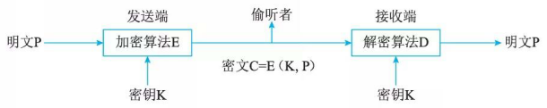
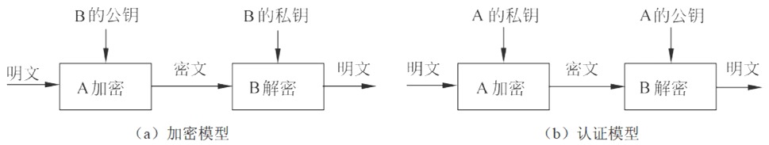

# 信息加解密技术

## 最佳实践

### 题目总结

- 💚 一个密码系统至少由明文、密文、加密算法、解密算法和密钥五个部分组成，而其安全性是由(  )决定的。

    - A. 加密算法
    - B. 解密算法
    - C. 加解密算法
    - D. 密钥

    答案: D

- 💚利用公开密钥算法进行数据加密时，采用的方式是(  )。

    - A．发送方用公开密钥加密，接收方用公开密钥解密
    - B．发送方用私有密钥加密，接收方用私有密钥解密
    - C．发送方用公开密钥加密，接收方用私有密钥解密
    - D．发送方用私有密钥加密，接收方用公开密钥解密

    答案: C

- 💛公司总部与分部之间需要传输大量数据，在保障数据安全的同时又要兼顾密钥算法效率，最合适的加密算法是(  )。

    - A．RC-5
    - B．RSA
    - C．ECC
    - D．MD5

    答案: A

- 💚以下wifi认证方式中，()使用了AES加密算法，安全性更高。
    - A. 开放式
    - B. WPA
    - C. WPA2
    - D. WEP

    - 答案：C

### 考察问

1. 信息加密:
    1. 对称加密:
    2. 非对称加密: `()`加密, `()`解密

3. 零碎知识
    1. 一个密码系统至少由明文、密文、加密算法、解密算法和密钥五个部分组成，而其安全性是由`()`决定的。

### 考察点

1. 信息加密:
    1. 对称加密:
    2. 非对称加密: `公钥`加密, `私钥`解密

3. 零碎知识
    1. 一个密码系统至少由明文、密文、加密算法、解密算法和密钥五个部分组成，而其安全性是由`密钥`决定的。

## 数据加密

研究数据加密的科学叫作密码学(Cryptography), 它又分为设计密码体制的密码编码学和破译密码的密码分析学。

一般的保密通信模型如图所示。

发送端把明文P用加密算法E和密钥K加密，变换成密文C, 即C=E(K, P); 接收端利用解密算法D和密钥K对C解密得到明文 P, 即P=D(K, C) 。里加／解密函数E和D是公开的，而密钥K(加解密函数的参数)是秘密的。

## 对称密钥加密算法

对称密钥加密算法中加密密钥和解密密钥是相同的，称为共享密钥算法或对称密钥算法。

1. DES(Data Encryption Standard)
2. IDEA(International Data Encryption Algorithm)
3. AES(Advanced Enc ryption  Standard)

## 非对称密钥加密算法

非对称加密算法中使用的加密密钥和解密密钥是不同的，称为不共享密钥算法或非对称密钥算法。非对称加密算法需要两个不同的密钥：公开密钥(Public key)和私有密钥(Private key)。公开密钥与私有密钥是一对，如果用公开密钥对数据进行加密，只有用对应的私有密钥才能解密；如果用私有密钥对数据进行加密，那么只有用对应的公开密钥才能解密。

1. 任何人的私钥只有自己拥有
2. 任何人的公钥可以明文公开发送

非对称加密体制模型：

1. 加密模型：明文经接受方的公钥由发送方加密成密文，再经接受方的私钥解密回明文。
2. 认证模型：明文经发送方的私钥由发送方加密成密文，再经发送方的公钥由接收方解密回明文。

优点是无须交换密钥，保密性较好。缺点是仅适用少量数据加密，加密速度慢、时间长。常用来加密对称加密算法的密钥。(数字信封的原理)常见非对称加密算法：RSA、DSA、ECC。

1976年，斯坦福大学的Diffie和Hellman提出了使用不同的密钥进行加密和解密的公钥加密算法。设$P$为明文，$C$为密文，$E$为公钥控制的加密算法，$D$为私钥控制的解密算法，这些参数满足下列3个条件：

1. $D(E(P)) = P$  
2. 不能由$E$导出$D$。  
3. 选择明文攻击(选择任意明文-密文对以确定未知的密钥)不能破解 $E$。  

加密时计算$C = E(P)$，解密时计算$P = D(C)$。加密和解密是互逆的。用公钥加密，私钥解密，可实现保密通信；用私钥加密，公钥解密，可实现数字签名。  

RSA(Rivest Shamir and Adleman)这是一种公钥加密算法，方法是按照下面的要求选择公钥和密钥：  

1. 选择两个大素数$p$和$q$(大于$10^{100}$ )。  
2. 令  
   $$n = pq, \quad z = (p - 1)(q - 1)$$  
3. 选择$d$与$z$互质。  
4. 选择$e$，使  
   $$ed \equiv 1 \pmod{z}$$  

明文$P$被分成$k$位的块，$k$是满足$2^k < n$的最大整数，于是有$0 \leq P < n$。加密时计算  
$$C = P^e \pmod{n}$$  
这样公钥为 $(e, n)$。解密时计算  
$$P = C^d \pmod{n}$$  
即私钥为 $(d, n)$。

用例子说明这个算法，设 $p = 3$，$q = 11$，$n = 33$，$z = 20$，$d = 7$，$e = 3$，$C = P^3 \pmod{33}$，$P = C^7 \pmod{33}$。则有

$$
\begin{align*}
C &= 2^3 \pmod{33}\\
&= 8 \pmod{33}\\
&= 8
\end{align*}
$$

$$
\begin{align*}
P &= 8^7 \pmod{33}\\
&= 2097152 \pmod{33}\\
&= 2
\end{align*}
$$

RSA 算法的安全性基于大素数分解的困难性。如果攻击者可以分解已知的 $n$，得到 $p$ 和 $q$，然后可得到 $z$，最后用 Euclid 算法，由 $e$ 和 $z$ 得到 $d$。然而要分解 200 位的数，需要 40 亿年；分解 500 位的数，则需要 $10^{25}$ 年。
