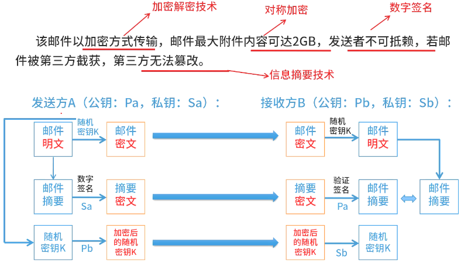
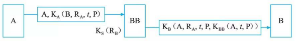
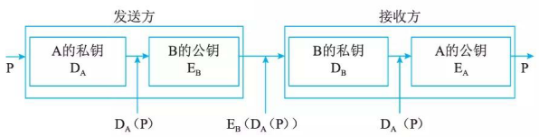
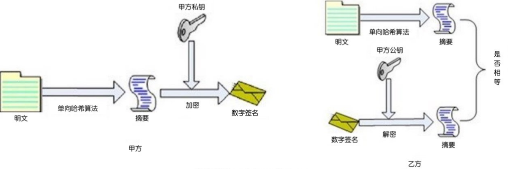

# 访问控制及数字签名技术

## 最佳实践

### 题目总结

- 请依据已学习的加密解密技术，以及信息摘要，数字签名技术解决以下问题：

请设计一个安全邮件传输系统，要求：该邮件以加密方式传输，邮件最大附件内容可达2GB，发送者不可抵赖，若邮件被第三方截获，第三方无法篡改。

- 💚以下属于访问控制的目标的是(  )。

    - A. 防止非法用户进入系统
    - B. 防止病毒进入系统
    - C. 防止内网用户访问外网
    - D. 防止外网用户访问内网

    答案: A

- 💚数字签名最常见的实现方法是建立在(  )的组合基础之上。

    - A．公钥密码体制和对称密码体制
    - B．对称密码体制和MD5摘要算法
    - C．公钥密码体制和单向安全散列函数算法
    - D．公证系统和MD4摘要算法

    答案: C

- 💚数字签名首先需要生成消息摘要，然后发送方用自己的私钥对报文摘要进行加密，接收方用发送方的公钥验证真伪。生成消息摘要的目的是(  )，对摘要进行加密的目的是(  )。

    - A．防止窃听  B．防止抵赖  C．防止篡改  D．防止重放
    - A．防止窃听  B．防止抵赖  C．防止篡改  D．防止重放

    答案: CB

- 💚在安全通信中，S将所发送的信息使用______进行数字签名，T收到该消息后可利用______验证该消息的真实性。

    - A. S的公钥
    - B. S的私钥
    - C. T的公钥
    - D. T的私钥

    - A. S的公钥
    - B. S的私钥
    - C. T的公钥
    - D. T的私钥

    答案：B A

### 考察问

- 数字签名最常见的实现方法是建立在`()`和`()`算法的组合基础之上。
- 数字签名
    1. 生成摘要: `()`作用信息, 目的是防`()`
    2. 签名摘要: `()`签名, `()`验证, 目的是防`()`

### 考察点

- 数字签名最常见的实现方法是建立在`公钥密码体制`和`单向安全散列函数`算法的组合基础之上。
- 数字签名
    1. 生成摘要: `单向散列函数`作用信息, 目的是防`篡改`✨摘要比起来比原文直接比较速度快
    2. 摘要签名: `私钥`签名, `公钥`验证, 目的是防`抵赖`

## 访问控制技术

### 访问控制的基本模型

访问控制包括3个要素，即主体、客体和控制策略。访问控制模型是一种从访问控制的角度出发，描述安全系统，建立安全模型的方法。

1. 主体(Subject):是可以对其他实体施加动作的主动实体，简记为S。有时我们也称为用户(User)或访问者(被授权使用计算机的人员)，记为U。主体的含义是广泛的，可以是用户所在的组织(以后我们称为用户组)、用户本身，也可是用户使用的计算机终端、卡机、手持终端(无线)等，甚至可以是应用服务程序程序或进程。

2. 客体(Object):是接受其他实体访间的被动实体，简记为O 。客体的概念也很广泛，凡是可以被操作的信息、资源、对象都可以认为是客体。在信息社会中，客体可以是信息、文件和记录等的集合体，也可以是网路上的硬件设施，无线通信中的终端，甚至一个客体可以包含另外一个客体。

3. 控制策略：是主体对客体的操作行为集和约束条件集，简记为KS。简单讲，控制策略是主体对客体的访问规则集，这个规则集直接定义了主体对可以的作用行为和客体对主体的条件约束。访问策略体现了一种授权行为，也就是客体对主体的权限允许，这种允许不超越规则集，由其给出。

访问控制的实现首先要考虑对合法用户进行验证，然后是对控制策略的选用与管理，最后要对没有非法用户或是越权操作进行管理。所以，访问控制包括认证、控制策略实现和审计 3方面的内容：

1. 认证。主体对客体的识别认证和客体对主体的检验认证。主体和客体的认证关系是相互的，当一个主体受到另外一个客体的访问时，这个主体也就变成了客体。一个实体可以在某一时刻是主体，而在另一时刻是客体，这取决于当前实体的功能是动作的执行者还是动作的被执行者。
2. 控制策略的具体实现。如何设定规则集合从而确保正常用户对信息资源的合法使用，既要防止非法用户，也要考虑敏感资源的泄露，对于合法用户而言，更不能越权行使控制策略所赋予其权利以外的功能。
3. 审计。审计的重要意义在于，比如客体的管理者即管理员有操作赋予权，他有可能滥用这一权利，这是无法在策略中加以约束的。必须对这些行为进行记录，从而达到威慑和保证访问控制正常实现的目的。

### 访问控制的实现技术

通常用户访问信息资源(文件或是数据库)，可能的行为有读、写和管理。为方便起见，用Read或是R表示读操作， Write或是W表示写操作，Own或是0表示管理操作。之所以将管理操作从读写中分离出来，是因为管理员也许会对控制规则本身或是文件的属性等做修改。

1. 访问控制矩阵

    访问控制矩阵(Access Control Matrix, ACM) 是通过矩阵形式表示访问控制规则和授权用户权限的方法。也就是说，对每个主体而言，都拥有对哪些客体的哪些访问权限；而对客体而言，又有哪些主体对他可以实施访问；将这种关联关系加以阐述，就形成了控制矩阵。其中，特权用户或特权用户组可以修改主体的访问控制权限。

    访问控制矩阵的实现很易于理解，但是查找和实现起来有一定的难度，而且，如果用户和文件系统要管理的文件很多，那么控制矩阵将会成几何级数增长。因为在大型系统中访问矩阵很大而且其中会有很多空值，所以目前使用的实现技术都不是保存整个访问矩阵，而是基千访问矩的行或者列来保存信息。

    | | file1 | file2 | file3 |
    | ---- | ---- | ---- | ---- |
    | User1 | rw |  | rw |
    | User2 | r | rwx | x |
    | User3 | x | r |  |

2. 访问控制表

    访问控制表ACLs(Access Control Lists) 是目前最流行、使用最多的访问控制实现技术。每个客体有一个访问控制表，是系统中每一个有权访问这个客体的主体的信息。这种实现技术实际上是按列保存访问矩阵。访问控制表提供了针对客体的方便的查询方法，通过查询一个客体的访问控制表，很容易决定某一个主体对该客体的当前访问权限。删除客体的访问权限也很方便，把该客体的访问控制表整个替换为空表即可。但是用访问控制表来查询一个主体对所有客体的所有访问权限是很困难的，必须查询系统中所有客体的访问控制表来获得其中每一个与该主体有关的信息。类似地，删除一个主体对所有客体的所有访问权限也必须查询所有客体的访问控制表，删除与该主体相关的信息。

3. 能力表

    能力表(Capabilities)对应于访问控制表，这种实现技术实际上是按行保存访问矩阵。每个主体有一个能力表(Capability Lists), 是该主体对系统中每一个客体的访问权限信息。使用能力表实现的访问控制系统可以很方便地查询某一个主体的所有访问权限，只需要遍历这个主体的能力表即可。然而查询对某一个客体具有访问权限的主体信息就很困难了，必须查询系统中所有主体的能力表。

4. 授权关系表

    授权关系表(Authorization Relations) 的每一行(或者说元组)就是访问矩阵中的一个非空元素，是某一个主体对应于某一个客体的访问权限信息。如果授权关系表按主体排序，查询时就可以得到能力表的效率；如果按客体排序，查询时就可以得到访问控制表的效率。

## 数字签名

与人们手写签名的作用一样，数字签名系统向通信双方提供服务，使得A向B发送签名的消息P, 以便达到以下几点：

1. B可以验证消息P确实来源于A
2. A以后不能否认发送过P
3. B不能编造或改变消息P

### 对称密钥签名

基于对称密钥的签名如图 4-6 所示。设 $\text{BB}$ 是 $\text{A}$ 和 $\text{B}$ 共同信赖的仲裁人。$K_A$ 和 $K_B$ 分别是 $\text{A}$ 和 $\text{B}$ 与 $\text{BB}$ 之间的密钥，而 $K_{\text{BB}}$ 是只有 $\text{BB}$ 掌握的密钥，$P$ 是 $\text{A}$ 发给 $\text{B}$ 的消息，$t$ 是时间戳。

$\text{BB}$ 解读了 $\text{A}$ 的报文 $\{\text{A}, K_A \left( \text{B}, R_A, t, P \right) \}$ 以后产生了一个签名的消息 $K_{\text{BB}} \left( \text{A}, t, P \right)$，并装配成发给 $\text{B}$ 的报文 $\{K_B \left( \text{A}, R_A, t, P, K_{\text{BB}} \left( \text{A}, t, P \right) \right) \}$。$\text{B}$ 可以解密该报文，阅读消息 $P$，并保留证据 $K_{\text{BB}} \left( \text{A}, t, P \right)$。由于 $\text{A}$ 和 $\text{B}$ 之间的通信是通过中间人 $\text{BB}$ 的，所以不必怀疑对方的身份。又由于证据 $K_{\text{BB}} \left( \text{A}, t, P \right)$ 的存在，$\text{A}$ 不能否认发送过消息 $P$，$\text{B}$ 也不能改变得到的消息 $P$，因为 $\text{BB}$ 仲裁时可能会当场解密 $K_{\text{BB}} (A, t, P)$，得到发送人、发送时间和原来的消息 $P$。

### 公开密钥签名

利用公钥加密算法的数字签名系统如图 4-7 所示。如果 $\text{A}$ 方否认，$\text{B}$ 可以拿出 $D_A (P)$，并用 $\text{A}$ 的公钥 $E_A$ 解密得到 $P$，从而证明 $P$ 是 $\text{A}$ 发送的。如果 $\text{B}$ 篡改消息 $P$，当 $\text{A}$ 要求 $\text{B}$ 出示原来的 $D_A (P)$ 时，$\text{B}$ 拿不出来。

在实践中，对长文件签名采用公钥密码算法效率太低。为了节约时间，数字签名协议经常和单向 Hash 函数一起使用，即并不对整个文件签名，只对文件的 Hash 值签名。基千消息摘要大大地提高了数字签名的计算速度。此外该协议还有其他优点：首先，签名和文件可以分开保存。其次，接收者对文件和签名的存储量要求大大降低。

2. 信息摘要的特点：无论数据多长，都会产生固定长度的信息摘要；任何不同的输入数据，都会产生不同的信息摘要；单向性，即只能由数据生成信息摘要，不能由信息摘要还原数据。常见的信息摘要算法：MD5(产生128位的输出)、SHA - 1(安全散列算法，产生160位的输出，安全性更高)。
3. 数字签名，用发送方的私钥签名，用发送方的公钥验证消息的真实性，发送方不可否认。

加密和签名对比:

1. 数字加密的主要过程

    1. 当信息发送者需要发送信息时，首先生成一个对称密钥，用该对称密钥加密要发送的报文；
    2. 信息发送者用信息接收者的公钥加密上述对称的密钥；
    3. 信息发送者将上述两个步骤的结果集合在一起传给信息接收者，称为数字信封；
    4. 信息接收者使用自己的私钥解密被加密的对称密钥，再用此对称密钥解密被发送方加密的密文，最后得到真正的原文。

2. 数字签名的主要过程

    1. 信息发送者使用一个单项散列函数(Hash函数)对信息生成信息摘要；
    2. 信息发送者使用自己的私钥签名信息摘要；
    3. 信息发送者把信息本身与已签名的信息摘要一起发送出去；
    4. 信息接受者使用与发送者相同的单项散列函数(Hash函数)对接收的信息生成新的信息摘要，再使用发送者的公钥对信息摘要进行验证，以确认信息发送者的身份和信息是否被修改过。

### 拓展: 数字签名原理

数字签名过程：

1. 将报文按双方约定的HASH算法计算得到一个固定位数的报文摘要。在数学上保证，只要改动报文中任何一位，重新计算出的报文摘要值就会与原先的值不相符。这样就保证了报文的不可更改性。
2. 将该报文摘要值用发送者的私人密钥加密即称数字签名，然后连同原报文和数字证书（包含公钥）一起发送给接收者。
3. 接收方收到数字签名后，用同样的HASH算法对报文计算摘要值，然后将数字签名用发送者的公钥进行解签，并与报文摘要值相比较，如相等则说明报文确实来自所称的发送者。

如图:

为了防止公钥在传输过程中被调包，需要证书中心（简称CA）为公钥做认证。证书中心用自己的私钥，对公钥和一些相关信息一起加密，生成"数字证书"（Digital Certificate），客户端用CA的公钥解开数字证书，从而确定公钥的真实性。
