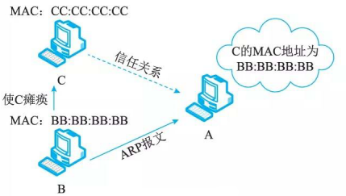
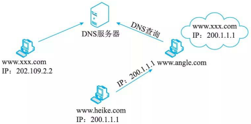

# 信息安全的抗攻击技术

## 密钥的选择

密钥在概念上被分成两大类：数据加密密钥(DK)和密钥加密密钥(K.K)。前者直接对数据进行操作，后者用于保护密钥，使之通过加密而安全传递。密钥生成需要考虑3个方面的因素。

1. 增大密钥空间(长度)
2. 选择强钥(类型多, 英文字母;数字;符号等)
3. 密钥的随机性(无规则)

## 拒绝服务攻击与防御

拒绝服务攻击DoS(Denial of Service) 是由人为或非人为发起的行动，使主机硬件、软件或者两者同时失去工作能力，使系统不可访问并因此拒绝合法的用户服务要求。拒绝服务攻击的主要企图是借助于网络系统或网络协议的缺陷和配置漏洞进行网络攻击，使网络拥塞、系统资源耗尽或者系统应用死锁，妨碍目标主机和网络系统对正常用户服务请求的及时响应，造成服务的性能受损甚至导致服务中断。目前常见的拒绝服务攻击为分布式拒绝服务攻击 DDoS (Distributed Denial of Service) 。

要对服务器实施拒绝服务攻击，有两种思路：

1. 服务器的缓冲区满，不接收新的请求。
2. 使用IP欺骗，迫使服务器把合法用户的连接复位，影响合法用户的连接。这也是DoS攻击实施的基本思想。

### 传统拒绝服务攻击的分类

内部用户可以通过长时间占用系统的内存、CPU处理时间使其他用户不能及时得到这些资源，而引起拒绝服务攻击；外部黑客也可以通过占用网络连接使其他用户得不到网络服务。

外部用户针对网络连接发动拒绝服务攻击主要有以下几种模式：

1. 消耗资源。计算机和网络需要一定的条件才能运行，如网络带宽、内存、磁盘空间、CPU 时间。攻击者利用系统资源有限这一特征，或者是大量地申请系统资源，并长时间地占用；或者是不断地向服务程序发请求，使系统忙于处理自己的请求，而无暇为其他用户提供服务。

2. 破坏或更改配置信息。计算机系统配置上的错误也可能造成拒绝服务攻击，尤其是服务程序的配置文件以及系统、用户的启动文件。这些文件一般只有该文件的属主才可以写入，如果权限设置有误，攻击者(包括已获得一般访问权的黑客与恶意的内部用户)可以修改配置
文件，从而改变系统向外提供服务的方式。

3. 物理破坏或改变网络部件。这种拒绝服务针对的是物理安全，一般来说，通过物理破坏或改变网络部件以达到拒绝服务的目的。其攻击的目标有：计算机、路由器、网络配线室、网络主干段、电源、冷却设备、其他的网络关键设备。

4. 利用服务程序中的处理错误使服务失效。这些攻击方法主要利用服务程序中的处理错误，发送一些该程序不能正确处理的数据包，引起该服务进入死循环。

### 分布式拒绝服务攻击DDoS

分布式拒绝服务DDoS攻击是对传统DoS攻击的发展，攻击者首先侵入并控制一些计算机，然后控制这些计算机同时向一个特定的目标发起拒绝服务攻击。

### 拒绝服务攻击的防御方法

1. 加强对数据包的特征识别，攻击者在传达攻击命令或发送攻击数据时，虽然都加入了伪装甚至加密，但是其数据包中还是有一些特征字符串。通过搜寻这些特征字符串，就可以确定攻击服务器和攻击者的位置。
2. 设置防火墙监视本地主机端口的使用情况。对本地主机中的敏感端口，如 UDP 31335 、UDP  27444 、TCP 27665 进行监视，如果发现这些端口处于监听状态，则系统很可能受到攻击。即使攻击者已经对端口的位置进行了一定的修改，但如果外部主机主动向网络内部高标号端口发起连接请求，则系统也很可能受到侵入。
3. 对通信数据量进行统计也可获得有关攻击系统的位置和数量信息。例如，在攻击之前，目标网络的域名服务器往往会接收到远远超过正常数量的反向和正向的地址查询。在攻击时，攻击数据的来源地址会发出超出正常极限的数据量。
4. 尽可能的修正已经发现的问题和系统漏洞。

## 欺骗攻击与防御

### ARP欺骗

ARP 原理：某机器 A 要向主机 C 发送报文，会查询本地的 ARP 缓存表，找到 C 的 IP 地址对应的 MAC 地址后，就会进行数据传输。如果未找到，则广播一个 ARP 请求报文(携带主机A 的 IP 地址 Ia-物理地址 AA:AA:AA:AA), 请求 IP 地址为 Ic 的主机 C 回答物理地址 Pc 。网上所有主机包括 C 都收到 ARP 请求，但只有主机 C 识别自己的 IP 地址，千是向 A 主机发回一个 ARP 响应报文。其中就包含有 C 的 MAC 地址 CC:CC:CC:CC, A 接收到 C 的应答后，就会更新本地的 ARP 缓存。接着使用这个 MAC 地址发送数据(由网卡附加 MAC 地址)。因此，本地高速缓存的这个 ARP 表是本地网络流通的基础，而且这个缓存是动态的。

ARP 协议并不只在发送了 ARP 请求才接收 ARP 应答。当计算机接收到 ARP 应答数据包的时候，就会对本地的 ARP 缓存进行更新，将应答中的 IP 和 MAC 地址存储在 ARP 缓存中。因此，局域网中的机器 B 首先攻击 C, 使 C 瘫痪，然后向 A 发送一个自己伪造的 ARP 应答，而如果这个应答是 B 冒充 C 伪造来的，即 IP 地址为 C 的 IP, 而 MAC 地址是 B 的，则当 A接收到 B 伪造的 ARP 应答后，就会更新本地的 ARP 缓存，这样在 A 看来 C的 IP 地址没有变，而它的 MAC 地址已经变成 B 的了。由于局域网的网络流通不是根据 IP 地址进行，而是按照MAC 地址进行传输。如此就造成 A 传送给 C 的数据实际上是传送到 B 。这就是一个简单的 ARP 欺骗，如图 4-9所示。

ARP 欺骗的防范措施:

1. 在 WinXP 下输入命令： arp -s gate-way-ip gate-way-mac 固化 ARP 表，阻止 ARP 欺骗。
2. 使用 ARP 服务器。通过该服务器查找自己的 ARP 转换表来响应其他机器的 ARP 广播。确保这台 ARP 服务器不被黑。
3. 采用双向绑定的方法解决并且防止 ARP 欺骗。
4. ARP 防护软件—ARP Guard 。通过系统底层核心驱动，无须安装其他任何第三方软件(如 WinPcap),以服务及进程并存的形式随系统启动并运行，不占用计算机系统资源。无须对计算机进行 IP 地址及 MAC 地址绑定，从而避免了大量且无效的工作量。也不用担心计算机会在重启后新建 ARP 缓存列表，因为此软件是以服务与进程相结合的形式存在于计算机中，当计算机重启后软件的防护功能也会随操作系统自动启动并工作。

### DNS欺骗

DNS 欺骗首先是冒充域名服务器，然后把查询的 IP 地址设为攻击者的 IP 地址，这样的话，用户上网就只能看到攻击者的主页，而不是用户想要取得的网站的主页了，这就是 DNS 欺骗的基本原理。

如图 4-10 所示， <www.xxx.com> 的 IP 地址为 202.109.2.2, 如果 <www.angel>. com 向 xxx.com的子域 DNS 服务器查询 <www.xxx.com> 的 IP 地址时， <www.heike.com> 冒充 DNS 向 <www.angel.com> 回复 <www.xxx.com> 的 IP 地址为 200. 1.1. 1, 这时 <www.angel>. com 就会把 200. 1.1. 1 当 <WWW.xxx.com> 的地址了。当 <www.angel>. com 连 <www.xxx.com> 时，就会转向那个虚假的 IP 地址了，这样对 <www.xxx.com> 来说，就算是给黑掉了。因为别人根本连接不上他的域名。

根据检测手段的不同，将其分为被动监听检测、虚假报文探测和交叉检查查询 3 种。

1. 被动监听检测。该检测手段是通过旁路监听的方式，捕获所有 DNS 请求和应答数据包，并为其建立一个请求应答映射表。如果在一定的时间间隔内，一个请求对应两个或两个以上结果不同的应答包，则怀疑受到了 DNS 欺骗攻击，因为 DNS 服务器不会给出多个结果不同的应答包，即使目标域名对应多个 IP 地址， DNS 服务器也会在一个 DNS 应答包中返回，只是有多个应答域 (Answer Section) 而已。
2. 虚假报文探测。该检测手段采用主动发送探测包的手段来检测网络内是否存在 DNS 欺骗攻击者。这种探测手段基于一个简单的假设：攻击者为了尽快地发出欺骗包，不会对域名服务器 IP 的有效性进行验证。这样如果向一个非 DNS 服务器发送请求包，正常来说不会收到任何应答，但是由千攻击者不会验证目标 IP 是否是合法 DNS 服务器，他会继续实施欺骗攻击，因此如果收到了应答包，则说明受到了攻击。
3. 交叉检查查询。所谓交叉检查即在客户端收到 DNS 应答包之后，向 DNS 服务器反向查询应答包中返回的 IP 地址所对应的 DNS 名字，如果二者一致说明没有受到攻击，否则说明被欺骗。

### IP欺骗

通过编程的方法可以随意改变发出的包的 IP 地址，但工作在传输层的 TCP 协议是一种相对可靠的协议，不会让黑客轻易得逞。由千 TCP 是面向连接的协议，所以在双方正式传输数据之前，需要用“三次握手”来建立一个值得信赖的连接。假设是 hosta 和 hostb 两台主机进行通信， hostb 首先发送带有 SYN 标志的数据段通知 hosta 建立 TCP 连接， TCP 的可靠性就是由数据包中的多位控制字来提供的，其中最重要的是数据序列 SYN 和数据确认标志 ACK 。 B 将TCP 报头中的 SYN 设为自己本次连接中的初始值 (ISN) 。假如想冒充 hostb 对 host a 进行攻击，就要先使 hostb 失去工作能力。也就是所谓的拒绝服务攻击，让 hostb 瘫痪。

虽然 IP 欺骗攻击有着相当难度，但这种攻击非常广泛，入侵往往由这里开始。预防这种攻击可以删除 UNIX 中所有的／etc/hosts.equiv 、 $HOME/.rhosts 文件，修改／etc/inetd.conf文件，使得 RPC 机制无法应用。另外，还可以通过设置防火墙过滤来自外部而信源地址却是内部 IP 的报文。

### 端口扫描

扫描端口有如下目的。

1. 判断目标主机上开放了哪些服务。
2. 判断目标主机的操作系统。

端口扫描原理:

端口是由计算机的通信协议 TCP/IP 协议定义的。 TCP/IP 协议规定，用 IP 地址和端口作为套接字，它代表 TCP 连接的一个连接端，一般称为 Socket。具体来说，就是用 [IP ：端口］来定位一台主机中的进程。端口扫描就是尝试与目标主机的某些端口建立连接，如果目标主机该端口有回复(见三次握手中的第二次)，则说明该端口开放，即为“活动端口“。

扫描原理分类:

1. 全 TCP 连接。这种扫描方法使用三次握手，与目标计算机建立标准的 TCP 连接。需要说明的是，这种古老的扫描方法很容易被目标主机记录。
2. 半打开式扫描 (SYN 扫描)。在这种扫描技术中，扫描主机自动向目标计算机的指定端口发送 SYN 数据段，表示发送建立连接请求。

    1. 如果目标计算机的回应TCP报文中 SYN=l, ACK=L 则说明该端口是活动的，接着扫描主机传送一个RST给目标主机拒绝建立TCP连接，从而导致三次握手的过程失败。
    2. 如果目标计算机的回应是RST, 则表示该端口为“死端口”，这种情况下，扫描主机不用做任何回应。

    由于扫描过程中，全连接尚未建立，所以大大降低了被目标计算机记录的可能性，并且加快了扫描的速度。

3. FIN 扫描。在前面介绍过的 TCP 报文中，有一个字段为 FIN, FIN 扫描则依靠发送FIN 来判断目标计算机的指定端口是否是活动的。

    发送一个 FIN=l 的 TCP 报文到一个关闭的端口时，该报文会被丢掉，并返回一个 RST 报文。但是，如果当 FIN 报文到一个活动的端口时，该报文只是被简单的丢掉，不会返回任何回应。
    从 FIN 扫描可以看出，这种扫描没有涉及任何 TCP 连接部分。因此，这种扫描比前两种都安全，可以称之为秘密扫描。

4. 第三方扫描。第三方扫描又称“代理扫描＂，这种扫描是利用第三方主机来代替入侵者进行扫描。这个第三方主机一般是入侵者通过入侵其他计算机而得到的，该“第三方”主机常被入侵者称之为“肉鸡”。这些“肉鸡”一般为安全防御系数极低的个人计算机。

### 强化TCP/IP堆栈以抵御拒绝服务攻击

#### 同步包风暴(SYN Flooding)

同步包风暴是当前最流行的 DoS (拒绝服务攻击)与 DDoS (分布式拒绝服务攻击)的方式之一，是应用最广泛的一种 DoS 攻击方式，它的原理虽然简单，但使用起来却十分有效。

问题出在 TCP 连接的三次握手中，假设一个用户向服务器发送了 SYN 报文后突然死机或掉线，那么服务器在发出 SYN+ ACK 应答报文后是无法收到客户端的 ACK 报文的(第三次握手无法完成)，这种情况下服务器端一般会重试(再次发送 SYN+ ACK 给客户端)，并等待一段时间后丢弃这个未完成的连接，这段时间的长度称为 SYN Timeout,一般来说这个时间是分钟的数量级(大约为 30 秒～ 2 分钟)；一个用户出现异常导致服务器的一个线程等待 1 分钟并不是什么很大的问题，但如果有一个恶意的攻击者大量模拟这种情况，服务器端将为了维护一个非常大的半连接列表而消耗非常多的资源蛐~数以万计的半连接，即使是简单的保存并遍历也会消耗非常多的 CPU 时间和内存，何况还要不断对这个列表中的 IP 进行 SYN+ACK 的重试。实际上如果服务器的 TCP/IP堆栈不够强大，最后的结果往往是堆栈溢出崩溃。即使服务器端的系统足够强大，服务器端也将忙于处理攻击者伪造的 TCP 连接请求而无暇理睬客户的正常请求(毕竟客户端的正常请求比率非常之小)，此时从正常客户的角度看来，服务器失去响应。这种情况被称作：服务器端受到了 SYN Flooding攻击。

如果攻击者盗用的是某台可达主机 X 的 IP 地址，由于主机 X 没有向主机 D 发送连接请求，所以当它收到来自 D 的 SYN 十 ACK 包时，会向 D 发送 RST 包，主机 D 会将该连接重置。因此，攻击者通常伪造主机 D 不可达的 IP 地址作为源地址。攻击者只要发送较少的、来源地址经过伪装，而且无法通过路由达到的 SYN 连接请求至目标主机提供 TCP 服务的端口，将目的主机的 TCP 缓存队列填满，就可以实施一次成功的攻击。实际情况下，攻击者往往会持续不断地发送 SYN 包，故称为 “SYN 洪水”。

可以通过修改注册表防御 SYN Flooding攻击，修改键值位于注册表项 HKEY_LOCAL_MACHINE\SYSTEM\CurrentControlSet\Services 的下面，如下表所示。

值名称 | 值(REG_DWORD)
| ---- | ---- |
| SynAttackProtect | 2 |
| TcpMaxPortsExhausted | 1 |
| TcpMaxHalfOpen | 500 |
| TcpMaxHalfOpenRetried | 400 |
| Tcp Max ConnectResponseRetransmissions | 2 |
| TcpMaxDataRetransmissions | 2 |
| EnablePMTUDiscovery | 0 |
| KeepAliveTime | 300000(5 分钟) |
| NoNameReleaseOnDemand | 1 |

🔒题目

1. SYN Flooding攻击的原理是______。

    - A. 利用TCP三次握手，恶意造成大量TCP半连接，耗尽服务器资源，导致系统拒绝服务
    - B. 操作系统在实现TCP／IP协议栈时，不能很好地处理TCP报文的序列号紊乱问题，导致系统崩溃
    - C. 操作系统在实现TCP／IP协议栈时，不能很好地处理IP分片包的重叠情况，导致系统崩溃
    - D. 操作系统协议栈在处理IP分片时，对于重组后超大的IP数据包不能很好地处理，导致缓存溢出而系统崩溃

    答案：A

#### ICMP攻击

ICMP 协议是 TCP/IP 协议集中的一个子协议，主要用于在主机与路由器之间传递控制信息，包括报告错误、交换受限控制和状态信息等。当遇到 IP 数据无法访问目标， IP 路由器无法按当前的传输速率转发数据包等情况时，会自动发送 ICMP 消息。我们可以通过 Ping命令发送ICMP 回应请求消息并记录收到 ICMP 回应的回复消息，通过这些消息来对网络或主机的故障提供参考依据。

ICMP 协议本身的特点决定了它非常容易被用千攻击网络上的路由器和主机。比如，前面提到的 “Pi ng of Death" 攻击就是利用操作系统规定的 ICMP 数据包的最大尺寸不超过 64KB 这一规定，达到使 TCP/IP 堆栈崩溃、主机死机的效果。

可以通过修改注册表防御 ICMP 攻击，修改键值位于注册表项HKLM\System \CurrentControlSet\Servi ces\AFD\Parameters 的下面，如表所示。

| 值名称            | 值(REG_DWORD) |
| ----------------- | --------------- |
| EnableICMPRedirect | 0               |

#### SNMP攻击

SNMP 是 TCP/IP网络中标准的管理协议，它允许网络中的各种设备和软件，包括交换机、路由器、防火墙、集线器、操作系统、服务器产品和部件等，能与管理软件通信，汇报其当前的行为和状态。但是， SNMP 还能被用千控制这些设备和产品，重定向通信流，改变通信数据包的优先级，甚至断开通信连接。总之，入侵者如果具备相应能力，就能完全接管你的网络。可以通过修改注册表项HKLM\Sy stem\CurrentControlSet\Services\ Tcpip\Parameters的键值防御 SNMP 攻击，如表所示。

| 值名称 | 值(REG_DWORD) |
| ---- | ---- |
| EnableDeadGWDetect | 0 |

### 系统涌洞扫描

系统漏洞扫描指对重要计算机信息系统进行检查，发现其中可能被黑客利用的漏洞。可以将系统漏洞扫描分为基于网络的扫描和基于主机的扫描这两种类型。

1. 基于网络的漏洞扫描

    一般来说，基于网络的漏洞扫描工具可以看作为一种涌洞信息收集工具，根据不同漏洞的特性，构造网络数据包，发给网络中的一个或多个目标服务器，以判断某个特定的漏洞是否存在。基于网络的漏洞扫描器，一般由以下几个方面组成。

2. 基于主机的漏洞扫描

    扫描目标系统漏洞的原理与基于网络的漏洞扫描器的原理类似，但是两者的体系结构不一样。基于主机的漏洞扫描器通常在目标系统上安装了一个代理(Agent)或者是服务( Servi ces), 以便能够访问所有的文件与进程，这也使得基千主机的漏洞扫描器能够扫描更多的漏洞。
