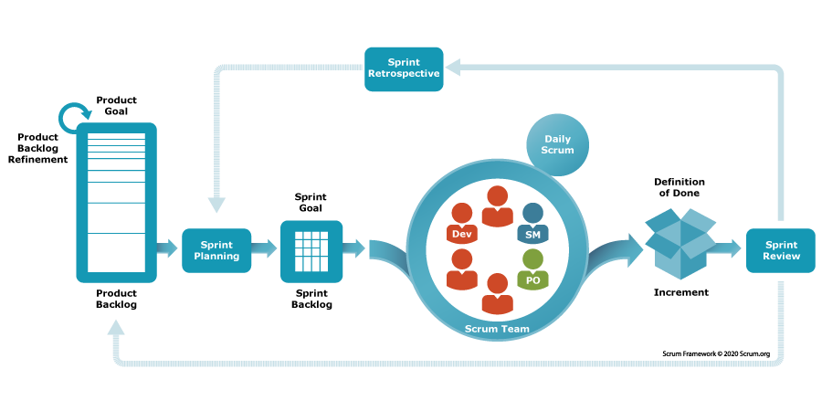

# scrum

## 最佳实践

### 题目总结

- 论文: 论敏捷开发方法及应用

### 考察问

- 论文: 论敏捷开发方法及应用
- 3个角色
    - `()`
    - `()`
    - `()`
- 3对工件
    - `()`-`()`
    - `()`-`()`
    - `()`-`()`
- Sprint4个事件
    - `()`
    - `()`
    - `()`
    - `()`

### 考察点

- 论文: 论敏捷开发方法及应用
- 3个角色
    - `敏捷教练(Scrum Master)`
    - `产品所有人(Product Owner)`
    - `开发人员(Developers)`
- 3对工件
    - `产品目标(Product Goal)`-`产品清单(Product Backlog)`
    - `冲刺目标(Product Goal)`-`冲刺清单(Sprint Backlog)`
    - `完成定义(Definition of Done)`-`增量(Increment)`
- Sprint4个事件
    - `冲刺计划会(Sprint Planning)`
    - `敏捷日会（Daily Scrum）`
    - `冲刺评审会(Sprint Review)`
    - `冲刺回顾会(Sprint Retrospective)`
- 5个价值观
    - 尊重(Respect): 每个人都有能力，都是独特的
    - 承诺(Commitment): 愿意对团队目标做出承诺
    - 专注(Focus): 专注冲刺的工作和团队的目标
    - 开放(Openness): 把项目中的一切开放给每个人看
    - 勇气(Courage): 有勇气做正确的事情并攻克难题
- 3大支柱
    - 透明性(Transparency)
    - 检验(Inspection)
    - 适应(Adaptation)

## 背景

一个段子看传统管理方法的缺陷，下面是猪和鸡打算合伙开店却不欢而散的一段对话：

- 鸡：猪猪，咱们合伙开个餐厅吧。
- 猪：行，不过餐厅卖什么呢？
- 鸡：就卖火腿和鸡蛋吧。
- 猪：！！！我要割肉你却只要下蛋，我不干。

段子其实体现的就是付出与收益不平等的问题，类比到项目开发中，鸡就是项目经理，猪就是项目成员。项目经理不参与具体的开发却往往掌握较大的权利，可以频繁且随意的更改需求或增加任务，使得需要全力投入的项目成员苦不堪言。不仅项目组达成不了共识，而且组员常常疲于奔命，应付了事。这样开发出的项目或许不会延期，但质量却得不到保证。

Scrum通过在项目经理和项目开发人员间引入一个称为“Scrum Master”的角色，有效地解决了项目经理在项目开发中权利过大的问题，增大了项目开发人员的话语权。同时Scrum还使用迭代的工作方式，一方面在组内进行定期总结，另一方面在组外进行定期汇报使得项目兼具效率、质量以及透明性。

Scrum来源于英式橄榄球(Rugby)的术语，意为“列阵争球”，即比赛中断后重新开球的仪式。透过纪律、自制与互相尊重，造就了一场共同参与而且公平竞争的比赛，这就是真正的英式橄榄球比赛。Scrum团队亦如此。

## Scrum定义

Scrum敏捷开发将复杂的产品开发工作分解成一系列的短期迭代，称为`Sprint`，每一个Sprint都是一个完整的产品开发周期，包含需求分析、设计、编码、测试到产品交付。

Scrum 的核心组成概念包括：

- 三种角色： 敏捷教练、产品拥有者、开发团队
- 四种活动： 敏捷规划、每日敏捷、冲刺审查、冲刺回顾
- 三对工件：产品目标-产品待办事项、冲刺目标-冲刺待办事项、完成定义-增量

Scrum需要Scrum Master营造一个环境，从而：

1. Product Owner 将解决复杂问题所需的工作整理成一份Product Backlog。
2. Scrum Team 在 一个 Sprint 期间将选择的工作转化为价值的Increment。
3. Scrum Team和利益攸关者检视结果并为下一个Sprint进行调整。
4. 重复

## Scrum3的大支柱

Scrum将4个正式事件组合在一起以在一个容器型事件 Sprint 中进行检视和适应。这些事件之所以起作用，是因为它们实现了基于经验主义的Scrum 的三个支柱：透明、检视和适应。

- 透明(Transparency)：涌现的过程和工作必须对执行工作的人员和接受工作的人员都是可见的。
- 检视(Inspection)：Scrum 工件和实现商定目标的进展必须经常地和勤勉地检视，以便发现潜在的不良的差异或问题
- 适应(Adaptation)：如果过程的任何方面超出可接受的范围或所得的产品不可接受，就必须对当下的过程或过程处理的内容加以调整。

## Scrum价值观

- 尊重(Respect): 每个人都有能力，都是独特的
- 承诺(Commitment): 愿意对团队目标做出承诺
- 专注(Focus): 专注冲刺的工作和团队的目标
- 开放(Openness): 把项目中的一切开放给每个人看
- 勇气(Courage): 有勇气做正确的事情并攻克难题

## Scrum Team的组成

Scrum Team由一名Scrum Master(敏捷教练)，一名Product Owner(产品所有人)和Developers(开发人员)组成。在Scrum Team中，没有子团队或层次结构。Scrum Team是具有凝聚力的专业团体，一次专注于一个目标，即Product Goal。

Scrum Team是跨职能的（cross-functional），这意味着团队成员具有在每个Sprint中创造价值而所需的全部技能。

Scrum Team规模足够小以保持灵活，同时足够大以便可以在一个Sprint中完成重要的工作，通常只有10人或更少。

## Scrum Master(敏捷教练)

Scrum Master是Scrum团队的教练和协调者，一般从项目开发人员中选择, 他们的主要职责包括：

- `确保`团队理解并`遵守`Scrum的`价值观`、规则和实践
- `协调`团队内部和外部的有效沟通
- 保护团队免受不必要的干扰，让团队能够专注于Sprint的目标
- 帮助解决阻碍团队进步的问题

### Product Owner(产品所有者)

产品拥有者是Scrum团队中代表利益相关者（如用户、客户、公司等）的角色，他们的主要职责包括：

- `定义``产品`的愿景和`目标`
- `管理`和优先排序产品`产品清单`（Product Backlog）
- 作为团队与外部利益相关者之间的桥梁
- 确定并接受产品增量

Product Owner是一个人，而不是一个委员会。在Product Backlog中，Product Owner可以代表许多利益攸关者的期望要求。那些想要改变Product Backlog的人可以尝试去说服Product Owner来做到这一点。

### Developers(开发者)

开发团队是Scrum 团队中负责开发工作的成员，他们的主要职责包括：

- 设计和`开发`高品质的冲刺`增量`
- 在Sprint规划会议中，与产品拥有者一起`确定``Sprint待办事项`（Sprint Backlog）和`Sprint目标`
- 参与每日Scrum会议，并进行进度报告和调整计划
- 在Sprint回顾会议中，检视并改进过去的Sprint

## Scrum 事件

### Sprint

Sprint是所有其他事件的容器。Sprint是Scrum的核心，在这里创意（idea）转化为价值。

它们是固定时长的事件，为期一个月或更短，以保持一致性。前一个Sprint结束后，下一个新的Sprint紧接着立即开始。

实现Product Goal所需的所有工作，包括Sprint Planning、Daily Scrum、Sprint Review和Sprint Retrospective，都发生在Sprint内。

### Sprint Planning(冲刺规划)

在每个冲刺（称为Sprint）开始时，团队会进行Sprint规划会议。在会议中，产品拥有者向团队解释哪些项目最优先，然后团队选择能在下一个Sprint中完成的工作项目，并规划如何完成这些工作。

🌰在Sprint规划会议上，产品拥有者可能会指出`使用者注册`和`使用者登录`是最优先实现的特性。开发团队会评估他们在即将开始的两周Sprint中能完成多少工作，并且讨论实现这些特性的具体方法。

Sprint Planning 处理以下话题：

1. 话题一：为什么这次 Sprint 有价值？

    Product Owner提议产品如何在当前的Sprint 中增加其价值和效用。然后，整个Scrum Team将共同制定一个 Sprint Goal，用以沟通当前Sprint对利益攸关者有价值的原因。必须在Sprint Planning结束之前最终确定 Sprint Goal。

2. 话题二：这次Sprint能完成什么？

    通过与Product Owner讨论，Developers从Product Backlog中选择一些条目，放入当前Sprint中。Scrum Team可以在此过程中精化这些Product Backlog条目，从而增加理解和信心。

    选择在Sprint中可以完成多少任务可能会有挑战。但是，Developers对他们以往的表现，他们在即将到来的Sprint内的产能以及对他们的Definition of Done了解得越多，他们对Sprint预测就越有信心。

3. 话题三：如何完成所选的工作？

    对于每个选定的Product Backlog条目，Developers都会规划必要的工作，以便创建符合Definition of Done的Increment。这通常是通过将Product Backlog条目分解为一天或更短的较小条目来完成的。Developers自行决定如何完成这一工作。

Sprint Goal、这次Sprint所选出的Product Backlog条目加上如何交付它们的计划称之为Sprint Backlog。

### Daily Scrum(敏捷日会)

✨每天都会进行一次短时间（通常不超过15分钟）的Scrum会议。在会议中，每个团队成员会回答三个问题：昨天我做了什么？今天我打算做什么？我遇到了哪些阻碍？

🌰在每天的Scrum会议中，一个团队成员可能会说：`昨天我完成了使用者注册介面的开发，今天我将进行测试，我遇到的问题是找不到适合的测试数据。`这样的讨论有助于团队找出阻碍并共同解决问题。

### Sprint Review(冲刺评审会)

在每个Sprint结束时，团队会进行一次Sprint审查会议。在会议中，团队会展示他们在Sprin 中完成的工作，并获得产品拥有者和其他利益相关者的反馈。

🌰在两周的Sprint结束时，开发团队在审查会议上展示他们完成的特性`使用者注册和登录功能`。产品拥有者和其他利益相关者会提供反馈，例如他们可能希望添加一个让使用者可以用社交媒体帐号登录的特性。

### Sprint Retrospective(冲刺回顾会)

在每个Sprint结束后，团队会进行一次回顾会议。在会议中，团队会反思在过去的Sprint中哪些地方做得好，哪些地方需要改进，并订出具体的改进计划。

在回顾会议上，团队可能会认为他们在解决测试数据问题上浪费了太多时间，并决定在下一个Sprint中提前准备好测试数据。他们也可能发现他们的估算有些过于乐观，并且在下一个Sprint中需要更实际一些。

## Scrum成果

每个成果都包含一个承诺，以确保它提供可增强透明度并聚焦于可度量进展的信息：

- 对于Product Backlog而言，它是 Product Goal。
- 对于Sprint Backlog 而言，它是 Sprint Goal 。
- 对于Increment而言，它是Definition of Done。

### Product Backlog(产品待办事项)

- 成果: Product Backlog

    这是一个有序的需求清单，由产品拥有者负责管理，反映了所有希望在产品中实现的功能和特性。产品待办事项是一个动态的清单，会根据产品需求的变化、市场状况的变化、业务优先级的变化等因素进行更新和调整。

- 承诺：Product Goal

    Product Goal 描述了产品的未来状态，可以作为Scrum Team 制定计划的目标。Product Goal在Product Backlog中。Product Backlog的其余部分涌现，用来定义“做什么”将实现Product Goal。

### Sprint Backlog(冲刺待办事项)

- 成果: Sprint Backlog

    这是一个由开发团队选择并承诺在当前Sprint中要完成的工作项目的清单。 Sprint待办事项也是一个动态的清单，会根据工作进展和团队对工作的理解的变化进行更新和调整。

- 承诺：Sprint Goal

    Sprint Goal是Sprint的单个目标。尽管Sprint Goal是Developers的承诺，但它为实现该目标所需的确切工作方面提供了灵活性。Sprint Goal还创造了连贯性和专注点，鼓励Scrum Team一起工作而不是分开独自行动。

### Product Increment(产品增量)

- 成果:

    这是在一个Sprint结束时，开发团队已完成的、可用的、并满足定义的已完成（Definition of Done）标准的产品功能。产品增量是Scrum框架的关键成果，它展示了团队在Sprint中的实际产出，并提供了一种测量团队成效的方式。

- 承诺： Definition of Done

    Definition of Done 是当 Increment 符合产品所需的质量度量标准时对其状态的正式描述。当一个Product Backlog条目符合Definition of Done时，就会产生一个 Increment。Definition of Done 通过使每一个人对作为Increment的一部分、什么样的工作算是已完成的工作有一个共同的理解来创建透明。如果一个Product Backlog条目不符合Definition of Done，那么它就不能发布，甚至不能在 Sprint Review中展示它。相反，它返回到Product Backlog中以供将来考虑。

## 参考

- <https://www.scrum.org/learning-series/what-is-scrum/what-is-scrum>
- <https://www.scrum.cn/agile-knowledge-library/scrum-guide-2020-chinese-version>
- <https://projectmanager.com.tw/%e5%b0%88%e6%a1%88%e7%ae%a1%e7%90%86/scrum/>
- <https://zhuanlan.zhihu.com/p/631459977>
- <https://www.scrum.cn/agile-knowledge-library/what-is-scrum-2>
