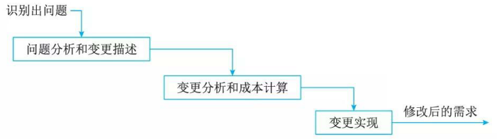
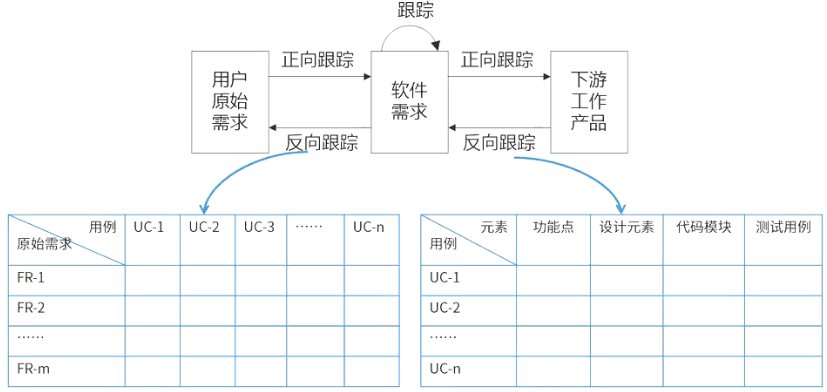

# 需求工程

## 最佳实践

### 题目总结

- 下列关于软件需求管理或需求开发的叙述中，正确的是(  )。

    - A. 所谓需求管理是指对需求开发的管理
    - B. 需求管理包括：需求获取、需求分析、需求定义和需求验证
    - C. 需求开发是将用户需求转化为应用系统成果的过程
    - D. 在需求管理中，要求维持对用户原始需求和所有产品构件需求的双向跟踪

    答案: D, 需求管理包括需求开发管理, 还包括需求变更管理、需求跟踪等其他活动. 软件需求开发的最终文档经过评审批准后，则定义了开发工作的需求基线 (Baseline) 。这个基线在客户和开发者之间构筑了计划产品功能需求和非功能需求的一个约定 (Agreement)。需求约定是需求开发和需求管理之间的桥梁。

- 通常有两种常用的需求定义方法：严格定义方法和原型方法。下述的各种假设条件中，“(  )”不适合使用严格定义方法进行需求定义。

    - A. 所有需求都能够被预先定义
    - B. 开发人员与用户之间能够准确而清晰地交流
    - C. 需求不能在系统开发前被完全准确地说明
    - D. 采用图形(或文字)充分体现最终系统

    答案: C

- 需求变更管理是需求管理的重要内容。需求变更管理的过程主要包括问题分析和变更描述、(  )、变更实现。具体来说，在关于需求变更管理的描述中，(  )是不正确的 。

    - A. 变更调研
    - B. 变更判定
    - C. 变更定义
    - D. 变更分析和成本计算

    - A. 需求变更要进行控制，严格防止因失控而导致项目混乱，出现重大风险
    - B. 需求变更对软件项目开发有利无弊
    - C. 需求变更通常按特定的流程进行
    - D. 在需求变更中，变更审批由CCB负责审批

    答案: DB

- (✨2025上24)下面关于需求跟踪的描述不正确的是( )。
    - A.正向跟踪是检查设计文档、代码、测试用例等工作成果是否都能在《产品需求规格说明书》中找到出处
    - B.需求跟踪的目的是建立与维护“需求 - 设计 - 编程 - 测试”之间的一致性
    - C.需求跟踪包括编制每个需求同系统元素之间的联系文档，这些元素包括别的需求、体系结构、其他设计部件、源代码模块、测试、帮助文件和文档等
    - D.正向跟踪和逆向跟踪合称为“双向跟踪”

    答案: A

- 软件需求开发的最终文档经过评审批准后，就定义了开发工作的(), 它在客户和开发者之间构筑了产品功能需求和非功能需求的一个()，是需求开发和需求管理之间的桥梁。
    - A. 需求基线
    - B. 需求标准
    - C. 需求用例
    - D. 需求分析

    - A. 需求用例
    - B. 需求管理标准
    - C. 需求约定
    - D. 需求变更

    答案：A C, 软件需求开发的最终文档经过评审批准后，则定义了开发工作的需求基线(baseline)。这个基线在客户和开发者之间构筑了计划产品功能需求和非功能需求的一个约定(agreement)。需求约定是需求开发和需求管理之间的桥梁。

### 考察问

1. 软件需求分类:✨`功能非功能约束`
    1. `()`: 用户利用这些功能来完成任务，满足业务需要。
    2. `()`: 软件质量属性(如可维护性、可靠性、效率等)
    3. `()`: 通常是对系统的一些约束说明，例如必须采用国有自主知识产权的数据库系统，必须运行在UNIX操作系统之下等

2. 需求工程✨`获取分析文档评审管理`

    1. 需求`()`：通过与用户的交流，对现有系统的观察及对任务进行分析，从而开发、捕获和修订用户的需求。
    2. 需求`()`：为系统建立一个概念模型，作为对需求的抽象描述，并尽可能多的捕获现实世界的语义。
    3. 形成`()`(或称之为需求文档化)：按照相关标准，生成需求模型的文档描述，用户原始需求书作为用户和开发者之间的一个协约，往往被作为合同的附件；软件需求描述规约作为后续软件系统开发的指南。
    4. 需求`()`与验证：以需求规格说明为输入，通过用户确认、复审会议、符号执行、模拟仿真或快速原型等途径与方法，确认和验证需求规格的完整性、正确性、一致性、可测试性和可行性，包含有效性检查、一致性检查、可行性检查和确认可验证性。
    5. 需求`()`：包括需求文档的追踪管理、变更控制、版本控制等管理性活动。

        1. 需求`()`:
            1. 过程: 描述->成本计算->实现
            2. 需求变更委员会
        2. 需求`()`
            1. 正向跟踪: `()` -> `()`
            2. 逆向跟踪: `()` -> `()`
            3. 双向跟踪: `()` <-> `()`

### 考察点

1. 软件需求分类:
    1. `功能需求`: 用户利用这些功能来完成任务，满足业务需要。
    2. `非功能需求`: 软件质量属性(如可维护性、可靠性、效率等)
    3. `设计约束`: 通常是对系统的一些约束说明，例如必须采用国有自主知识产权的数据库系统，必须运行在UNIX操作系统之下等

2. 需求工程

    1. 需求`获取`：通过与用户的交流，对现有系统的观察及对任务进行分析，从而开发、捕获和修订用户的需求。
    2. 需求`分析`：为系统建立一个概念模型，作为对需求的抽象描述，并尽可能多的捕获现实世界的语义。
    3. 形成`需求规格`(或称之为需求文档化)：按照相关标准，生成需求模型的文档描述，用户原始需求书作为用户和开发者之间的一个协约，往往被作为合同的附件；软件需求描述规约作为后续软件系统开发的指南。
    4. 需求`确认`与验证：以需求规格说明为输入，通过用户确认、复审会议、符号执行、模拟仿真或快速原型等途径与方法，确认和验证需求规格的完整性、正确性、一致性、可测试性和可行性，包含有效性检查、一致性检查、可行性检查和确认可验证性。
    5. 需求`管理`：包括需求文档的追踪管理、变更控制、版本控制等管理性活动。

        1. 需求`变更`:
            1. 过程: 描述->成本计算->实现
            2. 需求变更委员会
        2. 需求`追踪`
            1. 正向跟踪: `产品需求规格说明书` -> `工作成果`
            2. 逆向跟踪: `工作成果` -> `产品需求规格说明书`
            3. 双向跟踪: `产品需求规格说明书` <-> `工作成果`

3. 零碎知识

    1. 软件需求开发的最终文档经过评审批准后，就定义了开发工作的`需求基线`, 它在客户和开发者之间构筑了产品功能需求和非功能需求的一个`需求约定`，是需求开发和需求管理之间的桥梁。
    2. `需求跟踪`包括编制每个`需求`同`系统元素`之间的联系文档，这些元素包括其他需求、体系结构、其他设计部件、源代码模块、测试、帮助文件和文档等。

## 软件需求

软件需求是指用户对系统在功能、行为、性能、设计约束等方面的期望。

软件需求包括3个不同的层次：业务需求、用户需求和功能需求(也包括非功能需求)。

1. 业务需求(business requirement)反映了组织机构或客户对系统、产品高层次的目标要求。
2. 用户需求(user requirement)描述了用户使用产品必须要完成的任务，是用户对该软件产品的期望。这两种构成了用户原始需求文档的内容。按期望程度分(QFD)：

    1. 基本需求(明示，常规需求)
    2. 期望需求(隐含)
    3. 兴奋需求(多余)
3. 功能需求(functional requirement)定义了开发人员必须实现的软件功能，使得用户能完成他们的任务，从而满足业务需求。所

    1. 功能需求：也称为行为需求，规定了开发人员必须在系统中实现的软件功能，用户利用这些功能来完成任务，满足业务需要。
    2. 非功能需求：指系统必须具备的属性或品质，又可以细分为软件质量属性(如可维护性、可靠性、效率等)和其他非功能需求。
    3. 设计约束：也称为限制条件或补充规约，通常是对系统的一些约束说明，例如必须采用国有自主知识产权的数据库系统，必须运行在UNIX操作系统之下等。

需求工程(Requirement Engineering，RE)是指应用已证实有效的原理、方法，通过合适的工具和记号，系统地描述待开发系统及其行为特征和相关约束。需求工程的活动主要被划分为以下几个阶段。

1. 需求`获取`：通过与用户的交流，对现有系统的观察及对任务进行分析，从而开发、捕获和修订用户的需求。
2. 需求`分析`：为系统建立一个概念模型，作为对需求的抽象描述，并尽可能多的捕获现实世界的语义。
3. 形成需求`规格`(或称之为需求文档化)：按照相关标准，生成需求模型的文档描述，用户原始需求书作为用户和开发者之间的一个协约，往往被作为合同的附件；软件需求描述规约作为后续软件系统开发的指南。
4. 需求`确认`与验证：以需求规格说明为输入，通过用户确认、复审会议、符号执行、模拟仿真或快速原型等途径与方法，确认和验证需求规格的完整性、正确性、一致性、可测试性和可行性，包含有效性检查、一致性检查、可行性检查和确认可验证性。
5. 需求`管理`：包括需求文档的追踪管理、变更控制、版本控制等管理性活动。

## 需求获取

需求陈述的内容包括问题范围、功能需求、应用环境及假设条件等。此外，也包含涉及相关软件工程标准、技术方案、将来可能做的扩充及可维护性要求等方面的约束条件。总之，需求陈述应该阐明“做什么“，而不是“怎样做“。

### 需求获取的基本步骤

1. 开发高层的业务模型

    所谓应用领域，即目标系统的应用环境，如银行、电信公司等。如果系统分析员对该领域有了充分了解，就可以建立一个业务模型，描述用户的业务过程，确定用户的初始需求。然后通过迭代，更深入地了解应用领域，之后再对业模型进行改进。

2. 定义项目范围和高层需求

    在项目开始之前，应当在所有涉众(项目的利益攸关方)之间建立共同的项目愿景，即定义项目范围和高层需求。项目范围描述系统的边界以及系统与系统交互的参与者之间(包括组织、人、硬件设备、其他软件等)的关系。高层需求不涉及过多的细节，主要表示系统需求的概貌。常见的建模手段包括系统上下文图和系统顶层用例图等。

3. 识别用户角色和用户代表

    涉众不仅包括传统的用户、客户等，还包括测试人员、维护人员、市场人员等，他们也对项目有利益诉求。因此，首先确定所有涉众，然后挑选出每一类涉众并与他们一起工作。用户角色可以是人，也可以是与系统打交道的其他应用程序或硬件部件。如果是其他应用程序或硬件部件，则需要以熟悉这些系统或硬件的人员作为用户代表。

4. 获取具体的需求

    确定了项目范围和高层需求，并确定了所有涉众后，就需要获取每个涉众的具体、完整和详细的需求。

5. 确定目标系统的业务工作流

    具体到当前待开发的应用系统，确定系统的业务工作流和主要的业务规则。往往需要采取多重方法来获取所需的信息。

6. 需求整理与总结

    最后对上面步骤取得的需求资料进行整理和总结，确定对软件系统的综合要求，即软件的需求。并提出这些需求的实现条件，以及需求应达到的标准。这些需求包括功能需求、性能需求、环境需求、可靠性需求、安全保密需求、用户界面需求、资源使用需求、软件成本消耗与开发进度需求等。

### 需求获取方法

1. 用户面谈

    这是一种最为常见的需求获取方法，是理解用户需求的最有效方法。面谈过程需要认真的计划和准备；面谈之后，需要复查笔记的准确性、完整性和可理解性；把所收集的信息转化为适当的模型和文档；确定需要进一步澄清的问题。

2. 需求专题讨论会

    需求专题讨论会也是需求获取的一种有力技术。在短暂而紧凑的时间段内将相关涉众集中在一起集体讨论，与会者可以在应用需求上达成共识，对操作过程尽快取得统一的意见。参加会议的人员包括主待人、用户、技术人员、项目组人员。

3. 问卷调查

    问卷调查可用于确认假设和收集统计倾向数据。存在的问题是：相关问题不能事先决定，问题背后的假设对答案造成偏颇，难以探索一些新领域，难以继续用户的模糊响应。在完成最初的面谈和分析后，问卷调查可作为一项协作技术收到良好效果。

4. 现场观察

    该方法主要是通过观察用户实际执行业务的过程，来直观地了解业务的执行过程，全面了解需求细节。执行业务可能是手工操作，也可能是在原有的业务系统上执行。

5. 原型化方法

    在需求的早期，用户往往在具体的需求定义上存在很多不确定性，尤其是信息系统的人机交互界面和查询报表类的需求上。此时往往可以通过在需求阶段采用原型化方法，通过开发系统原型以及与用户的多次迭代反馈，解决在早期阶段需求不确定的问题，尤其是在人机界面等高度不确定的需求。

    需求的定义(拓展)

    - 严格定义法：
        - 所有需求都能够被预先定义。
        - 开发人员与用户之间能够准确而清晰地交流。
        - 采用图形/文字可以充分体现最终系统。
    - 原型法：
        - 并非所有的需求都能在开发前被准确的说明。
        - 项目参加者之间通常都存在交流上的困难。
        - 需要实际的、可供用户参与的系统模型。
        - 有合适的系统开发环境。
        - 反复是完全需要和值得提倡的，需求一旦确定，就应遵从严格的方法。

6. 头脑风暴法

    在一些新业务拓展的软件项目中，由千业务是新出现的，而且业务流程存在高度的不确定性，例如互联网上的新业务系统、 App等，一群人围绕该业务，发散思维，不断产生新的观点，参会者敞开思想使各种设想在相互碰撞中激起大脑的创造性风暴，从而确定具体的需求。

## 需求变更

需求变更的原因有很多种，可能是需求获取不完整，存在遗漏的需求；可能是对需求的理解产生了误差；也可能是业务变化导致了需求的变化等。需求变更管理过程如图所示。

### 变更控制过程

1. 问题分析和变更`描述`。当提出一份变更提议后，需要对该提议做进一步的问题分析，检查它的有效性，从而产生一个更明确的需求变更提议。
2. 变更分析和`成本`计算。当接受该变更提议后，需要对需求变更提议进行影响分析和评估。变更成本计算应该包括对该变更所引起的所有改动的成本，例如修改需求文档、相应的设计、实现等工作成本。一旦分析完成并且被确认，应该进行是否执行这一变更的决策。
3. 变更`实现`。当确定执行该变更后，需要根据该变更的影响范围，按照开发的过程模型执行相应的变更。在计划驱动过程模型中，往往需要回溯到需求分析阶段开始，重新作对应的需求分析、设计和实现等步骤；在敏捷开发模型中，往往会将需求变更纳入到下一次迭代的执行过程中。

### 变更控制过程

变更控制委员会(Change Control Board, CCB)负责裁定接受哪些变更。CCB由项目所涉及的多方成员共同组成，通常包括用户和实施方的决策人员。

## 需求追踪

需求跟踪提供了由需求到产品实现整个过程范围的明确查阅的能力。需求跟踪的目的是建立与维护“需求－设计－编程－测试”之间的一致性，确保所有的工作成果符合用户需求。

需求跟踪有两种方式：

1. 正向跟踪。检查《`产品需求规格说明书`》中的每个需求是否都能在后继`工作成果`中找到对应点。
2. 逆向跟踪。检查设计文档、代码、测试用例等`工作成果`是否都能在《`产品需求规格说明书`》中找到出处。

正向跟踪和逆向跟踪合称为“双向跟踪＂。不论采用何种跟踪方式，都要建立与维护需求跟踪矩阵(即表格)。需求跟踪矩阵保存了需求与后继工作成果的对应关系。

跟踪能力是优秀需求规格说明书的一个特征，为了实现可跟踪能力，必须统一地标识出每一个需求，以便能明确地进行查阅。

