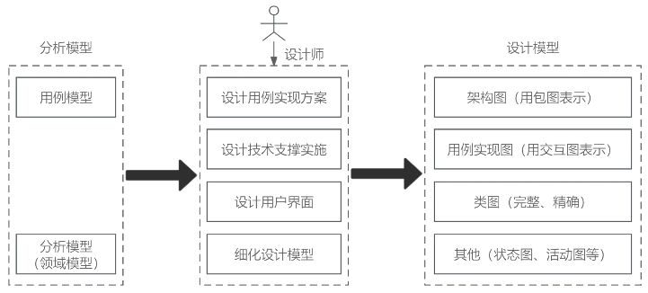

# 面向对象方法

## 最佳实践

### 题目总结

1. 采用面向对象方法开发学生成绩管理系统，学生的姓名、性别、出生日期、期末考试成绩、查看成绩操作均被(  )在学生对象中。系统中定义不同类，不同类的对象之间通过(  )进行通信。

    - A.封装
    - B.继承
    - C.多态
    - D.信息

    - A.继承
    - B.多态
    - C.消息
    - D.重载

    答案：A C

2. 采用面向对象方法进行某游戏设计，游戏中有野鸭、红头鸭等各种鸭子边游游戏水边呱呱叫，不同种类的鸭子具有不同颜色，设计鸭子类负责呱呱叫和游泳方法的实现，显示颜色设计为抽象方法，由野鸭和红头鸭各自具体实现，这一机制称为______。当给这些类型的一组不同对象发送同一显示颜色消息时，能实现各自显示自己不同颜色的结果，这种现象称为______原则。

    - A.继承
    - B.聚合
    - C.组合
    - D.多态

    - A.覆盖
    - B.重载
    - C.动态绑定
    - D.多态

    答案 :AD

3. 面向对象的分析模型主要由______、用例与用例图、领域概念模型构成；设计模型则包含以包图表示的软件体系结构图、以交互图表示的______, 完整精确的类图、针对复杂对象的状态图和描述流程化处理过程的______等。

    - A.业务活动图
    - B.顶层架构图
    - C.数据流模型
    - D.实体联系图

    - A.功能分解图
    - B.时序关系图
    - C.用例实现图
    - D.软件部署图

    - A.序列图
    - B.协作图
    - C.流程图
    - D.活动图

    答案：B C D

1. 在面向对象设计的原则中，(  )原则是指抽象不应该依赖于细节，细节应该依赖于抽象，即应针对接口编程，而不是针对实现编程。

    - A.开闭
    - B.里氏替换
    - C.最少知识
    - D.依赖倒置

    答案：D

2. 最少知识原则(也称为迪米特原则)是面向对象设计原则之一，指一个软件实体应当尽可能少地与其他实体发生相互作用。这样，当一个实体被修改时，就会尽可能少地影响其他的实体。下列叙述中，“(  )”不符最少知识原则。

    - A 在类的划分上，应当尽量创建松耦合的类
    - B 在类的设计上，只要有可能，一个类型应当设计成不变类
    - C 在类的结构设计上，每个类都应当尽可能提高对其属性和方法的访问权限
    - D 在对其他类的引用上，一个对象对其他对象的引用应当降到最低

    答案: C

### 考察问

- 面相对象编程的特点:
    1. `()`: 对外部隐藏实现的细节，只暴露公共的方法接口
    2. `()`: 在定义和实现一个类的时候, 把已实现的类所定义的内容作为自己的内容
    3. `()`: 不同的对象收到同一消息可以产生不同的行为结果

- OOD类的类型: ✨`()`
    1. `()`: 对应需求中的实体, 一定有属性, 不一定有操作
    2. `()`: 控制需求中的实体(动宾结构), 一定有操作, 不一定有属性
    3. `()`: 位于系统与外界的交接处，包括所有窗体、报表、打印机和扫描仪等硬件的接口，以及与其他系统的接口。参与者与用例交互. 即可有属性, 又可有操作

- 零碎知识点:
    1. `()`则包含以`()`图表示的软件体系结构图, 以`()`图表示的用例实现图, 完整精确的`()`图, 针对复杂对象的`()`图, 用以描述流程化处理过程的`()`图等。
    2. 最少知识原则：一个软件实体应当尽可能`()`的与其他实体发生`()`。
        - 在类的划分上，应当尽量创建`()`的类
        - 在类的设计上，只要有可能，一个类型应当设计成`()`类
        - 在类的结构设计上，每个类都应当尽可能`()`对其属性和方法的访问权限
        - 在对其他类的引用上，一个对象对其他对象的引用应当降到`()`

### 考察点

- 面相对象编程的特点:
    1. `封装`: 对外部隐藏实现的细节，只暴露公共的方法接口
    2. `继承`: 在定义和实现一个类的时候, 把已实现的类所定义的内容作为自己的内容
    3. `多态`: 不同的对象收到同一消息可以产生不同的行为结果

- OOD类的类型: ✨`体制界`
    1. `实体类`: 对应需求中的实体, 一定有属性, 不一定有操作
    2. `控制类`: 控制需求中的实体(动宾结构), 一定有操作, 不一定有属性
    3. `边界类`: 位于系统与外界的交接处，包括所有窗体、报表、打印机和扫描仪等硬件的接口，以及与其他系统的接口。参与者与用例交互. 即可有属性, 又可有操作

- 零碎知识点:
    1. `面向对象的设计模型`则包含以`包`图表示的软件体系结构图, 以`交互`图表示的用例实现图, 完整精确的`类`图, 针对复杂对象的`状态`图, 用以描述流程化处理过程的`活动`图等。
    2. 最少知识原则：一个软件实体应当尽可能`少`的与其他实体发生`相互作用`。
        - 在类的划分上，应当尽量创建`松耦合`的类
        - 在类的设计上，只要有可能，一个类型应当设计成`不变`类
        - 在类的结构设计上，每个类都应当尽可能`降低`对其属性和方法的访问权限
        - 在对其他类的引用上，一个对象对其他对象的引用应当降到`最低`

## 面相对象

面向对象 (Object-Oriented, OO) 的本质是主张参照人们认识一个现实系统的方法，完成分析、设计与实现一个软件系统，提倡用人类在现实生活中常用的思维方法来认识和理解描述客观事物，强调最终建立的系统能映射问题域，使得`系统中的对象`，以及对象之间的关系能够`如实`地反映问题域中`固有的事物`及其关系。

面向对象开发方法认为客观世界是由对象组成的，对象由属性和操作组成，对象可按其属性进行分类，对象之间的联系通过传递消息来实现，对象具有`封装性`、`继承性`和`多态性`。面向对象开发方法是以`用例驱动`的、以`体系结构`为中心的、`迭代的和渐增式`的开发过程，主要包括需求分析、系统分析、系统设计和系统实现4个阶段，但是，各个阶段的划分不像结构化开发方法那样清晰，而是在各个阶段之间迭代进行的。

## 面向对象分析

面向对象的分析方法 (Object-Oriented Analysis, OOA),OOA 所强调的是在系统调查资料的基础上，针对OO方法所需要的素材进行的归类分析和整理，而不是对管理业务现状和方法的分析。

OOA模型由5个层次(主题层、对象类层、结构层、属性层和服务层)和5个活动(标识对象类、标识结构、定义主题、定义属性和定义服务)组成。在这种方法中定义了两种对象类之间的结构，一种称为分类结构；另一种称为组装结构。分类结构就是所谓的一般与特殊的关系。组装结构则反映了对象之间的整体与部分的关系。

OOA 原则：

- 抽象。
- 封装。
- 继承。
- 分类。
- 聚合。
- 关联。
- 消息通信。
- 粒度控制。
- 行为分析。

## 面向对象设计

面向对象设计方法(Object-Oriented Design, OOD) 是OOA方法的延续，其基本思想包括抽象、封装和可扩展性，其中可扩展性主要通过继承和多态来实现。在OOD中，类可以分为3种类型：实体类、控制类和边界类。

1. 实体类

    实体类映射需求中的每个实体，是指实体类保存需要存储在永久存储体中的信息，例如，在线教育平台系统可以提取出学员类和课程类，它们都属千实体类。实体类通常都是永久性的，它们所具有的属性和关系是长期需要的。实体类对用户来说是最有意义的类，通常采用业务领域术语命名，一般来说是一个名词，在用例模型向领域模型的转化中，一个参与者一般对应于实体类。通常情况下，实体类`一定有属性，但不一定有操作`。

2. 控制类

    控制类是用千控制用例工作的类，一般是由动宾结构的短语(“动词＋名词”或“名词＋动词“)转化来的名词，例如，用例“身份验证”可以对应于一个控制类“身份验证器”，它提供了与身份验证相关的所有操作。通常情况下，控制类`没有属性，但一定有方法`。

3. 边界类

    边界类用于封装在用例内、外流动的信息或数据流。边界类位于系统与外界的交接处，包括所有窗体、报表、打印机和扫描仪等硬件的接口，以及与其他系统的接口。常见的边界类有窗口、通信协议、打印机接口、传感器和终端等。通常情况下，`边界类可以既有属性也有方法`。

## 面相对象分析与设计使用的工具图(拓展)

面向对象的分析模型主要由

- 顶层架构图
- 用例与用例图
- 领域概念模型构成

设计模型则包含

- 以包图表示的软件体系结构图
- 以交互图表示的用例实现图
- 完整精确的类图
- 针对复杂对象的状态图
- 用以描述流程化处理过程的活动图等。

## 面向对象设计的原则(拓展)

1. 单一职责原则：修改某个类的原因有且只有一个，让一个类只做一种责任。
2. 开放 - 封闭原则(open - close原则)：对扩展是开放的，对修改是封闭的。
3. 里氏替换原则：子类型必须能够替换父类型。
4. 依赖倒置原则：抽象不应该依赖于细节，细节应该依赖于抽象。即高层模块不应该依赖于底层模块，二者都应该依赖于抽象。
5. 接口分离原则：客户不应该依赖于它不需要的接口，类间的依赖关系应该建立在最小的接口上。
6. 迪米特法则(最少知识原则)：一个软件实体应当尽可能少的与其他实体发生相互作用。
7. 组合重用原则：要尽量使用组合，而不是继承关系达到重用的目的。
8. 重用发布等价原则：重用的粒度就是发布的粒度。
9. 共同封闭原则：包中的所有类对于同一类性质的变化应该是共同封闭的。一个变化若对一个包产生影响，则将对该包中的所有类产生影响，而对于其他的包不造成任何影响。
10. 共同重用原则：一个包中的所有类应该是共同重用的。如果重用了包中的一个类，那么就要重用包中的所有类。
11. 无环依赖原则：在包的依赖关系图中不允许存在环，即包之间的结构必须是一个直接的无环图形。
12. 稳定依赖原则：朝着稳定的方向进行依赖。
13. 稳定抽象原则：包的抽象程度应该和其稳定程度一致。

## 面向对象编程

面向对象程序设计(Object Oriented Programming, OOP) ＝对象＋类＋继承＋多态＋消息，其中核心概念是类和对象。OOP的基本特点有封装、继承和多态。

## 数据持久化与数据库

在面向对象开发方法中，对象只能存在于内存中，而内存不能永久保存数据，如果要永久保存对象的状态，需要进行对象的持久化(Persistence), 在多层软件设计和开发中，为了降低系统的耦合度，一般会引入持久层(Persistence Layer)

关系数据库仍旧是使用最为广泛的数据库，如DB2、Oracle、SQL Server等，因此，将对象待久化到关系数据库中，需要进行对象／关系的映射 (Object/Relation Mapping, ORM) 。主流的持久化技术框架包括Hibernate 、iBatis和JDO等。
