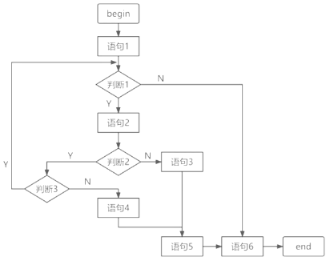

# 软件测试

## 最佳实践

### 题目总结

1. (✨2025上)关于白盒测试，下列说法正确的是( )。

    - A.条件覆盖不一定包含判定覆盖，判定覆盖也不一定包含条件覆盖
    - B.语句覆盖比判定覆盖强
    - C.条件覆盖比判定覆盖强
    - D.条件组合覆盖保证程序中所有可能的路径都至少遍历一次

    答案: A

2. 🟩软件测试是保障软件质量的重要手段。(  )是指被测试程序不在机器上运行，而采用人工监测和计算机辅助分析的手段对程序进行监测。(  )也称为功能测试，不考虑程序的内部结构和处理算法，只检查软件功能是否能按照要求正常使用。
    - A.静态测试
    - B.动态测试
    - C.黑盒测试
    - D.白盒测试

    - A.系统测试
    - B.集成测试
    - C.黑盒测试
    - D.白盒测试

    答案: A C

3. 🟩软件测试一般分为两个大类：动态测试和静态测试。前者通过运行程序发现错误，包括(  )等方法；后者采用人工和计算机辅助静态分析的手段对程序进行检测，包括(  )等方法。
    - A. 边界值分析、逻辑覆盖、基本路径
    - B. 桌面检查、逻辑覆盖、错误推测
    - C. 桌面检查、代码审查、代码走查
    - D. 错误推测、代码审查、基本路径

    - A. 边界值分析、逻辑覆盖、基本路径
    - B. 桌面检查、逻辑覆盖、错误推测
    - C. 桌面检查、代码审查、代码走查
    - D. 错误推测、代码审查、基本路径

    答案: AC

4. 🟩在白盒测试中，测试强度最高的是()。
    - A. 语句覆盖
    - B. 分支覆盖
    - C. 判定覆盖
    - D. 路径覆盖

    参考答案：D

5. 🟩在黑盒测试中，()方法最适合描述在多个逻辑条件取值组合所构成的复杂情况下，分别要执行哪些不同的动作。
    - A. 等价类
    - B. 边界类
    - C. 判定表
    - D. 因果图

    参考答案： C

6. 🟩关于白盒测试，下列说法正确的是( )。✨2025上

    - A.条件覆盖不一定包含判定覆盖，判定覆盖也不一定包含条件覆盖
    - B.语句覆盖比判定覆盖强
    - C.条件覆盖比判定覆盖强
    - D.条件组合覆盖保证程序中所有可能的路径都至少遍历一次

    答案: A

    逻辑覆盖是以程序内部逻辑为基础的测试技术，常用的有语句覆盖、判定覆盖、条件覆盖、条件判定覆盖、条件组合覆盖、路径覆盖等，发现错误的能力呈由弱至强的变化。
    - 语句覆盖每条语句至少执行一次。
    - 判定覆盖每个判定的每个分支至少执行一次。
    - 条件覆盖每个判定的每个条件应取到各种可能的值。
    - 判定/条件覆盖同时满足判定覆盖条件覆盖。
    - 条件组合覆盖每个判定中各条件的每一种组合至少出现一次。
    - 路径覆盖使程序中每一条可能的路径至少执行一次。

- (✨2025上25)在进行单元测试时( )是设计测试用例的依据。
    - A.需求分析文档
    - B.详细设计文档
    - C.项目计划文档
    - D.概要设计文档

    答案: B

- (✨2025上)软件测试中回归测试的目的是( )。

    - A.预防功能的不完善
    - B.确保修正过程中没有引入新的缺陷
    - C.辅助系统测试
    - D.辅助单元测试

    答案: B

1. 🟩()的目的是测试软件变更之后，变更部分的正确性和对变更需求的符合性，以及软件原有的、正确的功能、性能和其它规定的要求的不损害性。

    - A. 验收测试
    - B. Alpha 测试
    - C. Beta 测试
    - D. 回归测试

    - 答案： D

2. 🟩自动化测试工具主要使用脚本技术来生成测试用例，其中，()是录制手工测试的测试用例时得到的脚本；()是将测试输入存储在独立的数据文件中，而不是在脚本中。

- A.线性脚本  B.结构化脚本  C.数据驱动脚本  D.共享脚本
- A.线性脚本  B.结构化脚本  C.数据驱动脚本  D.共享脚本

    - 答案: AC

1. 🟩系统测试的依据是(  )。

    - A.软件详细设计说明书
    - B.软件需求规格说明书
    - C.软件概要设计说明书
    - D.软件用户手册

    答案：B

2. 🟥在单元测试中，(  )。

    - A. 驱动模块用来调用被测模块，自顶向下的单元测试中不需要另外编写驱动模块
    - B. 桩模块用来模拟被测模块所调用的子模块，自顶向下的单元测试中不需要另外编写桩模块
    - C. 驱动模块用来模拟被测模块所调用的子模块，自底向上的单元测试中不需要另外编写驱动模块
    - D. 桩模块用来调用被测模块，自底向上的单元测试中不需要另外编写桩模块

    答案: A

3. 🟩软件性能测试有多种不同类型的测试方法，其中，(  )用于测试在限定的系统下考查软件系统极限运行的情况，(  )可用于测试系统同时处理的在线最大用户数量。

    - A 强度测试  B 负载测试  C 压力测试  D 容量测试
    - A 强度测试  B 负载测试  C 压力测试  D 容量测试

    答案: AD

4. 🟩以下关于软件测试说法错误的是()。

    - A. 每个测试用例都必须定义预期的输出或结果
    - B. 测试用例中不仅要说明合法有效的输入条件，还应该描述那些不期望的、非法的输入条件
    - C. 软件测试可以证明被测对象的正确性
    - D. 80%软件错误都可以在大概20%模块中找到根源

    参考答案：C

🔒题目

1. 以下流程图中，至少需要______个测试用例才能覆盖所有路径。采用McCabe方法计算程序复杂度为______。
    

    - A.3 
    - B.4 
    - C.5 
    - D.6
    
    - A.2 
    - B.3 
    - C.4 
    - D.5

    答案：B C, 图中所有可能的路径为4条。程序图G的环路复杂度等于封闭区域数+1，即3+1=4。

🔒问题
2. 软件复杂性度量中，()可以反映原代码结构的复杂度。

    - A. 模块数  
    - B. 环路数  
    - C. 用户数  
    - D. 对象数

    参考答案： B

### 考察问

- 测试常用分类
    - 阶段划分
        1. `()`测试：针对程序源代码进行测试（单元：最小独立功能代码段）
        2. `()`测试：针对模块与模块之间的接口进行测试, 又称接口测试。
        3. `()`测试：针对系统整体功能+兼容+文档（说明、安装文档）
    - 代码可见度
        - `()`测试：针对程序源代码进行测试（阶段划分->`()`测试）, 如无界面，直接对开发实现的登录功能的源代码进行测试
        - `()`测试：针对接口测试（阶段划分->`()`测试）, 如无界面，通过工具/代码实现登录功能测试
        - `()`测试：主要针对功能（阶段划分->`()`测试）, 如登录界面输入账号、密码、验证码，点击登录测试
    - 其他分类
        - `()`测试：对核心功能的验证作用, 保障提测内容具备可测性
        - `()`测试: 指修改了旧代码后，重新进行测试以确认修改没有引入新的错误或导致其他代码产生错误。

- 白盒测试
    - 静态白盒测试
        - `()`的方法
            - `()`检查（程序员自己检查）
            - `()`审查（审查小组通过读程序和对照错误检查表进行检查）
            - `()`（审查小组需要准备有代表性的测试用例沿程序逻辑运行）
        - `()`分析法
            - 通过生成各种`()`，来帮助对源程序的静态分析
            - `()`主要用于确定在源程序中是否有某类错误或“危险”结构。
    - 动态白盒测试
        - `()`法
            - 语句覆盖（SC）
            - 判定覆盖（DC）
            - 条件覆盖（CC）
            - 判定-条件覆盖（CDC）
            - 条件组合覆盖（MCC）
            - 路径覆盖
        - `()`测试法

            如果某一程序的每一个独立路径都被执行到，那么就可以认为程序中的每个语句都已经检验过了，即达到了语句覆盖。这种测试方法就是通常所说的基路径测试法。

            基本路径测试法的4个步骤:
            - 以详细设计或源代码作为基础，绘制程序的控制流图。
            - 计算得到的控制流图G的环路复杂性V（G）。
            - 确定独立路径的集合。通过程序控制流图导出基本路径集，列出程序的独立路径。所谓独立路径，是指至少包含一条新边的路径，也就是包含一些前面的路径未包含的语句，当所有的语句都包含了，基路径集就够了。（线性无关路径）
            - 设计测试用例，确保基本路径集中每条路径的执行。

- 黑盒测试
    - `()`类
    - `()`分析法
    - `()`方法
    - `()`法(判定表)

### 考察点

- 测试常用分类
    - 阶段划分
        1. `单元`测试：针对程序源代码进行测试（单元：最小独立功能代码段）
        2. `集成`测试：针对模块与模块之间的接口进行测试, 又称接口测试。
        3. `系统`测试：针对系统整体功能+兼容+文档（说明、安装文档）
    - 代码可见度
        - `白盒`测试：针对程序源代码进行测试（阶段划分->`单元`测试）, 如无界面，直接对开发实现的登录功能的源代码进行测试
        - `灰盒`测试：针对接口测试（阶段划分->`集成`测试）, 如无界面，通过工具/代码实现登录功能测试
        - `黑盒`测试：主要针对功能（阶段划分->`系统`测试）, 如登录界面输入账号、密码、验证码，点击登录测试
    - 其他分类
        - `冒烟`测试：对核心功能的验证作用, 保障提测内容具备可测性
        - `回归`测试: 指修改了旧代码后，重新进行测试以确认修改没有引入新的错误或导致其他代码产生错误。

- 白盒测试
    - 静态白盒测试
        - `代码审查`的方法
            - `桌面`检查（程序员自己检查）
            - `代码`审查（审查小组通过读程序和对照错误检查表进行检查）
            - `走查`（审查小组需要准备有代表性的测试用例沿程序逻辑运行）
        - `静态结构`分析法
            - 通过生成各种`图表`，来帮助对源程序的静态分析
            - `静态错误分析`主要用于确定在源程序中是否有某类错误或“危险”结构。
    - 动态白盒测试
        - `逻辑覆盖`法
            - 语句覆盖（SC）
            - 判定覆盖（DC）
            - 条件覆盖（CC）
            - 判定-条件覆盖（CDC）
            - 条件组合覆盖（MCC）
            - 路径覆盖
        - `基本路径`测试法

            如果某一程序的每一个独立路径都被执行到，那么就可以认为程序中的每个语句都已经检验过了，即达到了语句覆盖。这种测试方法就是通常所说的基路径测试法。

            基本路径测试法的4个步骤:
            - 以详细设计或源代码作为基础，绘制程序的控制流图。
            - 计算得到的控制流图G的环路复杂性V（G）。
            - 确定独立路径的集合。通过程序控制流图导出基本路径集，列出程序的独立路径。所谓独立路径，是指至少包含一条新边的路径，也就是包含一些前面的路径未包含的语句，当所有的语句都包含了，基路径集就够了。（线性无关路径）
            - 设计测试用例，确保基本路径集中每条路径的执行。

- 黑盒测试
    - `划分等价`类
    - `边界值`分析法
    - `错误推测`方法
    - `因果图`法(判定表)

## 参考

软件测试目的在于检验它是否满足规定的需求或弄清预期结果与实际结果之间的差别。

## 测试方法

- 以测试过程中程序执行状态为依据可分为静态测试(StaticTesting, ST) 和动态测试(Dynamic Testing, DT)

    - 静态测试。静态测试是被测程序不运行，只依靠分析或检查源程序的语句、结构、过程等来检查程序是否有错误。即通过对软件的需求规格说明书、设计说明书以及源程序做结构分析和流程图分析，从而来找出错误。例如不匹配的参数，未定义的变量等。

    - 动态测试。动态测试与静态测试相对应，是通过运行被测试程序，对得到的运行结果与预期的结果进行比较分析，同时分析运行效率和健壮性能等。这种方法可简单分为3个步骤：构造测试实例、执行程序以及分析结果。

- 以具体实现算法细节和系统内部结构的相关情况为根据可分黑盒测试、白盒测试和灰盒测试3类

    - 黑盒测试。黑盒测试将被测程序看成是一个黑盒，工作人员在不考虑任何程序内部结构和特性的条件下，根据需求规格说明书设计测试实例，并检查程序的功能是否能够按照规范说明准确无误的运行。其主要是对软件界面和软件功能进行测试。对于黑盒测试行为必须加以量化才能够有效的保证软件的质量。

    - 白盒测试。白盒测试主要是借助程序内部的逻辑和相关信息，通过检测内部动作是否按照设计规格说明书的设定进行，检查每一条通路能否正常工作。白盒测试是从程序结构方面出发对测试用例进行设计。主要用于检查各个逻辑结构是否合理，对应的模块独立路径是否正常以及内部结构是否有效。
        - 常用的白盒测试法有控制流分析、数据流分析、路径分析、程序变异等。
        - 根据测试用例的覆盖程度，分为语句覆盖、判定覆盖、分支覆盖和路径覆盖等。

            逻辑覆盖是以程序内部逻辑为基础的测试技术，常用的有语句覆盖、判定覆盖、条件覆盖、条件判定覆盖、条件组合覆盖、路径覆盖等，发现错误的能力由弱到强的变化。
            - 语句覆盖：每条语句至少执行一次。
            - 判定覆盖：每个判定的每个分支至少执行一次。
            - 条件覆盖：每个判定的每个条件应取到各种可能的值。
            - 判定/条件覆盖：同时满足判定覆盖条件覆盖。
            - 条件组合覆盖：每个判定中各条件的每一种组合至少出现一次。
            - 路径覆盖：使程序中每一条可能的路径至少执行一次。

    - 灰盒测试。灰盒测试介于黑盒与白盒测试之间。灰盒测试除了重视输出相对千输入的正确性，也看重其内部的程序逻辑。但是，它不可能像白盒测试那样详细和完整。它只是简单地靠一些象征性的现象或标志来判断其内部的运行情况，因此在内部结果出现错误，但输出结果正确的清况下可以采取灰盒测试方法。因为在此情况下灰盒比白盒高效，比黑盒适用性广的优势就凸显出来了。

- 从程序执行的方式来分类，可分为人工测试 (Manual Testing,  MT) 和自动化测试 (Automatic Testing,  AT) 。

    - 自动化测试。自动化测试就是软件测试的自动化，即在预先设定的条件下自动运行被测程序，并分析运行结果。总的来说，这种测试方法就是将以人驱动的测试行为转化为机器执行的一种过程。

## 测试阶段

从阶段上划分，软件测试可以分为单元测试、集成测试和系统测试，系统测试中又包含了多种不同的测试种类，例如功能测试、性能测试、验收测试、压力测试等。

### 单元测试

由于模块的规模不大，功能单一，结构较简单，且测试人员可通过阅读源程序清楚知道其逻辑结构，首先应通过静态测试方法，比如静态分析、代码审查等，对该模块的源程序进行分析，按照模块的程序设计的控制流程图，以满足软件覆盖率要求的逻辑测试要求。另外，也可采用黑盒测试方法提出一组基本的测试用例，再用白盒测试方法进行验证。若用黑盒测试方法所产生的测试用例满足不了软件的覆盖要求，可采用白盒法增补出新的测试用例，以满足所需的覆盖标准。

### 集成测试

集成测试通常要对已经严格按照程序设计要求和标准组装起来的模块同时进行测试，明确该程序结构组装的正确性，发现和接口有关的问题。在这一阶段，一般采用白盒测试和黑盒测试结合的方法进行测试，验证这一阶段设计的合理性以及需求功能的实现性。

### 系统测试

一般情况下，系统测试采用黑盒测试，以此来检查该系统是否符合软件需求。本阶段的主要测试内容包括功能测试、性能测试、健壮性测试、安装或反安装测试、用户界面测试、压力测试、可靠性及安全性测试等。为了有效保证这一阶段测试的客观性，必须由独立的测试小组来进行相关的系统测试。另外，系统测试过程较为复杂，由于在系统测试阶段不断变更需求造成功能的删除或增加，从而使程序不断出现相应的更改，而程序在更改后可能会出现新的问题，或者原本没有问题的功能由于更改导致出现问题。所以，测试人员必须进行多轮回归测试。

1. 性能测试

    负载测试和压力测试都属于性能测试，两者可以结合进行。通过负载测试，确定在各种工作负载下系统的性能，目标是测试当负载逐渐增加时，系统各项性能指标的变化情况。压力测试是通过确定一个系统的瓶颈或者不能接受的性能点，来获得系统能提供的最大服务级别的测试。

2. 验收测试

    验收测试是最后一个阶段的测试，是软件产品投入正式交付前的测试工作。和系统测试相比，验收测试是要满足用户需求或者与用户签订的合同(包括技术协议、技术协调单以及各个阶段用户参与的评审意见等)的各项要求，此外系统测试是软件开发过程中一项工作，而验收测试是由用户对要交付软件开展的一种测试工作。

    通过了验收测试，该产品就可进行发布。但是，在实际交付给用户之后，开发人员是无法预测该软件用户在实际运用过程中是如何使用该程序的，所以从用户的角度出发，测试人员还应进行 Alpha 测试或 Beta 测试。 Alpha 测试是在软件开发环境下由用户进行的测试，或者模拟实际操作环境进而进行的测试。 Alpha 测试主要是对软件产品的功能、局域化、界面、可使用性以及性能等等方面进行评价。而 Beta 测试是在实际环境中由多个用户对其进行测试，并将在测试过程中发现的错误有效反馈给软件开发者。

### 其他测试

1. AB 测试是为 Web 或 App界面或流程制作两个(A/B)或多个(A/Bin) 版本，在同一时间维度，分别让组成成分相同(相似)的访客群组(目标人群)随机的访问这些版本，收集各群组的用户体验数据和业务数据，最后分析、评估出最好版本，正式采用。

2. Web 测试是软件测试的一部分，是针对 Web 应用的一类测试。由千 Web 具有分布、异构、并发和平台无关的特性，因而它的测试要比普通程序复杂得多，包含的测试种类也非常多。

3. 链接测试。链接测试可分为 3 个方面。首先，测试所有链接是否按指示的那样确实链接到了该链接的页面；其次，测试所链接的页面是否存在；最后，保证 Web 应用系统上没有孤立的页面。

4. 表单测试。当用户使用表单进行用户注册、登录、信息提交等操作时，必须测试提交操作的完整性，从而校验提交给服务器的信息的正确性。如果使用默认值，还要检验默认值的正确性。如果表单只能接受指定的某些值，则也要进行测试。