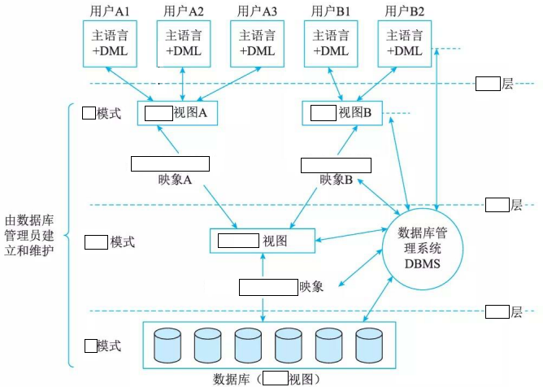
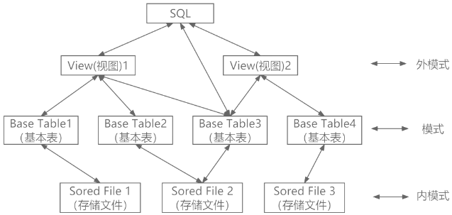

# 1数据库基本概念

## 最佳实践

### 题目总结

- 采用三级模式结构的数据库系统中，如果对一个表创建聚簇索引，那么改变的是数据库的______。

    - A. 外模式
    - B. 模式
    - C. 内模式
    - D. 用户模式

    答案：C

- (✨2025上)40, 41.数据库三级模式中，( )描述了记录的类型和记录间的联系、操作、数据的完整性和安全性，( )是用户需要使用的部分数据的描述。
    - A.概念模式
    - B.外模式
    - C.内模式
    - D.存储模式
    - A.概念模式
    - B.存储模式
    - C.外模式
    - D.内模式

    答案: AC

- 在数据库系统中，数据库的视图、基本表和存储文件的结构分别与( )对应；数据的物理独立性和数据的逻辑独立性是分别通过修改( )来完成的。

    - A.模式、外模式、内模式
    - B.模式、内模式、外模式
    - C.外模式、模式、内模式
    - D.外模式、内模式、模式

    - A.模式与内模式之间的映像、外模式与模式之间的映像
    - B.外模式与内模式之间的映像、外模式与模式之间的映像
    - C.外模式与模式之间的映像、模式与内模式之间的映像
    - D.外模式与内模式之间的映像、模式与内模式之间的映像

    答案: CA

- (✨2025上)56.数据库内模式描述的内容是( )。
    - A.存储结构
    - B.索引
    - C.物理存储
    - D.数据类型

    答案: C

- 数据库的安全机制中，通过提供(  )第三方开发人员调用进行数据更新 ，从而保证数据库的关系模式不被第三方所获取。

    - A. 索引
    - B. 视图
    - C. 存储过程
    - D. 触发器

    答案: C. 视图不能进行数据更新.

- 某软件企业开发一套类似于淘宝网上商城业务的电子商务网站，该系统涉及多种用户角色，包括购物用户、商铺管理员、系统管理员等。

    在数据库设计中，该系统数据库的核心关系包括：

    - 产品(产品编码，产品名称，产品价格，库存数量，商铺编码)
    - 商铺(商铺编码，商铺名称，商铺地址，商铺邮箱，服务电话)
    - 用户(用户编码，用户名，用户地址，联系电话)
    - 订单(订单编码，订单日期，用户编码，商铺编码，产品编码，产品数量，订单总价)

    不同用户角色有不同的数据需求，为此该软件企业在基本数据库关系模式的基础上，定制了许多视图。其中，有很多视图涉及到多表关联和聚集函数运算。

    1. (8分)商铺用户需要实时统计本商铺的货物数量和销售情况，以便及时补货，或者为商铺调整销售策略。为此专门设计了可实时查看当天商铺中货物销售情况和存货情况的视图，商铺产品销售情况日报表(商铺编码，产品编码，日销售产品数量，库存数量，日期)。数据库运行测试过程中，发现针对该视图查询性能比较差，不满足用户需求。请说明数据库视图的基本概念及其优点，并说明本视图设计导致查询性能较差的原因。

        1. 视图是虚表，是从一个或几个基本表(或视图)中导出的表，在系统的数据字典中仅存放了视图的定义，不存放视图对应的数据。

        2. 视图的优点：
            1. 视图能简化用户的操作。
            2. 视图机制可以使用户以不同的方式查询同一数据。
            3. 视图对数据库重构提供了一定程度的逻辑独立性。
            4. 视图可以对机密的数据提供安全保护。

        3. 查询性能较差的原因是视图中 “日销售产品数量” 需要针对订单表做统计分析，订单表中有数量庞大的历史销售记录，所以这种操作极为耗时。

    2. (8分)为解决该视图查询性能比较差的问题，张工建议为该数据建立单独的商品当天货物销售、存货情况的关系表。但李工认为张工的方案造成了数据不一致的问题，必须采用一定的手段来解决。

        1. 说明张工方案是否能够对该视图查询性能有所提升，并解释原因。

            张工方案能够对该视图查询性能有所提升，因为这样做能极大的减少统计分析的数据量，对小数据量进行统计，性能能得以保障。

        2. 解释说明李工指出的数据不一致问题产生的原因。

            由于当日订单数据既存储在订单表中，又存储在单独的当天货物销售、存货情况表中。同一数据存储了两份，一旦出现修改，未同步修改，则会造成数据不一致。

    3. (9分)针对李工提出的问题，常见的解决手段有应用程序实现，触发器实现和物化视图实现等，请用300字以内的文字解释说明这三种方案。

        1. `应用程序`实现：在进行订单的添加、修改、删除操作时，从应用程序中，控制对两个数据表都进行相关操作，以保障数据的一致性。

        2. `触发器`实现：在应用程序中，只对订单表进行操作。但写触发器，当订单表发生变化时，把当日订单内容同步更新到当天货物销售、存货情况表中。

        3. `物化视图`实现：建立 “当天货物销售、存货情况” 的物化视图，物化视图会把相应的数据物理存储起来，而且在订单表发生变化时，会自动更新。

### 考察问

1. 三级模式 ✨如果后缀是`()`和`()`, 前面是`()`, `()`, `()`, 如果后缀是层, 前面是`()`, `()`, `()`
    3. `()`模式(外部视图(视图), `()`, `()`层)
    2. `()`模式(概念视图(基本表), `()`, `()`层)
    1. `()`模式(内部视图(物理文件), `()`, `()`层)
2. 两级映射
    2. 模式/外模式映射保证逻辑独立性
    1. 模式/内模式映射保证物理独立性
3. 视图:
    1. 定义: `()`, 视图并`()`这些数据，而是通过`()`所需要的数据。
    2. 优点:
        1. 视图能`()`
        2. 视图对重构数据库提供了一定程度的`()`
        3. 视图可以对机密数据提供`()`保护
        4. 视图使用户能以`()`看待同一数据

### 考察点

1. 三级模式 ✨如果后缀是`模式`和`视图`, 前面是`外`, `概念`, `内`, 如果后缀是层, 前面是`视图`, `逻辑`, `物理`
    3. `外`模式(外部视图(视图), `select *`, `视图`层)
    2. `概念`模式(概念视图(基本表), `create table`, `逻辑`层)
    1. `内`模式(内部视图(物理文件), `create index`, `物理`层)
2. 两级映射
    2. 模式/外模式映射保证逻辑独立性
    1. 模式/内模式映射保证物理独立性
3. 视图:
    1. 定义: `虚拟表`, 视图并`没有存储`这些数据，而是通过`查询动态生成`所需要的数据。
    2. 优点:
        1. 视图能`简化操作`
        2. 视图对重构数据库提供了一定程度的`逻辑独立性`
        3. 视图可以对机密数据提供`安全`保护
        4. 视图使用户能以`多种角度`看待同一数据

## 数据库基本概念

1. 数据(Data)，是描述事物的符号记录，是数据库中存储的基本对象。数据的种类包括文本、图形、图像、音频、视频、学生的档案记录、货物的运输情况等。
2. 数据库(DataBase，DB)，是长期存储在计算机内、有组织的、可共享的大量数据的集合。其特点为：数据间联系密切；冗余度小；独立性高；易扩展；可为各类用户共享。
3. 数据库系统(DataBase System，DBS)是一个采用了数据库技术，有组织地、动态地存储大量相关联数据，从而方便多用户访问的计算机系统。其由数据库、硬件、软件和人员组成。
4. 数据库管理系统(DataBase Management System，DBMS)主要实现对共享数据有效地组织、管理和存取。其主要功能包括数据定义(Data Definition Language，DDL)、数据库操纵(Data Manipulation Language，DML)、数据库运行管理、数据组织、存储和管理、数据库的建立和维护、网络通信等 。 DBMS的分类：
    - 关系数据库系统(Relation DataBase System，RDBS)
    - 面向对象的数据库系统(Object-Oriented DataBase System，OODBS)
    - 对象关系数据库系统(Object-Oriented RelationDataBase System,ORDBS)

## 数据模型

数据模型的三要素是数据结构、数据操作和数据的约束条件。

1. 数据结构。对象类型的集合，是对系统静态特性的描述。
2. 数据操作。对数据库中各种对象(型)的实例(值)允许执行的操作集合，包括操作及操作规则。如操作有检索、插入、删除和修改，操作规则有优先级等。数据操作是对系统动态特性的描述。
3. 数据的约束条件。是一组完整性规则的集合。也就是说，对于具体的应用数据必须遵循特定的语义约束条件，以保证数据的正确、有效和相容。

按照不同的数据模型，可以将数据库的发展历史分为3个阶段。

1. 层次和网状数据库系统
2. 关系数据库系统: 关系是一个实例，也是一张表，对应于程序设计语言中变量的概念。
3. 第三代数据库系统: 数据管理出现了许多新的数据模型，如面向对象模型、语义数据模型、XML数据模型、半结构化数据模型等。其中最典型的是NoSQL(Not Only of SQL) 运动。

## 数据库管理系统

### DBMS 功能

1. 数据定义。DBMS 提供数据定义语言 (Data Definition Language, DDL), 可以对数据库的结构进行描述，包括外模式、模式和内模式的定义；数据库的完整性定义；安全保密定义，如口令、级别和存取权限等。
2. 数据库操作。DBMS 向用户提供数据操纵语言 (Data Manipulation Language, DML), 实现对数据库中数据的基本操作，如检索、插入、修改和删除。
3. 数据库运行管理。数据库在运行期间，多用户环境下的并发控制、安全性检查和存取控制、完整性检查和执行、运行日志的组织管理、事务管理和自动恢复等都是DBMS的重要组成部分。
4. 数据组织、存储和管理。DBMS分类组织、存储和管理各种数据，包括数据字典、用户数据和存取路径等。要确定以何种文件结构和存取方式在存储级别上组织这些数据，以提高存取效率。
5. 数据库的建立和维护。数据库的建立和维护，包括数据库的初始建立、数据的转换、数据库的转储和恢复、数据库的重组和重构、性能监测和分析等。
6. 其他功能。如DBMS与网络中其他软件系统的通信功能，一个DBMS与另一个DBMS或文件系统的数据转换功能等。

### DBMS的特点

1. 数据结构化且统一管理。数据库中的数据由 DBMS 统一管理。由于数据库系统采用数据模型表示数据结构，数据模型不仅描述数据本身的特点，还描述数据之间的联系。数据不再面向某个应用，而是面向整个企业内的所有应用。

2. 有较高的数据独立性。数据的独立性是指数据与程序独立，将数据的定义从程序中分离出去，由 DBMS 负责数据的存储，应用程序关心的只是数据的逻辑结构，无须了解数据在磁盘上的存储形式，从而简化应用程序，大大减少应用程序编制的工作量。数据的独立性包括数据的物理独立性和数据的逻辑独立性。

3. 数据控制功能。DBMS提供了数据控制功能，以适应共享数据的环境。数据控制功能包括对数据库中数据的安全性、完整性、并发和恢复的控制。

    1. 数据库的安全性( Security)是指保护数据库以防止不合法的使用所造成的数据泄露、更改或破坏。这样，用户只能按规定对数据进行处理，例如，划分了不同的权限，有的用户只有读数据的权限，有的用户有修改数据的权限，用户只能在规定的权限范围内操纵数据库。
    2. 数据的完整性 (Integrality)是指数据库正确性和相容性，是防止合法用户使用数据库时向数据库加入不符合语义的数据。保证数据库中数据是正确的，避免非法的更新。
    3. 并发控制 (concurrency control) 是指在多用户共享的系统中，许多用户可能同时对同一数据进行操作。DBMS的并发控制子系统负责协调并发事务的执行，保证数据库的完整性不受破坏，避免用户得到不正确的数据。
    4. 故障恢复( recovery from  failure) 。数据库中的常见故障是事务内部故障、系统故障、介质故障及计算机病毒等。故障恢复主要是指恢复数据库本身，即在故障导致数据库状态不一致时，将数据库恢复到某个正确状态或一致状态。

## 数据库三级膜式

由于大多数数据库系统用户并未受过计算机的专业训练，因此系统开发人员需要通过视图层、逻辑层和物理层三个层次上的抽象来对用户屏蔽系统的复杂性，简化用户与系统的交互。

1. 视图层(View Level) 是最高层次的抽象，描述整个数据库的某个部分的数据。因为数据库系统的很多用户并不关心数据库中的所有信息，而只关心所需要的那部分数据。

2. 逻辑层(Logical Level) 是比物理层更高一层的抽象，描述数据库中存储的数据以及这些数据间存在的关系。逻辑层抽象是数据库管理员的职责，管理员确定数据库应保存哪些信息。

3. 物理层 (Physical Level) 是最低层次的抽象，描述数据在存储器中是如何存储的。物理层详细地描述复杂的底层结构。

从数据库管理系统的角度，数据库也分为三级模式，分别是外模式、概念模式和内模式。

1. 外模式也称用户模式或子模式，是用户与数据库系统的接口，是用户需要使用的部分数据的描述。对应数据库中的`视图`。平时所用的`select *`就是产生视图, 而`create view`是将视图固化下来.

2. 概念模式也称模式，是数据库中全部数据的逻辑结构和特征的描述，它由若干个概念记录类型组成，只涉及“型”的描述，不涉及具体的值。概念模式不仅要描述概念记录类型，还要描述记录间的联系、操作、数据的完整性和安全性等要求。但是，概念模式不涉及存储结构、访问技术等细节。对应数据库中的`基本表`, 如`create table`就是创建概念模式.

3. 内模式也称存储模式，是数据物理结构和存储方式的描述，是数据在数据库内部的表示方式。定义所有的内部记录类型、索引和文件的组织方式，以及数据控制方面的细节。对应的是数据表文件, 比如定义列类型, 定义索引``create index`

SQL与三级模式(拓展):

✨数据库中索引的作用：

1. 通过创建唯一性索引，保证数据记录的唯一性
2. 大大加快数据的检索速度
3. 加速表与表之间的连接
4. 在使用Order By和Group By子句中进行检索数据时，可以显著减少查询中分组和排序的时间
5. 使用索引可以在检索数据的过程中使用优化隐藏器，提高系统性能

索引分为聚簇索引和非聚簇索引。聚簇索引是指索引表中索引项的顺序与表中记录的物理顺序一致的索引。

对于内模式，又称存储模式，对应文件级，是数据物理结构和存储方式的描述，是数据在数据库内部的表示方法，定义所有内部的记录类型、索引和文件的组织方式，以及数据控制方面的细节。例如：B+树结构存储、Hash方法存储和聚簇索引等。聚簇索引是指索引表中索引项的顺序与表中记录的物理顺序一致的索引，所以需要改变的是数据库的内模式。

## 两级映像(拓展)

1. 外模式/模式映像：实现了外模式和概念模式间的相互转换，是表和视图之间的映射，保证数据的逻辑独立性。

    逻辑独立性。逻辑独立性是指用户的应用程序与数据库中的逻辑结构是相互独立的。当数据的逻辑结构改变时，应用程序不需要改变。逻辑独立性存在于外模式和概念模式之间的映射转换，说明概念模式发生变化时应用程序的独立程度。

2. 模式/内模式映像：实现了概念模式和内模式间的相互转换，是表和数据的物理存储之间的映射，保证了数据的物理独立性。

    物理独立性。物理独立性是指用户的应用程序与存储在磁盘上的数据库中的数据是相互独立的。当数据的物理存储改变时，应用程序不需要改变。物理独立性存在于概念模式和内模式之间的映射转换，说明物理组织发生变化时应用程序的独立程度。

## 视图(拓展)

数据库视图：它是一个虚拟表(逻辑上的表)，其内容由查询定义(仅保存SQL查询语句)。同真实的表一样，视图包含一系列带有名称的列和行数据。但是，视图并`没有`真正`存储`这些数据，而是通过`查询`原始表`动态生成`所需要的数据。

视图的优点：

1. 视图能`简化`用户`操作`
2. 视图使用户能以多种角度看待同一数据(基本表)
3. 视图对重构数据库提供了一定程度的`逻辑独立性`
4. 视图可以对机密数据提供`安全`保护
