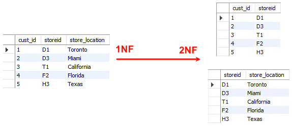
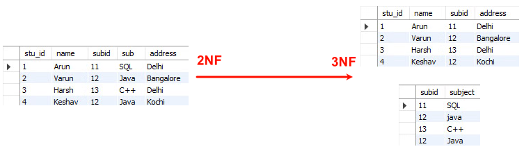
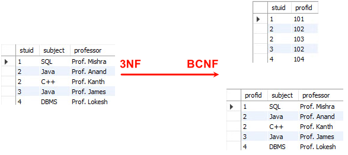

# 规范化

## 最佳实践

### 题目总结

1. 给定关系模式R(U，F)，其中属性集U = {A1，A2，A3，A4，A5，A6}，函数依赖集F = {A1→A2，A1→A3，A3→A4，A1A5→A6}。关系模式R的候选码为(  )，由于R存在非主属性对码的部分函数依赖，所以R属于(  )。

    - A. A1A3
    - B. A1A4
    - C. A1A5
    - D. A1A6

    - A. 1NF
    - B. 2NF
    - C. 3NF
    - D. BCNF

    答案: CA

    L: A1 A5

    左如下更改后满足BC:

    (A1, A2, A3)
    (A3, A4)
    (A1, A5, A6)

2. 关系模型(员工姓名，工资级别，工资金额)，其中员工姓名是主键，工资级别决定工资金额，请问满足(  )范式。

    - A. 2NF  B. 3NF  C. BCNF  D. 4NF

    答案：A

3. 某集团公司在各省设有分公司，现计划建立全国统一的销售管理信息系统，以便总公司及时掌握各分公司的销售情况。为此，公司成立专门项目组进行系统研发，张工负责数据库设计。

    张工与需求分析小组紧密合作，在设计出数据流图和数据字典的基础上，给出数据库关系模式及相应索引设计。考虑到不规范关系模式可能引发的数据错误，他对关系模式进行全面规范化处理，使所有关系模式都达到3NF或BCNF。

    但在项目实施中，应用开发小组认为该设计方案未考虑应用功能实际需求。严格按此方案实施，会因数据查询时大量的多表连接操作，对应用系统整体性能产生较大影响，且索引设计也不能完全满足数据查询的性能需求。

    此外，应用开发小组还指出，设计方案未考虑核心销售数据处理特点：各分公司只能操作本公司销售数据，总公司才有权利操作所有销售数据用于统计分析。

    因此，应用开发小组要求在数据库设计方案中，必须结合实际应用功能实现来考虑关系模式的规范化，必要时采用逆规范化或解除规范化的方法来保证性能要求。

    1. (8分)系统需要管理供应商和货物等信息，具体包括供应商姓名、地址以及货物名称、价格等，供应商可以提供0-n种货物，其公司地址也可能发生变化。请以供应商关系模式supplier(name,address,product,price)为例，解释不规范的关系模式存在哪些问题。

        1. `数据冗余`：关系模式中多次重复记录了同一供应商的地址。✨题目中给出供应商和货物是1:n关系, 所以重复的是供应商, 而不是货物.
        2. `插入异常`：如果还未确定一个供应商有哪些货物，只是想添加一个供应商的地址信息，则会产生产品与价格均为空的记录。
        3. `修改异常`：当修改一个供应商的地址时，需要将多条记录同时更新，若未同时更新，则数据产生不一致。
        4. `删除异常`：当删除一个供应商的货物时，其地址信息被一并删除。

    2. (6分)应用开发小组认为张工的规范化设计虽然解决了未规范化关系模式带来的问题，但实际实现功能时会造成系统性能的下降，请解释其原因。

        数据库规范化的过程，实际是对数据表的不断拆分，以达到更高的规范程度。这样处理，带来的问题是：系统中大量查询不能通过单表完成，而需要将多表进行连接查询，所以表拆分得越多，查询性能也就越差。

    3. (5分)请解释逆规范化方法，说明其优缺点。

        规范化设计后，数据库设计者希望牺牲部分规范化来提高性能，这种从规范化设计的回退方法称为反规范化技术。

        逆规范化方法优点：提高统计、查询效率。

        逆规范化方法缺点：增加了数据冗余，浪费存储空间，增、删、改操作的效率降低，可能导致数据不一致，可能产生添加、修改、删除异常。

    4. (6分)针对该信息系统中核心销售数据处理的特点，如采用关系表水平分割的逆规范化方法，请给出具体的解决方案，并说明该方案存在的问题。

        解决方案：将各省的数据存放于各省分公司。

        该方案主要问题：
        1. 在于总公司进行全国数据统计时，需要从各省服务器调取数据，效率较低。
        2. 执行应用功能时需要动态选择分公司的数据库表，增加了应用程序的复杂度 。

4. 某医药销售企业因业务发展，需要建立线上药品销售系统，为用户提供便捷的互联网药品销售服务。该系统除了常规药品展示、订单、用户交流与反馈功能外，还需要提供当前热销产品排名、评价分类管理等功能。

    通过对需求的分析，在数据管理上初步决定采用关系数据库(MySQL)和数据库缓存(Redis)的混合架构实现。

    经过规范化设计之后，该系统的部分数据库表结构如下所示。

    - 供应商(供应商ID，供应商名称，联系方式，供应商地址)；
    - 药品(药品ID，药品名称，药品型号，药品价格，供应商ID)；
    - 药品库存(药品ID，当前库存数量)；
    - 订单(订单号码，药品ID，供应商ID，药品数量，订单金额)。

    1. (9分)在系统初步运行后，发现系统数据访问性能较差。经过分析，刘工认为原来数据库规范化设计后，关系表过于细分，造成了大量的多表关联查询，影响了性能。例如当用户查询商品信息时，需要同时显示该药品的信息、供应商的信息、当前库存等信息。(2021下)

        为此，刘工认为可以采用反规范化设计来改造药品关系的结构，以提高查询性能。修改后的药品关系结构为：

        药品(药品ID，药品名称，药品型号，药品价格，供应商ID，供应商名称，当前库存数量)；

        请用200字以内的文字说明常见的反规范化设计方法，并说明用户查询商品信息应该采用哪种

        常见的反规范化技术有增加冗余列、增加派生列、重新组表、水平分割表和垂直分割表。
        1. 增加冗余列：在多个表中保留相同的列，通过增加数据冗余减少或避免查询时的连接操作。
        2. 增加派生列：在表中增加可以由本表或其它表中数据计算生成的列，减少查询时的连接操作并避免计算或使用集合函数。
        3. 重新组表：如果许多用户需要查看两个表连接出来的结果数据，则把这两个表重新组成一个表来减少连接而提高性能。增加冗余列是在现有表中增加冗余列，而重新组表则是将多个表的部分字段合并到一个新表中。
        4. 水平分割表：根据一列或多列数据的值，把数据放到多个独立的表中，主要用于表数据规模很大、表中数据相对独立或数据需要存放到多个介质上时使用。
        5. 垂直分割表：将主键与部分列放到一个表中，主键与其它列放到另一个表中，在查询时减少I/O次数。

        本题中用到了增加冗余列的方式。

    2. (9分)王工认为，反规范化设计可提高查询的性能，但必然会带来数据的不一致性问题。请用200字以内的文字说明在反规范化设计中，解决数据不一致性问题的三种常见方法，并说明该系统应该采用哪种方法。(2021下)

        解决数据不一致性问题的三种常见方法：批处理维护、应用逻辑和触发器。
        1. 批处理维护：通过定期运行一批处理作业或存储过程对数据库进行修改，适用于对实时性要求不高的情况。
        2. 应用逻辑：在同一事务中对所有涉及的表进行增、删、改操作。同一逻辑必须在所有的应用中使用和维护，容易遗漏，特别是在需求变化时，不易于维护。
        3. 触发器：对数据的任何修改立即触发对数据库某些列的相应修改。触发器实时性好，也易于维护。
        4. 存储过程:

        该系统应该采用触发器。

### 考察问

- 范式分类
    - 1NF: `()`
    - 2NF: 无`()`
    - 3NF: 无`()`属性`()`
    - 4NF: 无`()`依赖
- 反规范化的方法

    - 增加`()`列：已有单价和数量列，增加“总价”列
    - 增加`()`列：已有学号列，增加“姓名”列
    - `()`：把拆分的表重新组表 ✨创建一张新表, 而增加冗余列没有创建新表
    - `()`表：把用户表做水平分割，长沙的用户存在长沙，上海的用户存在上海

- 规范化与反规范化

    - 存储:
        - 规范化:
        - 逆规范化: 重复记录, 数据冗余，浪费空间

    - 插入(增)

        - 规范化: 无
        - 逆规范化:
            - 异常: 插入一个实体, 会导致另外一个实体数据为空
            - 效率: 低, 重复插入相同属性

    - 删除(删)
        - 规范化: 无
        - 逆规范化:
            - 异常: 假设只有一条记录时, 删除一个实体记录时, 会删除另一个实体信息(由于进行了连接查询)
            - 效率: 低, 多条记录

    - 修改(改)
        - 规范化: 无
        - 逆规范化:
            - 修改一个实体属性, 要修改多条记录(由于进行了连接)
            - 效率: 低, 多条记录

    - 查询(查):
        - 规范化: 多表连接查询，性能差
        - 反规范化: 单表查询, 性能好

    ✨反规范化技术的益处：降低连接操作的需求、降低外键和索引的数目，还可能减少表的数目，能够提高查询效率

- 数据同步方法: `()`, `()`, `()`

### 考察点

- 范式分类
    - 1NF: `原子不可再分`
    - 2NF: 无`部分依赖`
    - 3NF: 无`非主`属性`传递依赖`
    - 4NF: 无`多值`依赖
- 反规范化的方法

    - 增加`派生属性`列：已有单价和数量列，增加“总价”列
    - 增加`冗余`列：已有学号列，增加“姓名”列
    - `重新组表`：把拆分的表重新组表 ✨创建一张新表, 而增加冗余列没有创建新表
    - `分割`表：把用户表做水平分割，长沙的用户存在长沙，上海的用户存在上海

- 规范化与反规范化

    - 存储:
        - 规范化:
        - 逆规范化: 重复记录, 数据冗余，浪费空间

    - 插入(增)

        - 规范化: 无
        - 逆规范化:
            - 异常: 插入一个实体, 会导致另外一个实体数据为空
            - 效率: 低, 重复插入相同属性

    - 删除(删)
        - 规范化: 无
        - 逆规范化:
            - 异常: 假设只有一条记录时, 删除一个实体记录时, 会删除另一个实体信息(由于进行了连接查询)
            - 效率: 低, 多条记录

    - 修改(改)
        - 规范化: 无
        - 逆规范化:
            - 修改一个实体属性, 要修改多条记录(由于进行了连接)
            - 效率: 低, 多条记录

    - 查询(查):
        - 规范化: 多表连接查询，性能差
        - 反规范化: 单表查询, 性能好

    ✨反规范化技术的益处：降低连接操作的需求、降低外键和索引的数目，还可能减少表的数目，能够提高查询效率

- 数据同步方法: `触发器`, `存储过程`, `应用程序`

## [规范化](https://www.simplilearn.com/tutorials/sql-tutorial/what-is-normalization-in-sql)

关系数据库设计的方法之一就是设计满足适当范式的模式，通常可以通过判断分解后的模式达到几范式来评价模式规范化的程度。范式有：1NF、2NF、3NF、BCNF、4NF 和 5NF，其中 1NF 级别最低。这几种范式之间$1\text{NF} \supseteq 2\text{NF} \supseteq 3\text{NF} \supseteq \text{BCNF} \supseteq 4\text{NF} \supseteq 5\text{NF}$成立。

通过分解，可以将一个低一级范式的关系模式转换成若干个高一级范式的关系模式，这种过程叫作规范化。下面将给出 lNF 到 4NF 的定义。

1. lNF

    【定义6.7】若关系模式$R$的每一个分量都是不可再分的数据项，则关系模式$R$属于第一范式。记为$R \in 1NF$。

    例如，供应者和它所提供的零件信息，关系模式$FIRST$和函数依赖集$F$如下：

    $FIRST(Sno，Sname，Status，City，Pno，Qty)$

    $F = \{ Sno \to Sname，Sno \to Status，Status \to City，(Sno，Pno) \to Qty\}$

    对具体的关系$FIRST$如表6 - 2所示。从表6 - 2中可以看出，每一个分量都是不可再分的数据项，所以是$1NF$的。但是，$1NF$存在4个问题。

    表6 - 2$FIRST$

    | Sno | Sname | Status | City | Pno | Qty |
    | ---- | ---- | ---- | ---- | ---- | ---- |
    | S1 | 精益 | 20 | 天津 | P1 | 200 |
    | S1 | 精益 | 20 | 天津 | P2 | 300 |
    | S1 | 精益 | 20 | 天津 | P3 | 480 |
    | S2 | 盛锡 | 10 | 北京 | P2 | 168 |
    | S2 | 盛锡 | 10 | 北京 | P3 | 500 |
    | S3 | 东方红 | 30 | 北京 | P1 | 300 |
    | S3 | 东方红 | 30 | 北京 | P2 | 280 |
    | S4 | 泰达 | 40 | 上海 | P2 | 460 |

    (1)冗余度大。例如每个供应者的$Sno$、$Sname$、$Status$、$City$要与其供应的零件的种类一样多。

    (2)引起修改操作的不一致性。例如供应者$S1$从“天津”搬到“上海”，若不注意，会使一些数据被修改，另一些数据未被修改，导致数据修改的不一致性。

    (3)插入异常。关系模式$FRIST$的主码为$Sno$、$Pno$，按照关系模式实体完整性规定主码不能取空值或部分取空值。这样，当某个供应者的某些信息未提供时(如$Pno$)，则不能进行插入操作，这就是所谓的插入异常。

    (4) 删除异常。若供应商 S4 的 P2 零件销售完了，并且以后不再销售 P2 零件，那么应删除该元组。这样，在基本关系 FIRST 找不到 S4, 可 S4 又是客观存在的。

    正因为上述 4 个原因，所以要对模式进行分解，并引入了 2NF 。

2. 2NF
    【定义 6.8】若关系模式$R \in 1\text{NF}$，且每一个非主属性完全依赖于码，则关系模式$R \in 2\text{NF}$。

    换句话说，当$1\text{NF}$消除了非主属性对码的部分函数依赖，则称为$2\text{NF}$。

    例如：$\text{FIRST}$关系中的码是$\text{Sno}$、$\text{Pno}$，而$\text{Sno} \to \text{Status}$，因此非主属性$\text{Status}$部分函数依赖于码，故非$2\text{NF}$的。

    若此时，将$\text{FIRST}$关系分解为：

    $\text{FIRST}_1(\text{Sno}，\text{Sname}，\text{Status}，\text{City})\in 2\text{NF}$

    $\text{FIRST}_2(\text{Sno}，\text{Pno}，\text{Qty})\in 2\text{NF}$

    因为分解后的关系模式$\text{FIRST}_1$的码为$\text{Sno}$，非主属性$\text{Sname}$、$\text{Status}$、$\text{City}$完全依赖于码$\text{Sno}$，所以属于$2\text{NF}$；关系模式$\text{FIRST}_2$的码为$\text{Sno}$、$\text{Pno}$，非主属性$\text{Qty}$完全依赖于码，所以也属于$2\text{NF}$。

3. 3NF

    【定义 6.9】若关系模式$R(U，F)$中不存在这样的码$X$，属性组$Y$及非主属性$Z(Z \nsubseteq Y)$使得$X \to Y$，$(Y \nrightarrow X)$$Y \to Z$成立，则关系模式$R \in 3\text{NF}$。  

    即当$2\text{NF}$消除了非主属性对码的传递函数依赖，则称为$3\text{NF}$。  

    例如：$\text{FIRST}_1 \notin 3\text{NF}$，因为在分解后的关系模式$\text{FIRST}_1$中有$\text{Sno} \to \text{Status}$，$\text{Status} \to \text{City}$，存在着非主属性$\text{City}$传递依赖于码$\text{Sno}$。若此时将$\text{FIRST}_1$继续分解为：  

    $\text{FIRST}_{11}(\text{Sno}，\text{Sname}，\text{Status}) \in 3\text{NF}$

    $\text{FIRST}_{12}(\text{Status}，\text{City}) \in 3\text{NF}$

    通过上述分解，数据库模式$\text{FIRST}$转换为$\text{FIRST}_{11}(\text{Sno}，\text{Sname}，\text{Status})$，$\text{FIRST}_{12}(\text{Status}，\text{City})$，$\text{FIRST}_2(\text{Sno}，\text{Pno}，\text{Qty})$3 个子模式。由于这 3 个子模式都达到了$3\text{NF}$，因此称分解后的数据库模式达到了$3\text{NF}$。  

    可以证明，$3\text{NF}$的模式必是$2\text{NF}$的模式。产生冗余和异常的两个重要原因是部分依赖和传递依赖。因为$3\text{NF}$模式中不存在非主属性对码的部分函数依赖和传递函数依赖，所以具有较好的性能。对于非$3\text{NF}$的$1\text{NF}$、$2\text{NF}$来说，其性能弱，一般不宜作为数据库模式，通常要将它们变换成为$3\text{NF}$或更高级别的范式，这种变换过程称为 “关系模式的规范化处理”。

4. BCNF(Boyce Codd Normal Form, 巴克斯范式)

    【定义 6.10】关系模式$R \in 1\text{NF}$，若$X \to Y$且$Y \nsubseteq X$时，$X$必含有码，则关系模式$R \in \text{BCNF}$。

    也就是说，当$3\text{NF}$消除了主属性对码的部分函数依赖和传递函数依赖，则称为$\text{BCNF}$。

    结论：一个满足$\text{BCNF}$的关系模式，应有如下性质：
    - 所有非主属性对每一个码都是完全函数依赖；
    - 所有非主属性对每一个不包含它的码，也是完全函数依赖；
    - 没有任何属性完全函数依赖于非码的任何一组属性。

    例如，设$R(\text{Pno}，\text{Pname}，\text{Mname})$的属性分别表示零件号、零件名和厂商名，如果约定，每种零件号只有一个零件名，但不同的零件号可以有相同的零件名；每种零件可以有多个厂商生产，但每家厂商生产的零件应有不同的零件名。这样我们可以得到如下一组函数依赖：

    $\text{Pno} \to \text{Pname}$，$(\text{Pname}, \text{Mname}) \to \text{Pno}$

    由于该关系模式$R$中的候选码为$(\text{Pname}, \text{Mname})$或$(\text{Pno}, \text{Mname})$，因而关系模式$R$的属性都是主属性，不存在非主属性对码的传递依赖，所以$R$是$3\text{NF}$的。但是，主属性$\text{Pname}$传递依赖于码$(\text{Pname}, \text{Mname})$，因此$R$不是$\text{BCNF}$的。当一种零件由多个生产厂家生产时，零件名与零件号间的联系将多次重复，带来冗余和操作异常现象。若将$R$分解成：

    $R1(\text{Pno}, \text{Pname})$和$R2(\text{Pno}, \text{Mname})$

    就可以解决上述问题，并且分解后的关系模式$R1$、$R2$都属于$\text{BCNF}$。

4. 4NF

    【定义 6.11】关系模式$R \in 1\text{NF}$，若对于$R$的每个非平凡多值依赖$X \twoheadrightarrow Y$且$Y \nsubseteq X$时，$X$必含有码，则关系模式$R(U,F) \in 4\text{NF}$。  

    $4\text{NF}$是限制关系模式的属性间不允许有非平凡且非函数依赖的多值依赖。  

    注意：如果只考虑函数依赖，关系模式最高的规范化程度是$\text{BCNF}$；如果考虑多值依赖，关系模式最高的规范化程度是$4\text{NF}$。

## ✨规范化总结

关系数据库设计的方法之一就是设计满足适当范式的模式，通常可以通过判断分解后的模式达到几范式来评价模式规范化的程度。范式有：5NF ⊂ 4NF ⊂ BCNF ⊂ 3NF ⊂ 2NF ⊂ 1NF，其中级别最高，模式规范化程度也就越高。

1. 第一范式(1NF，First Normal Form)
  
    定义：若关系模式R的每一个分量是不可再分的数据项，则关系模式R属于第一范式。即`属性`是`原子`, `不可再分的`。

    🌰course列还有多个值.

    

    1NF存在的问题：数据冗余、插入异常、删除异常等问题。

2. 第二范式(2NF，Second Normal Form)：当且仅当实体E是第一范式(1NF)，且每一个非主属性完全依赖主键(不存在`部分依赖`)时，则称实体E是第二范式。

    🌰cust_id和store_id是主键, store_location仅依赖于store_id
    

    ✨2NF只存在候选键是两个的情况

3. 第三范式(3NF)：当且仅当实体E是第二范式(2NF)，且E中没有非主属性`传递依赖`于码时，则称实体E是第三范式。

    🌰subject依赖于subid依赖于stu_id

    

4. BC范式(BCNF)：设R是一个关系模式，F是它的依赖集，R属于BCNF当且仅当其F中每个依赖的决定因素必定包含R的某个候选码。

    🌰如下表
    1. 每个学员可以选多个课程
    2. 多个老师可以教授同一门课程
    3. 每个课程分配一个老师给学生

    stuid和subject组成了主键. 一个老师只能教一个课程, 一个课程可以多个老师教, 这就产生了一个依赖关系, 既课程依赖于老师.

    该表满足:
    1. 1NF, 因为每一列都是原子, 不可再分的
    2. 2NF, 没有部分依赖
    3. 3NF, 没有传递依赖

    但不满足BCNF. 因为stuid和subject组成了主键, 也就是说subject是主属性, 然而subject依赖于professor. 出现了主属性依赖于非主属性.

    

5. 4NF(第四范式)

    4NF主要是消除了多值依赖, [参考](2_0关系数据库🔴🟨💛.md)

🔒题目:

## 反规范化

1. 反规范化的方法

    1. 增加`派生属性`列：已有单价和数量列，增加“总价”列
    2. 增加`冗余`列：已有学号列，增加“姓名”列
    3. `重新组表`：把拆分的表重新组表 ✨创建一张新表, 而增加冗余列没有创建新表
    4. `分割`表：把用户表做水平分割，长沙的用户存在长沙，上海的用户存在上海

2. 反规范化的优点

    1. 存储:
        1. 规范化:
        2. 逆规范化: 重复记录, 数据冗余，浪费空间

    2. 插入(增)

        1. 规范化: 无
        2. 逆规范化:
            1. 异常: 插入一个实体, 会导致另外一个实体数据为空
            2. 效率: 低, 重复插入相同属性

    3. 删除(删)
        1. 规范化: 无
        2. 逆规范化:
            1. 异常: 假设只有一条记录时, 删除一个实体记录时, 会删除另一个实体信息(由于进行了连接查询)
            2. 效率: 低, 多条记录

    4. 修改(改)
        1. 规范化: 无
        2. 逆规范化:
            1. 修改一个实体属性, 要修改多条记录(由于进行了连接)
            2. 效率: 低, 多条记录

    5. 查询(查):
        1. 规范化: 多表连接查询，性能差
        2. 反规范化: 单表查询, 性能好

    ✨反规范化技术的益处：降低连接操作的需求、降低外键和索引的数目，还可能减少表的数目，能够提高查询效率
    ✨数据不一致，可能产生添加、修改、删除异常: 1、`触发器`数据同步 2. `存储过程` 3、`应用程序`数据同步
