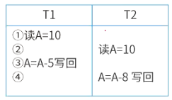
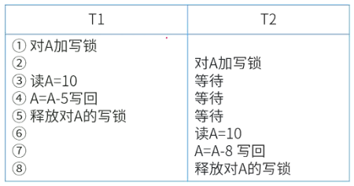
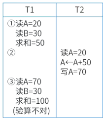
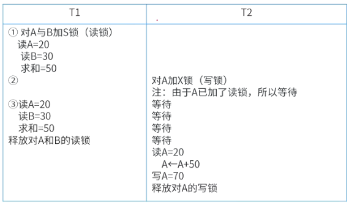
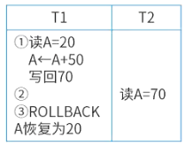
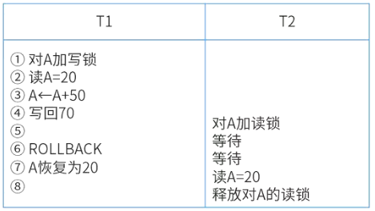

# 事务管理

## 最佳实践

### 考察问

- 事务的定义: 用户定义的一个`()`

- 事务的三阶段：
    1. `()`:
    2. 事务结束:
        - `()`: 表示事务成功地结束
        - `()`: 表示事务非成功地结束
- 事务的ACID性质
    - `()`: 要么都做(commit)，要么都不做(rollback), 不能部分做.
    - `()`: 无论转账过程中发生什么，都不会出现A扣了钱但B没收到，导致总金额变化等数据不一致的情况
    - `()`: 并发执行时，互不干扰
    - `()`: 提交后永久有效

    ✨原子性和隔离性决定了一致性, 附加一个持久性

- 并发控制技术

    - `()`:事务T对数据A加X锁,
        - 只允许事务T读取、修改数据A。
        - 并且其他任何事务都不能再对A加X锁或S锁.

    - `()`: 解决了X锁太严格，不允许其他事务并发读的问题。事务T对数据A加S锁，则：
        - 只允许事务T读取数据A但不能够修改
        - 可允许其他事务对其加S锁，但不允许加X锁

- 并发控制, 隔离性破坏
    - `()`: T_1和T_2分别读相同变量, T_2的写覆盖了T_1的写. T_2本应该在T_1修改后, 再读再写.
    - `()`: T_1前后两次读之间, T_2修改了数据
    - `()`: T_1前后两次读之间, T_2增加或删除了数据
    - `()`: T_2读了T_1回滚前的数据.
    - `()`: T_1回滚覆盖了T_2修改的数据

### 考察点

- 事务的定义: 用户定义的一个`操作序列`

- 事务的三阶段：
    1. `事务开始(Begin Transaction)`:
    2. 事务结束:
        - `事务提交(Commit)`: 表示事务成功地结束
        - `事务回滚(Rollback)`: 表示事务非成功地结束
- 事务的ACID性质
    - `原子性`: 要么都做(commit)，要么都不做(rollback), 不能部分做.
    - `一致性`: 无论转账过程中发生什么，都不会出现A扣了钱但B没收到，导致总金额变化等数据不一致的情况
    - `隔离性`: 并发执行时，互不干扰
    - `持久性`: 提交后永久有效

    ✨原子性和隔离性决定了一致性, 附加一个持久性

- 并发控制技术

    - `排他锁(eXclusive lock, X锁, 写锁, 独占锁)`:事务T对数据A加X锁,
        - 只允许事务T读取、修改数据A。
        - 并且其他任何事务都不能再对A加X锁或S锁.

    - `共享锁(Share lock, 读锁)`: 解决了X锁太严格，不允许其他事务并发读的问题。事务T对数据A加S锁，则：
        - 只允许事务T读取数据A但不能够修改
        - 可允许其他事务对其加S锁，但不允许加X锁

- 并发控制, 隔离性破坏
    - `丢失更新`: T_1和T_2分别读相同变量, T_2的写覆盖了T_1的写. T_2本应该在T_1修改后, 再读再写.
    - `不可重复读`: T_1前后两次读之间, T_2修改了数据
    - `幻读`: T_1前后两次读之间, T_2增加或删除了数据
    - `读脏数据(脏读)`: T_2读了T_1回滚前的数据.
    - `写脏数据(脏写)`: T_1回滚覆盖了T_2修改的数据

## 事务的概念

事务是DBMS的基本工作单位，是由用户定义的一个`操作序列`。

事务的定义语句有：

1. `Begin Transaction(事务开始)`
2. `Commit(事务提交，表示事务成功地结束)`
3. `Rollback(事务回滚，表示事务非成功地结束)`

## 事务的ACID性质

1. 原子性(Atomicity)：要么都做，要么都不做。要么全部成功(commit)，要么全部失败回滚(rollback)。这些操作是一个整体，不能部分地完成。

    一个账户扣款(记为操作 A)和向另一个账户存款(记为操作 B)这两个操作构成一个事务。若操作 A 执行成功后，在执行操作 B 时系统崩溃，原子性要求整个事务回滚，即撤销操作 A，保证资金不会无故从一个账户扣除却没存入另一个账户

2. 一致性(Consistency)：事务执行的结果必须从一个一致性状态转到另一个一致性状态。中间状态对外不可见。

    假设转账前，转出账户 A 有 1000 元，转入账户 B 有 500 元，总金额为 1500 元 。转账 200 元后，账户 A 应有 800 元，账户 B 应有 700 元，总金额仍为 1500 元。一致性确保无论转账过程中发生什么，都不会出现比如 A 扣了钱但 B 没收到，导致总金额变化等数据不一致的情况

3. 隔离性(Isolation)： 一个事务内部的操作及使用的数据对并发的其他事务是隔离的。

    不会出现甲的转账操作读到乙未提交的转账数据(脏读)，或者甲在同一事务中两次读取账户C余额结果不同(不可重复读)

4. 持久性(Durability)：事务成功提交后，对数据库的更新操作是永久有效的。

    当银行转账事务成功提交后，即便此时银行系统突然断电、服务器宕机等，之前转账操作导致的账户金额变化依然会存在，不会丢失

✨原子性, 隔离性, 持久性是技术手段, 一致性是结果

## 并发控制技术

- `排他锁(eXclusive lock, X锁, 写锁, 独占锁)`:事务T对数据A加X锁,
    - 只允许事务T读取、修改数据A。
    - 并且其他任何事务都不能再对A加X锁或S锁.

- `共享锁(Share lock, 读锁)`: 解决了X锁太严格，不允许其他事务并发读的问题。事务T对数据A加S锁，则：
    - 只允许事务T读取数据A但不能够修改
    - 可允许其他事务对其加S锁，但不允许加X锁

    ✨加锁遵循一个基本原则：如果该事务只读数据，就只加读锁；如果该事务要写数据，就加写锁，

## 并发控制(事务的隔离性破坏)

并发操作就是在多用户系统中，可能出现多个事务同时操作同一数据的情况。并发操作会导致3种数据不一致的问题：

- 丢失更新: T_1读后修改前, T_2读, T_1修改后, T_2修改. T_2的结果覆盖了T_1的结果. T_2本应该在T_1修改后, 再读再写.

    当两个事务 T₁和 T₂读入同一数据做修改，并发执行时，T₁把 T₂或 T₂把 T₁的修改结果覆盖掉，造成了数据的丢失更新问题，导致数据不一致。

    

    解决办法: 一级封锁协议

    事务T在修改数据R之前必须先对其加X锁，直到事务结束才释放，可防止丢失修改。

    

- 不可重复读(验证): T_2修改了T_1验证前的数据.

    事务T₁读取了数据R，事务T₂读取并更新了数据R。当事务T₁再读取数据R以进行核对时，得到的两次读取数据不一致。

    

    解决办法: 三级封锁协议

    一级封锁协议加上事务T在读取数据R之前先对其加S锁，直到事务结束才释放，能防止丢失修改、读“脏”数据以及数据(不可)重复读。

    

- 幻读

    一个事务A，先发送一条SQL语句，里面有一个条件，要查询一批数据出来，如`SELECT * FROM table WHERE id > 10`。然后呢，它一开始查询出来了10条数据。接着这个时候，事务B往表里插了几条数据，而且事务B还提交了，此时多了几行数据。接着事务A此时第二次查询，再次按照之前的一模一样的条件执行`SELECT * FROM table WHERE id > 10`这条SQL语句，由于其他事务插入了几条数据，导致这次它查询出来了12条数据。于是事务A开始怀疑自己的眼镜了，为什么一模一样的SQL语句，第一次查询是10 条数据，第二次查询是12条数据？难道刚才出现幻觉了？这就是`幻读`这个名词的由来

- 读脏数据(回滚): T_2读了T_1回滚前的数据.

    事务 T₁更新了数据 R，事务 T₂读取了更新后的数据 R，事务 T₁由于某种原因被撤销，进行了事务回滚，数据 R 恢复原值，事务 T₂读取了脏数据。

    

    解决办法: 二级封锁协议

    在一级封锁协议的基础上，事务T在读取数据R之前先对其加S锁，读完后即可释放S锁，可防止丢失修改和读“脏”数据。

    

- 写脏数据(回滚): T_1回滚时将T_2的数据也擦除了

    脏写，意思是说有两个事务，事务A和事务B同时在更新一条数据，事务A先把它更新为A值，事务B紧接着就把它更新为B值。而且此时事务A更新之后会记录一条undo log日志。因为事务A是先更新的，它在更新之前，这行数据的值为NULL。所以此时事务A的undo log日志大概就是：更新之前这行数据的值为 NULL. 那么此时事务B更新完数据的值为B，此时事务A突然回滚了，就会用它的undo log日志去回滚。此时事务A一回滚，直接就会把那行数据的值更新回NULL值。