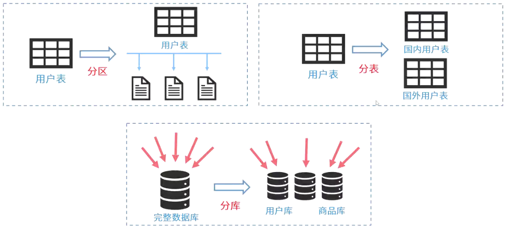
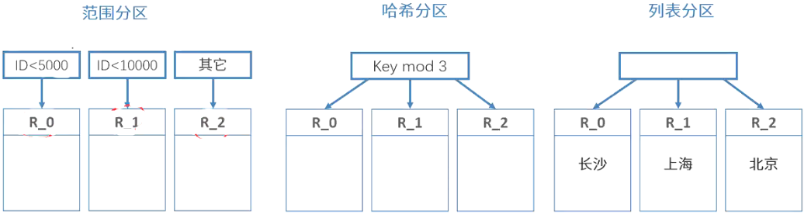
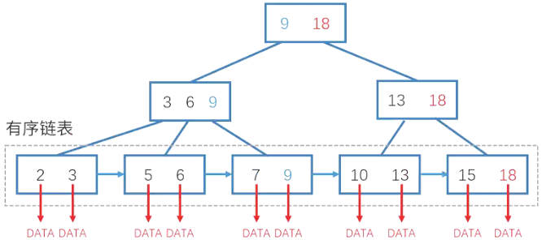

# 数据库的性能优化

## 最佳实践

### 题目总结

1. (4分)使用热数据、温数据和冷数据存储的原因。(2024上)

    使用热数据、温数据和冷数据存储的原因及好处主要包括以下几点(答出原因或者优点，任意 4 点即可。

    原因：

    1. 资源优化：不同数据的访问频率差异巨大，将数据按照热度分类可以更合理地分配存储资源。热数据通常需要快速访问，因此存储在高性能、高成本的媒介上；而冷数据访问较少，可以存储在低成本、低速的媒介上。
    2. 成本效率：通过区分数据的访问频率，企业可以将有限的预算投入到最关键的数据存储上，如使用 SSD 或 RAM 存储热数据，而冷数据则存储在磁带或蓝光光盘上，这样既能保证关键业务的性能，又能控制存储成本。
    3. 性能提升：将频繁访问的热数据放置在快速存储设备上，如 SSD 或内存，可以显著减少数据访问延迟，提高应用响应速度。而冷数据存储在低速设备上对整体系统性能影响较小。
    4. 数据保护：对于冷数据，虽然访问频率低，但可能需要长期保存，使用耐久性高的存储介质可以确保数据的安全与持久。
    5. 扩展性和灵活性：随着数据量的增长，分层存储策略提供了更好的扩展性，可以根据数据增长和访问模式的变化灵活调整存储策略。

    优点：

    6. 提升效率：确保高访问频度的数据能够迅速被获取，提升用户体验和业务处理速度。
    7. 降低成本：通过将不常访问的数据转移到成本较低的存储介质，减少整体存储成本。
    8. 资源利用率最大化：高效利用存储资源，避免高性能存储资源被低访问频度数据占用。
    9. 增强数据管理能力：便于数据生命周期管理，如数据归档、备份和恢复策略的实施。
    10. 适应业务变化：灵活调整数据存储布局，快速响应业务需求变化，支持业务的持续创新与发展。

    综上所述，依据数据热度进行分类存储是一种策略，旨在通过智能地分配存储资源，平衡成本与性能，确保关键业务数据的高效访问，同时合理管理数据生命周期，从而实现整体IT架构的优化。

### 考察问

- 💚`()`: 逻辑上是多个库
- 💚`()`: 逻辑上是多张表
- 💚`()`: 逻辑还是一张表, 物理上多个节点

### 考察点

分区分表分库

- `分库`: 逻辑上是多个库
- `分表`: 逻辑上是多张表
- `分区(分片)`: 逻辑还是一张表, 物理上多个节点

## 优化方法

1. 集中式数据库优化主要包含以下几个方面：
    - 硬件系统：CPU，内存，I/O(硬盘，阵列)，网络
    - 系统软件：参数，如进程优先级，CPU使用权，内存使用
    - 数据库设计：
        - 表与视图：表的规划，建立物化视图
        - 索引：常查询-建索引，常修改-避免索引
        - SQL优化：以不相干子查询替代相干子查询；只检索需要的列；用带IN的条件子句等价替换OR子句；经常提交COMMIT，以尽早释放锁；尽可能减少多表查询
    - 应用软件：数据库连接池

2. 分布式数据库优化主要关注通信代价，具体内容如下：
    - 全局查询树的变换
    - 多副本策略
    - 查询树的分解
    - 半连接与直接连接

## 分区分表分库

分区和分表的区别是:

1. 分区: 逻辑上还是一张表
2. 分表: 逻辑上已是多张表

常见分区方式:

|分区策略|分区方式|说明|
| ---- | ---- | ---- |
|范围分区(RANGE)|按数据范围值来做分区|例：按用户编号分区，0 - 999999映射到分区A；1000000 - 1999999映射到分区B。|
|散列分区(HASH)|通过对key进行hash运算分区|例：可以把数据分配到不同分区，这类似于取余操作，余数相同的，放在一个分区上。|
|列表分区(LIST)|根据某字段的某个具体值进行分区|例：长沙用户分成一个区，北京用户一个区|

分区的优点:

1. 相对于单个文件系统或是硬盘，分区可以存储更多的数据。
2. 数据管理比较方便，比如要清理或废弃某年的数据，就可以直接删除该日期的分区数据即可。
3. 精准定位分区查询数据，不需要全表扫描查询，大大提高数据检索效率。
4. 可跨多个分区磁盘查询，来提高查询的吞吐量。
5. 在涉及聚合函数查询时，可以很容易进行数据的合并。

## 索引

数据库索引：提升查询效率，降低添加、修改、删除效率。采用B树，B+树等。

1. 数据表

    |学号|姓名|性别|
    | ---- | ---- | ---- |
    |001|张三|男|
    |102|李四|女|
    |008|王五|男|
    |007|赵六|男|
    |235|钱七|女|
    |417|李华|男|
    |907|张明|女|
    |...|...|...|
    |018|龙四|女|

2. 索引表

    |学号|记录指针|
    | ---- | ---- |
    |1|data|
    |7|data|
    |8|data|
    |18|data|
    |102|data|
    |235|data|
    |417|data|
    |907|data|
    |...|...|

B+树

## 热数据温数据冷数据

热数据, 温数据, 冷数据