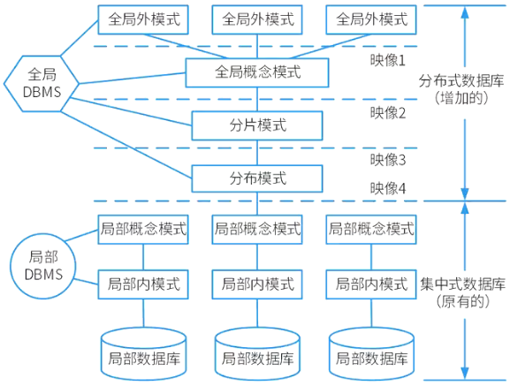

# 分布式数据库

## 最佳实践

### 题目总结

1. 在分布式数据库中包括分片透明、复制透明、位置透明和逻辑透明等基本概念，其中：(  )是指局部数据模型透明，即用户或应用程序无需知道局部场地使用的是哪种数据模型。

    - A 分片透明
    - B 复制透明
    - C 位置透明
    - D 逻辑透明

    答案: D

2. 在分布式数据库中有分片透明、复制透明、位置透明和逻辑透明等基本概念。其中，(  )是指用户无需知道数据存放的物理位置。

    - A. 分片透明  B. 逻辑透明  C. 位置透明  D. 复制透明

    答案：C 

3. 分布式数据库两阶段提交协议中的两个阶段是指(  )。

    - A 加锁阶段、解锁阶段
    - B 获取阶段、运行阶段
    - C 表决阶段、执行阶段
    - D 扩展阶段、收缩阶段

    答案: C

4. 分布式数据库系统除了包含集中式数据库系统的模式结构之外，还增加了几个模式级别，其中(  )定义分布式数据库中数据的整体逻辑结构，使得数据使用方便，如同没有分布一样。

    - A. 分片模式  B. 全局外模式  C. 分布模式  D. 全局概念模式 

    答案: D

5. (9分)基于MySQL实现分布式锁的缺点(2024上)

    1. 性能瓶颈：MySQL数据库本身可能成为性能瓶颈，特别是在高并发情况下，大量的锁请求和释放可能导致数据库性能下降。
    2. 单点故障：MySQL单点的特性使得其成为系统的单点故障，如果数据库出现故障，将导致整个系统的分布式锁失效。 
    3. 锁粒度问题：MySQL的锁粒度可能过大或者过小，过大的锁粒度会导致并发性能降低，而过小的锁粒度可能会增加锁冲突的概率，影响系统的并发性能。 
    4. 数据一致性问题：分布式系统中，不同的数据库节点之间的数据同步可能存在延迟或者不一致的情况，这可能导致分布式锁的有效性受到影响。
    5. 扩展性差：随着系统规模的扩大，单个MySQL数据库可能无法满足系统的性能和容量需求，需要进行垂直或者水平扩展，这会增加系统的复杂性和成本。
    6. 容错性差：MySQL数据库本身的容错性可能不如专门设计的分布式锁方案，例如基于ZooKeeper或者Redis的分布式锁方案，因此在面对网络分区或者其他故障时可能无法提供可靠的锁服务。 

6. (10分)举一个产生Redis分布式锁死锁的场景。(2024上)✨这个答案有问题, 交替执行不是死锁

    假设有两个客户端同时请求获取同一把分布式锁，并且两个客户端的请求几乎同时到达Redis服务器。此时，两个客户端都成功地获取了锁，并开始执行各自的任务。然而，由于某些原因(例如网络延迟、服务器负载等)，其中一个客户端在执行任务时花费的时间较长，导致其持有锁的时间超过了预期。在此期间，另一个客户端一直在等待获取锁，因为它无法在锁被释放之前执行任务。

    当第一个客户端最终完成任务并释放锁时，第二个客户端会立即获取到锁并开始执行任务。但此时第一个客户端可能又尝试获取锁以执行另一个任务，由于第二个客户端已经获取到了锁，因此第一个客户端将被阻塞等待获取锁，导致死锁的发生。

    这种情况下，由于两个客户端的请求在一段时间内交替执行，每个客户端都等待另一个客户端释放锁，最终导致了死锁的产生。为避免这种情况，需要在设计分布式锁的使用场景时考虑合理的超时机制和重试策略，以及确保释放锁的操作能够及时执行。 

7. (4 分)根据李工的提议，新的 B2C 商品交易平台引入了主从复制机制。请针对 B2C 商品交易平台的特点，简要叙述引入该机制的好处。(2017下)  

    避免数据库单点故障：主服务器实时、异步复制数据到从服务器，当主数据库宕机时，可在从数据库中选择一个升级为主服务器，从而防止数据库单点故障。

    提高查询效率：根据系统数据库访问特点，可以使用主数据库进行数据的插入、删除及更新等写操作，而从数据库则专门用来进行数据查询操作，从而将查询操作分担到不同的从服务器以提高数据库访问效率。 

### 考察问
1. 分布透明性✨不用记看关键字
    1. `()`透明: 不需关心如何分片存储
    2. `()`透明: 不需关心节点复制情况
    3. `()`透明: 不需关心存储物理位置
    4. `()`透明: 不需关系局部DBMS语言
2. 两阶段提交协议
    1. `()`阶段，目的是形成一个共同的决定。
    2. `()`阶段，目的是实现这个协调者的决定。
        1. 只要有一个参与者撤销事务，协调者就必须做出全局撤销决定。
        2. 只有所有参与者都同意提交事务，协调者才能做出全局提交决定。
3. 分布式数据库模式✨只需记住中间两个 `()`和`()`, 谐音`()`: 全局外->全局概念->分片->分布->局部概念->局部内模式
    1. 全局外模式
    2. 全局概念模式
    3. 分片模式
    4. 分布模式(全局内模式)
    5. 局部概念模式
    6. 局部内模式
4. 分布式锁✨分布式锁详解
    1. MYSQL: 给资源字段建立唯一索引, 当客户端使用某资源时, 就创建一条记录, 使用完删除该记录
    2. Redis: 客户端使用setnx命令, 如果key不存在则获得锁, 锁如果存在.
    3. ZooKeeper: 客户端在指定节点下创建节点, 如果自己是子节点最小值, 则获得锁.否则要监听子节点删除, 直到自己最小.

### 考察点
1. 分布透明性✨不用记看关键字
    1. `分片`透明: 不需关心如何分片存储
    2. `复制`透明: 不需关心节点复制情况
    3. `位置`透明: 不需关心存储物理位置
    4. `逻辑`透明: 不需关系局部DBMS语言
2. 两阶段提交协议
    1. `表决`阶段，目的是形成一个共同的决定。
    2. `执行`阶段，目的是实现这个协调者的决定。
        1. 只要有一个参与者撤销事务，协调者就必须做出全局撤销决定。
        2. 只有所有参与者都同意提交事务，协调者才能做出全局提交决定。
3. 分布式数据库模式✨只需记住中间两个 `分片`和`分布`, 谐音`遍布`: 全局外->全局概念->分片->分布->局部概念->局部内模式
    1. 全局外模式
    2. 全局概念模式
    3. 分片模式
    4. 分布模式(全局内模式)
    5. 局部概念模式
    6. 局部内模式
4. 分布式锁✨分布式锁详解
    1. MYSQL: 给资源字段建立唯一索引, 当客户端使用某资源时, 就创建一条记录, 使用完删除该记录
    2. Redis: 客户端使用setnx命令, 如果key不存在则获得锁, 锁如果存在.
    3. ZooKeeper: 客户端在指定节点下创建节点, 如果自己是子节点最小值, 则获得锁.否则要监听子节点删除, 直到自己最小.

## 分布式数据库概念

分布式数据库分布在计算机网络的不同计算机上，网络中的每个节点具有独立处理的能力(称为场地自治)，它可以执行局部应用，同时，每个节点也能通过网络通信子系统执行全局应用。

- 数据独立性。除了数据的`逻辑独立性`与`物理独立性`外，还有数据`分布独立性(分布透明性)`。
- `集中`与`自治`共享结合的控制结构。各局部的DBMS可以独立地管理局部数据库，具有自治的功能。同时，系统又设有集中控制机制，协调各局部DBMS的工作，执行全局应用。
- 适当增加数据冗余度。在不同的场地存储同一数据的多个副本，可以提高系统的可靠性和可用性，同时也能提高系统性能。
- 全局的一致性、可串行性和可恢复性。
- 分布式数据库的特点：高可扩展性、高并发性、高可用性

## 分布透明性

1. 分片透明性: 用户只对全局关系进行操作而不必考虑数据的分片。

    1. 水平分片: 按记录分
    2. 垂直分片: 按字段分
    3. 混合分片: 采用水平分片和垂直分片两种形式的混合。

2. 复制透明: 用户不用关心数据库在网络中各个节点的复制情况。

3. 位置透明性: 用户或应用程序不关心数据存放的物理位置。

4. 逻辑透明: 用户不必关心局部DBMS支持哪种数据模型、使用哪种数据操纵语言，数据模型和操纵语言的转换是由系统完成的。

## 两阶段提交协议2PC(Two - Phase Commitment Protocol)

1. 2PC事务提交的两个阶段
    1. 表决阶段，目的是形成一个共同的决定。
    2. 执行阶段，目的是实现这个协调者的决定。

        全局提交规则:
        1. 只要有一个参与者撤销事务，协调者就必须做出全局撤销决定。
        2. 只有所有参与者都同意提交事务，协调者才能做出全局提交决定。

## 分布式数据库模式

在分布式数据库中，局部DBMS中的内模式与概念模式与集中数据库是完全一致的，不同之处在于新增的全局DBMS，而整个全局DBMS，可以看作是相对于局部概念模式的外模式。由于外模式部分有一系列的分布模式、分片模式、全局概念模式和全局外模式，以及多级映射使得用户在使用分布式数据库时，可以使用集中式数据库同样的方式。

1. 全局外模式。全局外模式是全局应用的用户视图，是全局概念模式的子集，该层直接与用户(或应用程序)交互。
2. 全局概念模式。全局概念模式定义分布式数据库中数据的整体逻辑结构，数据就如同根本没有分布一样，可用传统的集中式数据库中所采用的方法进行定义。 
3. 分布模式。分布式数据库的本质特性就是数据分布在不同的物理位置。分布模式的主要职责是定义数据片段(即分片模式的处理结果)的存放节点。 
4. 分片模式。在某些情况下，需要将一个关系模式分解成为几个数据片，分片模式正是用于完成此项工作的。 
5. 局部概念模式。局部概念模式是局部数据库的概念模式。 
6. 局部内模式。局部内模式是局部数据库的内模式。 

## 分布式锁

分布式锁是一种在分布式系统环境下，通过多个节点对共享资源进行访问控制的一种`同步机制`。它的主要目的是防止`多个节点``同时操作``同一份数据`，从而避免`数据的不一致性`。

一般来说，实现分布式锁的方式有以下几种：

1. 使用 MySQL，基于`唯一索引`。

    在数据库中创建一张表，表中包含`锁定资源字段`，并在该字段上`创建唯一索引`。当线程想要执行某个操作时，向表中插入一条记录。由于唯一索引的约束，`多个线程``同时插入时``只有一个能成功`，成功插入的线程就`获取到了锁`，`操作完成后``删除对应记录`释放锁。

2. 使用 ZooKeeper，基于`临时有序节点`。 

    ZooKeeper 维护一个`树形目录结构`，支持临时节点和顺序节点。`客户端尝试加锁时`，在指定节点目录下创建一个唯一的`临时有序节点`。创建后，判断自己的节点是否是`所有子节点中序号最小的`，`若是则获取到锁`；`若不是`，则`监听比自己序号小的前一个节点的删除事件`。当监听到该节点被删除，`再次判断自己的节点是否为最小，若是则获取锁`。释放锁时，只需删除自己创建的临时节点。

3. 使用 Redis，基于 setnx 命令。

    1. 获取锁：使用 setnx 命令加锁, 当`键不存在时`，将键值对设置到 Redis 中并`返回 1`，代表`加锁成功`；若`键已存在`则`返回 0`，`加锁失败`。并使用 `expire` 命令为锁添加一个`超时时间`(`避免死锁`)，`锁的 value` 值为一个`随机生成的 UUID`。 
    2. 释放锁：通过 `UUID` 判断是不是该锁，`若是该锁`，则`执行 delete` 进行锁释放。

