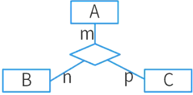
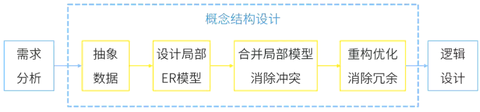
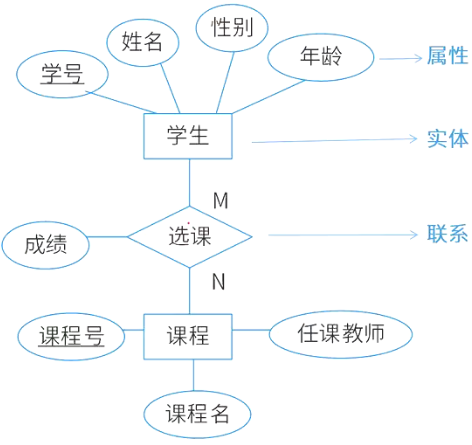
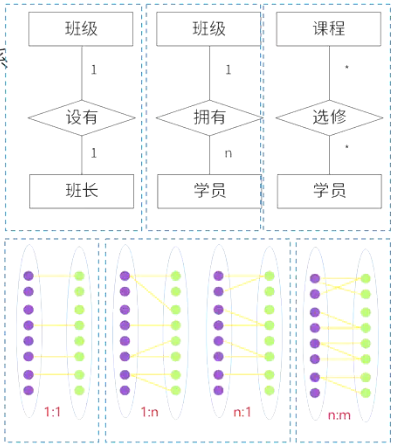

# 数据库设计

## 最佳实践

### 题目总结

- 💚某企业开发信息管理系统平台进行E-R图设计，人力部门定义的是员工实体具有属性：员工号、姓名、性别、出生日期、联系方式和部门，培训部门定义的培训师实体具有属性：培训师号、姓名和职称，其中职称={初级培训师，中级培训师，高级培训师}，这种情况属于 ( ) ，在合并E-R图时，解决这一冲突的方法是 ( ) 。

    - A. 属性冲突  
    - B. 结构冲突  
    - C. 命名冲突  
    - D. 实体冲突

    - A. 员工实体和培训师实体均保持不变
    - B. 保留员工实体、删除培训师实体
    - C. 员工实体中加入职称属性，删除培训师实体
    - D. 将培训师实体所有属性并入员工实体，删除培训师实体

    答案: BC, 没有实体冲突, 只有结构冲突

- 💚在数据库逻辑结构的设计中，将E-R模型转换为关系模型应遵循相关原则。对于三个不同实体集和它们之间的多对多联系m∶n∶p，最少可转换为( )个关系模式。

    

    - A.2
    - B.3
    - C.4
    - D.5

    答案: C

- 某企业工程项目管理数据库的部分关系模式如下所示，其中带实下划线的表示主键，虚下划线的表示外键。

    - 供应商 (供应商号_实，名称，地址，电话，账号)
    - 项目 (项目号_实，负责人_虚，开工日期)
    - 零件 (零件号_实，零件名，规格)
    - 供应 (项目号_实虚，零件号_实虚，供应商号_实虚，供应量)
    - 员工 (员工号_实，姓名，性别，出生日期，职位，联系方式)

    其中供应关系是(  )的联系。若一个工程项目可以有多个员工参加，每个员工可以参加多个项目，则项目和员工之间是 (  ) 联系。对项目和员工关系进行设计时，(  )设计成一个独立的关系模式。

    - A 2个实体之间的1∶n
    - B 2个实体之间的n∶m
    - C 3个实体之间的1∶n∶m
    - D 3个实体之间的k∶n∶m

    - A 1∶1
    - B 1∶n
    - C n∶m
    - D n∶1

    - A 多对多的联系在向关系模型转换时必须
    - B 多对多的联系在向关系模型转换时无须
    - C 只需要将一端的码并入多端，所以无须
    - D 不仅需要将一端的码并入多端，而且必须

    答案: DCA

- 💚E-R模型向关系模型转换时，两个实体$E_1$和$E_2$之间的多对多联系R应该转换为一个独立的关系模式，且该关系模式的关键字由(  )组成。

    - A.联系R的属性
    - B.$E_1$或$E_2$的关键字
    - C.$E_1$和$E_2$的关键字
    - D.$E_1$和$E_2$的关键字加上R的属性

    答案：C

- 💚通常在设计关系模式时，派生属性不会作为关系中的属性来存储。按照这个原则，假设原设计的学生关系模式为Students(学号，姓名，性别，出生日期，年龄，家庭地址)，那么该关系模式正确的设计应为_____。

    - A.Students(学号，性别，出生日期，年龄，家庭地址)
    - B.Students(学号，姓名，性别，出生日期，年龄)
    - C.Students(学号，姓名，性别，出生日期，家庭地址)
    - D.Students(学号，姓名，出生日期，年龄，家庭地址)

    答案：C

- 💛某企业委托软件公司开发一套包裹信息管理系统，以便于对该企业通过快递收发的包裹信息进行统一管理。在系统设计阶段，需要对不同快递公司的包裹单信息进行建模，其中，邮政包裹单如图所示。

    

    1. (14分)请说明关系型数据库开发中，逻辑数据模型设计过程包含哪些任务？该包裹单的逻辑数据模型中应该包含哪些实体？并给出每个实体的主键属性。(2020下)

        逻辑模型设计也称为逻辑结构设计，其任务是将概念模型转化为某个特定的DBMS上的逻辑模型。设计逻辑结构时，首先为概念模型选定一个合适的逻辑模型(例如，关系模型、网状模型或层次模型)，然后将其转化为由特定DBMS支持的逻辑模型，最后对逻辑模型进行优化。逻辑设计的目的是将概念设计阶段设计好的E-R图转换为与选用的具体机器上的DBMS所支持的数据模型相符合的逻辑结构。

        该包裹单包含三类实体：收件人(主键：电话)、寄件人(主键：电话)、包裹单(主键：包裹单编号)。

    2. (6分)请说明什么是超类实体？结合图中包裹单信息，试设计一种超类实体，给出完整的属性列表。(2020下)

        某个实体类型中所有实体同时也是另一个实体类型中的实体，此时称前一实体为子类实体，后一实体为超类实体。本题的超类实体为：包裹单(包裹单编号、收件人、寄件人)。

    3. (5分)请说明什么是派生属性，并结合图的包裹单信息说明哪个属性是派生属性。(2020下)

        实体的某个属性可以从其他属性或其他数据`推导`出来，那么这个属性就是派生属性。本题中，资费总计=资费+挂号费+保价费+回执费，因此资费总计是一个派生属性。

- 💚某数据库中有

    - 员工关系E(员工号，姓名，部门，职称，月薪)
    - 产品关系P(产品号，产品名称，型号，尺寸，颜色)
    - 仓库关系W(仓库号，仓库名称，地址，负责人)
    - 库存关系I(仓库号，产品号，产品数量)。

    若数据库设计中要求：

    - 仓库关系W中的“负责人”引用员工关系的员工号
    - 库存关系I中的“仓库号，产品号”唯一标识I中的每一个记录
    - 员工关系E中的职称为“工程师”的月薪不能低于3500元

    则123依次要满足的完整性约束是(  )。
    - A 实体完整性、参照完整性、用户定义完整性
    - B 参照完整性、实体完整性、用户定义完整性
    - C 用户定义完整性、实体完整性、参照完整性
    - D 实体完整性、用户定义完整性、参照完整性

        答案: B

- 💚在数据库设计的(  )阶段进行关系规范化。

    - A. 需求分析
    - B. 概念设计
    - C. 逻辑设计
    - D. 物理设计

    答案: C

- 💚在数据库设计的需求分析阶段应完成包括(  )在内的文档。
    - A. E-R图
    - B. 关系模式
    - C. 数据字典和数据流图
    - D. 任务书和设计方案

    答案: C

### 考察问

- 💚数据设计步骤:

    - `()`分析(数据流图, 数据字典)
    - `()`结构设计(E-R图)
    - `()`结构设计(关系模式)
    - `()`结构设计(物理分布)

- 💚概念结构设计: E-R图集成产生的冲突
    - `()`冲突: 属性的取值范围, 单位等
    - `()`冲突：属性的名称
    - `()`冲突: 属性的种类

- 💚ER图

    - E-R图的组成3部分: `()`, `()`, `()`

        - 实体(集): 矩形
        - 联系: 菱形

            - 一对一(1:1): 体集A中的一个实体最多只与实体集B中的一个实体相联系，反之亦然。
            - 一对多(1:n): 集A中的一个实体可与实体集B中的多个实体相联系。
            - 多对多(n:n): 体集A中的多个实体可与实体集B中的多个实体相联系。多对多的联系会产生一个新的关系模式.

        - 属性: 椭圆

            派生属性：派生属性可以从其他属性`()`得来。

    - E-R图集成产生的冲突
        - `()`冲突: 属性域和属性取值
        - `()`冲突：包括同名异义和异名同义
        - `()`冲突: 同一实体不同属性; 实体是属性, 属性是实体

- 💚E-R图转关系模式
    - 一个实体型必须转换为一个关系模式
    - 联系转关系模式：
        - 一对一联系的转换有两种方式。
            - `()`：并入两端主键及联系自身属性。(主键：任一端主键)
            - `()`：并入另一端主键及联系自身属性。(主键：保持不变)
        - 一对多联系的转换有两种方式。
            - `()`：并入两端主键及联系自身属性。(主键：多端主键)
            - `()`：并入另一端主键及联系自身属性。(主键：保持不变)
        - 多对多联系的转换只有一种方式
            - `()`：并入两端主键及联系自身属性。(主键：两端主键的组合键)

- 💚完整性约束
    - `()`完整性(主键约束): 主属性不能为空
    - `()`完整性(外键约束): 外键的值或者为空, 或者必须等于对应关系的主键值
    - `()`完整性: 用户自定义的约束

### 考察点

- 数据设计步骤:

    - `需求`分析(数据流图, 数据字典)
    - `概念`结构设计(E-R图)
    - `逻辑`结构设计(关系模式)
    - `物理`结构设计(物理分布)

- 概念结构设计: E-R图集成产生的冲突
    - `属性`冲突: 属性的取值范围, 单位等
    - `命名`冲突：属性的名称
    - `结构`冲突: 属性的种类

- ER图

    - E-R图的组成3部分: `实体`, `联系`, `属性`

        - 实体(集): 矩形
        - 联系: 菱形

            - 一对一(1:1): 体集A中的一个实体最多只与实体集B中的一个实体相联系，反之亦然。
            - 一对多(1:n): 集A中的一个实体可与实体集B中的多个实体相联系。
            - 多对多(n:n): 体集A中的多个实体可与实体集B中的多个实体相联系。多对多的联系会产生一个新的关系模式.

        - 属性: 椭圆

            派生属性：派生属性可以从其他属性`推导`得来。

    - E-R图集成产生的冲突
        - `属性`冲突: 属性域和属性取值
        - `命名`冲突：包括同名异义和异名同义
        - `结构`冲突: 同一实体不同属性; 实体是属性, 属性是实体

- E-R图转关系模式
    - 一个实体型必须转换为一个关系模式
    - 联系转关系模式：
        - 一对一联系的转换有两种方式。
            - `独立的关系模式`：并入两端主键及联系自身属性。(主键：任一端主键)
            - `归并(任意一端)`：并入另一端主键及联系自身属性。(主键：保持不变)
        - 一对多联系的转换有两种方式。
            - `独立的关系模式`：并入两端主键及联系自身属性。(主键：多端主键)
            - `归并(多端)`：并入另一端主键及联系自身属性。(主键：保持不变)
        - 多对多联系的转换只有一种方式
            - `独立的关系模式`：并入两端主键及联系自身属性。(主键：两端主键的组合键)

- 完整性约束
    - `实体`完整性(主键约束): 主属性不能为空
    - `参照`完整性(外键约束): 外键的值或者为空, 或者必须等于对应关系的主键值
    - `用户定义`完整性: 用户自定义的约束

## 数据库设计的基本步骤

数据库设计分为如下 6 个阶段。

1. 用户需求分析。数据库设计人员采用一定的辅助工具对应用对象的功能、性能、限制等要求进行科学的分析。
2. 概念结构设计。概念结构设计是对信息分析和定义，如视图模型化、视图分析和汇总。对应用对象精确地抽象、概括而形成独立千计算机系统的企业信息模型。描述概念模型的较理想的工具是 E-R 图。
3. 逻辑结构设计。将抽象的概念模型转化为与选用的 DBMS 产品所支待的数据模型相符合的逻辑模型，它是物理结构设计的基础。包括模式初始设计、子模式设计、应用程序设计、模式评价以及模式求精。
4. 物理结构设计。是逻辑模型在计算机中的具体实现方案。
5. 数据库实施阶段。数据库设计人员根据逻辑设计和物理设计阶段的结果建立数据库，编制与调试应用程序，组织数据入库，并进行试运行。
6. 数据库运行和维护阶段。数据库应用系统经过试运行即可投入运行，但该阶段需要不断地对系统进行评价、调整与修改。

## 数据需求分析

分析和表达用户需求的方法主要包括自顶向下和自底向上两类方法。自顶向下的结构化分析 (Structured Analysis,  SA) 方法从最上层的系统组织机构入手，采用逐层分解的方式分析系统，并把每一层用数据流图和数据字典描述。产出物有数据流图、数据字典、需求说明书。

此获得用户对系统的如下要求。

1. 信息要求。用户需要在系统中保存哪些信息，由这些保存的信息要得到什么样的信息，这些信息以及信息间应当满足的完整性要求。
2. 处理要求。用户在系统中要实现什么样的操作功能，对保存信息的处理过程和方式，各种操作处理的频度、响应时间要求、处理方式等以及处理过程中的安全性要求和完整性要求。
3. 系统要求。包括安全性要求、使用方式要求和可扩充性要求。安全性要求：系统有几种用户使用，每一种用户的使用权限如何。使用方式要求：用户的使用环境是什么，乎均有多少用户同时使用，最高峰时有多少用户同时使用，有无查询相应的时间要求等。可扩充性要求：对未来功能、性能和应用访问的可扩充性的要求。

## 概念结构设计

概念结构是独立于支持数据库的 DBMS 和使用的硬件环境的。此时，设计人员从用户的角度看待数据以及数据处理的要求和约束，产生一个反映用户观点的概念模式，然后再把概念模式转换为逻辑模式。

概念结构设计的方法是实体－联系方法 (Entity­Relationship Approach), 简称 E-R 方法。对现实事物抽象认识的 3 种方法分别是分类、聚集和概括。

1. 分类 (Classification):对现实世界的事物，按照其具有的共同特征和行为，定义一种类型。
2. 聚集 (Aggregation):定义某一类型所具有的属性。
3. 概括 (Generalization):由一种已知类型定义新的类型。通常把已知类型称为超类( Superclass), 新定义的类型称为子类 (Subclass) 。子类是超类的一个子集，即“issubset of",例如，研究生是学生的一个子集。

E-R图的设计要依照上述的抽象机制，对需求分析阶段所得到的数据进行分类、聚集和概括，确定实体、属性和联系。概念结构设计工作步骤包括：选择局部应用、逐一设计分E-R图和E-R图合并。

### E-R图(拓展)

`实体-联系`(`Entity-Relationship, ER`)模型，用来描述现实世界的概念模型(接近于人的思维方式，容易理解)，其中有三个主要的概念：实体、联系和属性。

形状|说明
--|--
矩形|实体
菱形|联系集
椭圆|属性
线段|关系

1. 实体

    用`矩形`表示，每个实体由一组属性表示，包括`候选键、主键、外键`。`实体集`是指具有相同属性的实体集合。

2. 联系

    用`菱形`表示，实体集之间的对应关系称为联系，分为`一对一(1:1)`, `一对多(1:n或1:*)`, `多对多(m:n或*:*)`。

    

    1. 一对一(1:1): 体集A中的一个实体最多只与实体集B中的一个实体相联系，反之亦然。
    2. 一对多(1:n): 集A中的一个实体可与实体集B中的多个实体相联系。
    3. 多对多(n:n): 体集A中的多个实体可与实体集B中的多个实体相联系。

        多对多的联系会产生一个新的关系模式，此关系模式的属性由联系的两个实体的主键以及自己的特有属性所组成。

3. 属性

    用椭圆表示，是实体某方面的特性。E-R模型中的属性分为：

    1. 简单和复合属性：简单属性是原子的、不可再分的，复合属性可以划分为多个子属性，如通信地址。
    2. 单值和多值属性：对于一个特定的实体都只 有一个单独的值(单值属性)。例如，对于一个特定的员工，只对应一个员工号、员工姓名。而员工可能有0个、1个或多个亲属，那么员工的亲属姓名可能有多个，这样的属性称为多值属性。
    3. NULL属性：某个属性没有值或属性值未知时，使用NULL值，表示无意义或不知道。
    4. `派生属性`：派生属性可以从其他属性`推导`得来。例如，职工实体集中有“参加工作时间”和“工作年限”属性，那么“工作年限”的值可以由当前时间和参加工作时间得到。“工作年限”就是一个派生属性。

        🔒题目:

        1. 通常在设计关系模式时，派生属性不会作为关系中的属性来存储。按照这个原则，假设原设计的学生关系模式为Students(学号，姓名，性别，出生日期，年龄，家庭地址)，那么该关系模式正确的设计应为( )。

            - A. Students(学号，性别，出生日期，年龄，家庭地址)
            - B. Students(学号，姓名，性别，出生日期，年龄)
            - C. Students(学号，姓名，性别，出生日期，家庭地址)
            - D. Students(学号，姓名，出生日期，年龄，家庭地址)

            答案：C

### 选择局部应用

数据流图是对业务处理过程从高层到底层的一级级抽象，高层抽象流图一般反映系统的概貌，对数据的引用较为笼统，而底层又可能过千细致，不能体现数据的关联关系，因此要选择适当层次的数据流图，让这一层的每一部分对应一个局部应用，实现某一项功能。从这一层入手，就能很好地设计分 E-R 图。

### 逐一设计分 E-R 图

划分好各个局部应用之后，就要对每一个局部应用逐一设计分 E-R 图，又称为局部E-R 图。

对千每一局部应用，其所用到的数据都应该收集在数据字典中了，依照该局部应用的数据流图，从数据字典中提取出数据，使用抽象机制，确定局部应用中的实体、实体的属性、实体标识符及实体间的联系和其类型。

### E-R 图合并

合并的方法是将具有相同实体的两个或多个 E-R 图合二为一，在合成后的 E-R 图中把相同实体用一个实体表示，合成后的实体的属性是所有分 E-R 图中该实体的属性的并集，并以此实体为中心，并入其他所有分 E-R 图。再把合成后的 E-R 图以分 E-R 图看待，合并剩余的分 E-R图，直至所有的 E-R 图全部合并，就构成一张全局 E-R 图。

注意分 E-R 图进行合并时，它们之间存在的冲突主要有以下 3 类。

1. 属性冲突。同一属性可能会存在于不同的分 E-R 图中，由于设计人员不同或是出发点不同，对属性的类型、取值范围、数据单位等可能会不一致，这些属性数据将来只能以一种形式在计算机中存储，这就需要在设计阶段进行统一。

    🌰在图书馆管理分 E-R 图中，图书的价格属性可能以“人民币元”为单位；而在学校财务系统的分E-R图中，图书价格属性可能以“分”为单位。

2. 命名冲突。相同意义的属性，在不同的分E-R图上有着不同的命名，或是名称相同的属性在不同的分E-R图中代表着不同的意义，这些也需要进行统一。

    🌰包括同名异义和异名同义。

    1. 同名异义: 在一个分 E-R 图中，“姓名” 属性代表学生的姓名；而在另一个分 E-R 图中，“姓名” 属性可能代表教师的姓名。即相同的名称在不同的分 E-R 图中代表不同的对象属性。

    2. 异名同义: 在一个分 E-R 图中，学生的学号属性被命名为 “student_id”，而在另一个分 E-R 图中，该属性被命名为 “student_number”，但它们都表示学生的唯一标识，意义相同。

3. 结构冲突。同一实体在不同的分E-R图中有不同的属性，同一对象在某一分E-R图中被抽象为实体而在另一分 E-R 图中又被抽象为属性。对千这种结构冲突问题需要统一。

    - 🌰同一实体在不同的分E-R图中有不同的属性

        在学校的教学管理分 E-R 图中，“课程” 实体可能包含课程名称、课程编号、学分、授课教师等属性；而在学校的在线学习系统分 E-R 图中，“课程” 实体除了包含上述部分属性外，还可能有课程视频链接、在线测试题目等属性。

    - 🌰同一对象在某一分E-R图中被抽象为实体而在另一分E-R图中又被抽象为属性。

        在学校的设备管理分 E-R 图中，“电脑” 被抽象为实体，有型号、配置、购买时间等属性；而在学校的资产管理分 E-R 图中，“电脑” 可能作为 “固定资产” 实体的一个属性，固定资产包含资产编号、类别(电脑、桌椅等)、数量等属性。

## 逻辑结构设计

逻辑结构设计即是在概念结构设计的基础上进行数据模型设计，可以是层次模型、网状模型和关系模型。逻辑结构设计阶段的主要工作步骤包括确定数据模型、将 E-R 图转换成为指定的数据模型、确定完整性约束和确定用户视图。

1. E-R 图转换为关系模式

    E-R 图是由实体、属性和联系三要素构成的，而关系模型中只有唯一的结构`关系模式`，通常采用下述方法加以转换。

    1. 将 E-R 图中的实体逐一转换成为一个关系模式，实体名对应关系模式的名称，实体的属性转换为关系模式的属性，实体标识符就是关系的码。
    2. E-R 图中的联系有 3 种：一对一联系`(1:1)` 、一对多联系`(1 :*)`和多对多联系`(*:＊)`，针对这 3 种不同的联系，转换方法如下。

        1. 一对一联系的转换。通常一对一联系不需要将其转换为一个独立的关系模式，只需要将联系归并到关联的两个实体的任一方，给待归并的一方实体属性集中增加另一方实体的码和该联系的属性即可，归并后的实体码保持不变。

            - `独立的关系模式`：并入两端主键及联系自身属性。(主键：任一端主键)
            - `归并(任意一端)`：并入另一端主键及联系自身属性。(主键：保持不变)

        2. 一对多联系的转换。通常一对多联系也不需要将其转换为一个独立的关系模式，只需要将联系归并到关联的两个实体的多方，给待归并的多方实体属性集中增加一方实体的码和该联系的属性即可，归并后的多方实体的码保持不变。

            - `独立的关系模式`：并入两端主键及联系自身属性。(主键：多端主键)
            - `归并(多端)`：并入另一端主键及联系自身属性。(主键：保持不变)

        3. 多对多联系的转换。多对多联系只能转换成一个独立的关系模式，关系模式的名称取联系的名称，关系模式的属性取该联系所关联的两个多方实体的码及联系的属性，关系的码是多方实体的码构成的属性组。

            - `独立的关系模式`：并入两端主键及联系自身属性。(主键：两端主键的组合键)

2. 关系模式规范化

3. 确定完整性约束

    完整性规则提供了一种手段来`保证`当用户对数据库做修改时不会破坏数据的`一致性`，防止对数据的意外破坏。关系模型的完整性规则是对关系的某种约束条件。关系的完整性分为三类：

    1. `实体完整性`：`主属性`不能取空。
    2. `参照完整性`：`外键的值`或者为`空`，或者必须`等于对应关系中的主键值`。
        员工(<u>员工号</u>，姓名，性别，参加工作时间，部门号)，部门(<u>部门号</u>，名称，电话，负责人)
    3. `用户定义完整性`：根据语义要求所`自定义的约束条件`。

4. 确定用户视图

    确定了整个系统的关系模式之后，还要根据数据流图及用户信息建立视图模式，提高数据的安全性和独立性。

    1. 根据数据流图确定处理过程使用的视图。数据流图是某项业务的处理，使用了部分数据，这些数据可能要跨越不同的关系模式，建立该业务的视图，可以降低应用程序的复杂性，并提高数据的独立性。
    2. 根据用户类别确定不同用户使用的视图。不同的用户可以处理的数据可能只是整个系统的部分数据，而确定关系模式时并没有考虑这一因素，如学校的学生管理，不同的院系只能访问和处理自己的学生信息，这就需要建立针对不同院系的视图来达到这一要求，这样可以在一定程度上提高数据的安全性。

5. 反规范化

    这种修正称之为反规范化设计，反规范化 (Denormalization) 是加速读操作性能(数据检索)的方法，一般用这种方法有选择地在数据结构标准化后添加特定的冗余数据实例。反规范化数据库不应该与从未进行过标准化的数据库相混淆。常见的反规范化操作由冗余列、派生列、表重组和表分割，其中表分割又分为水平分割和垂直分割。

    反规范化都会在数据库中形成数据冗余，在提高查询性能的同时，也带来设计复杂和更新异常的问题。由千反规范化形成了数据冗余，为解决数据冗余带来的数据不一致性问题，设计人员往往需要额外采用数据同步的方法来解决这种数据不一致性。常见的方法有应用程序同步、批量处理同步和触发器同步等。

## 物理设计

1. 确定数据分布
2. 确定数据的存储结构

    在文件中，数据是以记录为单位存储的，可以采用顺序存储、哈希存储、堆存储和 B飞对存储等方式。在实际应用中，要根据数据的处理要求和变更频度选定合理的物理结构。

3. 确定数据的访问方式

    1. 存储记录结构设计

        当多用户同时访问常用数据项时，往往会因为访盘冲突而等待。若将这些数据分布在不同的磁盘组上，当多用户同时访问常用数据项时，系统可并行地执行 1/0, 从而减少访盘冲突，提高数据库的性能。可见对于常用关系，最好将其水平分割成多个片，分布到多个磁盘组上，以均衡各个磁盘组的负荷，发挥多磁盘组并行操作的优势，提高系统性能。

    2. 存储记录布局

        聚簇对于某些特定的应用可以明显地提高性能，但对千与聚簇码无关的查询却毫无益处。相反地，当表中数据有插入、删除、修改时，关系中有些元组就要被搬动后重新存储，所以建立聚簇的维护代价是很大的。

    3. 存取方法的设计

        在数据库中建立存取路径最普遍的方法是建立索引。确定索引的一般顺序如下。
        1. 首先可确定关系的存储结构，即记录的存放是无序的，还是按某属性(或属性组)聚簇存放。这在前面已讨论过，这里不再重复。
        2. 确定不宜建立索引的属性或表。对于太小的表、经常更新的属性或表、属性值很少的表、过长的属性、一些特殊数据类型的属性(大文本、多媒体数据)和不出现或很少出现在查询条件中的属性不宜建立索引。
        3. 确定宜建立索引的属性。例如，关系的主码或外部码、以查询为主或只读的表、范围查询、聚集函数 (Min、Max、Avg、Sum、Count)或需要排序输出的属性可以考虑建立索引。

## 数据库实施

根据逻辑和物理设计的结果，在计算机上建立起实际的数据库结构，数据加载(或称装入)，进行试运行和评价的过程，叫作数据库的实施(或称实现)。

1. 建立实际的数据库结构
2. 数据加载
3. 数据库试运行和评价

## 数据库运行维护

数据库维护工作的主要内容包括对数据库性能的监测和改善、故障恢复、数据库的重组和重构。在数据库运行阶段，对数据库的维护主要由 DBA 完成。

1. 对数据库性能的监测和改善: 性能可以用处理一个事务的I/0 量、 CPU 时间和系统响应时间来度量。
2. 数据库的备份及故障恢复: DBA 应根据应用要求制定不同的备份方案，保证一旦发生故障能很快地将数据库恢复到某种一致性状态，尽量减少损失。
3. 数据库重组和重构:
    1. 数据库的重组是指在不改变数据库逻辑和物理结构的情况下，去除数据库存储文件中的废弃空间以及碎片空间中的指针链，使数据库记录在物理上紧连。
    2. 数据库系统运行过程中，会因为一些原因而对数据库的结构做修改，称为数据库重构。重构包括表结构的修改和视图的修改。
        1. 表结构的修改有数据列的增删和修改、约束的修改、表的分解与合并。
        2. 视图机制的优点是可以实现数据的逻辑独立性，并且可以实现数据的安全性。
