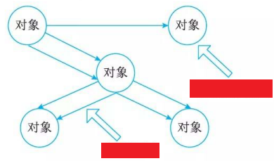
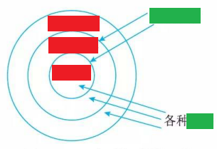
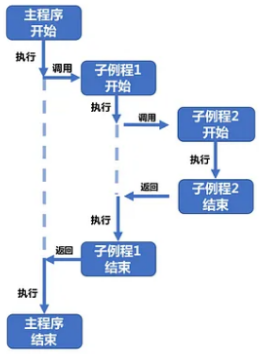
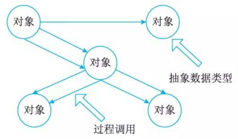
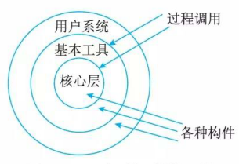
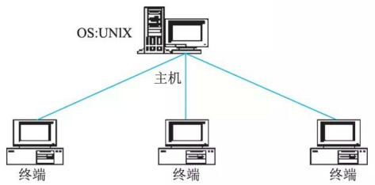
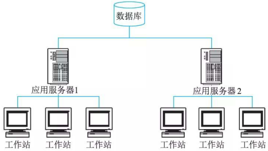

# 调用返回体系结构风格(Call-and-Return Styles)

## 最佳实践

### 问题总结

- 💛(✨2025上)35.下面关于三层C/S架构的特点描述不正确的是( )。
    - A.合理地划分三层的功能，使整个系统的逻辑结构更为清晰，能提高系统的可维护性和可扩展性
    - B.B/S架构是一种特殊的两层C/S架构
    - C.与两层C/S架构相比，在三层C/S架构中，增加了一个应用服务器
    - D.三层C/S架构将应用系统分成表示层、功能层和数据层三个部分

    答案: B

### 考察问

- 💚主程序子程序: 主程序通过`()`子程序来执行特定任务，子程序执行完毕后`()`给主程序.

- 💚面向对象: 在主程序子程序上增加了`()`

    

- 💚层次型: 内部的层接口只对`()`的层可见

    

- 💚客户端服务器:
    - 两层CS体系结构有3个主要组成部分: `()`、`()`和`()`, 简称`()`
    - 三层CS结构(见图)增加了一个`()`, 简称`()`

### 考察点

- 主程序子程序: 主程序通过`调用`子程序来执行特定任务，子程序执行完毕后`将结果返回`给主程序.

    

- 面向对象: 在主程序子程序上增加了`抽象数据封装`

    

- 层次型: 内部的层接口只对`相邻`的层可见

    

- 客户端服务器:
    - 两层CS体系结构有3个主要组成部分: 数据库服务器、客户应用程序和网络, 简称`胖客户机`

        

    - 三层CS结构(见图)增加了一个应用服务器, 简称`瘦客户机`

        

## 调用返回

调用返回风格是指在系统中采用了调用与返回机制。利用调返回实际上是一种分而治之的策略，其主要思想是将一个复杂的大系统分解为若干子系统，以便降低复杂度，并且增加可修改性。程序从其执行起点开始执行该构件的代码，程序执行结束，将控制返回给程序调用构件。调用返回体系结构风格主要包括主程序子程序风格、面向对象风格、层次型风格以及客户端服务器风格。

## 主程序子程序风格(Main Program-Subroutine)

主程序／子程序风格一般采用单线程控制，把问题划分为若干处理步骤，构件即为主程序和子程序。子程序通常可合成为模块。过程调用作为交互机制，即充当连接件。调用关系具有层次性，其语义逻辑表现为子程序的正确性取决于它调用的子程序的正确性。

- 主程序: 程序的整体控制流程，负责调用和协调各个子程序.
- 子程序: 完成特定功能的模块，内部高度内聚，通过参数传递数据.
- 调用/返回机制: 主程序通过调用子程序来执行特定任务，子程序执行完毕后将结果返回给主程序.

## 面向对象体系结构风格

抽象数据类型概念对软件系统有着重要作用，目前软件界已普遍转向使用面向对象系统。这种风格建立在数据抽象和面向对象的基础上，数据的表示方法和它们的相应操作封装在一个抽象数据类型或对象中。这种风格的构件是对象，或者说是抽象数据类型的实例(见图) 。

## 层次型体系结构风格

层次系统(见图) 组成一个层次结构，每一层为上层提供服务，并作为下层的客户。在一些层次系统中，除了一些精心挑选的输出函数外，内部的层接口只对相邻的层可见。这样的系统中构件在层上实现了虚拟机。连接件由通过决定层间如何交互的协议来定义，拓扑约束包括对相邻层间交互的约束。由于每一层最多只影响两层，同时只要给相邻层提供相同的接口，允许每层用不同的方法实现，这同样为软件重用提供了强大的支持。

## 客户端服务器体系结构风格

两层CS体系结构有3个主要组成部分：数据库服务器、客户应用程序和网络。服务器(后台)负责数据管理，客户机(前台)完成与用户的交互任务，称为“胖客户机，瘦服务器”。

三层CS结构(见图)增加了一个应用服务器。整个应用逻辑驻留在应用服务器上，只有表示层存在于客户机上，故称为＂瘦客户机”。应用功能分为表示层、功能层和数据层三层。表示层是应用的用户接口部分，通常使用图形用户界面；功能层是应用的主体，实现具体的业务处理逻辑；数据层是数据库管理系统。以上三层逻辑上独立。

## 参考

- <https://blog.csdn.net/weixin_43452424/article/details/104813972>
