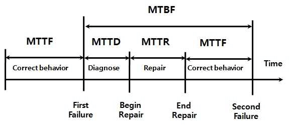

# 质量属性概念

## 最佳实践

### 题目总结

- (✨2025上)63.以下不属于可靠性的是( )。
    - A.容错性
    - B.成熟性
    - C.可恢复性
    - D.健壮性

    答案: D

- (✨2025上)44.智慧教育系统应保护用户的数据隐私，对敏感数据采用密文方式存储。这一需求属于( )需求。
    - A.可用性
    - B.可靠性
    - C.安全性
    - D.性能

    答案: C

1. 基于软件系统的生命周期，可以将软件系统的质量属性分为(  )两个部分。

    - A.需求分析期质量属性和设计期质量属性
    - B.开发期质量属性和运行期质量属性
    - C.设计期质量属性和开发期质量属性
    - D.设计期质量属性和运行期质量属性

    答案：B

2. 在软件系统质量属性(Quality Atribute)中，(  )关注系统在一定时间内正常工作的时间所占的比例；(  )关注软件系统与其他系统交换数据和相互调用服务的难易程度。

    - A.可用性 B.可修改性 C.性能 D.安全性
    - A.可靠性 B.可伸缩性 C.互操作性 D.易用性

    答案：A C

3. 平均失效等待时间(mean time to failure，MTTF)和平均失效间隔时间(mcan time between failure，MTBF)是进行系统可靠性分析时的重要指标，在失效率为常数和修复时间很短的情况下，_____。

    - A.MTTF远远小于MTBF
    - B.MTTF和MTBF无法计算
    - C.MTTF远远大于MTBF
    - D.MTTF和MTBF几乎相等

    答案：D

4. 安全性(Security)是指系统在向合法用户提供服务的同时能够阻止非授权用户使用的企图或拒绝服务的能力。安全性可根据系统可能受到的安全威胁类型来分类。其中，_____保证信息不泄露给未授权的用户、实体或过程；_____是指信息交换的双方不能否认其在交换过程中发送信息或接收信息的行为。

    - A.可控性 B.完整性 C.不可否认性 D.机密性
    - A.完整性 B.机密性 C.不可否认性 D.可控性

    答案：D C

5. 某服务器软件系统对可用性(Availability)、性能(Performance)和可修改性(Modification)的要求较高，(  )设计策略能提高该系统的可用性，(  )设计策略能够提高该系统的性能，(  )设计策略能够提高该系统的可修改性。

    - A Ping/Echo  B 限制访问  C 运行时注册  D 接口-实现分离
    - A 分层结构  B 事务机制  C 主动冗余  D 队列调度
    - A 信息隐藏  B 记录/回放  C 任务模型  D 回滚

    答案: ADA

6. 某公司欲开发一个电子交易清算系统，在架构设计阶段，公司的架构师识别出3个核心质量属性场景。其中“数据传递时延不大于1s，并提供相应的优先级管理”主要与(  )质量属性相关，通常可采用(  )架构策略实现该属性；“系统采用双机热备，主机必须实时监测对方状态，以便完成系统的实时切换”主要与(  )质量属性相关，通常可采用(  )架构策略实现该属性；“系统应能够防止99%的黑客攻击”主要与(  )质量属性相关，通常可采用(  )架构策略实现该属性。

    - A 可用性 B 性能 C 安全性 D 可修改性
    - A 限制资源 B 引入并发 C 资源仲裁 D 限制访问
    - A 可用性 B 性能 C 安全性 D 可修改性
    - A 记录/回放 B 操作串行化 C 心跳 D 资源调度
    - A 可用性 B 性能 C 安全性 D 可修改性
    - A 检测攻击 B Ping /Echo C 选举 D 权限控制

    答案: BCACCA

7. 质量属性都包含哪些?

### 考察问

- 系统架构评估的质量属性(✨`()`):
    1. `()`
    2. `()`
        1. `()`
        2. `()`
    3. `()`
    4. `()`(✨`()`)
        1. `()`
        2. `()`
        3. `()`
        4. `()`
    5. `()`(✨`()`)
        1. `()`
        2. `()`
        3. `()`
        4. `()`
    6. `()`
    7. `()`
    8. `()`
- 零碎知识
    - 基于软件系统的生命周期，可以将软件系统的质量属性分为`()`质量属性和`()`质量属性两个部分

### 考察点

- 系统架构评估的质量属性(✨`性靠用安, 改变作功, 易重伸`):
    1. `性能`
    2. `可靠性`
        1. `容错性`
        2. `健壮性`
    3. `可用性`
    4. `安全性`(✨`整机不可控审`)
        1. `完整性`
        2. `机密性`
        3. `不可否认性`
        4. `可控性`
    5. `可修改性`(✨`展护移重`)
        1. `可拓展性`
        2. `可维护性`
        3. `可移植性`
        4. `结构重组`
    6. `可变性`
    7. `互操作性`
    8. `功能性`
- 零碎知识
    - 基于软件系统的生命周期，可以将软件系统的质量属性分为`开发期`质量属性和`运行期`质量属性两个部分

## 质量属性概念

软件系统属性包括`功能`属性和`质量`属性，架构的基本需求是在满足`功能`属性的`前提`下，关注软件系统质量属性。

根据GB/T16260.1定义，从管理角度对软件系统质量进行度量，可将影响软件质量的主要因素划分为6种维度特性：功能性、可靠性、易用性、效率、维护性与可移植性。其中

- 功能性包括适合性、准确性、互操作性、依从性、安全性
- 可靠性包括容错性、易恢复性、成熟性
- 易用性包括易学性、易理解性、易操作性
- 效率包括资源特性和时间特性
- 维护性包括可测试性、可修改性、稳定性和易分析性
- 可移植性包括适应性、易安装性、一致性和可替换性

基于软件系统的生命周期，可以将软件系统的质量属性分为开发期质量属性和运行期质量属性2个部分。

1. 开发期质量属性

    - 易理解性：指设计被开发人员理解的难易程度。
    - 可扩展性：软件因适应新需求或需求变化而增加新功能的能力，也称为灵活性。
    - 可重用性：指重用软件系统或某一部分的难易程度。
    - 可测试性：对软件测试以证明其满足需求规范的难易程度。
    - 可维护性：当需要修改缺陷、增加功能、提高质量属性时，识别修改点并实施修改的难易程度。
    - 可移植性：将软件系统从一个运行环境转移到另一个不同的运行环境的难易程度。

2. 运行期质量属性

    - 性能：性能是指软件系统及时提供相应服务的能力，如速度、吞吐量和容量等的要求。
    - 安全性：指软件系统同时兼顾向合法用户提供服务，以及阻止非授权使用的能力。
    - 可伸缩性：指当用户数和数据量增加时，软件系统维持高服务质量的能力。例如，通过增加服务器来提高能力。
    - 互操作性：指本软件系统与其他系统交换数据和相互调用服务的难易程度。
    - 可靠性：软件系统在一定的时间内待续无故障运行的能力。
    - 可用性：指系统在一定时间内正常工作的时间所占的比例。可用性会受到系统错误，恶意攻击，高负载等问题的影响。
    - 鲁棒性：是指软件系统在非正常情况(如用户进行了非法操作、相关的软硬件系统发生了故障等)下仍能够正常运行的能力，也称健壮性或容错性。

## 面向架构评估的质量属性

在架构评估过程中，评估人员所关注的是系统的质量属性。

1. 性能(Performance)

    系统的响应能力，即要经过多长时间才能对某个事件做出响应，或者在某段事件内系统所能处理的事件的个数。经常用单位时间内所处理事务的数量或系统完成某个事务处理所需的时间来对性能进行定量表示。性能测试经常要使用基准测试程序。

2. 可靠性(Reliability)

    软件系统在应用或系统错误面前，在意外或错误使用的情况下维持软件系统的功能特性的基本能力。

    可靠性通常用平均失效等待时间(Mean Time To Failure, MTTF)和平均失效间隔时间(Mean Time Between Failure,  MTBF)来衡量。在失效率为常数和修复时间很短的情况下，MTTF和MTBF几乎相等。

    `可靠性 = MTTF/(MTTF + MTTR)*100%`。

    1. 平均失效等待时间(Mean Time To Failure，MTTF)错误修复开始到下一次错误发生(正常运行)
    2. 平均恢复时间(Mean Time To Repair, MTTR)：平均修复时间，从出现故障到修复成功的时间
    3. 平均失效间隔时间(Mean Time Between Failure，MTBF)错误发生到下一次错误发生。MTBF = MTTF + MTTR。

    

    ✨在失效率为常数和修复时间很短的情况下，MTTF和MTBF几乎相等。

    可靠性可以分为两个方面。

    1. `容错`。容错的目的是在错误发生时确保系统正确的行为，并进行内部“修复“。例如在一个分布式软件系统中失去了一个与远程构件的连接，接下来恢复了连接。(主动修复)

    2. `健壮性`。这里说的是保护应用程序不受错误使用和错误输入的影响，在发生意外错误事件时确保应用系统处于预先定义好的状态。值得注意的是，和容错相比，健壮性并不是说在错误发生时软件可以继续运行，它只能保证软件按照某种已经定义好的方式终止执行。例如，软件架构设计上通过在应用程序内部采用冗余机制，或集成监控构件和异常处理，以提升系统可靠性。(被动修复)

3. 可用性(Availability)

    系统能够正常运行的时间比例。经常用两次故障之间的时间长度或在出现故障时系统能够恢复正常的速度来表示。

    可用性 =（正常运行时间 ÷ 总时间）× 100, 示例：8756小时正常运行时间 ÷ 8760小时总时间 = 99.95%的系统可用性

    - 正常运行时间(Uptime)：指系统、设备或服务处于正常工作状态、可正常使用的总时长，不包含因故障、维护等导致的停机时间。  
    - 总时间(Total Time)：指统计周期内的完整时长，常见周期如1天（24小时）、1年（非闰年8760小时）、1个月（约

4. 安全性 (Security)

    系统在向合法用户提供服务的同时能够阻止非授权用户使用的企图或拒绝服务的能力。安全性可根据系统可能受到的安全威胁类型来分类。安全性又可划分为机密性、完整性、不可否认性及可控性等特性。

    1. `机密性`保证信息不泄露给未授权的用户、实体或过程；
    2. `完整性`保证信息的完整和准确，防止信息被非法修改；
    3. `不可否认性`是指信息交换的双方不能否认其在交换过程中发送信息或接收信息的行为；
    4. `可控性`保证对信息的传播及内容具有控制的能力，防止为非法者所用。

5. 可修改性 (Modifiabilit)

    能够快速地以较高的性价比对系统进行变更的能力。通常以某些具体的变更为基准，通过考查这些变更的代价来衡量可修改性。可修改性包含以下4个方面。

    1. `可维护性`(Maintainabi lity)。这主要体现在问题的修复上，在错误发生后“修复“软件系统。可维护性好的软件架构往往能做局部性的修改并能使对其他构件的负面影响最小化。
    2. `可扩展性`(Extendibility)。这一点关注的是使用新特性来扩展软件系统，以及使用改进版本方式替换构件并删除不需要或不必要的特性和构件。为了实现可扩展性，软件系统需要松散耦合的构件。其目标是实现一种架构，能使开发人员在不影响构件客户的情况下替换构件。支持把新构件集成到现有的架构中也是必要的。
    3. `结构重组`(Reassemble) 。这一点处理的是重新组织软件系统的构件及构件间的关系，例如通过将构件移动到一个不同的子系统而改变它的位置。为了支待结构重组，软件系统需要精心设计构件之间的关系。理想情况下，它们允许开发人员在不影响实现的主体部分的情况下灵活地配置构件。
    4. `可移植性`(Portability)。可移植性使软件系统适用于多种硬件平台、用户界面、操作系统、编程语言或编译器。为了实现可移植，需要按照硬件、软件无关的方式组织软件系统。可移植性是系统能够在不同计算环境下运行的能力，这些环境可能是硬件、软件，也可能是两者的结合。如果移植到新的系统需要做适当更改，则该可移植性就是一种特殊的可修改性。

6. 功能性(Functionality)

    系统能完成所期望的工作的能力。一项任务的完成需要系统中许多或大多数构件的相互协作。

7. 可变性 (Changeability)

    架构经扩充或变更而成为新架构的能力。这种新架构应该符合预先定义的规则，在某些具体方面不同于原有的架构。当要将某个架构作为一系列相关产品(例如，软件产品线)的基础时，可变性是很重要的。

8. 互操作性(interoperability)

    作为系统组成部分的软件不是独立存在的，通常与其他系统或自身环境相互作用。为了支持互操作性，软件架构必须为外部可视的功能特性和数据结构提供精心设计的软件入口。程序和用其他编程语言编写的软件系统的交互作用就是互操作性的问题，这种互操作性也影响应用的软件架构。
