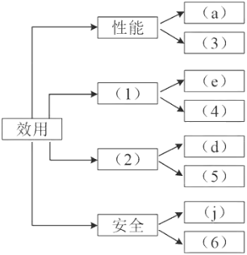
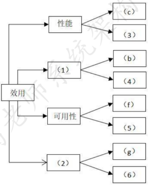
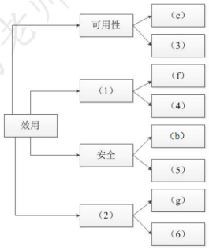
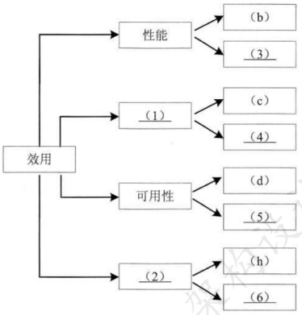
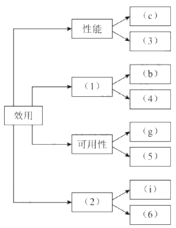
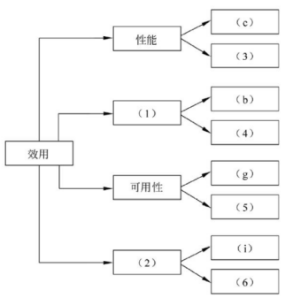
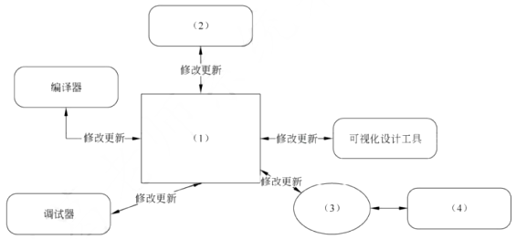
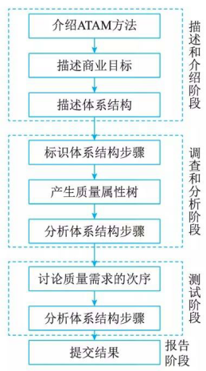
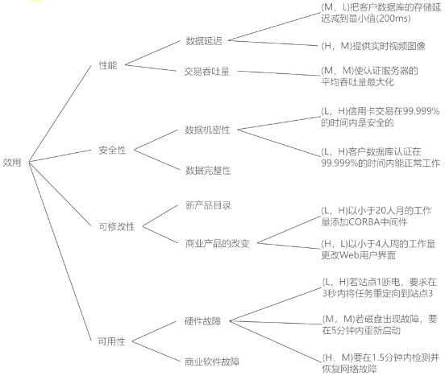

# ATAM方法架构评估实践

## 最佳实践

### 题目总结
- 论文: 论软件系统架构评估及其应用
1. 在ATAM评估方法设计之初，其主要关注的4种质量属性，分别为______。

    - A. 性能、安全性、可修改性和可测试性
    - B. 性能、安全性、可修改性和可用性
    - C. 性能、可修改性、可用性和可测试性
    - D. 安全性、可测试性、可用性和可测试性

    答案: B

2. 效用树是采用架构权衡分析方法(Architecture Trade off Analysis Method，ATAM)进行架构评估的工具之一，其树形结构从根部到叶子节点依次为______。

    - A. 树根、属性分类、优先级、质量属性场景
    - B. 树根、质量属性、属性分类、质量属性场景
    - C. 树根、优先级、质量属性、质量属性场景
    - D. 树根、质量属性、属性分类、优先级

答案: B

1. 改变加密级别可能会对安全性和性能产生非常重要的影响，因此在软件架构评估中，该设计决策是一个______。

    - A. 敏感点
    - B. 风险点
    - C. 权衡点
    - D. 非风险点

    答案: C

2. 识别风险、非风险、敏感点和权衡点是进行软件架构评估的重要过程。“改变业务数据编码方式会对系统的性能和安全性产生影响”是对(  )的描述，“假设用户请求的频率为每秒1个，业务处理时间小于30毫秒，则将请求响应时间设定为1秒钟是可以接受的”是对(  )的描述。

    - A 风险点
    - B 非风险
    - C 敏感点
    - D 权衡点

    - A 风险点
    - B 非风险
    - C 敏感点
    - D 权衡点

    答案: DB

3. Architecture Tradeoff Analysis Method(ATAM)是一种软件架构的评估方法，以下关于该方法的叙述中，正确的是(  )。

    - A ATAM是一种代码评估方法
    - B ATAM需要评估软件的需求是否准确
    - C ATAM需要对软件系统进行测试
    - D ATAM不是一种精确的评估工具

    答案: D

4. 体系结构权衡分析方法(Architecture Tradeoff Analysis Method，ATAM)包含4个主要的活动领域，分别是场景和需求收集、体系结构视图和场景实现、(  )、折中。基于场景的架构分析方法(Scenarios-based Architecture Analysis Method，SAAM)的主要输入是问题描述、需求声明和(  )。

- A 架构设计
- B 问题分析与建模
- C 属性模型构造和分析
- D 质量建模

- A 问题说明
- B 问题建模
- C 体系结构描述
- D 需求建模

答案: CC

|  | 性能 | 安全性 | 可用性 | 易用性 | 可测试性 | 可维护性 |
| --- | --- | --- | --- | --- | --- | --- |
| 性能 |  | - |  | - | - | - |
| 安全性 | - |  |  | - | - |  |
| 可用性 |  |  |  |  |  |  |
| 易用性 | - |  | - |  | - |  |
| 可测试性 | - |  |  |  |  | + |
| 可维护性 | - |  | + |  | + |  |

1. (6分)质量属性及其场景(质量效用树)，填空6个。(2024上)

    答：考查质量效用树，如安全性，可用性，功能性，可修改性等。

1. 某网上购物电子商务公司拟升级正在使用的在线交易系统，以提升用户网上购物在线支付环节的效率和安全性。在系统的需求分析与架构设计阶段，公司提出了以下需求和关键质量属性场景：

    1. 正常负载情况下，系统必须在0.5秒内对用户的交易请求进行响应；(性能)
    2. 信用卡支付必须保证99.999%的安全性；(安全性)
    3. 对交易请求处理时间的要求将影响系统的数据传输协议和处理过程的设计；(敏感点)
    4. 网络失效后，系统需要在1.5分钟内发现错误并启用备用系统；(可用性)
    5. 需要在20人月内为系统添加一个新的CORBA中间件；(可修改性)
    6. 交易过程中涉及到的产品介绍视频传输必须保证画面具有600*480的分辨率，20帧/秒的速率；(性能)
    7. 更改加密的级别将对安全性和性能产生影响；(权衡点)
    8. 主站点断电后，需要在3秒内将访问请求重定向到备用站点；(可用性)
    9. 假设每秒用户交易请求的数量是10个，处理请求的时间为30毫秒，则“在1秒内完成用户的交易请求”这一要求是可以实现的；
    10. 用户信息数据库授权必须保证99.999%可用；(安全性)
    11. 目前对系统信用卡支付业务逻辑的描述尚未达成共识，这可能导致部分业务功能模块的重复，影响系统的可修改性；(风险点)
    12. 更改Web界面接口必须在4人周内完成；(可修改性)
    13. 系统需要提供远程调试接口，并支持系统的远程调试。(可测试性)

2. 在对系统需求和质量属性场景进行分析的基础上，系统架构师给出了三个候选的架构设计方案，公司目前正在组织系统开发的相关人员对系统架构进行评估。

    1. (12分)在架构评估过程中，质量属性效用树(utility tree)是对系统质量属性进行识别和优先级排序的重要工具。请给出合适的质量属性，填入下图中(1)、(2)空白处；并选择题干描述的(a)～(m)，填入(3)～(6)空白处，完成该系统的效用树。

        

    2. 在架构评估过程中，需要正确识别系统的架构风险、敏感点和权衡点，并进行合理的架构决策。请用300字以内的文字给出系统架构风险、敏感点和权衡点的定义，并从题干(a)～(m)中各选出1个对系统架构风险、敏感点和权衡点最为恰当的描述。

2. 在需求分析与架构设计阶段， 公司提出的需求和质量属性描述如下：

    (a)管理员能够在页面上灵活设置折扣力度规则和促销活动逻辑，设置后即可生效；
    (b)系统应该具备完整的安全防护措施，支持对恶意攻击行为进行检测与报警；
    (c)在正常负载情况下，系统应在0.3秒内对用户的界面操作请求进行响应；
    (d)用户名是系统唯一标识，要求以字母开头，由数字和字母组合而成，长度不少于6个字符；
    (e)在正常负载情况下，用户支付商品费用后在3秒内确认订单支付信息；
    (f)系统主站点电力中断后，应在5秒内将请求重定向到备用站点；
    (g)系统支持横向存储扩展，要求在2人天内完成所有的扩展与测试工作；
    (h)系统宕机后，需要在10秒内感知错误，并自动启动热备份系统；
    (i)系统需要内置接口函数，支持开发团队进行功能调试与系统诊断；
    (j)系统需要为所有的用户操作行为进行详细记录，便于后期查阅与审计；
    (k)支持对系统的外观进行调整和配置，调整工作需要在4人天内完成。

    在架构评估过程中，质量属性效用树 (utility tree)是对系统质量属性进行识别和优先级排序的重要工具。请将合适的质量属性名称填入图1 - 1中(1)、(2)空白处，并选择题干描述的(a)~(k)填入(3)~(6)空白处，完成该系统的效用树。(2022下)

    

    (1)安全性 (2)可修改性 (3)e (4)j (5)h (6)k

3. 在需求分析与架构设计阶段，公司提出的需求和质量属性描述如下：

    (a)平台用户分为算法工程师、软件工程师和管理员等三种角色，不同角色的功能界面有所不同；
    (b)平台应该具备数据库保护措施，能够预防核心数据库被非授权用户访问；
    (c)平台支持分布式部署，当主站点断电后，应在20秒内将请求重定向到备用站点；
    (d)平台支持初学者和高级用户两种界面操作模式，用户可以根据自己的情况灵活选择合适的模式；
    (e)平台主站点宕机后，需要在15秒内发现错误并启用备用系统；
    (f)在正常负载情况下，机器学习流程从提交到开始执行，时间间隔不大于5秒；
    (g)平台支持硬件扩容与升级，能够在3人天内完成所有部署与测试工作；
    (h)平台需要对用户的所有操作过程进行详细记录，便于审计工作；
    (i)平台部署后，针对界面风格的修改需要在3人天内完成；
    (j)在正常负载情况下，平台应在0.5秒内对用户的界面操作请求进行响应；
    (k)平台应该与目前国内外主流的机器学习应用开发平台的界面风格保持一致；
    (l)平台提供机器学习算法的远程调试功能，支持算法工程师进行远程调试。

    

    1. (9分)在架构评估过程中，质量属性效用树(utility tree)是对系统质量属性进行识别和优先级排序的重要工具。请将合适的质量属性名称填入图1-1中(1)、(2)空白处，并从题干中的(a)-(l)选择合适的质量属性描述，填入(3)-(6)空白处，完成该平台的效用树。(2021下)

        (1)性能
        (2)可修改性
        (3)e
        (4)j
        (5)h
        (6)i

在需求分析与架构设计阶段，公司提出的需求和质量属性描述如下：
(a)根据用户的付费情况对用户进行分类，并根据类别提供相应的开发功能；
(b)在正常负载情况下，系统应在0.2秒内对用户的界面操作请求进行响应；
(c)系统应该具备完善的安全防护措施，能够对黑客的攻击行为进行检测与防御；
(d)系统主站点断电后，应在3秒内将请求重定向到备用站点；
(e)系统支持中文昵称，但用户名必须以字母开头，长度不少于8个字符；
(f)系统宕机后，需要在15秒内发现错误并启用备用系统；
(g)在正常负载情况下，用户的代码提交请求应该在0.5秒内完成；
(h)系统支持硬件设备灵活扩容，应保证在2人·天内完成所有的部署与测试工作；
(i)系统需要为针对代码仓库的所有操作情况进行详细记录，便于后期查阅与审计；
(j)更改系统的web界面风格需要在4人·天内完成；
(k)系统本身需要提供远程调试接口，支持开发团队进行远程排错。

1. (12分)在架构评估过程中，质量属性效用树(utility tree)是对系统质量属性进行识别和优先级排序的重要工具。请将合适的质量属性名称填入图1 - 1中(l)、(2)空白处，并选择题干描述的(a)～(k)填入(3)～(6)空白处，完成该系统的效用树。(2020下)

    

    参考答案：(1)安全性(2)可修改性(3)g(4)i(5)f(6)j

某电子商务公司为了更好地管理用户，提升企业销售业绩，拟开发一套用户管理系统。该系统的基本功能是根据用户的消费级别、消费历史、信用情况等指标将用户划分为不同的等级，并针对不同等级的用户提供相应的折扣方案。在需求分析与架构设计阶段，电子商务公司提出的需求、质量属性描述和架构特性如下：
(a)用户目前分为普通用户、银卡用户、金卡用户和白金用户四个等级，后续需要能够根据消费情况进行动态调整；
(b)系统应该具备完善的安全防护措施，能够对黑客的攻击行为进行检测与防御；
(c)在正常负载情况下，系统应在0.5秒内对用户的商品查询请求进行响应；
(d)在各种节假日或公司活动中，针对所有级别用户，系统均能够根据用户实时的消费情况动态调整折扣力度；
(e)系统主站点断电后，应在5秒内将请求重定向到备用站点；
(f)系统支持中文昵称，但用户名要求必须以字母开头，长度不少于8个字符；
(g)当系统发生网络失效后，需要在15秒内发现错误并启用备用网络；
(h)系统在展示商品的实时视频时，需要保证视频画面具有1024×768像素的分辨率，40帧/秒的速率；
(i)系统要扩容时，应保证在10人·月内完成所有的部署与测试工作；
(j)系统应对用户信息数据库的所有操作都进行完整记录；

1. (8分)针对该系统的需求，在面向对象和基于规则的两种架构风格中，哪种架构风格更适合？请从灵活性、可扩展性和性能三个方面对这两种架构风格进行比较与分析，并简要说明选择理由。(2019下)

    |架构风格名称|灵活性|可扩展性|性能|
    | ---- | ---- | ---- | ---- |
    |面向对象|将用户级别,折扣规则等封装为对象，在系统启动时加载|(2)|(3)|
    |基于规则|(1)|加入新的用户级别和折扣规则时只需要定义新的规则，解释规则即可进行扩展|需要对用户级别与折扣规则进行实时解释、性能较差|

    该系统更适合采用基于规则的虚拟机架构风格。
    1. 根据用户级别建立用户级别 - 折扣规则矩阵，在系统启动时加载并支持运行过程中动态更新，灵活性好；
    2. 加入新的用户级别和折扣规则时需要增加相应的类来扩展，可通过系统重启、动态反射或动态加载扩展，扩展性较差；
    3. 可根据类型判断或策略模式直接获得用户级别对应的折扣规则对象实时计算，性能很好。

2. 在架构评估过程中，质量属性效用树(Utility Tree)是对系统质量属性进行识别和优先级排序的重要工具。请将合适的质量属性名称填入图1 - 1中(1)、(2)空白处，并选择题干描述的(a)~(l)填入(3)~(6)空白处，完成该系统的效用树。(2019下)

    

    (1)安全性(2)可修改性(3)h(4)j(5)e(6)k

某文化产业集团委托软件公司开发一套文化用品商城系统，业务涉及文化用品销售、定制、竞拍和点评等板块，以提升商城的信息化建设水平。该软件公司组织项目组完成了需求调研，现已进入到系统架构设计阶段。考虑到系统需求对架构设计决策的影响，项目组先列出了可能影响系统架构设计的部分需求如下：

(a)用户界面支持用户的个性化定制；
(b)系统需要支持当前主流的标准和服务，特别是通信协议和平台接口；
(c)用户操作的响应时间应不大于3秒，竞拍板块不大于1秒；
(d)系统具有故障诊断和快速恢复能力；
(e)用户密码需要加密传输；
(f)系统需要支持不低于2GB的数据缓存；
(g)用户操作停滞时间超过一定时限需要重新登录验证；
(h)系统支持用户选择汉语、英语或法语三种语言之一进行操作。

项目组提出了两种系统架构设计方案：瘦客户端C/S架构和胖客户端C/S架构，经过对上述需求逐条分析和讨论，最终决定采用瘦客户端C/S架构进行设计。

1. (8 分)在系统架构设计中，决定系统架构设计的非功能性需求主要有四类：操作性需求、性能需求、安全性需求和文化需求。请简要说明四类需求的含义。(2018下)

    1. 操作性需求：指系统完成任务所需的操作环境要求及如何满足系统将来可能的需求变更的要求。
    2. 性能需求：针对系统性能要求的指标，如吞吐率、响应时间和容量等。
    3. 安全性需求：指为防止系统崩溃和保证数据安全所需要采取的保护措施的要求，为系统提供合理的预防措施。
    4. 文化需求：指使用本系统的不同用户群体对系统提出的特有要求。

2. (8 分)根据表 1 - 1 的分类，将题干所给出的系统需求(a)~(h)分别填入(1)(4)。

    |需求类别|系统需求|
    | ---- | ---- |
    |操作性需求|(1)|
    |性能需求|(2)|
    |安全性需求|(3)|
    |文化需求|(4)|

    1. (b)、(d)
    2. (c)、(f)
    3. (e)、(g)
    4. (a)、(h)

3. (9 分)请用 100 字以内文字说明瘦客户端 C/S 架构能够满足题干中给出的哪些系统需求。

    瘦客户端C/S架构能够更好地满足系统需求中的(a)、(b)、(d)和(h)。

某单位为了建设健全的公路桥梁养护管理档案，拟开发一套公路桥梁在线管理系统。在系统的需求分析与架构设计阶段，用户提出的需求、质量属性描述和架构特性如下：
(a)系统用户分为高级管理员、数据管理员和数据维护员等三类；
(b)系统应该具备完善的安全防护措施，能够对黑客的攻击行为进行检测与防御；
(c)正常负载情况下，系统必须在 0.5 秒内对用户的查询请求进行响应；
(d)对查询请求处理时间的要求将影响系统的数据传输协议和处理过程的设计；
(e)系统的用户名不能为中文，要求必须以字母开头，长度不少于 5 个字符；
(f)更改系统加密的级别将对安全性和性能产生影响；
(g)网络失效后，系统需要在 10 秒内发现错误并启用备用系统；
(h)查询过程中涉及的桥梁与公路的实时状态视频传输必须保证画面具有 1024×768 的分辨率，40 帧/秒的速率；
(i)在系统升级时，必须保证在 10 人月内可添加一个新的消息处理中间件；
(k)系统主站点断电后，必须在 3 秒内将请求重定向到备用站点；
(h)如果每秒钟用户查询请求的数量是 10 个，处理单个请求的时间为 30 毫秒，则系统应保证在 1 秒内完成用户的查询请求；
(l)对桥梁信息数据库的所有操作都必须进行完整记录；
(m)更改系统的 Web 界面接口必须在 4 人周内完成；
(n)如果“养护报告生成”业务逻辑的描述尚未达成共识，可能导致部分业务功能模块规则的矛盾，影响系统的可修改性；
(o)系统必须提供远程调试接口，并支持系统的远程调试。在对系统需求、质量属性描述和架构特性进行分析的基础上，系统的架构师给出了三个候选的架构设计方案，公司目前正在组织系统开发的相关人员对系统架构进行评估。

1. (12 分)在架构评估过程中，质量属性效用树(utility tree)是对系统质量属性进行识别和优先级排序的重要工具。请给出合适的质量属性，填入图 1 - 1 中(1)、(2)空白处；并选择题干描述的(a)~(o)，填入(3)~(6)空白处，完成该系统的效用树。(2017下)

    

    | 编号 | 答案 |
    | ---- | ---- |
    | (1) | 安全性 |
    | (2) | 可修改性 |
    | (3) | (h) |
    | (4) | (l) |
    | (5) | (j) |
    | (6) | (m) |

2. (13 分)在架构评估过程中，需要正确识别系统的架构风险、敏感点和权衡点，并进行合理的架构决策。请用 300 字以内的文字给出系统架构风险、敏感点和权衡点的定义，并从题干(a)~(o)中分别选出 1 个对系统架构风险、敏感点和权衡点最为恰当的描述。(2017下)

    系统架构风险是指架构设计中潜在的、存在问题的架构决策所带来的隐患。敏感点是指为了实现某种特定的质量属性，一个或多个系统组件所具有的特性。权衡点是指影响多个质量属性，并对多个质量属性来说都是敏感点的系统属性。题干描述中，
    (n)描述的是系统架构风险；
    (d)描述的是敏感点；
    (f)描述的是权衡点。

某软件公司为某品牌手机厂商开发一套手机应用程序集成开发环境，以提高开发手机应用程序的质量和效率。在项目之初，公司的系统分析师对该集成开发环境的需求进行了调研和分析，具体描述如下：

1. 需要同时支持该厂商自行定义的应用编程语言的编辑、界面可视化设计、编译、调试等模块，这些模块产生的模型或数据格式差异较大，集成环境应提供数据集成能力。集成开发环境还要支持以适配方式集成公司现有的应用模拟器工具。
2. 经过调研，手机应用开发人员更倾向于使用 Windows 系统，因此集成开发环境的界面需要与 Windows 平台上的主流开发工具的界面风格保持一致。
3. 支持相关开发数据在云端存储，需要保证在云端存储数据的机密性和完整性。
4. 支持用户通过配置界面依据自己的喜好修改界面风格，包括颜色、布局、代码高亮方式等，配置完成后无须重启环境。
5. 支持不同模型的自动转换。在初始需求中定义的机器性能条件下，对于一个包含 50 个对象的设计模型，将其转换为相应代码框架时所消耗时间不超过 5 秒。
6. 能够连续运行的时间不小于 240 小时，意外退出后能够在 10 秒之内自动重启。
7. 集成开发环境具有模块化结构，支持以模块为单位进行调试、测试与发布。
8. 支持应用开发过程中的代码调试功能：开发人员可以设置断点，启动调试，编辑器可以自动卷屏并命中断点，能通过变量监视器查看当前变量取值。

在对需求进行分析后，公司的架构师小张查阅了相关的资料，认为该集成开发环境应该采用管道 - 过滤器(Pipe - Filter)的架构风格，公司的资深架构师王工在仔细分析后，认为应该采用数据仓储(Data Repository)的架构风格。公司经过评审，最终采用了王工的方案。

1. (10 分)识别软件架构质量属性是进行架构设计的重要步骤。请分析题干中的需求描述，填写表 1 - 1 中(1)~(5)处的空白。(2016下)

    |质量属性名称|需求描述编号|
    | ---- | ---- |
    |可用性|(1)|
    |(2)|e|
    |可修改性|(3)|
    |可测试性|(4)|
    |安全性|c|
    |易用性|(5)|

    (1)f(2)性能(3)d(4)g(5)b

2. (7 分)请在阅读题干需求描述的基础上，从交互方式、数据结构、控制结构和扩展方法 4 个方面对两种架构风格进行比较，填写表 1 - 2 中(1)~(4)处的空白。

    |比较因素|管道 - 过滤器风格|数据仓储风格|
    | ---- | ---- | ---- |
    |交互方式|顺序结构或有限的循环结构|(1)|
    |数据结构|(2)|文件或模型|
    |控制结构|(3)|业务功能驱动|
    |扩展方法|接口适配|(4)|

    (1)工具之间无直接交互，通过数据仓储间接交互
    (2)流式数据
    (3)数据驱动
    (4)与数据仓储进行数据适配

3. (8 分)在确定采用数据仓库架构风格后，王工给出了集成开发环境的架构图。请填写图 1 - 1 中(1)~(4)处的空白，完成该集成开发环境的架构图。

    

    (1)模型/数据库
    (2)代码编辑工具
    (3)数据格式转换器
    (4)模拟器

4. 该系统还需满足以下非功能性需求：

    - (a)系统应支持大于100个工业设备的并行监测；
    - (b)设备数据从制造现场传输到系统后台的传输时间小于1s；
    - (c)系统应7×24小时工作；
    - (d)可抵御常见XSS攻击；
    - (e)系统在故障情况下，应在0.5小时内恢复；
    - (f)支持数据审计。

    问题:

    1. (6分)请按照性能、安全性和可用性等三类非功能性需求分类，选择题干描述的(a)~(f)填入(1)~(3)。(2020下)

        |非功能性需求类别|非功能性需求|
        | ---- | ---- |
        |性能|(1)|
        |安全性|(2)|
        |可用性|(3)|

        (1)a、b(2)d、f(3)c、e

5. 其非功能性需求如下：

    - (1)系统应支持大于50个终端设备的并发请求；
    - (2)系统应能够实时识别车牌，识别时间应小于1s；
    - (3)系统应7×24小时工作；
    - (4)具有友好的用户界面；
    - (5)可抵御常见SQL注入攻击；
    - (6)独立事务操作响应时间应小于3s；
    - (7)系统在故障情况下，应在1小时内恢复；
    - (8)新用户学习使用系统的时间少于1小时。

    1. (4分)请将上述非功能性需求(1)~(8)归类到性能、安全性、可用性、易用性这四类非功能性需求。(2019下)

        性能：(1)、(2)、(6)
        安全性：(5)
        可用性：(3)、(7)
        易用性：(4)、(8)

### 考察问
- 论文: 论软件系统架构评估及其应用
- 情景生成: `()`, `()`, `()`

- 质量属性效用树:

    1. 树根: `()`
    2. 1级分支: `()`(性能, 可用性, 安全性, 可修改性)
    3. 2级分支: 质量属性的`()`
        1. 性能: 响应延迟, 吞吐量
        2. 可用性: 软硬件故障
        3. 安全性: 机密性, 完整性
        4. 可修改行: 新产品, 业务改变
    4. 3级分支: `()`

- 敏感点, 权衡点, 风险点和非风险点
    - 敏感点: 为实现质量属性, 架构的`()`
    - 权衡点: 多个质量属性的权衡
    - 风险点:
    - 非风险点:

- ATAM: ✨`()`
    1. 介绍: 业务
    2. 分析: `()`
        1. `()`生成
        2. `()`生成
    3. 测试: ✨`()`
        1. 质量属性`()`
        2. 并分析`()`, `()`, `()`
    4. 报告

### 考察点
- 论文: 论软件系统架构评估及其应用
- 情景生成: `利益相关者`, `场景`, `质量属性`

- 质量属性效用树:

    1. 树根: `效用`
    2. 1级分支: `质量属性`(性能, 可用性, 安全性, 可修改性)
    3. 2级分支: 质量属性的`评估指标`
        1. 性能: 响应延迟, 吞吐量
        2. 可用性: 软硬件故障
        3. 安全性: 机密性, 完整性
        4. 可修改行: 新产品, 业务改变
    4. 3级分支: `场景`

- 敏感点, 权衡点, 风险点和非风险点
    - 敏感点: 为实现质量属性, 架构的`特点`
    - 权衡点: 多个质量属性的权衡
    - 风险点:
    - 非风险点:

- ATAM: ✨`介绍, 分析, 测试, 报告`
    1. 介绍: 业务
    2. 分析: `情景, 效用树`
        1. `情景`生成
        2. `质量属性效用树`生成
    3. 测试: ✨`排序, 并分析3点`
        1. 质量属性`排序`
        2. 并分析`敏感点`, `权衡点`, `风险点`
    4. 报告

- 零碎知识
    - ATAM`不是`一种精确的评估工具
    - ATAM包含4个活动领域: `场景和需求收集`、`体系结构视图和场景实现`、`属性模型构造和分析`、`折中`
    - 场景的架构分析方法(SAAM)主要输入是`问题描述`、`需求声明`和`体系结构描述`

## ATAM

用ATAM方法评估软件体系结构，其工作分为4个基本阶段，即演示、调查和分析、测试和报告ATAM

## 阶段1演示

1. 第1步：介绍ATAM

    在此步骤中，评估负责人向所有相关参与者提供有关ATAM过程的一般信息。

2. 第2步：介绍业务驱动因素

    这一步着重于系统的业务视角。它提供了有关系统功能、主要利益相关方、业务目标和系统其他限制的更多信息。

3. 第3步：介绍要评估的体系结构

    架构团队描述了要评估的架构。它侧重于体系结构、时间可用性以及体系结构的质量要求。

    下面将详细介绍胡佛事件架构和“银行”事件架构。

## 阶段2调查和分析

### 第4步:确定架构方法

1. 胡佛的架构

    在此体系结构中，系统从闲置处理程序生成的命令提示符处接受输入。输入事件被传递给事件管理器，事件管理器将事件存储在事件队列中。主进程从事件队列中取出事件，并将其分派给事件管理器进行处理。事件管理器将事件绑定到其相应的事件处理程序。如果事件未被注册，则事件管理器丢弃该事件并将控制传递给主进程。下一个要处理的事件从事件队列中取出，并再次发送给事件管理器。如果没有要处理的事件，则会生成空闲事件，执行空闲等待，直到从系统用户接收到输入为止。如果事件在事件管理器事件注册表中已注册，则事件与正确的事件处理程序匹配。该处理程序执行该事件，可能导致系统状态的变化。

    从质量属性角度来看结构，可以提出以下几点。从图 8-6 中可以清楚地看出框架之外的应用。每个组件都可以独立出来并重新使用。因此，该架构具有高度的可修改性。另外，这些组件相互之间适当地进行交互并执行其预期的工作，实现功能的质量属性。由千应用程序构建器提供了明确的钩子接口，使得架构也可以扩展。

2. “银行”活动架构

    在此体系结构中，系统由“开始”事件初始化，该事件在内部生成并处理。从空闲处理程序生成的命令提示符处接收输入。当输入事件输入时， IDLE_Handler 检查它的有效性，将事件传递并存储在事件队列的主模块中，作为有效输入。处理事件时，首先从队列中提取事件并分派给事件管理器进一步处理。由千在初始阶段消除了有缺陷的输入，并且事件管理器知道应用程序处理程序会将相应的处理程序与事件进行匹配，并执行事件。如果事件队列中没有可处理的事件，则事件队列发送空闲事件。

    关千这个架构中提到的质量属性，需要注意以下几点： 1) 这种体系结构的一个明显缺陷是，事件管理器组件暴露给了应用程序，没有在框架中封装(见图 8-7) 。因此可修改性较差。2) 这些组件高度相互依赖，互相协同以完成特定功能。由千组件的相互依赖性，此架构的可重用性较差。 3) 空闲事件的输入需要额外的处理空间，因为对其进行解析并消除任何有缺陷的输入，才能保证架构的可靠性。

### 第5步：生成质量属性效用树

效用树提供了一种使系统目标更加具体的方法，还提供了质量属性目标重要性的比较方式。因此，效用树表达了系统的整体“良好”程度。最重要的是，效用树包含了与系统有关的`质量属性`，以及对`利益相关者`重要的质量属性要求(称之为`情景`)。情景是一个说明利益相关者和系统之间的相互作用的陈述。这些情景用来判断架构的质量目标。

在这个项目中， Event系统有两个相互竞争的体系结构，在这一步中，将会有一个实用程序树代表系统的质量目标，这些场景是代表三个利益相关者生成的：最终用户、架构师和应用程序开发人员。

1. 情景生成

    |利益相关者|场景|质量属性|
    | ---- | ---- | ---- |
    |用户|针对系统的未授权访问|安全性|
    |用户|所有操作以尽可能快的速度处理|性能|
    |用户|失效发生后应该立即回复|可用性|
    |用户|处理使用系统过程中的用户错误|可靠性|
    |用户|处理针对系统功能的新需求|可修改性|
    |架构师|框架的主要部分应该支持重用|可变性|
    |架构师|框架的修改开销小、速度快、时间短|可修改性|
    |架构师|框架中的组件能够协同交互|功能性|
    |架构师|框架能够扩展以支持更复杂的选项|可变性|
    |架构师|可以在不同环境中执行|可移植性|
    |架构师|合适的数据封装和安全的数据结构|安全性|
    |架构师|可以用其他编程语言灵活实现|可移植性|
    |架构师|架构层面上期望有着全局一致的行为|概念一致性|
    |应用开发人员|框架应该完整、清晰并与需求一致|功能性|

2. 质量属性效用树生成

    效用树以`效用`作为根结点，质量属性构成效用树的辅助级别。在每个质量属性中都会包含特定的质量属性说明，以提供对方案更精确的描述。后者形成了实用程序树中的叶节点。效用树沿着两个维度进行优先顺序：每个场景对系统成功的重要性以及对此场景实现(从架构师的角度来看)所带来的难易程度的估计。效用树中的优先级排名为高(H) 、中 (M) 和低 (L) 。

    质量效用树(拓展):

    ATAM方法采用效用树(Utility tree)这一工具来对质量属性进行分类和优先级排序。效用树的结构包括：效用(根节点)->质量属性->属性细分->质量属性场景(叶子节点)。需要注意的是，ATAM主要关注4类质量属性：`性能`、`安全性`、`可修改性`和`可用性`，这是因为这4个质量属性是利益相关者最为关心的。

    

### 第6步:分析体系结构方法

根据这些质量属性分析这两种架构，并为它们提供适当的解释。这里还确定了每种架构方法的风险、非风险、敏感点和权衡点。

从步骤5的效用树中，提取高优先级场景。例如，请考虑步骤5中效用程序树的以下两个方案：

- (L, M) 所有操作都以最快的速度处理(性能)。
- (H, M) 应该处理系统中的用户错误(可靠性)。

场景旁边的 (L, M) 和 (H, M) 所示这些场景的优先级，从而决定选择哪个质量属性。在这个例子中，选择第2种方案是因为它对系统的成功和架构师的中等难度具有高度重要性。第1种情况不被考虑，因为它对系统的重要性不高。从效用树中获得的高优先级属性是可变性、可靠性、集成性( Conceptual Integrity)、功能性和可修改性。质量属性(如性能、可用性、安全性和可移植性)没有被赋予高优先级，因为它们对系统目标不那么重要。

这一步可分为四个主要阶段：

1. 调查架构方法。
2. 创建分析问题。
3. 分析问题的答案。
4. 找出风险、非风险、敏感点和权衡点。

具体来说:

1. 调查架构方法

    在识别出对系统目标至关重要的质量属性后，我们分析两种架构并确定它们如何支持这些质量属性。我们对体系结构进行详细的调查，以了解这些质量属性要求是否得到满足。

    (l) 可变性。可变性是定义如何扩展或修改架构以生成新体系结构的属性。

    胡佛架构。胡佛架构如图 8-6 所示，该框架非常灵活。 Event框架维护一个队列，其独立于应用程序的处理程序和事件组件。由千该应用程序未嵌入许多组件，因此该系统具有高度可修改性。例如，如果架构团队希望包含主模块调用队列的新方案，则可以在稍后阶段完成。由千架构清楚地显示了所有组件的交互作用，因此可以重构任何组件，或者可以将任何新组件添加到架构中，而不会影响任何其他组件。因此，胡佛架构高度支待可变性。

    银行体系结构。如图 8-7 所示，架构的组件是高度相互依赖的，并且许多组件包含特定于应用程序的信息。例如，如果主模块调用应用程序处理程序，则事件管理器会受到影响，因为后者包含特定千应用程序的信息。但是，架构的某些部分支待可变性。例如，如果事件队列更改为绑定到事件管理器，而不是当前体系结构中的主模块，则不会影响其他组件。因此，这种架构在一定程度上支持变化。另外，这种架构的一个主要缺陷是事件管理器被排除在框架之外，因为它包含与应用程序相关的信息。事件管理器应该是框架内的核心组件。如果这种架构在未来得到扩展，这个缺陷将会造成很大的困难。一般而言，某些组件的更改或新组件的包含很可能会影响其他相关组件。

    (2) 可靠性。可靠性是决定系统响应故障的行为以及系统如何随时间运行的特性。

    胡佛架构。在这个架构中的输入阶段，任何输入都是在没有消除任何“有缺陷＂的输入的情况下处理的。传播有缺陷的输入直到事件绑定时的主要原因是，它是一个特定千应用程序的细节。因此，无论应用程序是否与之相关，框架保持不变。然而，最终在事件管理器组件中以适当的方式处理有缺陷的输入。因此，该体系结构支持可靠性。

    银行体系结构。在此体系结构中，在空闲事件的输入活动中识别有缺陷的输入。因此，在事件存储到队列中之前，将检查类型和参数的有效性。请注意：这是一个特定于应用程序的细节。尽管这是一个与应用程序相关的活动，但系统在任何有缺陷的输入和可靠性得到满足后都会恢复。但是，如果任何其他应用程序挂钩到框架，则此验证过程必须更改。

    (3) 集成性 (Conceptual Integrity)。该属性定义了统一各级系统设计的基础主题。架构应该是一致的，在执行架构的所有进程时使用最少的数据和控制机制。

    胡佛架构。在这个架构中，事件在整个系统中以类似的方式处理。无论事件类型如何，主模块都将事件传递给事件管理器，后者将事件绑定到执行该过程的处理程序。在系统中执行任何操作都涉及很少的控制机制，并且后者以有效的方式执行。因此，概念完整性得以实现。

    银行体系结构。在这个架构中，所有事件都以类似的方式处理，但所使用的控制机制的数量相当多。在这个体系结构中，事件从事件队列中提取并传递给事件管理器，事件管理器相对于某些特定于应用程序的细节处理事件。处理事件后，事件管理器通过调用应用程序处理程序将该事件传播到其处理程序，处理程序依次处理该事件。虽然类似的方法被用于架构中的所有事件，但是使用的控制机制的数量可以被最小化。因此，在这个架构中，概念完整性的属性没有得到妥善处理。

    (4) 功能性。此属性标识系统中组件之间的交互以及系统是否执行预期的任务。

    胡佛架构。如前所述，在这个架构中，组件之间展示了适当的相互作用。该体系结构还以有效的方式执行事件处理的预期任务。组件之间的交互是合理和适当的。事件队列保存事件，根据请求分派给事件管理器。另外，事件管理器与应用程序处理程序协调，并将事件绑定到相应的处理程序。因此，在这种架构中，功能的属性显然是需要关注的。

    银行体系结构。在这种架构中，组件之间存在适当的交互，系统通常适当地执行预期的任务。尽管在系统的许多组件中都嵌入了特定千应用程序的细节，但组件协调也是合理的。因此，在这种架构中适度地解决了功能问题。

    (5) 可修改性。顾名思义，该属性验证系统是否能够以一种快速、经济、高效的方式进行修改。它验证了体系结构如何处理对组件所做的更改，以及是否可以将任何不同的应用程序挂接到框架。

    胡佛架构。在此体系结构中，可修改性的程度很高，因为所有框架组件都与应用程序分离。如果要包含任何新的特定于应用程序的组件，该体系结构有能力以经济有效的方式适应这种修改。事件管理器组件维护一个事件类型的注册表，它将每个事件注册到它的处理程序。此注册表的内容不固定，但依赖于使用事件框架的应用程序。这确保了架构中的高度可修改性。

    银行体系结构。在这种架构中，应用程序嵌入在许多组件中。因此，重新使用不同应用程序的框架或添加任何新的应用程序特定组件都会涉及很多困难和修改。因此修改过程可能不是成本有效的。鉴于这些观点，这种架构没有表现出足够的可修改性。

2. 创建分析问题

    分析问题与上面讨论的每种架构方法相关联；并面向重要的质量属性。以下是分析问题列表和正在解决的属性：

3. 分析问题的答案

    (1)胡佛架构。

    1. 架构的组件可以重复用于未来的项目吗？
    如前所述，此体系结构中的每个组件都是相互独立的，并以适当的方式进行协调。例如，无论它链接到哪个组件，事件管理器都会在使用任何注册的事件类型调用时，将事件绑定到相应的处理程序。

    1. 未来可以扩展框架以适应新的应用程序或新组件吗？
    是的。这个架构可以很容易地扩展以适应更多的组件和任何给定的应用程序。这是由于上一个问题中给出的原因。

    1. 系统是否处理用户提供的任何输入并处理无效输入？
    虽然有缺陷的输入在稍后阶段被识别，但系统会处理用户给出的所有输入并处理任何无效输入。

    1. 架构的行为是否一致？
    是的。胡佛的架构在处理所有事件时的行为是一致的。另外，它利用最少数量的控制机制来执行任何给定的任务。

    1. 是否可以将任何新的特定千应用程序的功能添加到架构中？
    由于应用程序完全独立于此框架组件。在这个体系结构中，可以将任何新功能添加到架构中，而不会影响其他组件。该应用程序被添加到框架中的＂挂钩＂，这在架构中有明确定义。

    1. 系统是否可以在短时间内以具有成本效益的方式进行修改？
    是的。因为应用程序没有嵌入到许多组件中，并且在极小的地方与框架链接，所以可以在更短的时间内以经济高效的方式进行修改。

    1. 组件是否正确交互？
    正如上述架构方法的讨论中所解释的，此架构中的组件以协调的方式进行交互。

    1. 体系结构是否正确执行其事件处理任务？
    胡佛的体系结构提供了所需的结果，因为事件处理的主要任务是通过系统中各组件之间的适当交互来处理的。

    (2) 银行体系结构。

    1. 架构的组件可以重复用千未来的项目吗？

    这些组件可以重用，但会涉及一些重大更改，因为应用程序嵌入了许多组件。但是，像事件队列这样的组件可以被重用。

    2. 未来可以扩展框架以适应新的应用程序或新组件吗？

    使用框架来改变应用程序并不是一件容易的事情，因为必须对框架的主要部分进行重大更改。事件管理器组件在此体系结构中是高度特定于应用程序的，并且如果要添加任何应用程序，则必须对其进行修改。出于同样的原因，添加任何新功能都需要付出很大的努力。

    3. 系统是否处理用户提供的任何输入并处理无效输入？

    是的。系统处理系统用户给出的所有输入，并丢弃无效的输入事件。

    4. 架构的行为是否一致？

    在这种体系结构中，一致性没有充分显示，因为控制权被转移到一系列组件中以执行任何任务。

    5. 是否可以将任何新的特定千应用程序的功能添加到架构中？

    即使涉及许多组件，也可以向系统添加任何新功能。

    7. 系统是否可以在短时间内以具有成本效益的方式进行修改？

    鉴于该应用程序嵌入到系统中涉及的许多组件中，所以修改需要更多时间，并且可能不具有成本效益优势。

    8. 组件是否正确交互？

    这些组件以适当的方式进行交互(如上面在架构方法讨论中所述)。

    9. 体系结构是否正确执行其事件处理任务？

    我们的体系结构提供了所需的结果，因为事件处理的主要任务得到处理，即使系统中还存在其他缺陷。

4. 找出风险、非风险、敏感点和权衡点。

    风险是架构中的一个问题点，后者不支待给定的优先级质量属性。非风险是体系结构的优势，后者实现特定的优先级质量属性。敏感点是一个或多个组件的属性，对于实现给定的质量属性至关重要。如果架构对多个属性敏感，那么该点称为权衡点。

    |架构|风险|非风险|
    | ---- | ---- | ---- |
    |胡佛架构|—|可变性 可靠性 概念一致性 功能性 可修改性|
    |银行体系结构|可变性 概念一致性 可修改性|可靠性 功能性|

    1. 敏感点。

    这两种体系结构的敏感点：
    ·更改体系结构的范围对应用程序嵌入到系统中的位置数量很敏感。
    ·错误输入的处理对应用程序中事件类型的数量很敏感(因为在验证过程中，输入事件是针对已知事件进行验证的)。
    ·系统一致性水平对用于处理流程的控制机制的数量很敏感。
    ·从系统获取所需输出的过程，对组件协调的方式以及彼此之间的交互方式非常敏感。
    ·向应用程序添加新功能的能力，对应用程序嵌入到系统中的位置数量很敏感。

    2. 权衡点

    从敏感点可以清楚地看出，应用程序嵌入系统的地方，数量会影响变化性和可修改性质量属性。因此，这形成了一个权衡点。

    基于这一观察，人们发现银行业务体系结构具有上述的权衡点，而胡佛的体系结构则没有。

    例如：
    5. 对交易请求处理时间的要求将影响系统的数据传输协议和处理过程的设计(敏感点)
    6. 假设每秒中用户交易请求的数量是10个，处理请求的时间为30毫秒，则“在1秒内完成用户的交易请求”这一要求是可以实现的(非风险点)
    7. 目前对系统信用卡支付业务逻辑的描述尚未达成共识，这可能导致部分业务功能模块的重复，影响系统的可修改性(风险点)
    8. 更改加密的级别将对安全性和性能产生影响(权衡点)

## 阶段4一—报告ATAM

ATAM 团队的主要发现通常包括：

1. 一种效用树；
2. 一组生成的场景；
3. 一组分析问题；
4. 一套确定的风险和非风险；
5. 确定的架构方法。
报告中包含的所有内容在前述的 8 个步骤中已经进行了介绍。
