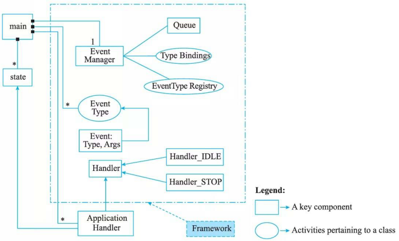

# 胡佛与银行事件架构

## 胡佛(Hoover) 事件架构

胡佛的事件架构由组成事件框架的组件和利用框架服务的应用程序组成。

该框架基于事件框架，根据事件不同的类型进行相应处理。一个事件由两个主要部分组成：事件类型 (Event Type) 和事件需要处理的参数 (Args) 。为了处理多个事件，系统中存在一个事件队列(Queue) 组件。

事件队列 (Event Queue) 保存系统中的事件，并以先来先服务 (FIFO) 模式进行分派。事件队列能够存储任意时间内产生的事件，并支持检索以供将来处理。

该框架的核心组件是事件管理器 (Event Manager) 。该组件绑定事件队列和事件类型 (TypeBindings) 。事件管理器还维护事件类型注册表 (Event Type  Registry)数据结构，并将事件类型注册到相关关联的处理程序中。一个事件可能关联多个处理程序。当事件正在执行时，由千事件管理器维护着事件类型注册表。它能将事件动态绑定到相应的处理程序中，这大大增加了框架的灵活性。

该框架还有一个 Handler 组件，它是所有处理程序的基类。基本处理程序组件包含两个主要处理程序：

1. STOP  handler: 此处理程序负责系统终止。
2. IDLE  handler: 此处理程序执行“空闲等待”，直到用户输入一个输入事件。它将系统
维持在空闲状态，直到有任意输入被提交给系统处理。

应用程序在某些定义的“挂钩“处挂钩到上述框架。如图 8-6 所示，灰色背景阴影区域代表了胡佛架构的框架。主进程控制事件类型和应用程序的状态，它也控制着事件管理器。所有应用程序处理程序都会修改系统的状态(在图 8-6 中由应用程序处理程序组件旁边的＊表示)。但是，只有一个事件管理器控制系统。

## 银行事件架构

“银行“体系结构由组成事件框架的组件和利用框架服务的应用程序组成。

这个框架与上面描述的架构类似，但有一些区别。在这种架构中，即使没有特有的事件组件，底层主题也可看作是一种事件(框架默认)。在这种架构中，事件有两个主要部分：类型(Type) 及其参数 (Args) 。

事件队列(Queue) 组件对事件进行排队，并以先进先出 FIFO 模式进行处理。如果没有要返回的事件，则会生成“空闲”事件。

框架中有一个基本的处理程序 (Handler) 组件，该组件由三个标准的指定处理程序和相应的扩展接口。

1. START handler: 在启动时初始化系统。
2. STOP handler ：终止系统。
3. ID LE handler: 此处理程序执行“空闲等待”，直到用户输入一个事件。当用户输入事件后，该处理程序验证输入事件是否有效。如果有效，则事件排队；否则会产生另一个空闲事件。该处理程序将系统保持在空闲状态，直到系统处理任何输入事件。

在这个架构中，主模块 (Main) 是框架的一部分。该组件将事件管理器和事件队列绑定到一起。该模块的基本功能是从事件队列中取出一个事件并将其分派给事件管理器进行处理。该组件中没有应用程序的特定信息。

在此框架中，应用程序挂接在事件管理器，应用程序处理器 (Application Handler) 也链接到此事件处理器中。框架支待定义多个系统事件和多个应用程序处理程序，但只有一个事件队列和一个事件管理器。
