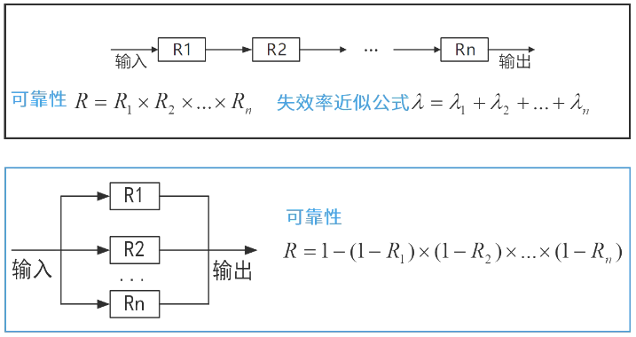
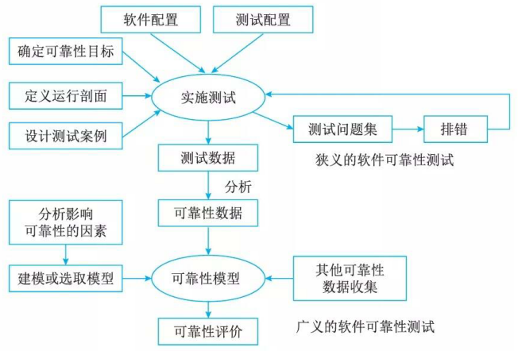

# 软件可靠性基本概念

## 最佳实践

### 题目总结

- 💚系统______是指在规定的时间内和规定条件下能有效地实现规定功能的能力。它不仅取决于规定的使用条件等因素，还与设计技术有关。常用的度量指标主要有故障率(或失效率)、平均失效等待时间、平均失效间隔时间和可靠度等。其中，______是系统在规定工作时间内无故障的概率。

    - A. 可靠性  B. 可用性  C. 可理解性  D. 可测试性
    - A. 失效率  B. 平均失效等待时间  C. 平均失效间隔时间  D. 可靠度

    答案：A D

- 💛某种部件用在2000台计算机系统中，运行工作1000小时后，其中有4台计算机的这种部件失效，则该部件的千小时可靠度$R$为______。

    - A. 0.990  B. 0.992  C. 0.996  D. 0.998

    答案：D

### 考察点

- 💚可靠性是指在规定的时间内和规定条件下能有效地实现规定功能的`()`。
- 💚可靠度是系统在规定工作时间内`()`的概率
- 💚软件可靠性的定量描述
    - 规定时间: 自然时间, 运行时间, `()`时间
    - 失效率: 从软件运行开始，到某一时刻$t$为止，出现`()`的概率
    - 可靠度: 1-`()`
    - 失效强度: `()`时间失效的概率
    - 平均失效前时间(MTTF): `()`
    - 平均恢复前时间(MTTR): `()`
    - 平均故障间隔时间(MTBF): `()`
- 💚失效严重程度类: 以`()`分类

### 考察问

- `可靠性`是指在规定的时间内和规定条件下能有效地实现规定功能的`能力`。
- `可靠度`是系统在规定工作时间内无故障的概率
- 软件可靠性的定量描述
    - 规定时间: 自然时间, 运行时间, `执行`时间
    - 失效率: 从软件运行开始，到某一时刻$t$为止，出现`失效`的概率
    - 可靠度: 1-`失效率`
    - 失效强度: `单位`时间失效的概率
    - 平均失效前时间(MTTF): `正常运行时间`
    - 平均恢复前时间(MTTR): `修复的时间`
    - 平均故障间隔时间(MTBF): `两次失效之间的时间`
- 失效严重程度类: 以`损失`分类

## 软件可靠性定义

软件可靠性(Software Reliability)是软件产品在规定的条件下和规定的时间区间完成规定功能的能力。

## 软件可靠性的定量描述

从软件可靠性的定义可以看到，软件的可靠性可以基于使用条件、规定时间、系统输入、系统使用和软件缺陷等变量构建的数学表达式。

1. 规定时间

    对于“规定时间”有3种概念：
    - 一种是自然时间，也就是日历时间，指人们日常计时用的年、月、周、日等自然流逝的时间段
    - 一种是运行时间，指软件从启动开始，到运行结束的时间段
    - 一种是执行时间，指软件运行过程中，中央处理器 (CPU) 执行程序指令所用的时间总和。

    例如，某单位有一套供会计人员使用的财务软件，我们来关注一整天的时间，上午9:00上班开机运行，下午5:00下班退出程序。在这里，自然时间是一天，也就是24小时，运行时间是8个小时，而CPU处理程序的执行时间可能不到2小时，这要视会计的业务繁忙状况、使用软件的频度和软件本身的设计而定。

    很明显，在这三种时间中，人们使用执行时间来度量软件的可靠性最为准确，效果也最好。

2. 失效率

    从软件运行开始，到某一时刻$t$为止，出现失效的概率可以看作是关于软件运行时间的一个随机函数，用$F(t)$表示。根据我们对软件可靠性的分析，函数$F(t)$有如下特征。

    1. $F(0) = 0$，即软件运行初始时刻失效概率为$0$。
    2. $F(t)$在时间域$(0, +\infty)$上是单调递增的。
    3. $F(+\infty) = 1$，即失效概率在运行时间不断增长时趋向于$1$，这也和“任何软件都存在缺陷”的思想相吻合。

    为了简化分析，把$F(t)$看作关于时间$t$的一个连续函数，并且可导。

3. 可靠度

    可靠度就是软件系统在规定的条件下、规定的时间内不发生失效的概率。如果用F(t)来表示到t时刻止，软件不出现失效的概率，则可靠度的公式为:

    $R(t) = 1 - F(t)$

    同样，我们知道$R(0) = 1$，$R(+\infty) = 0$ 。

4. 失效强度

    失效强度(Failure Intensity)的物理解释就是单位时间软件系统出现失效的概率。在t时刻到 $t + \Delta t$ 时刻之间软件系统出现失效的平均概率为 $(F(t + \Delta t) - F(t)) / \Delta t$，当 $\Delta t$ 趋于很小时，就表现为 $t$ 时刻的失效强度。用 $f(t)$ 表示失效强度函数，则

    $$f(t) = \lim_{\Delta t \to 0} \frac{F(t + \Delta t) - f(t)}{\Delta t} = F'(t)$$

5. 平均失效前时间

    可靠度为$R(t)$的系统平均失效前时间(Mean Time To Failure，MTTF)定义为从$t = 0$时到故障发生时系统的持续运行时间的期望值：

    $$
    \text{MTTF} = \int_{0}^{\infty} R(t) dt
    $$

    对于不可修复系统，系统的平均寿命指系统发生失效前的平均工作(或存储)时间或工作次数，也称为系统在失效前的平均时间。MTTF的长短，通常与使用周期中的产品有关，其中不包括老化失效。

6. 平均恢复前时间

    平均恢复前时间(Mean Time To Restoration, MTTR) 是随机变量恢复时间的期望值，就是从出现故障到修复成功中间的这段时间，它包括确认失效发生所必需的时间，记录所有任务的时间，还有将设备重新投入使用的时间。 MTTR越短表示易恢复性越好。

7. 平均故障间隔时间

    MTBF(Mean Time Between Failures，平均故障间隔时间)定义为：失效或维护中所需的平均时间，包括故障时间以及检测和维护设备的时间。
    对于可靠度服从指数分布的系统，从任一时刻$t_0$到达故障的期望时间都是相等的，因此有：
    $MTBF = MTTF + MTTR$
    当讨论完对软件可靠性的定量描述问题之后，需要对软件可靠度这个直接反映软件可靠性的度量指标作下列补充说明。
    1. 描述的软件对象必须明确，即需指明它与其他软件的界限。
    2. 软件失效必须明确定义。
    3. 必须假设硬件无故障(失效)和软件有关变量的输入值正确。
    4. 运行环境包括硬件环境、软件支持环境和确定的软件输入域。
    5. 规定的时间必须指明时间基准，可以是自然时间(日历时间)、运行时间、执行时间(CPU时间)或其他时间基准。
    6. 软件无失效运行的机会通常以概率度量，但也可以是模糊数学中的可能性加以度量。
    7. 上述定义是在时间域上进行的，这时软件可靠度是一种动态度量。也可以是在数据域上将软件可靠度定义为一种表态度量，表示软件成功执行一个回合的概率。软件回合(Run)是指软件在规定环境下的一个基本执行过程，如给定一组输入数据，到软件给定相应的输出数据这一过程。软件回合是软件运行最小的、不可分的执行单位，软件的运行过程由一系列软件回合组成。
    8. 有时将软件运行环境简单地理解为软件运行剖面(Operational Profile)。欧空局(ESA)标准 PSS-01-21 (1991)  "ESA 软件产品保证要求“中，”软件运行剖面”的定义为：”对系统使用条件的定义。系统的输入值都用其按时间的分布或按它们在可能输入范围内的出现概率的分布来定义”。简单来说，运行剖面定义了关于软件可靠性描述中的”规定条件”，也就是相当于可靠性测试中需要考虑的测试环境、测试数据等一系列问题。

拓展总结：

1. 规定时间：自然时间、运行时间、执行时间(占用CPU)。
2. 失效概率：软件运行初始时刻失效概率为0，随着时间增长单调递增，不断趋向于1。
3. 可靠度：软件系统在规定的条件下、规定的时间内不发生失效的概率。等于1 - 失效概率。
4. 失效强度：单位时间软件系统出现失效的概率。
5. 平均失效前时间(MTTF)：平均失效等待时间，系统从开始运行到发生第一次故障所经历的平均时间。
6. 平均恢复前时间(MTTR)：平均修复时间，从出现故障到修复成功的时间。
7. 平均故障间隔时间(MTBF)：平均失效间隔时间，失效或维护中所需的平均时间，包括故障时间以及检测和维护设备的时间。(系统两次连续故障之间的平均时间)。MTBF = MTTF + MTTR。
8. 系统可用性 = MTTF/(MTTF + MTTR)*100%。

拓展： 串联系统与并联系统

无论什么系统，都是由多个设备组成，并协同工作，而这多个设备的组合方式可以是串联、并联，也可以是混合模式，假设每个设备的可靠性为$R_1,R_2\cdots R_n$，则：

## 可靠性目标

而在实际情况中，对软件运行的影响程度不仅取决于软件失效发生的概率，还和软件失效的严重程度有很大关系。这里引出另外一个概念:失效严重程度类(Failure Severity Class) 。

对成本的影响可能包括失效引起的额外运行成本、修复和恢复成本、现有或潜在的业务机会的损失等。由千失效严重程度类的影响分布很广泛，为了按照一定数量的等级去定义失效严重程度类，通常用数量级去划分等级。

表给出了一个按照对成本的影响划分失效严重程度类的例子，这个例子涉及的软件系统是某电子商务运营系统。

|失效严重程度类|定义(人民币万元)|失效严重程度类|定义(人民币万元)|
| ---- | ---- | ---- | ---- |
|1|成本$> 100$|4|$0.1 <$成本$\leq 1$|
|2|$10 <$成本$\leq 100$|5|成本$< 0.1$|
|3|$1 <$成本$\leq 10$| | |

对系统能力的影响常常表现为关键数据的损失、系统异常退出、系统崩溃、导致用户操作无效等。对于不同性质的软件系统，相同的表现可能造成的失效严重程度是不同的，例如对可用性要求较高的系统，导致长时间停机的失效常常会划分到较高的严重级别中去。

|失效严重程度类|定义|
| ---- | ---- |
|1|系统崩溃，重要数据不可恢复|
|2|系统出错停止响应，重要数据可恢复|
|3|用户重要操作无响应，可恢复|
|4|部分操作无响应，但可用其他操作方式替代|

有了失效严重程度的划分，现在可以结合失效强度来定量地表示一个软件系统的可靠性目标了。
可靠性目标是指客户对软件性能满意程度的期望。通常用可靠度、故障强度和平均失效时间 (MTTF) 等指标来描述，根据不同项目的不同需要而定。建立定量的可靠性指标需要对可靠性、交付时间和成本进行平衡。为了定义系统的可靠性指标，必须确定系统的运行模式，定义故障的严重性等级，确定故障强度目标。

|失效严重程度类|可靠性要求/%|失效强度|平均无失效时间|
| ---- | ---- | ---- | ---- |
|1|99.9999|$10^{-6}$|114年|
|2|99.99|$10^{-4}$|417天|
|3|99|$10^{-1}$|4天|
|4|90|1|9小时|

## 广义的可靠性测试与狭义的可靠性测试

- 广义的软件可靠性测试是指为了最终评价软件系统的可靠性而运用建模、统计、试验、分析和评价等一系列手段对软件系统实施的一种测试。

- 狭义的软件可靠性测试是指为了获取可靠性数据，按预先确定的测试用例，在软件的预期使用环境中，对软件实施的一种测试。它是面向缺陷的测试，以用户将要使用的方式来测试软件。

