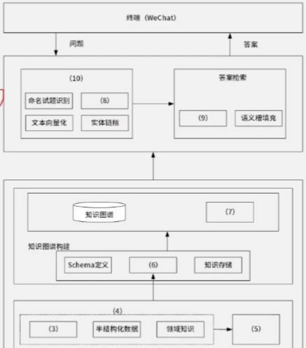
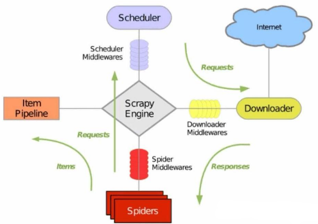

# 2025年上半年系统架构设计师综合知识真题

## 题目

### 综合知识

- 1.某信道的带宽为3000Hz，编码采用32种不同的物理状态来表示数据，在无噪声环境下，该信道的最大数据传输速率是( )kbps。

    - A. 100
    - B. 30
    - C. 50
    - D. 500

    答案: B, [参考](../2计算机系统基础知识/5_2通信技术🟡🟥❤️.md)

- 2.操作系统采用页式存储管理，用位图管理空闲页框，若页大小为4KB，物理内存大小为16GB，则位图所占内存空间大小是( )KB。

    - A. 64
    - B. 512
    - C. 256
    - D. 128

    答案: B, [参考](../2计算机系统基础知识/3_4a文件系统🔴🟥❤️.md)

- 3.操作系统中有5个进程，若每个进程最多可同时访问2个资源，为了不发生死锁，至少需要提供( )个资源。

    - A.6
    - B.5
    - C.8
    - D.10

    答案: A, [参考](../2计算机系统基础知识/3_2e锁🔴🟨💛.md)

- 4.净室软件工程的理论基础主要是( )。

    - A.函数理论和抽样理论
    - B.迭代模型
    - C.瀑布模型
    - D.概率统计

    答案: A, [参考](../5软件工程基础知识/5净室软件工程🔴🟩💚.md)

- 5.关于白盒测试，下列说法正确的是( )。

    - A.条件覆盖不一定包含判定覆盖，判定覆盖也不一定包含条件覆盖
    - B.语句覆盖比判定覆盖强
    - C.条件覆盖比判定覆盖强
    - D.条件组合覆盖保证程序中所有可能的路径都至少遍历一次

    答案: A, [参考](../5软件工程基础知识/4软件测试🔴🟨💛.md)

- 6.Web服务器性能评测方法不包括( )。

    - A.可靠性测试
    - B.压力测试
    - C.基准性能测试
    - D.UI测试

    答案: D

- 7.在下列运算中，( )不属于关系运算。

    - A.删除
    - B.连接
    - C.投影
    - D.选择

    答案: A, [参考](../6数据库设计基础知识/2_1关系运算🔴🟨💛.md)

- 8.CMMI(Capability Maturity Model Integraton)提供了一个软件能力成熟度模型，它将软件过程改进的步骤组织成( )个成熟度等级。

    - A.3  
    - B.4  
    - C.5  
    - D.6

    答案: C, [参考](../5软件工程基础知识/1软件工程🔴🟨💛.md)

- 9.某工程项目包括10个作业A~J，各作业所需的时间及其衔接关系如下表:

    | 作业 | A | B | C | D | E | F | G | H | I | J |
    | --- | --- | --- | --- | --- | --- | --- | --- | --- | --- | --- |
    | 紧前作业 | -- | -- | A、B | B | A | C | E、F | D、F | G、H | I |
    | 工期(天) | 2 | 3 | 4 | 5 | 6 | 3 | 2 | 3 | 6 | 5 |

    如果作业D推迟3天开始，其他因素都不变，整个工程工期将推迟( )天完成。
    - A.3
    - B.0
    - C.1
    - D.2

    答案: C, [参考](../5软件工程基础知识/7软件项目管理🔴🟨💛.md)

- 10.软件测试中回归测试的目的是( )。

    - A.预防功能的不完善
    - B.确保修正过程中没有引入新的缺陷
    - C.辅助系统测试
    - D.辅助单元测试

    答案: B, [参考](../5软件工程基础知识/4软件测试🔴🟨💛.md)

- 11.RUP把软件开发生命周期划分为多个循环，每个循环生成产品的一个新的版本，每个循环依次由多个连续的阶段组成。其中，设计及确定系统的体系结构、制定工作计划及资源要求是( )阶段主要活动。
    - A.初始
    - B.构造
    - C.移交
    - D.细化

    答案: D, [参考](../5软件工程基础知识/1软件工程🔴🟨💛.md)

- 12.微服务架构中，断路器模式主要包含以下三种状态( )。
    - A.关闭状态、激活状态、挂起状态
    - B.激活状态、打开状态、休眠状态
    - C.激活状态、打开状态、熔断状态
    - D.关闭状态、打开状态、半开状态

    答案: D, [参考](../../../7后端开发/微服务/2_6服务保护🔴🟨💛.md)

- 13.边缘计算的核心思想是将计算任务从中心节点转移到数据产生的边缘节点，以下不属于边缘计算特点的是( )。
    - A.降低功耗
    - B.降低延迟
    - C.提高带宽
    - D.提高安全性

    答案: C, [参考](../11来信息综合技术/4边缘计算概述🔴🟨💛.md)

- 14.设 x，y 满足约束条件：x≤120，x-y≤0，x-y-4≤0，则 y/x 的最大值是( )。
    - A.3
    - B.2
    - C.4
    - D.1

    答案: A

- 15.申请软件著作权登记时应当向中国版权保护中心提交软件的鉴别材料，具体包括( )。
    - A.程序和文档的鉴别材料
    - B.程序和著作权归属书面合同的鉴别材料
    - C.程序和数据的鉴别材料
    - D.数据和文档的鉴别材料

    答案: A

- 16.嵌入式操作系统通常分为实时和非实时两类，( )不属于非实时嵌入式操作系统。
    - A.WinCE
    - B.VxWorks
    - C.Android
    - D.IOS

    答案: B

- 17.黑盒测试使用到的方法不包括( )。
    - A.路径覆盖
    - B.边界值分析
    - C.等价类划分
    - D.因果图

    答案: A, [参考](../5软件工程基础知识/4软件测试🔴🟨💛.md)

- 18.在典型强实时调度算法中，( )算法是根据任务的紧急程度确定任务的优先级。
    - A.Earliest Deadline First
    - B.First In First Out Scheduling
    - C.Least Laxity First
    - D.Rate Monotonic Scheduling

    答案: C, [参考](../2计算机系统基础知识/3_2f进程调度🟢.md)

- 19.ERP中的企业资源包括企业的“三流”资源，即( )。
    - A.税务流资源、资金流资源和信息流资源
    - B.物流资源、税务流资源和信息流资源
    - C.物流资源、资金流资源和信息流资源
    - D.物流资源、资金流资源和税务流资源

    答案: C, [参考](../3信息系统基础知识/7企业资源规划(ERP)🔴🟨💛.md)

- 20, 21.Kruchten提出了一个“4+1”的视图模型。“4+1”视图模型从5个不同的视角来描述软件架构，每个视图只关心系统的个侧面，5个视图结合在一起才能反映软件架构的全部内容。其中，( )主要考虑如何把软件映射到硬件上；( )侧重于系统的运行特性。

    - A.场景
    - B.模块视图
    - C.开发视图
    - D.物理视图
    - A.进程视图
    - B.实现视图
    - C.逻辑视图
    - D.部署视图

    答案: DA, [参考](../7系统架构设计基础知识/2基于架构的软件开发方法🔴🟨💛.md)

- 22.下列选项中会导致线程从执行态变为就绪态的是( )。

    - A.键盘输入
    - B.主动让出 CPU
    - C.执行信号量的 wait()操作
    - D.缺页异常

    答案: B, [参考](../2计算机系统基础知识/3_2b进程和线程🔴🟨💛.md)

- 23.黑板架构风格中，用于进行数据处理和计算的构件是( )。
    - A.知识源
    - B.控制器
    - C.黑板
    - D.中央数据结构

    答案: A, [参考](../7系统架构设计基础知识/3_3以数据为中心🔴🟥💛.md)

- 24.下面关于需求跟踪的描述不正确的是( )。
    - A.正向跟踪是检查设计文档、代码、测试用例等工作成果是否都能在《产品需求规格说明书》中找到出处
    - B.需求跟踪的目的是建立与维护“需求 - 设计 - 编程 - 测试”之间的一致性
    - C.需求跟踪包括编制每个需求同系统元素之间的联系文档，这些元素包括别的需求、体系结构、其他设计部件、源代码模块、测试、帮助文件和文档等
    - D.正向跟踪和逆向跟踪合称为“双向跟踪”

    答案: A, [参考](../5软件工程基础知识/2需求工程🟡🟨💛.md)

- 25.在进行单元测试时( )是设计测试用例的依据。
    - A.需求分析文档
    - B.详细设计文档
    - C.项目计划文档
    - D.概要设计文档

    答案: B, [参考](../5软件工程基础知识/4软件测试🔴🟨💛.md)

- 26.在UML活动图中，( )是原子的，不能被分解，没有内部转移、没有内部活动，它的工作所占用的时间可以忽略。
    - A.活动状态
    - B.初始状态
    - C.动作状态
    - D.原子状态

    答案: C, [参考](../2计算机系统基础知识/6_1UML🔴🟥❤️.md), 没有找到对应问题答案

- 27.某公司有 100 人，其中会 Java 语言的有 45 人，会 C 语言的有 53 人，会 Python 语言的有 55 人，既会 Java 语言也会 C 语言的有 28 人，既会 C 语言也会 Python 语言的有 32 人，既会 Python 语言也会 Java 语言的有 35 人，三种语言都会的有 20，那么三种语言都不会的有( )人。
    - A.21
    - B.20
    - C.23
    - D.22

    答案: D

- 28.双生命周期模型是一种软件产品线过程模型，分为两个重叠的生命周期，分别是( )。
    - A.领域工程和应用工程
    - B.应用工程和企业工程
    - C.领域工程和企业工程
    - D.应用工程和管理工程

    答案: A

- 29.在RESTAPI中，( )用于对一个资源进行部分修改，而不需要发送整个资源的完整表示。
    - A.PART
    - B.POST
    - C.PUT
    - D.PATCH

    答案: D

- 30.一个对象将另一个对象的能力与特点进行完全的继承之后，又继承了其他对象的相应内容，使得这个对象所具有的能力与特点大于等于父对象，这种继承属于( )。
    - A.特化继承
    - B.取代继承
    - C.受限继承
    - D.包含继承

    答案: D

- 31.一个对象有5个属性，每个属性有2种可能的取值，如果要求对所有值的组合进行测试，则共有( )种不同的测试组合。
    - A.5
    - B.10
    - C.32
    - D.25

    答案: C

- 32.根据芯片可适应的工作环境温度，-40℃~+85℃属于( )。
    - A.军用级
    - B.民用级
    - C.工业级
    - D.通用级

    答案: C, 民用级(0~70度), 工业级(-40~85度), 军工级(-55~155度)

- 33.国家秘密的保密期限，除另有规定外，机密级不超过( )。
    - A.二十年
    - B.十年
    - C.四十年
    - D.三十年

    答案: A, 绝密30, 机密20, 秘密10

- 34.已知关系R(a,b,c,d)和R上的函数依赖F={a->cd, c->b}，则R的候选码是( )。
    - A.c
    - B.d
    - C.a
    - D.b

    答案: C, [参考](../6数据库设计基础知识/2_0关系数据库🔴🟨💛.md)

- 35.下面关于三层C/S架构的特点描述不正确的是( )。
    - A.合理地划分三层的功能，使整个系统的逻辑结构更为清晰，能提高系统的可维护性和可扩展性
    - B.B/S架构是一种特殊的两层C/S架构
    - C.与两层C/S架构相比，在三层C/S架构中，增加了一个应用服务器
    - D.三层C/S架构将应用系统分成表示层、功能层和数据层三个部分

    答案: B, [参考](../7系统架构设计基础知识/3_2调用返回🔴🟥💛.md)

- 36.软件著作权人享有多项权利，其中( )指决定软件是否公之于众的权利。
    - A.信息网络传播权
    - B.发表权
    - C.发行权
    - D.转让权

    答案: B, [参考](../a数学与经济管理/15_0知识产权.md)

- 37.工业大模型体系架构中，在基础设施层和应用层中间的是( )。
    - A.基座层、数据层、模型层
    - B.模型层、数据层、交互层
    - C.基座层、模型层、交互层
    - D.基座层、逻辑层、模型层

    答案: C

- 38.在逆向工程中用于恢复信息的方法有四类。其中，用户指导下的搜索与变换方法用于导出( )信息。
    - A.实现级和功能级
    - B.实现级和领域级
    - C.实现级和结构级
    - D.功能级和领域级

    答案: C, [参考](../5软件工程基础知识/a逆向工程🟡🟨💛.md)

- 39.开放系统互联安全体系的五类安全服务包括( )。
    - A.鉴别、访问控制、安全防御、数据机密性和抗抵赖性
    - B.鉴别、访问控制、数据机密性、数据完整性和安全防御
    - C.鉴别、访问控制、数据机密性、数据完整性和抗抵赖性
    - D.访问控制、安全防御、数据机密性、数据完整性和抗抵赖性

    答案: C, [参考](../18安全架构设计理论与实践/5网络安全体系架构设计🟡🟨💛.md)

- 40.以下关于软件测试与调试说法错误的是( )。
    - A.测试是调试之后的活动，测试和调试在目标、方法和思路上都有所不同
    - B.测试从一个已知的条件开始，使用预先定义的过程，有预知的结果；调试从一个未知的条件开始，结束的过程不可预计
    - C.测试过程可以事先设计，进度可以事先确定；而调试不能描述过程或持续时间
    - D.测试的目的是找出程序中存在的错误，而调试的目的是定位错误并且修改程序以修正错误

    答案: A

- 41, 42.数据库三级模式中，( )描述了记录的类型和记录间的联系、操作、数据的完整性和安全性，( )是用户需要使用的部分数据的描述。
    - A.概念模式
    - B.外模式
    - C.内模式
    - D.存储模式
    - A.概念模式
    - B.存储模式
    - C.外模式
    - D.内模式

    答案: AC, [参考](../6数据库设计基础知识/1_0数据库基本概念🔴🟨💛.md)

- 43.在数据流图中，数据流A经过处理后可以生成数据流B或者数据流C，但不能同时生成数据流B和数据流C，那么B和C之间用( )关系表示。
    - A.⊕
    - B.×
    - C.○
    - D.+

    答案: A, [参考](../5软件工程基础知识/3_1_1结构化分析🔴🟨💛.md)

- 44.在 UML 用例图中，用例与用例之间不存在( )。
    - A.包含关系
    - B.泛化关系
    - C.扩展关系
    - D.聚合关系

    答案: D, [参考](../2计算机系统基础知识/6_1UML🔴🟥❤️.md)

- 45.智慧教育系统应保护用户的数据隐私，对敏感数据采用密文方式存储。这一需求属于( )需求。
    - A.可用性
    - B.可靠性
    - C.安全性
    - D.性能

    答案: C, [参考](../8系统质量属性与架构评估/1_0软件系统质量属性🟢.md)

- 46.调制解调技术的主要功能是( )。
    - A.模拟信道传递模拟信号
    - B.模拟信道传递数字信号
    - C.数字信道传递模拟信号
    - D.数字信道传递数字信号

    答案: B

- 47.要想实现半双工通讯，通信双方至少需要( )。
    - A.1 个逻辑通道
    - B.2 个逻辑通道
    - C.1 个物理信道
    - D.2 个物理信道

    答案: B, [参考](../2计算机系统基础知识/2_4总线🟡🟨💛.md)

- 48.内聚类型从高到低的正确排序是( )。
    - A.功能、顺序、通信、过程、时间、逻辑、偶然
    - B.顺序、通信、过程、逻辑、功能、时间
    - C.逻辑、顺序、过程、功能、时间、通信
    - D.时间、功能、过程、通信、顺序、逻辑

    答案: A, [参考](../5软件工程基础知识/3_1_2结构化设计🟡🟨💛.md)

- 49.一次可编程只读存储器的英文缩写是( )。
    - A.ROM
    - B.PROM
    - C.EPROM
    - D.EEPROM

    答案: B

- 50.大模型生成代码的核心架构是( )。
    - A.Transformer
    - B.Knowledge Map
    - C.Rule Base System
    - D.Data Flow

    答案: A

- 51.以下( )增加了风险评估环节。
    - A.瀑布模型
    - B.螺旋模型
    - C.V 模型
    - D.增量模型

    答案: B, 

- 52.结构化分析的特点是( )。
    - A.自底向上
    - B.非直接耦合
    - C.数据耦合
    - D.面向数据流

    答案: D, [text](../5软件工程基础知识/3_1_1结构化分析🔴🟨💛.md)

- 53.以下( )不属于测试度量指标。
    - A.故障率
    - B.平均故障恢复时间
    - C.测试准备时间
    - D.测试完成时间

    答案: B

- 54.WebService的核心技术是( )。
    - A.计算池模型
    - B.五层模型
    - C.开放式Web
    - D.网格计算

    答案: C, 

- 55.SOA 中服务请求者与提供者的通信传输规范是( )。
    - A.UUID
    - B.SOAP
    - C.WSDL
    - D.XML

    答案: B, [参考](../15面向服务架构设市里论与实践/4SOA主要协议和规范🟡🟨💛.md)

- 56.数据库内模式描述的内容是( )。
    - A.存储结构
    - B.索引
    - C.物理存储
    - D.数据类型

    答案: C, [参考](../6数据库设计基础知识/1_0数据库基本概念🔴🟨💛.md)

- 57.数据流图中表示“异或”(互斥关系)的符号是( )。
    - A. ⊕
    - B. +
    - C. *
    - D. ○

    答案: A, [参考](../5软件工程基础知识/3_1_1结构化分析🔴🟨💛.md)

- 58.数据治理的应用场景不包括( )。
    - A.风险控制
    - B.存储备份
    - C.预测分析
    - D.用户画像

    答案: B

- 59.约束条件$x - 1 \geq 0$，$x - y \leq 0$，$x + y - 4 \leq 0$，则$y/x$的最大值是( )。
    - A.1
    - B.2
    - C.3
    - D.4

    答案: C

- 60.关于 A/B 测试的描述正确的是( )。
    - A.同一时间相似用户
    - B.不同时间相同用户
    - C.同一时间不同用户
    - D.不同时间不同用户

    答案: A

- 61.监理“四控三管一协调”中的四控指的是( )。
    - A.成本控制、进度控制、质量控制、变更控制
    - B.投资控制、进度控制、质量控制、合同控制
    - C.成本控制、进度控制、质量控制、风险控制
    - D.投资控制、进度控制、质量控 制、变更控制

    答案: D, 监理活动的主要内容被概括为“四控、三管、一协调”。

    - 四控：信息系统工程质量控制；信息系统工程进度控制；信息系统工程投资控制；信息系统工程变更控制。
    - 三管：信息系统工程合同管理；信息系统工程信息管理；信息系统工程安全管理。
    - 一协调：在信息系统工程实施过程中协调有关单位及人员间的工作关系。

- 62.以下不属于项目管理和过程支持域的是( )。
    - A.源代码
    - B.工作计划
    - C.项目追踪
    - D.项目质量报告

    答案: A

- 63.以下不属于可靠性的是( )。
    - A.容错性
    - B.成熟性
    - C.可恢复性
    - D.健壮性

    答案: D, 有争议. [参考](../8系统质量属性与架构评估/1_0软件系统质量属性🟢.md)

- 64.数据流图中表示数据加工和转换的组件是( )。
    - A.外部实体
    - B.处理
    - C.数据流
    - D.数据存储

    答案: B, 这里用的是处理而不是加工, [参考](../5软件工程基础知识/3_1_1结构化分析🔴🟨💛.md)

- 65.Scrum产品待办列表的排序标准是( )。
    - A.实现难度
    - B.技术成熟度
    - C.最后期限
    - D.商业价值

    答案: D, [参考](../5软件工程基础知识/1软件工程🔴🟨💛.md)

- 66.机器学习中，没有标识的数据应使用的算法是( )。
    - A.聚类算法
    - B.分类算法
    - C.回归算法
    - D.强化学习

    答案: A

- 67.用户首次打开文件时，系统首先执行的操作是( )。
    - A.读 FCB 到内存
    - B.读文件到缓存区
    - C.读文件到内存
    - D.修改文件权限

    答案: A

- 68.SOA中( )进一步解耦了服务请求者和服务提供者。
    - A.WebService
    - B.ESB(企业服务总线)
    - C.服务注册表
    - D.RMI

    答案: B, 

- 69.关于架构脆弱性，描述错误的是( )。
    - A.分层架构需要穿过多层通信，可能导致性能问题
    - B.黑板风格可能没得到解，也没有合适的知识来源继续执行
    - C.管道过滤器无法并发
    - D.事件驱动中触发事件顺序不可控

    答案: C

- 70.影响软件质量的三组因素是( )。
    - A.产品运行、产品修改、产品转移
    - B.产品运行、产品修改、产品重构
    - C.产品修改、产品转移、产品重构
    - D.产品运行、产品重构、产品健壮

    答案: A

- 71~75.System quality attributes have been of interest to the software community at least since the 1970s. There are a variety of published taxonomies and definitions, and many of them have their own research and practitioner communities. From an (71) perspective, there are three problems with previous discussions of system quality attributes: The definitions provided for an attribute are not operational. It is (72) to say that a system will be modifiable. Every system is modifiable with respect to one set of changes and not modifiable with respect to another. The other attributes are similar. A focus of discussion is often on which quality a particular aspect belongs to. Is a system failure an aspect of availability, an aspect of security, or an aspect of usability? All three attribute communities would claim ownership of a system failure. Each attribute community has developed its own (73). The (74) community has "events" arriving at a system, the security community has "attacks" arriving at a system, the availability community has "failure" of a system, and the usability community has "user input". All of these may actually refer to the same occurrence, but are described using different terms. A solution to the first two of these problems (nonoperational definitions and overlapping attribute concerns) is to use qual attribute (75) as a means of characterizing quality attributes. A solution to the third problem is to provide a brief discussion of each attribute-concentrating on its underlying concerns - to illustrate the concepts that are fundamental to that attribute community.

    - A.scenarios 
    - B.definitions 
    - C.taxonomies 
    - D.communities
    - A.performance 
    - B.security 
    - C.availability 
    - D.usability
    - A.scenarios 
    - B.vocabulary 
    - C.solutions 
    - D.problems
    - A.meaningful 
    - B.operational 
    - C.meaningless 
    - D.useful
    - A.architect's 
    - B.developer 
    - C.tester 
    - D.user

    答案: AABCA

### 案例

- 必选题一：
    某公司开发一个在线大模型训练平台，支持Python代码编写、模型训练和部署，用户通过python编写模型代码，将代码交给系统进行模型代码的解析，最终由系统匹配相应的计算机资源进行输出

    - （12分）列举了所有需求列表，填写对应的质量属性（第一问是12个质量属性场景，问这12个分别属于哪个质量属性）
    - （13分）解释器风格架构的组成图填空（6分），以及解释为什么该模型平台适合解释器风格（7分）

- 可选题1: 医院知识图谱

    某公司拟开发一个医药领域的智能问答系统，以帮助用户快速准确的获取疾病病因、治疗方式、治疗周期、常用药物、症状表现和药物企业等医药领域信息。

    基于项目需求，公司召开了项目讨论会。会上，张工指出基于关键词的中心化检索技术已无法满足用户获取医药领域信息的需求，应从各种医药信息网站网页数据中爬取数据构建医药领域知识图谱，并基于知识图谱实现信息的查询和智能问答。

    - 【问题1】图1展示了基于知识图谱的医药领域智能问答系统的架构设计方案，请从给出的（a）~（p）中选择，补充完善图1中（1）~（10）空处的内容。

        （a）网络层
        （b）数据层
        （c）业务层
        （d）知识层
        （e）网页数据
        （f）结构化数据
        （g）数据采集
        （h）知识获取
        （i）知识清洗
        （j）数据清洗
        （k）知识管理
        （l）实体获取
        （m）关系获取
        （n）意图识别
        （o）语句解析
        （p）知识检索

        

        参考答案

        （1）业务层
        （2）数据层
        （3）结构化数据
        （4）数据采集
        （5）数据清洗
        （6）知识获取
        （7）知识管理
        （8）实体获取
        （9）知识检索
        （10）意图识别

    - 【问题2】构建医药领域知识图谱的数据层为各层处理多任务，项目组采用Scrapy框架快速抓取网页信息，Scrapy框架的异步IO机制能高效地处理信息访问。请补充完善图2中（1）~（3）的空白处，完成Scrapy框架架构示意图。并用200字以内的文字在（4）处简要说明什么是异步IO。

        

    - 【问题3】医药领域信息繁杂、数据量大，请用300字以内的文字简要说明该系统构建的医药领域知识图谱应采用何种方式进行知识存储，并说明原因。

- 可选题2：Redis

    - 【问题1】redis主从同步，要求按图填空，首次全量同步过程（10分）
    - 【问题2】主从库第一次同步完成之后，增量复制的流程（6分）
    - 【问题3】数据持久化在系统非常重要，系统发生故障的时候需要进行数据恢复，请列举出数据持久化的两种方式，并论述其优缺点。

- 可选题3：端侧ai和云测ai算力
    - （6分）云端AI和端侧AI的定义以及端侧AI相比云端AI的优势是什么
    - （7分）请将abc填入对应的描述后面的1-7空
        - a）异构计算和算法优化
        - b）资源调度和容器控制（好像不太对）（我记得是个数据抽象资源）
        - c）安全和隔离(大致是这个意思)
    - （12分）第三问：表格对比、集中式资源池 分布式资源池 混合云资源池，写出集中式资源池的三个弊端

        近年来，AI技术得到快速发展，其技术促使了智能终端软硬架构的全面升级。云端AI和端侧AI最大差别在于算力是在云侧，还是端侧计算的问题。某装备研制企业为了适应产品的智能化升级换代，要求研发部门开展端侧AI技术的研究工作，王工主要承担了智能终端的资源池化设计工作，并就资源池的架构设计提出了自己的见解。在研发部门组织的讨论会上，王工的独到见解得到技术主管的认可。

        针对智能终端端侧AI的需求，王工在讨论会上提出，应开展资源池架构设计工作。资源池可高效管理和分配计算、存储和网络等资源，其核心目标是通过集中化管理、动态调度和自动化运维，提升资源利用率、弹性和可靠性。资源池架构设计除需要兼顾计算、存储、网络等资源的动态管理与优化外，同时应满足低延迟、高能效和隐私安全等核心需求。资源池的核心架构设计需要考虑 (a)资源抽象与异构计算、(b)动态调度与能效优化、(c)安全与隔离机制等三个方面。

        - 问题1: 表1给出了七种资源池架构设计方法，请根据你所掌握的相关知识，判断这些设计方法属于(a) ~ (c)的哪一类，并补充完善表1(1)~(7)的空白。

            资源池的核心架构设计需要考虑（a）资源抽象与异构计算、（b）动态调度与能效优化、（c）安全与隔离机制等三个方面。

            |序号|设计方法|类别|
            | ---- | ---- | ---- |
            |1|基于任务优先级、能耗阈值和硬件亲和性（如NPU加速）动态分配资源|（1）|
            |2|通过虚拟化容器隔离技术隔离多用户任务，防止资源争抢|（2）|
            |3|将端侧设备的CPU、GPU、NPU等异构算力统一抽象为虚拟资源池，屏蔽硬件差异，实现灵活调度|（3）|
            |4|本地数据处理避免敏感信息上传云端，结合硬件级安全模块实现端侧端加密|（4）|
            |5|根据负载自动调整算力分配|（5）|
            |6|近存计算优化|（6）|
            |7|通过模型蒸馏、量化和稀疏编码压缩模型体积，适配端侧资源限制|（7）|

- 可选题4：区块链
    - 区块链的六层架构，三种员工的工作流程
    - 什么是智能合约
    - 区块链应用场景

### 论文

1. 论软件测试方法及应用

    软件测试是运用系统化方法验证软件质量、识别缺陷并确保软件符合需求的关键过程，它涵盖功能、性能及安全等多维度验证。当前AI在软件测试中的应用正成为行业变革的核心驱动力，其通过机器学习自动生成高覆盖率测试用例、利用自然语言处理技术精确解析需求文档，并借助计算机视觉实现UI自动化断言等，显著的提升了测试效率与精准度。

    请围绕“论软件测试方法及应用”论题，依次从以下三个方面进行论述。

    - 概要叙述你参与管理和开发的软件项目以及你在其中所承担的主要工作。
    - 详细描述AI测试用例生成的基本处理流程，说明各个步骤的基本内容。
    - 结合你具体参与管理和开发的项目，说明你如何实施AI测试用例生成，给出具体实施过程以及应用效果。

- 负载均衡：第二问：让你回答什么是静态负载均衡，动态负载均衡，基于场景的负载均衡
- 事件驱动架构： 第二问：事件驱动架构的概念和特点，实际的分析、设计、开发的过程
- 多模型数据源：第二问：多模型数据主要体现在哪些方面以及采用多模型数据统一管理的优势

## 参考

1. https://www.bilibili.com/opus/1075159000055545861
2. https://zhuanlan.zhihu.com/p/1909635165602428852
3. https://blog.csdn.net/qq_36771396/article/details/148929584
4. https://zhuanlan.zhihu.com/p/1910030604331901226
5. https://docs.qq.com/doc/DZk9jSEFDbGpicFJn
