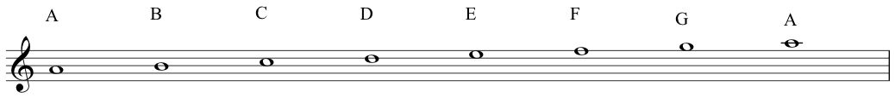
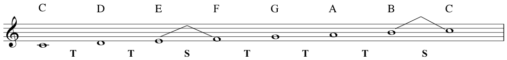
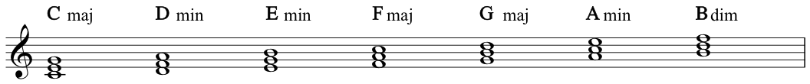
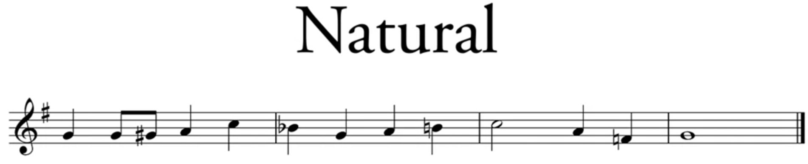

# initweight

## scale

### treble clef
stave/staff(谱子), scale(音阶)上升:

scale下降

记忆treble clef 上的notes 的方法:

### octave(八度音阶)
就是上下重名的notes:

### intervals

### Tones and semitones
B and C, E and F是semitone, 其他都是tone

### C major scale
scale是root note是C, 且符合TTSTTTS的音阶

###  diatonic scale
在一个octave中包含两个semitones和五个tones的scale

记忆的方法是:
I Don’t Punch Like Muhammad A - Li. 

## chord

### perfect fifth
interval between the ‘bottom’ note and the ‘top’ note, breaking it down into semitones, and adding those up.
无论是从C到G还是从A到E都是perfect fifth.

但是从C到E是major third, 从A到C是minor third.

下面是C major scale的所有triad

### three primary chords:
在C major scale中 Cmaj称为tonic, Fmaj称为subdominant, Gmaj称为Dominant.

C major scale中的note和chord的搭配:

## signature

所有的signature的记忆方法

key signature包含一个sharp标记, 所以是G major

accidental flat B, 表示在该bar(小节)里, 所有的B都是flat

accidental natural, 在一个bar里, 表示该note, 恢复为正常的音高(没有sharp或flat),既B-Natural,而不是B-Flat

该bar里, 将F-Sharp变为F-Nature

## minor
1st note 被称为tonic note
5th note 被称为dominant note
7th note 被称为Leading note
minor scale 就是 6th degree of the major as this is the tonic of the relative minor.

### Natural Minor

### Harmonic Minor
raised 7th by semitone

### Melodic Minor
1. the ascending from of the melodic minor is the natural minor with a raised 6th and 7th degree
2. descending form has these notes lowered again and is, thus, essentially the natural minor

## interval
### major

### augmented

### minor

## 
Ledger Lines

signature

piano signature

pitch
x axis 表示时间先手
y axis 表示high low

archbisop isidore of seville

fine lines -> stave(us, staff)

Treble-Clef(G-Clef)

octaves

semitone -> half
tone -> interval of a second

